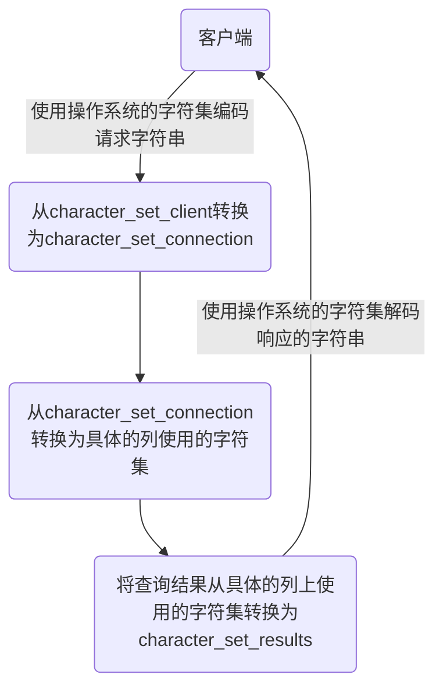

# MySQL 高级特性篇

## Linux下MySQL的安装与使用

### 安装前说明

#### 查看是否安装过MySQL

如果你是用rpm安装, 检查一下RPM PACKAGE：

```shell
rpm -qa | grep -i mysql # -i 忽略大小写
```

检查mysql service：

```shell
systemctl status mysqld.service
```


#### MySQL的卸载

**1.** **关闭** **mysql** **服务**

```shell
systemctl stop mysqld.service
```

**2.** **查看当前** **mysql** **安装状况**

```shell
rpm -qa | grep -i mysql
# 或
yum list installed | grep mysql
```

**3.** **卸载上述命令查询出的已安装程序**

```shell
yum remove mysql-xxx mysql-xxx mysql-xxx mysqk-xxxx
```

务必卸载干净，反复执行`rpm -qa | grep -i mysql`确认是否有卸载残留

**4.** **删除** **mysql** **相关文件**

- 查找相关文件

```shell
find / -name mysql
```

- 删除上述命令查找出的相关文件

```shell
rm -rf xxx
```

**5.删除 my.cnf**

```shell
rm -rf /etc/my.cnf
```

### MySQL的Linux版安装

#### CentOS7下检查MySQL依赖

**1.** **检查/tmp临时目录权限（必不可少）**

由于mysql安装过程中，会通过mysql用户在/tmp目录下新建tmp_db文件，所以请给/tmp较大的权限。执行 ：

```shell
chmod -R 777 /tmp
```

**2.** **安装前，检查依赖**

```shell
rpm -qa|grep libaio
rpm -qa|grep net-tools
```


#### CentOS7下MySQL安装过程

**1.** **将安装程序拷贝到/opt目录下**

在mysql的安装文件目录下执行：（必须按照顺序执行）

```shell
rpm -ivh mysql-community-common-8.0.25-1.el7.x86_64.rpm 
rpm -ivh mysql-community-client-plugins-8.0.25-1.el7.x86_64.rpm 
rpm -ivh mysql-community-libs-8.0.25-1.el7.x86_64.rpm 
rpm -ivh mysql-community-client-8.0.25-1.el7.x86_64.rpm 
rpm -ivh mysql-community-server-8.0.25-1.el7.x86_64.rpm
```

- `rpm`是Redhat Package Manage缩写，通过RPM的管理，用户可以把源代码包装成以rpm为扩展名的文件形式，易于安装。
- `-i`, --install 安装软件包
- `-v`, --verbose 提供更多的详细信息输出
- `-h`, --hash 软件包安装的时候列出哈希标记 (和 -v 一起使用效果更好)，展示进度条

> 若存在mariadb-libs问题，则执行**yum remove mysql-libs**即可


#### 查看MySQL版本

```shell
mysql --version 
#或
mysqladmin --version
```


#### 服务的初始化

为了保证数据库目录与文件的所有者为 mysql 登录用户，如果你是以 root 身份运行 mysql 服务，需要执行下面的命令初始化：

```shell
mysqld --initialize --user=mysql
```

说明： --initialize 选项默认以“安全”模式来初始化，则会为 root 用户生成一个密码并将`该密码标记为过期`，登录后你需要设置一个新的密码。生成的`临时密码`会往日志中记录一份。

查看密码：

```shell
cat /var/log/mysqld.log
```

root@localhost: 后面就是初始化的密码


#### 启动MySQL，查看状态

```shell
# 加不加.service后缀都可以 
# 启动
systemctl start mysqld.service 

# 关闭
systemctl stop mysqld.service 

# 重启
systemctl restart mysqld.service 

# 查看状态
systemctl status mysqld.service
```


#### 查看MySQL服务是否自启动

```shell
systemctl list-unit-files|grep mysqld.service
```

- 如不是enabled可以运行如下命令设置自启动

```shell
systemctl enable mysqld.service
```

- 如果希望不进行自启动，运行如下命令设置

```shell
systemctl disable mysqld.service
```


### MySQL登录

#### 首次登录

通过`mysql -hlocalhost -P3306 -uroot -p`进行登录，在Enter password：录入初始化密码。


#### 修改密码

```mysql
ALTER USER 'root'@'localhost' IDENTIFIED BY 'new_password';
```


#### 设置远程登录

1. **确认网络** 

1、在远程机器上使用ping ip地址`保证网络畅通`。

2、在远程机器上使用telnet命令`保证端口号开放`访问。

2、**关闭防火墙或开放端口**

**方式一：关闭防火墙**

- CentOS6 ：

```shell
service iptables stop
```

- CentOS7：

```shell
# 开启防火墙
systemctl start firewalld.service

# 查看防火墙状态
systemctl status firewalld.service

# 关闭防火墙
systemctl stop firewalld.service

# 设置开机启用防火墙 
systemctl enable firewalld.service

# 设置开机禁用防火墙 
systemctl disable firewalld.service
```


**方式二：开放端口**

- 查看开放的端口号

```shell
firewall-cmd --list-all
```

- 设置开放的端口号

```shell
firewall-cmd --add-service=http --permanent
firewall-cmd --add-port=3306/tcp --permanent
```

- 重启防火墙

```shell
firewall-cmd --reload
```


##### Linux下修改配置

修改允许远程登陆：

```mysql
use mysql;

select Host,User from user;

update user set host = '%' where user ='root';

flush privileges;
```

> `%`是个 通配符 ，如果Host=192.168.1.%，那么就表示只要是IP地址前缀为“192.168.1.”的客户端都可以连接。如果`Host=%`，表示所有IP都有连接权限。
>
> 注意：在生产环境下不能为了省事将host设置为%，这样做会存在安全问题，具体的设置可以根据生产环境的IP进行设置。

配置新连接报错：错误号码 2058，分析是 mysql 密码加密方法变了。

**解决方法一：**升级远程连接工具版本。

**解决方法二：**

```mysql
ALTER USER 'root'@'%' IDENTIFIED WITH mysql_native_password BY 'abc123';
```


### 字符集的相关操作

#### 各级别的字符集

```mysql
show variables like 'character%';
```

- character_set_server：服务器级别的字符集。
- character_set_database：当前数据库的字符集。
- character_set_client：服务器解码请求时使用的字符集。
- character_set_connection：服务器处理请求时会把请求字符串从character_set_client转为character_set_connection 。
- character_set_results：服务器向客户端返回数据时使用的字符集。


**小结**：

- 如果`创建或修改列`时没有显式的指定字符集和比较规则，则该列`默认用表的`字符集和比较规则
- 如果`创建表时`没有显式的指定字符集和比较规则，则该表`默认用数据库的`字符集和比较规则
- 如果`创建数据库时`没有显式的指定字符集和比较规则，则该数据库`默认用服务器的`字符集和比较规则


#### 请求到响应过程中字符集的变化




## MySQL的数据目录

### MySQL8的主要目录结构

```shell
find / -name mysql
```


### 数据库文件的存放路径

```mysql
show variables like 'datadir'; # /var/lib/mysql/
```


#### 相关命令目录

相关命令目录：/usr/bin 和/usr/sbin。


#### 配置文件目录

配置文件目录：/usr/share/mysql-8.0（命令及配置文件），/etc/mysql（如my.cnf）。


### 数据库和文件系统的关系

#### 表在文件系统中的表示

##### InnoDB存储引擎模式

1. **表结构**

为了保存表结构，`InnoDB`在`数据目录`下对应的数据库子目录下创建了一个专门用于`描述表结构的文件`。

```
表名.frm
```


2. **表中数据和索引**

**① 系统表空间（system tablespace）**

默认情况下，InnoDB会在数据目录下创建一个名为`ibdata1`、大小为`12M`的`自拓展`文件，这个文件就是对应的`系统表空间`在文件系统上的表示。

**② 独立表空间(file-per-table tablespace)** 

在MySQL5.6.6以及之后的版本中，InnoDB并不会默认的把各个表的数据存储到系统表空间中，而是为`每一个表建立一个独立表空间`，也就是说我们创建了多少个表，就有多少个独立表空间。使用`独立表空间`来存储表数据的话，会在该表所属数据库对应的子目录下创建一个表示该独立表空间的文件，文件名和表名相同。

```
表名.ibd
```

> MySQL8.0中不再单独提供`表名.frm`，而是合并在`表名.ibd`文件中。

**③ 系统表空间与独立表空间的设置**

我们可以自己指定使用`系统表空间`还是`独立表空间`来存储数据，这个功能由启动参数`innodb_file_per_table`控制。

```ini
[server] 
innodb_file_per_table=0 # 0：代表使用系统表空间； 1：代表使用独立表空间
```

**④ 其他类型的表空间**

随着MySQL的发展，除了上述两种老牌表空间之外，现在还新提出了一些不同类型的表空间，比如通用表空间（general tablespace）、临时表空间（temporary tablespace）等。


##### MyISAM存储引擎模式

1. **表结构**

在存储表结构方面， MyISAM 和 InnoDB 一样，也是在`数据目录`下对应的数据库子目录下创建了一个专门用于描述表结构的文件。

```
表名.frm
```


2. **表中数据和索引**

在MyISAM中的索引全部都是`二级索引`，该存储引擎的`数据和索引是分开存放`的。所以在文件系统中也是使用不同的文件来存储数据文件和索引文件，同时表数据都存放在对应的数据库子目录下。

```
test.frm 存储表结构 #MySQL8.0 改为了 b.xxx.sdi
test.MYD 存储数据 (MYData) 
test.MYI 存储索引 (MYIndex
```


## 用户与权限管理

### 用户管理

#### 登录MySQL服务器

启动MySQL服务后，可以通过mysql命令来登录MySQL服务器，命令如下：

```mysql
mysql –h hostname|hostIP –P port –u username –p DatabaseName –e "SQL语句"
```

- `-h参数`后面接主机名或者主机IP，hostname为主机，hostIP为主机IP。 
- `-P参数`后面接MySQL服务的端口，通过该参数连接到指定的端口。MySQL服务的默认端口是3306，不使用该参数时自动连接到3306端口，port为连接的端口号。
- `-u参数`后面接用户名，username为用户名。
- `-p参数`会提示输入密码。
- `DatabaseName参数`指明登录到哪一个数据库中。如果没有该参数，就会直接登录到MySQL数据库中，然后可以使用USE命令来选择数据库。
- `-e参数`后面可以直接加SQL语句。登录MySQL服务器以后即可执行这个SQL语句，然后退出MySQL服务器。

```mysql
mysql -uroot -p -hlocalhost -P3306 mysql -e "select host,user from user"
```


#### 创建用户

```mysql
CREATE USER 用户名 [IDENTIFIED BY '密码'][,用户名 [IDENTIFIED BY '密码']];


# 示例
CREATE USER zhang3 IDENTIFIED BY '123123'; # 默认host是 %
CREATE USER 'kangshifu'@'localhost' IDENTIFIED BY '123456';
```


#### 修改用户

```mysql
UPDATE mysql.user SET USER='li4' WHERE USER='wang5'; 
FLUSH PRIVILEGES;
```


#### 删除用户

**方式1：使用DROP方式删除（推荐）**

```mysql
DROP USER user[,user]…;


# 示例
DROP USER li4 ; # 默认删除host为%的用户
DROP USER 'kangshifu'@'localhost';
```


**方式2：使用DELETE方式删除（不推荐，有残留信息）**

```mysql
DELETE FROM mysql.user WHERE Host=’hostname’ AND User=’username’;
FLUSH PRIVILEGES;
```


#### 设置当前用户密码

**1.** **使用ALTER USER命令来修改当前用户密码**

```mysql
ALTER USER USER() IDENTIFIED BY 'new_password';
```

**2.** **使用SET语句来修改当前用户密码**

```mysql
SET PASSWORD='new_password';
```


#### 修改其它用户密码

**1.** **使用ALTER语句来修改普通用户的密码**

```mysql
ALTER USER user [IDENTIFIED BY '新密码'] 
[,user[IDENTIFIED BY '新密码']]…;
```

**2.** **使用SET命令来修改普通用户的密码**

```mysql
SET PASSWORD FOR 'username'@'hostname'='new_password';
```


### 权限管理

#### 权限列表

```mysql
show privileges;
```

- `CREATE和DROP权限`，可以创建新的数据库和表，或删除（移掉）已有的数据库和表。如果将MySQL数据库中的DROP权限授予某用户，用户就可以删除MySQL访问权限保存的数据库。
- `SELECT、INSERT、UPDATE和DELETE权限`允许在一个数据库现有的表上实施操作。
- `SELECT权限`只有在它们真正从一个表中检索行时才被用到。
- `INDEX权限`允许创建或删除索引，INDEX适用于已有的表。如果具有某个表的CREATE权限，就可以在CREATE TABLE语句中包括索引定义。
- `ALTER权限`可以使用ALTER TABLE来更改表的结构和重新命名表。
- `CREATE ROUTINE权限`用来创建保存的程序（函数和程序），`ALTER ROUTINE权限`用来更改和删除保存的程序，`EXECUTE权限`用来执行保存的程序。
- `GRANT权限`允许授权给其他用户，可用于数据库、表和保存的程序。
- `FILE权限`使用户可以使用LOAD DATA INFILE和SELECT ... INTO OUTFILE语句读或写服务器上的文件，任何被授予FILE权限的用户都能读或写MySQL服务器上的任何文件（说明用户可以读任何数据库目录下的文件，因为服务器可以访问这些文件）。


#### 授予权限的原则

权限控制主要是出于安全因素，因此需要遵循以下几个`经验原则`：

1、只授予能`满足需要的最小权限`，防止用户干坏事。比如用户只是需要查询，那就只给select权限就可以了，不要给用户赋予update、insert或者delete权限。

2、创建用户的时候`限制用户的登录主机`，一般是限制成指定IP或者内网IP段。

3、为每个用户`设置满足密码复杂度的密码`。 

4、`定期清理不需要的用户`，回收权限或者删除用户。


#### 授予权限

```mysql
GRANT 权限1,权限2,…权限n ON 数据库名称.表名称 TO 用户名@用户地址 [IDENTIFIED BY ‘密码口令’];
```

- 该权限如果发现没有该用户，则会直接新建一个用户。
- 给li4用户用本地命令行方式，授予demodb这个库下的所有表的插删改查的权限。

```mysql
GRANT SELECT,INSERT,DELETE,UPDATE ON demodb.* TO li4@localhost;
```

- 授予通过网络方式登录的joe用户 ，对所有库所有表的全部权限，密码设为123。注意这里唯独不包括grant的权限

```mysql
GRANT ALL PRIVILEGES ON *.* TO joe@'%' IDENTIFIED BY '123';
```


#### 查看权限

查看当前用户权限

```mysql
SHOW GRANTS; 
# 或 
SHOW GRANTS FOR CURRENT_USER; 
# 或 
SHOW GRANTS FOR CURRENT_USER();
```

查看某用户的全局权限

```mysql
SHOW GRANTS FOR 'user'@'主机地址';
```


#### 收回权限

**注意：在将用户账户从user表删除之前，应该收回相应用户的所有权限。**

- 收回权限命令

```mysql
REVOKE 权限1,权限2,…权限n ON 数据库名称.表名称 FROM 用户名@用户地址;


# 示例

# 收回全库全表的所有权限 
REVOKE ALL PRIVILEGES ON *.* FROM joe@'%';

# 收回mysql库下的所有表的插删改查权限 
REVOKE SELECT,INSERT,UPDATE,DELETE ON mysql.* FROM joe@localhost;
```


注意：`须用户重新登录后才能生效` 


### 角色管理

#### 创建角色

```mysql
CREATE ROLE 'role_name'[@'host_name'] [,'role_name'[@'host_name']]...
```

角色名称的命名规则和用户名类似。如果`host_name省略，默认为%`，`role_name不可省略`，不可为空。


#### 给角色赋予权限

```mysql
GRANT privileges ON table_name TO 'role_name'[@'host_name'];
```

上述语句中privileges代表权限的名称，多个权限以逗号隔开。可使用SHOW语句查询权限名称

```mysql
SHOW PRIVILEGES\G
```


#### 查看角色的权限

```mysql
SHOW GRANTS FOR 'role_name';
```

只要你创建了一个角色，系统就会自动给你一个“`USAGE`”权限，意思是`连接登录数据库的权限`。


#### 回收角色的权限

```mysql
REVOKE privileges ON tablename FROM 'rolename';
```


#### 删除角色

```mysql
DROP ROLE role [,role2]...
```

注意，`如果你删除了角色，那么用户也就失去了通过这个角色所获得的所有权限`。


#### 给用户赋予角色

角色创建并授权后，要赋给用户并处于`激活状态`才能发挥作用。

```mysql
GRANT role [,role2,...] TO user [,user2,...];
```

查询当前已激活的角色

```mysql
SELECT CURRENT_ROLE();
```


#### 激活角色

**方式1：使用set default role 命令激活角色**

```mysql
SET DEFAULT ROLE ALL TO 'kangshifu'@'localhost';
```

**方式2：将activate_all_roles_on_login设置为ON**

```mysql
SET GLOBAL activate_all_roles_on_login=ON;
```

这条 SQL 语句的意思是，对`所有角色永久激活`。


#### 撤销用户的角色

```mysql
REVOKE role FROM user;
```


#### 设置强制角色(mandatory role)

方式1：服务启动前设置

```ini
[mysqld] 
mandatory_roles='role1,role2@localhost,r3@%.demo.com'
```

方式2：运行时设置

```mysql
SET PERSIST mandatory_roles = 'role1,role2@localhost,r3@%.example.com'; #系统重启后仍然有效
SET GLOBAL mandatory_roles = 'role1,role2@localhost,r3@%.example.com'; #系统重启后失效
```


## 逻辑架构

### 逻辑架构剖析


#### 第1层：连接层

系统（客户端）访问`MySQL`服务器前，做的第一件事就是建立`TCP`连接。

经过三次握手建立连接成功后，`MySQL`服务器对`TCP`传输过来的账号密码做身份认证、权限获取。

- **用户名或密码不对，会收到一个Access denied for user错误，客户端程序结束执行**
- **用户名密码认证通过，会从权限表查出账号拥有的权限与连接关联，之后的权限判断逻辑，都将依赖于此时读到的权限**

`TCP`连接收到请求后，必须要分配给一个线程专门与这个客户端的交互。所以还会有个线程池，去走后面的流程。每一个连接从线程池中获取线程，省去了创建和销毁线程的开销。


#### 第2层：服务层

- **SQL Interface: SQL接口**

  - 接收用户的SQL命令，并且返回用户需要查询的结果。比如SELECT ... FROM就是调用SQL Interface。
  - MySQL支持DML（数据操作语言）、DDL（数据定义语言）、存储过程、视图、触发器、自定义函数等多种SQL语言接口。


- **Parser:** **解析器**

  - 在解析器中对 SQL 语句进行语法分析、语义分析。将SQL语句分解成数据结构，并将这个结构传递到后续步骤，以后SQL语句的传递和处理就是基于这个结构的。如果在分解构成中遇到错误，那么就说明这个SQL语句是不合理的。
  - 在SQL命令传递到解析器的时候会被解析器验证和解析，并为其创建`语法树`，并根据数据字典丰富查询语法树，会`验证该客户端是否具有执行该查询的权限`。创建好语法树后，MySQL还会对SQL查询进行语法上的优化，进行查询重写。


- **Optimizer:** **查询优化器**

  - SQL语句在语法解析之后、查询之前会使用查询优化器确定 SQL 语句的执行路径，生成一个`执行计划`。
  - 这个执行计划表明应该`使用哪些索引`进行查询（全表检索还是使用索引检索），表之间的连接顺序如何，最后会按照执行计划中的步骤调用存储引擎提供的方法来真正的执行查询，并将查询结果返回给用户。
  - 它使用“`选取-投影-连接`”策略进行查询。例如：

  ```mysql
  SELECT id,name FROM student WHERE gender = '女';
  ```

  这个SELECT查询先根据WHERE语句进行`选取`，而不是将表全部查询出来以后再进行gender过滤。 这个SELECT查询先根据id和name进行属性`投影`，而不是将属性全部取出以后再进行过滤，将这两个查询条件`连接`起来生成最终查询结果。


- **Caches & Buffers： 查询缓存组件**

  - MySQL内部维持着一些Cache和Buffer，比如Query Cache用来缓存一条SELECT语句的执行结果，如果能够在其中找到对应的查询结果，那么就不必再进行查询解析、优化和执行的整个过程了，直接将结果反馈给客户端。
  - 这个缓存机制是由一系列小缓存组成的。比如表缓存，记录缓存，key缓存，权限缓存等 。
  - 这个查询缓存可以在`不同客户端之间共享`。 
  - 从MySQL 5.7.20开始，不推荐使用查询缓存，并在`MySQL 8.0中删除`。


#### 第3层：引擎层

插件式存储引擎层（ Storage Engines），**真正的负责了MySQL中数据的存储和提取，对物理服务器级别维护的底层数据执行操作**，服务层通过API与存储引擎进行通信。


#### 小结


简化为三层结构：

1. 连接层：客户端和服务器端建立连接，客户端发送 SQL 至服务器端；

2. SQL 层（服务层）：对 SQL 语句进行查询处理；与数据库文件的存储方式无关；

3. 存储引擎层：与数据库文件打交道，负责数据的存储和读取。


### SQL执行流程

#### MySQL **中的** SQL执行流程


**MySQL的查询流程：**

**1.** **查询缓存**：Server 如果在查询缓存中发现了这条 SQL 语句，就会直接将结果返回给客户端；如果没有，就进入到解析器阶段。需要说明的是，因为查询缓存往往效率不高，所以在 MySQL8.0 之后就抛弃了这个功能。

查询缓存是提前把查询结果缓存起来，这样下次不需要执行就可以直接拿到结果。需要说明的是，在MySQL 中的查询缓存，不是缓存查询计划，而是查询对应的结果。这就意味着查询匹配的`鲁棒性大大降低`，只有`相同的查询操作才会命中查询缓存`。两个查询请求在任何字符上的不同（例如：空格、注释、大小写），都会导致缓存不会命中。因此 MySQL 的 查询缓存命中率不高 。

同时，如果查询请求中包含某些系统函数、用户自定义变量和函数、一些系统表，如 mysql、 information_schema、 performance_schema 数据库中的表，那这个请求就不会被缓存。

此外，既然是缓存，那就有它`缓存失效的时候`。MySQL的缓存系统会监测涉及到的每张表，只要该表的结构或者数据被修改，如对该表使用了`INSERT`、`UPDATE`、`DELETE`、`TRUNCATE TABLE`、`ALTER TABLE`、`DROP TABLE`或`DROP DATABASE`语句，那使用该表的所有高速缓存查询都将变为无效并从高速缓存中删除！对于`更新压力大的数据库`来说，查询缓存的命中率会非常低。


**2.** **解析器**：在解析器中对 SQL 语句进行语法分析、语义分析。

分析器先做“`词法分析`”。你输入的是由多个字符串和空格组成的一条 SQL 语句，MySQL 需要识别出里面的字符串分别是什么，代表什么。 MySQL 从你输入的"select"这个关键字识别出来，这是一个查询语句。它也要把字符串“T”识别成“表名 T”，把字符串“ID”识别成“列 ID”。


接着，要做“`语法分析`”。根据词法分析的结果，语法分析器（比如：Bison）会根据语法规则，判断你输入的这个 SQL 语句是否`满足 MySQL 语法`。如果SQL语句正确，则会生成一个语法树。


**3.** **优化器**：在优化器中会确定 SQL 语句的执行路径，比如是根据`全表检索`，还是根据`索引检索`等。在查询优化器中，可以分为`逻辑查询`优化阶段和`物理查询`优化阶段。


**4.** **执行器**：在执行之前需要判断该用户是否`具备权限`。如果没有，就会返回权限错误。如果具备权限，就执行 SQL查询并返回结果。在 MySQL8.0 以下的版本，如果设置了查询缓存，这时会将查询结果进行缓存。


SQL 语句在 MySQL 中的流程是： SQL语句→查询缓存→解析器→优化器→执行器 。


### 数据库缓冲池(buffer pool)

`InnoDB`存储引擎是以页为单位来管理存储空间的，我们进行的增删改查操作其实本质上都是在访问页面（包括读页面、写页面、创建新页面等操作）。而磁盘 I/O 需要消耗的时间很多，而在内存中进行操作，效率则会高很多，为了能让数据表或者索引中的数据随时被我们所用，DBMS 会申请`占用内存来作为数据缓冲池`，在真正访问页面之前，需要把在磁盘上的页缓存到内存中的`Buffer Pool`之后才可以访问。

这样做的好处是可以让磁盘活动最小化，从而`减少与磁盘直接进行 I/O 的时间`。要知道，这种策略对提升 SQL 语句的查询性能来说至关重要。如果索引的数据在缓冲池里，那么访问的成本就会降低很多。


#### 缓冲池 vs 查询缓存

**1、缓冲池（Buffer Pool）**


从图中，你能看到 InnoDB 缓冲池包括了数据页、索引页、插入缓冲、锁信息、自适应 Hash 和数据字典信息等。

**缓存原则：**

“`位置 * 频次`”这个原则，可以帮我们对 I/O 访问效率进行优化。

首先，位置决定效率，提供缓冲池就是为了在内存中可以直接访问数据。

其次，频次决定优先级顺序。因为缓冲池的大小是有限的，比如磁盘有 200G，但是内存只有 16G，缓冲池大小只有 1G，就无法将所有数据都加载到缓冲池里，这时就涉及到优先级顺序，会`优先对使用频次高的热数据进行加载`。


**2、查询缓存**

查询缓存是提前把`查询结果缓存`起来，这样下次不需要执行就可以直接拿到结果。需要说明的是，在MySQL 中的查询缓存，不是缓存查询计划，而是查询对应的结果。因为命中条件苛刻，而且只要数据表发生变化，查询缓存就会失效，因此命中率低。


#### 缓冲池如何读取数据

缓冲池管理器会尽量将经常使用的数据保存起来，在数据库进行页面读操作的时候，首先会判断该页面是否在缓冲池中，如果存在就直接读取，如果不存在，就会通过内存或磁盘将页面存放到缓冲池中再进行读取。


#### 查看/设置缓冲池的大小

查看缓冲池的大小。

```mysql
show variables like 'innodb_buffer_pool_size';
```

设置缓冲池的大小。

```mysql
set global innodb_buffer_pool_size = 268435456;
```

或者

```ini
[server] 
innodb_buffer_pool_size = 268435456
```


#### 多个Buffer Pool实例

```ini
[server] 
innodb_buffer_pool_instances = 2
```

何查看缓冲池的个数。

```mysql
show variables like 'innodb_buffer_pool_instances';
```

每个`Buffer Pool`实例实际占内存空间。

```
innodb_buffer_pool_size/innodb_buffer_pool_instances
```


## 存储引擎

### 查看存储引擎

```mysql
show engines;
# 或
show engines\G
```


### 设置系统默认的存储引擎

- 查看默认的存储引擎：

```mysql
show variables like '%storage_engine%'; 
#或
SELECT @@default_storage_engine;
```

- 修改默认的存储引擎

如果在创建表的语句中没有显式指定表的存储引擎的话，那就会默认使用`InnoDB`作为表的存储引擎。

```mysql
SET DEFAULT_STORAGE_ENGINE=MyISAM;
```

或者修改`my.cnf`文件：

```ini
default-storage-engine=MyISAM 
```

```shell
# 重启服务 
systemctl restart mysqld.service
```


### 设置表的存储引擎

存储引擎是负责对表中的数据进行提取和写入工作的，我们可以为`不同的表设置不同的存储引擎`，也就是说不同的表可以有不同的物理存储结构，不同的提取和写入方式。


#### 创建表时指定存储引擎

```mysql
CREATE TABLE 表名(
    建表语句; 
) ENGINE = 存储引擎名称;
```


#### 修改表的存储引擎

```mysql
ALTER TABLE 表名 ENGINE = 存储引擎名称;
```


### 引擎介绍

#### InnoDB 引擎：具备外键支持功能的事务存储引擎

MySQL从3.23.34a开始就包含InnoDB存储引擎。**大于等于5.5之后，默认采用InnoDB引擎**。 

**InnoDB是MySQL的默认事务型引擎**，它被设计用来处理大量的短期(short-lived)事务。可以确保事务的完整提交(Commit)和回滚(Rollback)。

除了增加和查询外，还需要更新、删除操作，那么，应优先选择InnoDB存储引擎。

**除非有非常特别的原因需要使用其他的存储引擎，否则应该优先考虑InnoDB引擎。**


数据文件结构：

- 表名.frm 存储表结构（MySQL8.0时，合并在表名.ibd中）。
- 表名.ibd 存储数据和索引。


InnoDB是`为处理巨大数据量的最大性能设计`。

- 在以前的版本中，字典数据以元数据文件、非事务表等来存储。现在这些元数据文件被删除了。比如：`.frm`，`.par`，`.trn`，`.isl`，`.db.opt`等都在MySQL8.0中不存在了。

- 对比MyISAM的存储引擎，`InnoDB写的处理效率差一些`，并且会占用更多的磁盘空间以保存数据和索引。
- MyISAM只缓存索引，不缓存真实数据；InnoDB不仅缓存索引还要缓存真实数据，`对内存要求较高`，而且内存大小对性能有决定性的影响。


#### MyISAM 引擎：主要的非事务处理存储引擎

> 5.5之前默认的存储引擎。

MyISAM提供了大量的特性，包括全文索引、压缩、空间函数(GIS)等，但MyISAM`不支持事务、行级锁、外键`，有一个毫无疑问的缺陷就是`崩溃后无法安全恢复`。 

优势是访问的`速度快`，对事务完整性没有要求或者以SELECT、INSERT为主的应用。

针对数据统计有额外的常数存储。故而 `count(*)` 的查询效率很高。


数据文件结构：

- 表名.frm 存储表结构
- 表名.MYD 存储数据 (MYData)
- 表名.MYI 存储索引 (MYIndex)

- 应用场景：只读应用或者以读为主的业务


#### Archive 引擎：用于数据存档

下表展示了 ARCHIVE 存储引擎功能：

| 特征                                                   | 支持         |
| ------------------------------------------------------ | ------------ |
| B树索引                                                | 不支持       |
| 备份/时间点恢复 （在服务器中实现，而不是在存储引擎中） | 支持         |
| 集群数据库支持                                         | 不支持       |
| 聚集索引                                               | 不支持       |
| 压缩数据                                               | 支持         |
| 数据缓存                                               | 不支持       |
| 加密数据（加密功能在服务器中实现）                     | 支持         |
| 外键支持                                               | 不支持       |
| 全文检索索引                                           | 不支持       |
| 地理空间数据类型支持                                   | 支持         |
| 地理空间索引支持                                       | 不支持       |
| 哈希索引                                               | 不支持       |
| 索引缓存                                               | 不支持       |
| 锁粒度                                                 | 行锁         |
| MVCC                                                   | 不支持       |
| 存储限制                                               | 没有任何限制 |
| 交易                                                   | 不支持       |
| 更新数据字典的统计信息                                 | 支持         |


#### Blackhole 引擎：丢弃写操作，读操作会返回空内容


#### CSV 引擎：存储数据时，以逗号分隔各个数据项

```sql
mysql> CREATE TABLE test (i INT NOT NULL, c CHAR(10) NOT NULL) ENGINE = CSV; 
Query OK, 0 rows affected (0.06 sec) 

mysql> INSERT INTO test VALUES(1,'record one'),(2,'record two'); 
Query OK, 2 rows affected (0.05 sec) Records: 2 Duplicates: 0 Warnings: 0 

mysql> SELECT * FROM test; 
+---+------------+
| i | c | 
+---+------------+
| 1 | record one | 
| 2 | record two | 
+---+------------+
2 rows in set (0.00 sec)
```

创建CSV表还会创建相应的 元文件 ，用于 存储表的状态 和 表中存在的行数 。此文件的名称与表的名称相同，后缀为 CSM 。如图所示


如果检查 test.CSV 通过执行上述语句创建的数据库目录中的文件，其内容使用Notepad++打开如下：

```txt
"1","record one" 
"2","record two"
```

这种格式可以被 Microsoft Excel 等电子表格应用程序读取，甚至写入。


#### Memory 引擎：置于内存的表

Memory采用的逻辑介质是 内存 ， 响应速度很快 ，但是当mysqld守护进程崩溃的时候 数据会丢失 。另外，要求存储的数据是数据长度不变的格式，比如，Blob和Text类型的数据不可用(长度不固定的)。


**主要特征：**

- Memory同时 支持哈希（HASH）索引 和 B+树索引 。
- Memory表至少比MyISAM表要 快一个数量级 。
- MEMORY 表的大小是受到限制 的。表的大小主要取决于两个参数，分别是 max_rows 和 max_heap_table_size 。其中，max_rows可以在创建表时指定；max_heap_table_size的大小默认为16MB，可以按需要进行扩大。
- 数据文件与索引文件分开存储。

缺点：其数据易丢失，生命周期短。基于这个缺陷，选择MEMORY存储引擎时需要特别小心。


**使用 Memory 存储引擎的场景：**

1. 目标数据比较小 ，而且非常 频繁的进行访问 ，在内存中存放数据，如果太大的数据会造成 内存溢 出 。可以通过参数 max_heap_table_size 控制Memory表的大小，限制Memory表的最大的大小。
2.  如果数据是临时的 ，而且 必须立即可用 得到，那么就可以放在内存中。
3. 存储在Memory表中的数据如果突然间 丢失的话也没有太大的关系 。 


#### Federated 引擎：访问远程表

Federated引擎是访问其他MySQL服务器的一个 代理 ，尽管该引擎看起来提供了一种很好的 跨服务器 的灵活性 ，但也经常带来问题，因此 默认是禁用的 。


#### Merge引擎：管理多个MyISAM表构成的表集合


#### NDB引擎：MySQL集群专用存储引擎

也叫做 NDB Cluster 存储引擎，主要用于 MySQL Cluster 分布式集群 环境，类似于 Oracle 的 RAC 集群。


#### MyISAM 和 InnoDB

| 对比项         | **MyISAM**                                               | **InnoDB**                                                   |
| -------------- | -------------------------------------------------------- | ------------------------------------------------------------ |
| 外键           | 不支持                                                   | 支持                                                         |
| 事务           | 不支持                                                   | 支持                                                         |
| 行表锁         | 表锁，即使操作一条记录也会锁住整个表，不适合高并发的操作 | 行锁，操作时只锁某一行，不对其它行有影响，适合高并发的操作   |
| 缓存           | 只缓存索引，不缓存真实数据                               | 不仅缓存索引还要缓存真实数据，对内存要求较高，而且内存大小对性能有决定性的影响 |
| 自带系统表使用 | Y                                                        | N                                                            |
| 关注点         | 性能：节省资源、消耗少、简单业务                         | 事务：并发写、事务、更大资源                                 |
| 默认安装       | Y                                                        | Y                                                            |
| 默认使用       | N                                                        | Y                                                            |


## 索引的数据结构

### 索引及其优缺点

1. 索引概述

MySQL官方对索引的定义为：**索引（Index）是帮助MySQL高效获取数据的数据结构**。

**索引的本质：**索引是数据结构。你可以简单理解为“排好序的快速查找数据结构”，满足特定查找算法。这些数据结构以某种方式指向数据， 这样就可以在这些数据结构的基础上实现`高级查找算法`。


2. 优点

（1）类似大学图书馆建书目索引，提高数据检索的效率，降低`数据库的IO成本`，这也是创建索引最主要的原因。

（2）通过创建唯一索引，可以保证数据库表中每一行`数据的唯一性`。

（3）在实现数据的参考完整性方面，可以`加速表和表之间的连接`。换句话说，对于有依赖关系的子表和父表联合查询时，可以提高查询速度。

（4）在使用分组和排序子句进行数据查询时，可以显著`减少查询中分组和排序的时间`，降低了CPU的消耗。


3. 缺点

（1）创建索引和维护索引要`耗费时间`，并且随着数据量的增加，所耗费的时间也会增加。

（2）索引需要占`磁盘空间`，除了数据表占数据空间之外，每一个索引还要占一定的物理空间`存储在磁盘上`，如果有大量的索引，索引文件就可能比数据文件更快达到最大文件尺寸。

（3）虽然索引大大提高了查询速度，同时却会`降低更新表的速度`。当对表中的数据进行增加、删除和修改的时候，索引也要动态地维护，这样就降低了数据的维护速度。


### InnoDB中索引的推演

#### 索引之前的查找

```mysql
SELECT [列名列表] FROM 表名 WHERE 列名 = xxx;
```


1. **在一个页中的查找**

假设目前表中的记录比较少，所有的记录都可以被存放在一个页中，在查找记录的时候可以根据搜索条件的不同分为两种情况：

- 以主键为搜索条件：可以在页目录中使用`二分法`快速定位到对应的槽，然后再遍历该槽对应分组中的记录即可快速找到指定的记录。
- 以其他列作为搜索条件：因为在数据页中并没有对非主键建立所谓的页目录，所以我们无法通过二分法快速定位相应的槽。这种情况下只能从最小记录开始依次遍历单链表中的每条记录，然后对比每条记录是不是符合搜索条件。很显然，这种查找的效率是非常低的。


2. **在很多页中查找**

大部分情况下我们表中存放的记录都是非常多的，需要好多的数据页来存储这些记录。在很多页中查找记录的话可以分为两个步骤：

1）、定位到记录所在的页。

2）、从所在的页内查找相应的记录。

在没有索引的情况下，不论是根据主键列或者其他列的值进行查找，由于我们并不能快速的定位到记录所在的页，所以只能`从第一个页`沿着`双向链表`一直往下找，在每一个页中根据我们上面的查找方式去查找指定的记录。因为要遍历所有的数据页，所以这种方式显然是`超级耗时`的。


#### 设计索引

```mysql
mysql> CREATE TABLE index_demo(
    -> c1 INT,
    -> c2 INT,
    -> c3 CHAR(1),
    -> PRIMARY KEY(c1)
    -> ) ROW_FORMAT = Compact;
```

这个新建的`index_demo`表中有2个INT类型的列，1个CHAR(1)类型的列，而且我们规定了c1列为主键，这个表使用`Compact`行格式来实际存储记录的。这里我们简化了index_demo表的行格式示意图：


- `record_type`：记录头信息的一项属性，表示记录的类型，`0`表示普通记录、`1`表示目录项记录、`2`表示最小记录、`3`表示最大记录。
- `next_record`：记录头信息的一项属性，表示下一条地址相对于本条记录的地址偏移量，我们用箭头来表明下一条记录是谁。
- `各个列的值`：这里只记录在`index_demo`表中的三个列，分别是`c1`、`c2`和`c3`。 
- `其他信息`：除了上述3种信息以外的所有信息，包括其他隐藏列的值以及记录的额外信息。


将记录格式示意图的其他信息项暂时去掉并把它竖起来的效果就是这样：


把一些记录放到页里的示意图就是：


##### 一个简单的索引设计方案

我们在根据某个搜索条件查找一些记录时为什么要遍历所有的数据页呢？因为各个页中的记录并没有规律，我们并不知道我们的搜索条件匹配哪些页中的记录，所以不得不依次遍历所有的数据页。所以如果我们`想快速的定位到需要查找的记录在哪些数据页`中该咋办？我们可以为快速定位记录所在的数据页而`建立一个目录`，建这个目录必须完成下边这些事：

- **下一个数据页中用户记录的主键值必须大于上一个页中用户记录的主键值。**
- **给所有的页建立一个目录项。**


以`页28`为例，它对应`目录项2`，这个目录项中包含着该页的页号`28`以及该页中用户记录的最小主键值`5`。我们只需要把几个目录项在物理存储器上连续存储（比如：数组），就可以实现根据主键值快速查找某条记录的功能了。比如：查找主键值为`20`的记录，具体查找过程分两步：

1）、先从目录项中根据`二分法`快速确定出主键值为`20`的记录在`目录项3`中（因为 12 < 20 < 209 ），它对应的页是`页9`。 

2）、再根据前边说的在页中查找记录的方式去`页9`中定位具体的记录。

至此，针对数据页做的简易目录就搞定了。这个目录有一个别名，称为`索引`。


###### 迭代1次：目录项纪录的页

我们把前边使用到的目录项放到数据页中的样子就是这样：


从图中可以看出来，我们新分配了一个编号为30的页来专门存储目录项记录。这里再次强调`目录项记录`和普通的`用户记录`的**不同点**：

- `目录项记录`的`record_type`值是1，而`普通用户记录`的`record_type`值是0。
- 目录项记录只有`主键值和页的编号`两个列，而普通的用户记录的列是用户自己定义的，可能包含`很多列`，另外还有InnoDB自己添加的隐藏列。
- 了解：记录头信息里还有一个叫`min_rec_mask`的属性，只有在存储`目录项记录`的页中的主键值最小的`目录项记录`的`min_rec_mask`值为`1`，其他别的记录的`min_rec_mask`值都是`0`。

**相同点：**两者用的是一样的数据页，都会为主键值生成`Page Directory`（页目录），从而在按照主键值进行查找时可以使用`二分法`来加快查询速度。

现在以查找主键为`20`的记录为例，根据某个主键值去查找记录的步骤就可以大致拆分成下边两步：

1）、先到存储`目录项记录`的页，也就是页30中通过`二分法`快速定位到对应目录项，因为 12 < 20 < 209 ，所以定位到对应的记录所在的页就是页9。 

2）、再到存储用户记录的页9中根据`二分法`快速定位到主键值为`20`的用户记录。


###### 迭代2次：多个目录项纪录的页


从图中可以看出，我们插入了一条主键值为320的用户记录之后需要两个新的数据页：

- 为存储该用户记录而新生成了`页31`。
- 因为原先存储目录项记录的`页30的容量已满`（我们前边假设只能存储4条目录项记录），所以不得不需要一个新的`页32`来存放`页31`对应的目录项。


现在因为存储目录项记录的页不止一个，所以如果我们想根据主键值查找一条用户记录大致需要3个步骤，以查找主键值为`20`的记录为例：

1）、确定`目录项记录页`我们现在的存储目录项记录的页有两个，即`页30`和`页32`，又因为页30表示的目录项的主键值的范围是 [1, 320) ，页32表示的目录项的主键值不小于 320 ，所以主键值为`20`的记录对应的目录项记录在`页30`中。

2）、通过目录项记录页`确定用户记录真实所在的页`。在一个存储`目录项记录`的页中通过主键值定位一条目录项记录的方式说过了。

3）、在真实存储用户记录的页中定位到具体的记录。


###### 迭代3次：目录项记录页的目录页


如图，我们生成了一个存储更高级目录项的`页33`，这个页中的两条记录分别代表页30和页32，如果用户记录的主键值在`[1, 320)`之间，则到页30中查找更详细的目录项记录，如果主键值`不小于320`的话，就到页32中查找更详细的目录项记录。

我们可以用下边这个图来描述它：


这个数据结构，它的名称是`B+树`。 


**④** **B+Tree**

一个B+树的节点其实可以分成好多层，规定最下边的那层，也就是存放我们用户记录的那层为第`0`层，之后依次往上加。之前我们做了一个非常极端的假设：存放用户记录的页`最多存放3条记录`，存放目录项记录的页`最多存放4条记录`。其实真实环境中一个页存放的记录数量是非常大的，假设所有存放用户记录的叶子节点代表的数据页可以存放`100条用户记录`，所有存放目录项记录的内节点代表的数据页可以存放`1000条目录项记录`，那么：

- 如果B+树只有1层，也就是只有1个用于存放用户记录的节点，最多能存放`100`条记录。
- 如果B+树有2层，最多能存放`1000×100=10,0000`条记录。
- 如果B+树有3层，最多能存放`1000×1000×100=1,0000,0000`条记录。
- 如果B+树有4层，最多能存放`1000×1000×1000×100=1000,0000,0000`条记录。相当多的记录！！！


你的表里能存放`100000000000`条记录吗？所以一般情况下，我们`用到的B+树都不会超过4层`，那我们通过主键值去查找某条记录最多只需要做4个页面内的查找（查找3个目录项页和一个用户记录页），又因为在每个页面内有所谓的`Page Directory`（页目录），所以在页面内也可以通过`二分法`实现快速定位记录。


#### 常见索引概念

##### 聚簇索引

**特点：**

1. 使用记录主键值的大小进行记录和页的排序，这包括三个方面的含义：

   - `页内`的记录是按照主键的大小顺序排成一个`单向链表`。

   - 各个存放`用户记录的页`也是根据页中用户记录的主键大小顺序排成一个`双向链表`。
   - 存放`目录项记录的页`分为不同的层次，在同一层次中的页也是根据页中目录项记录的主键大小顺序排成一个`双向链表`。 


2. B+树的`叶子节点`存储的是完整的用户记录。

所谓完整的用户记录，就是指这个记录中存储了所有列的值（包括隐藏列）。

**优点：**

- `数据访问更快`，因为聚簇索引将索引和数据保存在同一个B+树中，因此从聚簇索引中获取数据比非聚簇索引更快
- 聚簇索引对于主键的`排序查找`和`范围查找`速度非常快
- 按照聚簇索引排列顺序，查询显示一定范围数据的时候，由于数据都是紧密相连，数据库不用从多个数据块中提取数据，所以`节省了大量的io操作`。


**缺点：**

- `插入速度严重依赖于插入顺序`，按照主键的顺序插入是最快的方式，否则将会出现页分裂，严重影响性能。因此，对于InnoDB表，我们一般都会定义一个**自增ID列为主键**
- `更新主键的代价很高`，因为将会导致被更新的行移动。因此，对于InnoDB表，我们一般定义**主键为不可更新**
- `二级索引访问需要两次索引查找`，第一次找到主键值，第二次根据主键值找到行数据


##### 二级索引（辅助索引、非聚簇索引）


**概念：回表** 我们根据这个以c2列大小排序的B+树只能确定我们要查找记录的主键值，所以如果我们想根据c2列的值查找到完整的用户记录的话，仍然需要到`聚簇索引`中再查一遍，这个过程称为`回表`。也就是根据c2列的值查询一条完整的用户记录需要使用到`2`棵B+树！


##### 联合索引

我们也可以同时以多个列的大小作为排序规则，也就是同时为多个列建立索引，比方说我们想让B+树按照`c2和c3列`的大小进行排序，这个包含两层含义：

- 先把各个记录和页按照c2列进行排序。

- 在记录的c2列相同的情况下，采用c3列进行排序

注意一点，以c2和c3列的大小为排序规则建立的B+树称为`联合索引`，本质上也是一个二级索引。它的意思与分别为c2和c3列分别建立索引的表述是不同的，不同点如下：

- 建立`联合索引`只会建立如上图一样的1棵B+树。

- 为c2和c3列分别建立索引会分别以c2和c3列的大小为排序规则建立2棵B+树。


#### InnoDB的B+树索引的注意事项

##### 根页面位置万年不动

我们前边介绍B+索引的时候，为了大家理解上的方便，先把存储用户记录的叶子节点都画出来，然后接着画存储目录项记录的内节点，实际上B+树的形成过程是这样的：

- 每当为某个表创建一个B+树索引（聚簇索引不是人为创建的，默认就有）的时候，都会为这个索引创建一个`根节点`页面。最开始表中没有数据的时候，每个B+树索引对应的`根节点`中既没有用户记录，也没有目录项记录。
- 随后向表中插入用户记录时，先把用户记录存储到这个`根节点`中。
- 当根节点中的可用`空间用完时`继续插入记录，此时会将根节点中的所有记录复制到一个新分配的页，比如`页a`中，然后对这个新页进行`页分裂`的操作，得到另一个新页，比如`页b`。这时新插入的记录根据键值（也就是聚簇索引中的主键值，二级索引中对应的索引列的值）的大小就会被分配到`页a`或者`页b`中，而`根节点`便升级为存储目录项记录的页。

这个过程特别注意的是：一个B+树索引的根节点自诞生之日起，便不会再移动。这样只要我们对某个表建立一个索引，那么它的根节点的页号便会被记录到某个地方，然后凡是`InnoDB`存储引擎需要用到这个索引的时候，都会从那个固定的地方取出根节点的页号，从而来访问这个索引。


##### 内节点中目录项记录的唯一性

我们知道B+树索引的内节点中目录项记录的内容是`索引列+页号`的搭配，但是这个搭配对于二级索引来说有点不严谨。还拿`index_demo`表为例，假设这个表中的数据是这样的：

| c1   | c2   | c3   |
| ---- | ---- | ---- |
| 1    | 1    | 'u'  |
| 3    | 1    | 'd'  |
| 5    | 1    | 'y'  |
| 7    | 1    | 'a'  |

如果二级索引中目录项的内容只是`索引号+页号`的搭配的话，那么为`c2`列建立索引后的B+树应该长这样：


如果我们想要新插入一行记录，其中`c1`、`c2`、`c3`的值分别是：`9`、`1`、`c`，那么在修改这个为c2列建立的二级索引对应的B+树时便碰到了个大问题：由于`页3`中存储的目录项记录是由`c2列+页号`的值构成的，`页3`中的两条目录项记录对应的c2列的值都是`1`，那么我们这条新插入的记录到底应该放在`页4`中，还是应该放在`页5`中啊？答案是：对不起，懵了。

为了让新插入记录能找到自己在哪个页里，我们需要**保证在B+树的同一层内节点的目录项记录除页号这个字段以外是唯一的。**所以对于二级索引的内节点的目录项记录的内容实际上是由三个部分构成的：

- 索引列的值
- 主键值
- 页号

也就是我们把主键值也添加到二级索引内节点中的目录项记录了，这样就能保证B+树每一层节点中各条目录项记录除页号这个字段外是唯一的，所以我们为c2列建立二级索引后的示意图实际上应该是这样子的：


这样我们再插入记录`(9, 1, 'c')`时，由于`页3`中存储的目录项记录是由`c2列+主键+页号`的值构成的，可以先把新记录的`c2`列的值和`页3`中各目录项记录的`c2`列的值作比较，如果`c2`列的值相同的话，可以接着比较主键值，因为B+树同一层中不同目录项记录的`c2列+主键`的值肯定是不一样的，所以最后肯定能定位唯一的一条目录项记录，在本例中最后确定新记录应该被插入到`页5`中。


**3.** **一个页面最少可以存储2条记录**

一个B+树只需要很少的层级就可以轻松存储数亿条记录，查询速度相当不错！这是因为B+树本质上就是一个大的多层级目录，每经过一个目录时都会过滤掉许多无效的子目录，直到最后访问的存储真实数据的目录。那如果一个大的目录中只存放一个子目录是个啥效果呢？那就是目录层级非常非常非常多，而且最后的那个存放真实数据的目录中存放一条记录。费了半天劲只能存放一条真实的用户记录？所以`InnoDB的一个数据页至少可以存放两条记录`


#### MyISAM中的索引方案

**B树索引适用存储引擎如表所示：**

| 索引/存储引擎 | MyISAM | InnoDB | Memory |
| ------------- | ------ | ------ | ------ |
| B-Tree索引    | 支持   | 支持   | 支持   |

即使多个存储引擎支持同一种类型的索引，但是他们的实现原理也是不同的。Innodb和MyISAM默认的索引是Btree索引；而Memory默认的索引是Hash索引。

MyISAM引擎使用`B+Tree`作为索引结构，叶子节点的data域存放的是`数据记录的地址`。


##### MyISAM索引的原理


##### MyISAM 与 InnoDB对比

**MyISAM的索引方式都是“非聚簇”的，与InnoDB包含1个聚簇索引是不同的。**

**小结两种引擎中索引的区别：**

① 在InnoDB存储引擎中，我们只需要根据主键值对`聚簇索引`进行一次查找就能找到对应的记录，而在`MyISAM`中却需要进行一次`回表`操作，意味着MyISAM中建立的索引相当于全部都是`二级索引`。 

② InnoDB的数据文件本身就是索引文件，而MyISAM索引文件和数据文件是`分离的`，索引文件仅保存数据记录的地址。

③ InnoDB的非聚簇索引data域存储相应记录`主键的值`，而MyISAM索引记录的是`地址`。换句话说，InnoDB的所有非聚簇索引都引用主键作为data域。

④ MyISAM的回表操作是十分`快速`的，因为是拿着地址偏移量直接到文件中取数据的，反观InnoDB是通过获取主键之后再去聚簇索引里找记录，虽然说也不慢，但还是比不上直接用地址去访问。

⑤ InnoDB要求表`必须有主键`（`MyISAM可以没有`）。如果没有显式指定，则MySQL系统会自动选择一个可以非空且唯一标识数据记录的列作为主键。如果不存在这种列，则MySQL自动为InnoDB表生成一个隐含字段作为主键，这个字段长度为6个字节，类型为长整型。


#### 索引的代价

索引是个好东西，可不能乱建，它在空间和时间上都会有消耗：

- **空间上的代价**

每建立一个索引都要为它建立一棵B+树，每一棵B+树的每一个节点都是一个数据页，一个页默认会占用`16KB`的存储空间，一棵很大的B+树由许多数据页组成，那就是很大的一片存储空间。

- **时间上的代价**

每次对表中的数据进行`增、删、改`操作时，都需要去修改各个B+树索引。而且我们讲过，B+树每层节点都是按照索引列的值`从小到大的顺序排序`而组成了`双向链表`。不论是叶子节点中的记录，还是内节点中的记录（也就是不论是用户记录还是目录项记录）都是按照索引列的值从小到大的顺序而形成了一个单向链表。而增、删、改操作可能会对节点和记录的排序造成破坏，所以存储引擎需要额外的时间进行一些`记录移位`，`页面分裂`、`页面回收`等操作来维护好节点和记录的排序。如果我们建了许多索引，每个索引对应的B+树都要进行相关的维护操作，会给性能拖后腿。


#### MySQL数据结构选择的合理性

##### 二叉搜索树

如果我们利用二叉树作为索引结构，那么磁盘的IO次数和索引树的高度是相关的。


创造出来的二叉搜索树如下：


为了提高查询效率，就需要`减少磁盘IO数`。为了减少磁盘IO的次数，就需要尽量`降低树的高度`，需要把原来“瘦高”的树结构变的“矮胖”，树的每层的分叉越多越好。


##### AVL树

如果我们利用二叉树作为索引结构，那么磁盘的IO次数和索引树的高度是相关的。


针对同样的数据，如果我们把二叉树改成`M 叉树`（M>2）呢？当 M=3 时，同样的 31 个节点可以由下面的三叉树来进行存储：


##### B-Tree

B 树的结构如下图所示：


一个 M 阶的 B 树（M>2）有以下的特性：

1. 根节点的儿子数的范围是 [2,M]。 

2. 每个中间节点包含 k-1 个关键字和 k 个孩子，孩子的数量 = 关键字的数量 +1，k 的取值范围为[ceil(M/2), M]。 

3. 叶子节点包括 k-1 个关键字（叶子节点没有孩子），k 的取值范围为 [ceil(M/2), M]。 

4. 假设中间节点节点的关键字为：Key[1], Key[2], …, Key[k-1]，且关键字按照升序排序，即 Key[i] <Key[i+1]。此时 k-1 个关键字相当于划分了 k 个范围，也就是对应着 k 个指针，即为：P[1], P[2], …,P[k]，其中 P[1] 指向关键字小于 Key[1] 的子树，P[i] 指向关键字属于 (Key[i-1], Key[i]) 的子树，P[k]指向关键字大于 Key[k-1] 的子树。

5. 所有叶子节点位于同一层。

上面那张图所表示的 B 树就是一棵 3 阶的 B 树。我们可以看下磁盘块 2，里面的关键字为（8，12），它有 3 个孩子 (3，5)，(9，10) 和 (13，15)，你能看到 (3，5) 小于 8，(9，10) 在 8 和 12 之间，而 (13，15)大于 12，刚好符合刚才我们给出的特征。

然后我们来看下如何用 B 树进行查找。假设我们想要`查找的关键字是 9`，那么步骤可以分为以下几步：

1. 我们与根节点的关键字 (17，35）进行比较，9 小于 17 那么得到指针 P1； 

2. 按照指针 P1 找到磁盘块 2，关键字为（8，12），因为 9 在 8 和 12 之间，所以我们得到指针 P2； 

3. 按照指针 P2 找到磁盘块 6，关键字为（9，10），然后我们找到了关键字 9。

你能看出来在 B 树的搜索过程中，我们比较的次数并不少，但如果把数据读取出来然后在内存中进行比较，这个时间就是可以忽略不计的。而读取磁盘块本身需要进行 I/O 操作，消耗的时间比在内存中进行比较所需要的时间要多，是数据查找用时的重要因素。`B 树相比于平衡二叉树来说磁盘 I/O 操作要少`，在数据查询中比平衡二叉树效率要高。所以`只要树的高度足够低，IO次数足够少，就可以提高查询性能`。

**再举例1：**


##### B+Tree

**B+** **树和** **B** **树的差异：**

1. 有 k 个孩子的节点就有 k 个关键字。也就是孩子数量 = 关键字数，而 B 树中，孩子数量 = 关键字数+1。

2. 非叶子节点的关键字也会同时存在在子节点中，并且是在子节点中所有关键字的最大（或最小）。

3. 非叶子节点仅用于索引，不保存数据记录，跟记录有关的信息都放在叶子节点中。而 B 树中， `非叶子节点既保存索引，也保存数据记录`。 

4. 所有关键字都在叶子节点出现，叶子节点构成一个有序链表，而且叶子节点本身按照关键字的大小从小到大顺序链接。

> B 树和 B+ 树都可以作为索引的数据结构，在 MySQL 中采用的是 B+ 树。
>
> 但B树和B+树各有自己的应用场景，不能说B+树完全比B树好，反之亦然。


**思考题：为了减少IO，索引树会一次性加载吗？**

1、数据库索引是存储在磁盘上的，如果数据量很大，必然导致索引的大小也会很大，超过几个G。

2、当我们利用索引查询时候，是不可能将全部几个G的索引都加载进内存的，我们能做的只能是：逐一加载每一个磁盘页，因为磁盘页对应着索引树的节点。


**思考题：B+树的存储能力如何？为何说一般查找行记录，最多只需1~3次磁盘IO**

InnoDB存储引擎中页的大小为16KB，一般表的主键类型为INT(占用4个字节)或BIGINT(占用8个字节)，指针类型也一般为4或8个字节，也就是说一个页（B+Tree中的一个节点）中大概存储16KB/(8B+8B)=1K个键值，因为是估算，为了方便计算，这里的K取值为10^3^。也就是说一个深度为3的B+Tree索引可以维护10^3 * 10^3 * 10^3 = 10亿条记录。（这里假定一个数据页也存储10^3条行记录数据了）。

实际情况中每个节点可能不能填充满，因此在数据库中，`B+Tree的高度一般都在2~4层`。MySQL的InnoDB存储引擎在设计时是将根节点常驻内存的，也就是说查找某一键值的行记录时最多只需要1~3次磁盘I/O操作。


**思考题：为什么说B+树比B-树更适合实际应用中操作系统的文件索引和数据库索引？**

1.B+树的磁盘读写代价更低

B+树的内部结点并没有指向关键字具体信息的指针。因此其内部结点相对于B树更小。如果把所有同一内部结点的关键字存放在同一盘块中，那么盘块所能容纳的关键字数量也越多。一次性读入内存中的需要查找的关键字也就越多。相对来说IO读写次数也就降低了。

2、B+树的查询效率更加稳定

由于非终结点并不是最终指向文件内容的节点，而只是叶子结点中关键字的索引。所有任何关键字的查找必须走一条从根结点到叶子结点的路。所有关键字查询的路径长度相同，导致每一个数据的查询效率相当。


**思考题：Hash索引与B+树索引的区别**

1、Hash索引`不能进行范围查询`，而B+树可以。这是因为Hash索引指向的数据是无序的，而B+树的叶子节点是个有序的链表。

2、Hash索引`不支持联合索引的最左侧原则`（即联合索引的部分索引无法使用），而B+树可以。对于联合索引来说，Hash索引在计算Hash值的时候是将索引键合并后再一起计算Hash值，所以不会针对每个索引单独计算Hash值。因此如果用到联合索引的一个或者几个索引时，联合索引无法被利用。

3、Hash索引`不支持 ORDER BY 排序`，因为Hash索引指向的数据是无序的，因此无法起到排序优化的作用，而B+树索引数据是有序的，可以起到对该字段ORDER BY 排序优化的作用。同理，我们也无法用Hash索引进行`模糊查询`，而B+树使用LIKE进行模糊查询的时候，LIKE后面后模糊查询（比如%结尾）的话就可以起到优化作用。

4、`InnoDB不支持哈希索引`。


## InnoDB数据存储结构

### 数据库的存储结构：页

索引结构给我们提供了高效的索引方式，不过索引信息以及数据记录都保存在文件上的，确切说是存储在页结构中。另一方面，索引是在存储引擎中实现的，MySQL服务器上的`存储引擎`负责对表中数据的读取和写入工作。不同存储引擎中`存放的格式`一般不同的，甚至有的存储引擎比如Memory都不用磁盘来存储数据。

由于`InnoDB`是MySQL的`默认存储引擎`，所以本章剖析InooDB存储引擎的数据存储结构。


#### 磁盘与内存交互基本单位：页

InnoDB将数据划分为若干个页，InnoDB中页的大小默认为`16KB`。

以`页`作为磁盘和内存之间交互的基本单位，也就是一次最少从磁盘中读取16KB的内容到内存中，一次最少把内存中的16KB内容刷新到磁盘中。也就是说，**在数据库中，不论读一行，还是读多行，都是将这些行所在的页进行加载。也就是说，数据库管理存储空间的基本单位是页（Page），数据库I/O操作的最小单位是页。**一个页中可以存储多个行记录。

> 记录是按照行来存储的，但是数据库的读取并不以行为单位，否则一次读取（也就是一次I/O操作）只能处理一行数据，效率会非常低。


#### 页结构概述

页a、页b、页c...页n这些页可以`不在物理结构上相连`，只要通过`双向链表`相关联即可。每个数据页中的记录会按照主键值从小到大的顺序组成一个`单向链表`，每个数据页都会为存储在它里边的记录生成一个`页目录`，在通过主键查找某条记录的时候可以在页目录中`使用二分法`快速定位到对应的槽，然后再遍历该槽对应的分组中的记录即可快速找到指定的记录。


#### 页的上层结构


区（Extent）是比页大一级的存储结构，在InnoDB存储引擎中，一个区会分配`64个连续的页`。因为InnoDB中的页大小默认是16KB，所以一个区的大小是64*16KB=`1MB`。

段（Segment）由一个或多个区组成，区在文件系统是一个连续分配的空间（在InnoDB中是连续的64个页），不过在段中不要求区与区之间是相邻的。`段是数据库中的分配单位，不同类型的数据库对象以不同的段形式存在。`当我们创建数据表、索引的时候，就会相应创建对应的段，比如创建一张表时会创建一个表段，创建一个索引时会创建一个索引段。

表空间（Tablespace）是一个逻辑容器，表空间存储的对象是段，在一个表空间中可以有一个或多个段，但是一个段只能属于一个表空间。数据库由一个或多个表空间组成，表空间从管理上可以划分为`系统表空间`、`用户表空间`、`撤销表空间`、`临时表空间`等。


### 页的内部结构

#### 第1部分：文件头部和文件尾部

##### File Header（文件头部）（38字节）

**作用**：描述各种页的通用信息。（比如页的编号、其上一页、下一页是谁等）。

**大小**：38字节

| 名称                               | 占用空间大小 | 描述                                                         |
| ---------------------------------- | ------------ | ------------------------------------------------------------ |
| `FIL_PAGE_SPACE_OR_CHKSUM`         | `4`字节      | 页的校验和（checksum值）                                     |
| `FIL_PAGE_OFFSET`                  | `4`字节      | 页号                                                         |
| `FIL_PAGE_PREV`                    | `4`字节      | 上一个页的页号                                               |
| `FIL_PAGE_NEXT`                    | `4`字节      | 下一个页的页号                                               |
| FIL_PAGE_LSN                       | `8`字节      | 页面被最后修改时对应的日志序列位置                           |
| `FIL_PAGE_TYPE`                    | `2`字节      | 该页的类型                                                   |
| FIL_PAGE_FILE_FLUSH_LSN            | `8`字节      | 仅在系统表空间的一个页中定义，代表文件至少被刷新到了对应的LSN值 |
| `FIL_PAGE_ARCH_LOG_NO_OR_SPACE_ID` | `4`字节      | 页属于哪个表空间                                             |

- `FIL_PAGE_OFFSET（4字节）`：每一个页都有一个单独的页号，就跟你的身份证号码一样，InnoDB通过页号可以唯一定位一个页。
- `FIL_PAGE_TYPE（2字节）`：这个代表当前页的类型。

| 类型名称                | 十六进制 | 描述                             |
| ----------------------- | -------- | -------------------------------- |
| FIL_PAGE_TYPE_ALLOCATED | 0x0000   | 最新分配，还没有使用             |
| `FIL_PAGE_UNDO_LOG`     | 0x0002   | Undo日志页                       |
| FIL_PAGE_INODE          | 0x0003   | 段信息节点                       |
| FIL_PAGE_IBUF_FREE_LIST | 0x0004   | Insert Buffer空闲列表            |
| FIL_PAGE_IBUF_BITMAP    | 0x0005   | Insert Buffer位图                |
| `FIL_PAGE_TYPE_SYS`     | 0x0006   | 系统页                           |
| FIL_PAGE_TYPE_TRX_SYS   | 0x0007   | 事务系统数据                     |
| FIL_PAGE_TYPE_FSP_HDR   | 0x0008   | 表空间头部信息                   |
| FIL_PAGE_TYPE_XDES      | 0x0009   | 扩展描述页                       |
| FIL_PAGE_TYPE_BLOB      | 0x000A   | 溢出页                           |
| `FIL_PAGE_INDEX`        | 0x45BF   | 索引页，也就是我们所说的`数据页` |

- `FIL_PAGE_PREV（4字节）和FIL_PAGE_NEXT（4字节）`：InnoDB都是以页为单位存放数据的，如果数据分散到多个不连续的页中存储的话需要把这些页关联起来，FIL_PAGE_PREV和FIL_PAGE_NEXT就分别代表本页的上一个和下一个页的页号。这样通过建立一个双向链表把许许多多的页就都串联起来了，保证这些页之间**不需要是物理上的连续，而是逻辑上的连续。**
- `FIL_PAGE_SPACE_OR_CHKSUM（4字节）`：代表当前页面的校验和（checksum）。文件头部和文件尾部都有属性：FIL_PAGE_SPACE_OR_CHKSUM。


**作用：**

InnoDB存储引擎以页为单位把数据加载到内存中处理，如果该页中的数据在内存中被修改了，那么`在修改后的某个时间需要把数据同步到磁盘中。`但是在同步了一半的时候断电了，造成了该页传输的不完整。

为了检测一个页是否完整（也就是在同步的时候有没有发生只同步一半的尴尬情况），这时可以通过文件尾的校验和（checksum 值）与文件头的校验和做比对，如果两个值不相等则证明页的传输有问题，需要重新进行传输，否则认为页的传输已经完成。

- `FIL_PAGE_LSN（8字节）`：页面被最后修改时对应的日志序列位置（英文名是：Log Sequence Number）。


##### File Trailer（文件尾部）（8字节）

- 前4个字节代表页的校验和：这个部分是和File Header中的校验和相对应的。
- 后4个字节代表页面被最后修改时对应的日志序列位置（LSN）：这个部分也是为了校验页的完整性的，如果首部和尾部的LSN值校验不成功的话，就说明同步过程出现了问题。


#### 第2部分：空闲空间、用户记录和最小最大记录

##### Free Space (空闲空间)

我们自己存储的记录会按照指定的`行格式`存储到`User Records`部分。但是在一开始生成页的时候，其实并没有User Records这个部分，`每当我们插入一条记录，都会从Free Space部分，也就是尚未使用的存储空间中申请一个记录大小的空间划分到User Records部分`，当Free Space部分的空间全部被User Records部分替代掉之后，也就意味着这个页使用完了，如果还有新的记录插入的话，就需要去`申请新的页`了。


##### User Records (用户记录)

User Records中的这些记录按照`指定的行格式`一条一条摆在User Records部分，相互之间形成`单链表`。


##### Infimum + Supremum（最小最大记录）

**记录可以比较大小吗**？
是的，记录可以比大小，对于一条完整的记录来说，比较记录的大小就是`比较主键`的大小。比方说我们插入的4行记录的主键值分别是：1、2、3、4，这也就意味着这4条记录是从小到大依次递增。

InnoDB规定的最小记录与最大记录这两条记录的构造十分简单，都是由5字节大小的记录头信息和8字节大小的一个固定的部分组成的。


这两条记录`不是我们自己定义的记录`，所以它们并不存放在页的User Records部分，他们被单独放在一个称为Infimum + Supremum的部分


#### 第3部分：页目录和页面头部

##### Page Directory（页目录）

**为什么需要页目录**？
在页中，记录是以`单向链表`的形式进行存储的。单向链表的特点就是插入、删除非常方便，但是`检索效率不高`，最差的情况下需要遍历链表上的所有节点才能完成检索。因此在页结构中专门设计了页目录这个模块，`专门给记录做一个目录`，通过`二分查找法`的方式进行检索，提升效率。

**页目录，二分法查找**

1. 将所有的记录`分成几个组`，这些记录包括最小记录和最大记录，但不包括标记为“已删除”的记录。
2. 第 1 组，也就是最小记录所在的分组只有 1 个记录；
   最后一组，就是最大记录所在的分组，会有 1-8 条记录；
   其余的组记录数量在 4-8 条之间。
   这样做的好处是，除了第 1 组（最小记录所在组）以外，其余组的记录数会`尽量平分`。
3. 在每个组中最后一条记录的头信息中会存储该组一共有多少条记录，作为 n_owned 字段。
4. `页目录用来存储每组最后一条记录的地址偏移量`，这些地址偏移量会按照`先后顺序存储`起来，每组的地址偏移量也被称之为`槽（slot）`，每个槽相当于指针指向了不同组的最后一个记录。


**举例：**

现在的page_demo表中正常的记录共有6条，InnoDB会把它们分成两组，第一组中只有一个最小记录，第二组中是剩余的5条记录。如下图：


从这个图中我们需要注意这么几点：

- 现在页目录部分中有两个槽，也就意味着我们的记录被分成了两个组，槽1中的值是112，代表最大记录的地址偏移量（就是从页面的0字节开始数，数112个字节）；槽0中的值是99，代表最小记录的地址偏移量。
- 注意最小和最大记录的头信息中的n_owned属性
  - 最小记录的n_owned值为1，这就代表着以最小记录结尾的这个分组中只有1条记录，也就是最小记录本身。
  - 最大记录的n_owned值为5，这就代表着以最大记录结尾的这个分组中只有5条记录，包括最大记录本身还有我们自己插入的4条记录。

用箭头指向的方式替代数字，这样更易于我们理解，修改后如下：


**为什么最小记录的n_owned值为1，而最大记录的n_owned值为5呢？**

InnoDB规定：对于最小记录所在的分组只能有1条记录，最大记录所在的分组拥有的记录条数只能在1~8条之间，剩下的分组中记录的条数范围只能在是 4~8 条之间。

分组是按照下边的步骤进行的：

- 初始情况下一个数据页里只有最小记录和最大记录两条记录，它们分属于两个分组。
- 之后每插入一条记录，都会从页目录中找到主键值比本记录的主键值大并且差值最小的槽，然后把该槽对应的记录的n_owned值加1，表示本组内又添加了一条记录，直到该组中的记录数等于8个。
- 在一个组中的记录数等于8个后再插入一条记录时，会将组中的记录拆分成两个组，一个组中4条记录，另一个5条记录。这个过程会在页目录中新增一个槽来记录这个新增分组中最大的那条记录的偏移量。


##### Page Header（页面头部）

为了能得到一个数据页中存储的记录的状态信息，比如本页中已经存储了多少条记录，第一条记录的地址是什么，页目录中存储了多少个槽等等，特意在页中定义了一个叫Page Header的部分，这个部分占用固定的56个字节，专门存储各种状态信息。

| 名称              | 占用空间大小 | 描述                                                         |
| ----------------- | ------------ | ------------------------------------------------------------ |
| PAGE_N_DIR_SLOTS  | 2字节        | 在页目录中的槽数量                                           |
| PAGE_HEAP_TOP     | 2字节        | 还未使用的空间最小地址，也就是说从该地址之后就是`Free Space` |
| PAGE_N_HEAP       | 2字节        | 本页中的记录的数量（包括最小和最大记录以及标记为删除的记录） |
| PAGE_FREE         | 2字节        | 第一个已经标记为删除的记录的记录地址（各个已删除的记录通过`next_record`也会组成一个单链表，这个单链表中的记录可以被重新利用） |
| PAGE_GARBAGE      | 2字节        | 已删除记录占用的字节数                                       |
| PAGE_LAST_INSERT  | 2字节        | 最后插入记录的位置                                           |
| PAGE_DIRECTION    | 2字节        | 记录插入的方向                                               |
| PAGE_N_DIRECTION  | 2字节        | 一个方向连续插入的记录数量                                   |
| PAGE_N_RECS       | 2字节        | 该页中记录的数量（不包括最小和最大记录以及被标记为删除的记录） |
| PAGE_MAX_TRX_ID   | 8字节        | 修改当前页的最大事务ID，该值仅在二级索引中定义               |
| PAGE_LEVEL        | 2字节        | 当前页在B+树中所处的层级                                     |
| PAGE_INDEX_ID     | 8字节        | 索引ID，表示当前页属于哪个索引                               |
| PAGE_BTR_SEG_LEAF | 10字节       | B+树叶子段的头部信息，仅在B+树的Root页定义                   |
| PAGE_BTR_SEG_TOP  | 10字节       | B+树非叶子段的头部信息，仅在B+树的Root页定义                 |


### InnoDB行格式（或记录格式）

#### 指定行格式的语法

```mysql
CREATE TABLE 表名 (列的信息) ROW_FORMAT=行格式名称
```

```mysql
ALTER TABLE 表名 ROW_FORMAT=行格式名称
```


#### COMPACT行格式

在MySQL 5.1版本中，默认设置为Compact行格式。一条完整的记录其实可以被分为记录的额外信息和记录的真实数据两大部分。


##### 变长字段长度列表

MySQL支持一些变长的数据类型，比如VARCHAR(M)、VARBINARY(M)、TEXT类型，BLOB类型，这些数据类型修饰列称为`变长字段`，变长字段中存储多少字节的数据不是固定的，所以我们在存储真实数据的时候需要顺便把这些数据占用的字节数也存起来。`在Compact行格式中，把所有变长字段的真实数据占用的字节长度都存放在记录的开头部位，从而形成一个变长字段长度列表。`

>  注意：这里面存储的变长长度和字段顺序是反过来的。比如两个varchar字段在表结构的顺序是a(10)，b(15)。那么在变长字段长度列表中存储的长度顺序就是15，10，是反过来的。


##### NULL值列表

Compact行格式会把可以为NULL的列统一管理起来，存在一个标记为NULL值列表中。如果表中没有允许存储 NULL 的列，则 NULL值列表也不存在了。
**为什么定义NULL值列表？**
之所以要存储NULL是因为数据都是需要对齐的，如果`没有标注出来NULL值的位置`，就有可能在查询数据的时候`出现混乱`。如果使用`一个特定的符号`放到相应的数据位表示空置的话，虽然能达到效果，但是这样很浪费空间，所以直接就在行数据得头部开辟出一块空间专门用来记录该行数据哪些是非空数据，哪些是空数据，格式如下：

1. 二进制位的值为1时，代表该列的值为NULL。
2. 二进制位的值为0时，代表该列的值不为NULL。

> 注意：同样顺序也是反过来存放的


#####  记录头信息（5字节）


| 名称            | 大小（单位：bit） | 描述                                                         |
| --------------- | ----------------- | ------------------------------------------------------------ |
| `预留位1`       | 1                 | 没有使用                                                     |
| `预留位2`       | 1                 | 没有使用                                                     |
| `delete_mask`   | 1                 | 标记该记录是否被删除                                         |
| `mini_rec_mask` | 1                 | B+树的每层非叶子节点中的最小记录都会添加该标记               |
| `n_owned`       | 4                 | 表示当前记录拥有的记录数                                     |
| `heap_no`       | 13                | 表示当前记录在记录堆的位置信息                               |
| `record_type`   | 3                 | 表示当前记录的类型，`0`表示普通记录，`1`表示B+树非叶子节点记录，`2`表示最小记录，`3`表示最大记录 |
| `next_record`   | 16                | 表示下一条记录的相对位置                                     |

- `delete_mask`：这个属性标记着当前记录是否被删除，占用1个二进制位。
  - 值为0：代表记录并没有被删除
  - 值为1：代表记录被删除掉了


**被删除的记录为什么还在页中存储呢？**
你以为它删除了，可它还在真实的磁盘上。这些被删除的记录之所以不立即从磁盘上移除，是因为移除它们之后其他的记录在磁盘上需要`重新排列，导致性能消耗`。所以只是打一个删除标记而已，所有被删除掉的记录都会组成一个所谓的`垃圾链表`，在这个链表中的记录占用的空间称之为`可重用空间`，之后如果有新记录插入到表中的话，可能把这些被删除的记录占用的存储空间覆盖掉。

- `min_rec_mask`：B+树的每层非叶子节点中的最小记录都会添加该标记，min_rec_mask值为1。我们自己插入的四条记录的min_rec_mask值都是0，意味着它们都不是B+树的非叶子节点中的最小记录。
- `record_type`：这个属性表示当前记录的类型，一共有4种类型的记录：
  - 0：表示普通记录
  - 1：表示B+树非叶节点记录
  - 2：表示最小记录
  - 3：表示最大记录
- `heap_no`：这个属性表示当前记录在本页中的位置。


**怎么不见heap_no值为0和1的记录呢**？
MySQL会自动给每个页里加了两个记录，由于这两个记录并不是我们自己插入的，所以有时候也称为`伪记录`或者`虚拟记录`。这两个伪记录一个代表`最小记录`，一个代表`最大记录`。最小记录和最大记录的heap_no值分别是0和1，也就是说它们的位置最靠前

- `n_owned`：页目录中每个组中最后一条记录的头信息中会存储该组一共有多少条记录，作为 n_owned 字段
- `next_record`：记录头信息里该属性非常重要，它表示从当前记录的真实数据到下一条记录的真实数据的`地址偏移量`。


##### 记录的真实数据

| 列名           | 是否必须 | 占用空间 | 描述                   |
| -------------- | -------- | -------- | ---------------------- |
| row_id         | 否       | 6字节    | 行ID，唯一标识一条记录 |
| transaction_id | 是       | 6字节    | 事务ID                 |
| roll_pointer   | 是       | 7字节    | 回滚指针               |

一个表没有手动定义主键，则会选取一个Unique键作为主键，如果连Unique键都没有定义的话，则会为表默认添加一个名为row_id的隐藏列作为主键。所以row_id是在没有自定义主键以及Unique键的情况下才会存在的。


#### Dynamic和Compressed行格式

我们可以知道一个页的大小一般是16KB，也就是16384字节，而一个VARCHAR(M)类型的列就最多可以存储65533个字节，这样就可能出现一个页存放不了一条记录，这种现象称为`行溢出`

在Compact和Reduntant行格式中，对于占用存储空间非常大的列，在记录的真实数据处只会存储该列的一部分数据，把剩余的数据分散存储在几个其他的页中进行`分页存储`，然后记录的真实数据处用20个字节存储指向这些页的地址（当然这20个字节中还包括这些分散在其他页面中的数据的占用的字节数），从而可以找到剩余数据所在的页。这称为`页的扩展`。

在MySQL 8.0中，默认行格式就是Dynamic，Dynamic、Compressed行格式和Compact行格式挺像，只不过在处理行溢出数据时有分歧

- Compressed和Dynamic两种记录格式对于存放在BLOB中的数据采用了完全的行溢出的方式。在数据页中只存放20个字节的指针（溢出页的地址），实际的数据都存放在Off Page（溢出页）中。
- Compact和Redundant两种格式会在记录的真实数据处存储一部分数据（存放768个前缀字节）。


### 区、段和碎片区

#### 为什么要有区？

`B+`树的每一层中的页都会形成一个双向链表，如果是以`页为单位`来分配存储空间的话，双向链表相邻的两个页之间的`物理位置可能离得非常远`。我们介绍B+树索引的使用场景的时候特别提到范围查询只需要定位到最左边的记录和最右边的记录，然后沿着双向链表一直扫描就可以了，而如果链表中相邻的两个页物理位置离得非常远，就是所谓的`随机I/O`。再一次强调，磁盘的速度和内存的速度差了好几个数量级，`随机I/O是非常慢`的，所以我们应该尽量让链表中相邻的页的物理位置也相邻，这样进行范围查询的时候才可以使用所谓的`顺序I/O`。

引入`区`的概念，一个区就是物理位置上连续的`64个页`。因为InnoDB中的页的大小默认是16KB，所以一个区的大小是64*16KB=`1MB`。在表中`数据量大`的时候，为某个索引分配空间的时候就不再按照页的单位分配了，而是按照`区为单位分配`，甚至在表中的数据特别多的时候，可以一次性分配多个连续的区。虽然可能造成`一点点空间的浪费`（数据不足以填充满整个区），但是从性能角度看，可以消除很多的随机I/O，`功大于过`！


#### 为什么要有段？

对于范围查询，其实是对B+树叶子节点中的记录进行顺序扫描，而如果不区分叶子节点和非叶子节点，统统把节点代表的页面放到申请到的区中的话，进行范围扫描的效果就大打折扣了。所以InnoDB对B+树的`叶子节点`和`非叶子节点`进行了区别对待，也就是说叶子节点有自己独有的区，非叶子节点也有自己独有的区。存放叶子节点的区的集合就算是一个`段（segment）`，存放非叶子节点的区的集合也算是一个段。也就是说一个索引会生成2个段，一个`叶子节点段`，一个`非叶子节点段`。

除了索引的叶子节点段和非叶子节点段之外，InnoDB中还有为存储一些特殊的数据而定义的段，比如回滚段。所以，常见的段有`数据段`、`索引段`、`回滚段`。数据段即为B+树的叶子节点，索引段即为B+树的非叶子节点。

在InnoDB存储引擎中，对段的管理都是由引擎自身所完成，DBA不能也没有必要对其进行控制。这从一定程度上简化了DBA对于段的管理。

段其实不对应表空间中的某一个连续的物理区域，而是一个逻辑上的概念，由若干个零散的页面以及一些完整的区组成。


#### 为什么要有碎片区？

默认情况下，一个使用InnoDB存储引擎的表只有一个聚簇索引，一个索引会生成2个段，而段是以区为单位申请存储空间的，一个区默认占用1M（64*16KB=1024KB）存储空间，所以**默认情况下一个只存在几条记录的小表也需要2M的存储空间么？**以后每次添加一个索引都要多申请2M的存储空间么？这对于存储记录比较少的表简直是天大的浪费。这个问题的症结在于到现在为止我们介绍的区都是非常`纯粹`的，也就是一个区被整个分配给某一个段，或者说区中的所有页面都是为了存储同一个段的数据而存在的，即使段的数据填不满区中所有的页面，那余下的页面也不能挪作他用。

为了考虑以完整的区为单位分配给某个段对于`数据量较小`的表太浪费存储空间的这种情况，InnoDB提出了一个`碎片（fragment）区`的概念。在一个碎片区中，并不是所有的页都是为了存储同一个段的数据而存在的，而是碎片区中的页可以用于不同的目的，比如有些页面用于段A，有些页面用于段B，有些页甚至哪个段都不属于。`碎片区直属于表空间`，并不属于任何一个段。

所以此后为某个段分配存储空间的策略是这样的：

- 在刚开始向表中插入数据的时候，段是从某个碎片区以单个页面为单位来分配存储空间的。
- 当某个段已经占用了`32个碎片区`页面之后，就会申请以完整的区为单位来分配存储空间。

所以现在段不能仅定义为是某些区的集合，更精确的应该是`某些零散的页面`已经`一些完整的区`的集合。


#### 区的分类

区大体上可以分为4种类型：

- `空闲的区(FREE)`：现在还没有用到这个区中的任何页面。
- `有剩余空间的碎片区(FREE_FRAG)`：表示碎片区中还有可用的页面。
- `没有剩余空间的碎片区(FULL_FRAG)`：表示碎片区中的所有页面都被使用，没有空闲页面。
- `附属于某个段的区(FSEG)`：每一索引都可以分为叶子节点段和非叶子节点段

处于`FREE`、`FREE_FRAG`以及`FULL_FRAG`这三种状态的区都是独立的，直属于表空间。而处于`FSEG`状态的区是附属于某个段的。


## 索引的创建与设计原则

### 索引的声明与使用

#### 索引的分类

- 从`功能逻辑`上说，索引主要有 4 种，分别是普通索引、唯一索引、主键索引、全文索引。
- 按照`物理实现方式`，索引可以分为 2 种：聚簇索引和非聚簇索引。
- 按照`作用字段个数`进行划分，分成单列索引和联合索引。


#### 创建索引

```mysql
CREATE TABLE table_name [col_name data_type] 
[UNIQUE | FULLTEXT | SPATIAL] [INDEX | KEY] [index_name] (col_name [length]) [ASC | DESC]
```

- `UNIQUE`、`FULLTEXT`和`SPATIAL`为可选参数，分别表示唯一索引、全文索引和空间索引；
- `INDEX`与`KEY`为同义词，两者的作用相同，用来指定创建索引；
- `index_name`指定索引的名称，为可选参数，如果不指定，那么MySQL默认col_name为索引名；
- `col_name`为需要创建索引的字段列，该列必须从数据表中定义的多个列中选择；
- `length`为可选参数，表示索引的长度，只有字符串类型的字段才能指定索引长度；
- `ASC`或`DESC`指定升序或者降序的索引值存储。


1、**创建普通索引**

```mysql
CREATE TABLE book( 
    book_id INT , 
    book_name VARCHAR(100), 
    authors VARCHAR(100), 
    info VARCHAR(100) , 
    comment VARCHAR(100), 
    year_publication YEAR, 
    INDEX(year_publication) 
);
```

2、**创建唯一索引**

```mysql
CREATE TABLE test1( 
    id INT NOT NULL, 
    name varchar(30) NOT NULL, 
    UNIQUE INDEX uk_idx_id(id) 
);
```

3、**主键索引**

```mysql
CREATE TABLE student ( 
    id INT(10) UNSIGNED AUTO_INCREMENT, 
    student_no VARCHAR(200),
    student_name VARCHAR(200), 
    PRIMARY KEY(id) 
);
```

```mysql
# 删除主键索引
ALTER TABLE student drop PRIMARY KEY ;
```

4、**创建单列索引**

```mysql
CREATE TABLE test2( 
    id INT NOT NULL, 
    name CHAR(50) NULL, 
    INDEX single_idx_name(name(20)) 
);
```

5、**创建组合索引**

```mysql
CREATE TABLE test3( 
    id INT(11) NOT NULL, 
    name CHAR(30) NOT NULL, 
    age INT(11) NOT NULL, 
    info VARCHAR(255), 
    INDEX multi_idx(id,name,age) 
);
```

6、**创建全文索引**

```mysql
CREATE TABLE `papers` ( 
    id` int(10) unsigned NOT NULL AUTO_INCREMENT, 
    `title` varchar(200) DEFAULT NULL, 
    `content` text, PRIMARY KEY (`id`), 
    FULLTEXT KEY `title` (`title`,`content`) 
) ENGINE=MyISAM DEFAULT CHARSET=utf8;
```

```mysql
SELECT * FROM papers WHERE MATCH(title,content) AGAINST (‘查询字符串’);
```

7、**创建空间索引**

```mysql
CREATE TABLE test5( 
    geo GEOMETRY NOT NULL, 
    SPATIAL INDEX spa_idx_geo(geo) 
) ENGINE=MyISAM;
```


> 在已经存在的表上创建索引

1、**使用ALTER TABLE语句创建索引**

```mysql
ALTER TABLE table_name 
ADD [UNIQUE | FULLTEXT | SPATIAL] [INDEX | KEY] [index_name] (col_name[length],...) [ASC | DESC]
```

2、**使用CREATE INDEX创建索引**

```mysql
CREATE [UNIQUE | FULLTEXT | SPATIAL] INDEX index_name 
ON table_name (col_name[length],...) [ASC | DESC]
```


#### 删除索引

1、**使用ALTER TABLE删除索引**

```mysql
ALTER TABLE table_name DROP INDEX index_name;
```

2、**使用DROP INDEX语句删除索引**

```mysql
DROP INDEX index_name ON table_name;
```


### MySQL8.0索引新特性

#### 支持降序索引

```mysql
CREATE TABLE ts1(a int,b int,index idx_a_b(a,b desc));
```


#### 隐藏索引

从MySQL 8.x开始支持`隐藏索引（invisible indexes）`，只需要将待删除的索引设置为隐藏索引，使查询优化器不再使用这个索引（即使使用force index（强制使用索引），优化器也不会使用该索引），确认将索引设置为隐藏索引后系统不受任何响应，就可以彻底删除索引。`这种通过先将索引设置为隐藏索引，再删除索引的方式就是软删除`。

1、**创建表时直接创建**

```mysql
CREATE TABLE tablename( 
    propname1 type1[CONSTRAINT1], 
    propname2 type2[CONSTRAINT2], 
    ……
    propnamen typen, 
    INDEX [indexname](propname1 [(length)]) INVISIBLE 
);
```

2、**在已经存在的表上创建**

```mysql
CREATE INDEX indexname 
ON tablename(propname[(length)]) INVISIBLE;
```

3、**通过ALTER TABLE语句创建**

```mysql
ALTER TABLE tablename 
ADD INDEX indexname (propname [(length)]) INVISIBLE;
```

4、**切换索引可见状态**

```mysql
ALTER TABLE tablename ALTER INDEX index_name INVISIBLE; #切换成隐藏索引 
ALTER TABLE tablename ALTER INDEX index_name VISIBLE; #切换成非隐藏索引
```


### 索引的设计原则

#### 哪些情况适合创建索引

1、**字段的数值有唯一性的限制**

索引本身可以起到约束的作用，比如唯一索引、主键索引都可以起到唯一性约束的，因此在我们的数据表中，如果`某个字段是唯一的`，就可以直接`创建唯一性索引`，或者`主键索引`。这样可以更快速地通过该索引来确定某条记录。

> 业务上具有唯一特性的字段，即使是组合字段，也必须建成唯一索引。（来源：Alibaba）
>
> 说明：不要以为唯一索引影响了insert速度，这个速度损耗可以忽略，但提高查找速度是明显的。


2、**频繁作为 WHERE 查询条件的字段**

某个字段在SELECT语句的 WHERE 条件中经常被使用到，那么就需要给这个字段创建索引了。尤其是在数据量大的情况下，创建普通索引就可以大幅提升数据查询的效率。


3、**经常 GROUP BY 和 ORDER BY 的列**

索引就是让数据按照某种顺序进行存储或检索，因此当我们使用 GROUP BY 对数据进行分组查询，或者使用 ORDER BY 对数据进行排序的时候，就需要`对分组或者排序的字段进行索引`。如果待排序的列有多个，那么可以在这些列上建立`组合索引`。


4、**UPDATE、DELETE 的 WHERE 条件列**

对数据按照某个条件进行查询后再进行 UPDATE 或 DELETE 的操作，如果对 WHERE 字段创建了索引，就能大幅提升效率。原理是因为我们需要先根据 WHERE 条件列检索出来这条记录，然后再对它进行更新或删除。**如果进行更新的时候，更新的字段是非索引字段，提升的效率会更明显，这是因为非索引字段更新不需要对索引进行维护。**


5、**DISTINC 字段需要创建索引**

有时候我们需要对某个字段进行去重，使用 DISTINCT，那么对这个字段创建索引，也会提升查询效率。


6、**多表 JOIN 连接操作时，创建索引注意事项**

首先，`连接表的数量尽量不要超过 3 张`，因为每增加一张表就相当于增加了一次嵌套的循环，数量级增长会非常快，严重影响查询的效率。

其次，`对 WHERE 条件创建索引`，因为 WHERE 才是对数据条件的过滤。如果在数据量非常大的情况下，没有 WHERE 条件过滤是非常可怕的。

最后，`对用于连接的字段创建索引`，并且该字段在多张表中的`类型必须一致`。


7、**使用列的类型小的创建索引**

我们这里所说的`类型大小`指的就是该类型表示的数据范围的大小。

- 数据类型越小，在查询时进行的比较操作越快
- 数据类型越小，索引占用的存储空间就越少，在一个数据页内就可以`放下更多的记录`，从而减少磁盘`I/O`带来的性能损耗，也就意味着可以把更多的数据页缓存在内存中，从而加快读写效率。

这个建议对于表的`主键来说更加适用`，因为不仅是聚簇索引中会存储主键值，其他所有的二级索引的节点处都会存储一份记录的主键值，如果主键使用更小的数据类型，也就意味着节省更多的存储空间和更高效的I/O。


8、**使用字符串前缀创建索引**

区分度计算公式：

```mysql
count(distinct left(列名, 索引长度))/count(*)
```

**拓展：Alibaba《Java开发手册》**

【`强制`】在 varchar 字段上建立索引时，必须指定索引长度，没必要对全字段建立索引，根据实际文本区分度决定索引长度。

说明：索引的长度与区分度是一对矛盾体，一般对字符串类型数据，长度为 20 的索引，区分度会`高达 90% 以上`。


9、**区分度高(散列性高)的列适合作为索引**

`列的基数`指的是某一列中不重复数据的个数，比方说某个列包含值`2,5,8,2,5,8,2,5,8`，虽然有`9`条记录，但该列的基数却是`3`。也就是说，**在记录行数一定的情况下，列的基数越大，该列中的值越分散；列的基数越小，该列中的值越集中。**这个列的基数指标非常重要，直接影响我们是否能有效的利用索引。最好为列的基数大的列建立索引，为基数太小的列建立索引效果可能不好。

可以使用公式`select count(distinct a)/count(*) from t1`计算区分度，越接近1越好，一般超过`33%`就算是比较高效的索引了。

拓展：联合索引把区分度高（散列性高）的列放在前面。


10、**使用最频繁的列放到联合索引的左侧**

11、**在多个字段都要创建索引的情况下，联合索引优于单值索引**


##### 限制索引的数目

在实际工作中，我们也需要注意平衡，索引的数目不是越多越好。我们需要限制每张表上的索引数量，建议单张表索引数量`不超过6个`。原因：

- 每个索引都需要占用`磁盘空间`，索引越多，需要的磁盘空间就越大。
- 索引会影响`INSERT、DELETE、UPDATE等语句的性能`，因为表中的数据更改的同时，索引也会进行调整和更新，会造成负担。
- 优化器在选择如何优化查询时，会根据统一信息，对每一个可以用到的`索引来进行评估`，以生成出一个最好的执行计划，如果同时有很多个索引都可以用于查询，会增加MySQL优化器生成执行计划时间，降低查询性能。


##### 哪些情况不适合创建索引

**1.** **在where中使用不到的字段，不要设置索引**

**2.** **数据量小的表最好不要使用索引**

**3.** **有大量重复数据的列上不要建立索引**

**4.** **避免对经常更新的表创建过多的索引** 

**5.** **不建议用无序的值作为索引**

例如身份证、UUID(在索引比较时需要转为ASCII，并且插入时可能造成页分裂)、MD5、HASH、无序长字符串等。

**6.** **删除不再使用或者很少使用的索引**

**7.** **不要定义冗余或重复的索引**


## 性能分析工具的使用

### 统计SQL的查询成本：last_query_cost

```mysql
SHOW STATUS LIKE 'last_query_cost';
```

使用场景：它对于比较开销是非常有用的，特别是我们有好几种查询方式可选的时候。


SQL 查询是一个动态的过程，从页加载的角度来看，我们可以得到以下两点结论：

1. `位置决定效率`。如果页就在数据库`缓冲池`中，那么效率是最高的，否则还需要从`内存`或者`磁盘`中进行读取，当然针对单个页的读取来说，如果页存在于内存中，会比在磁盘中读取效率高很多。
2. `批量决定效率`。如果我们从磁盘中对单一页进行随机读，那么效率是很低的（差不多10ms），而采用顺序读取的方式，批量对页进行读取，平均一页的读取效率就会提升很多，甚至要快于单个页面在内存中的随机读取。

所以说，遇到I/O并不用担心，方法找对了，效率还是很高的。我们首先要考虑数据存放的位置，如果是经常使用的数据就要尽量放到`缓冲池`中，其次我们可以充分利用磁盘的吞吐能力，一次性批量读取数据，这样单个页的读取效率也就得到了提升。


### 定位执行慢的SQL：慢查询日志

MySQL的慢查询日志，用来记录在MySQL中`响应时间超过阈值`的语句，具体指运行时间超过`long_query_time`的值的SQL，则会被记录到慢查询日志中。long_query_time的默认值为`10`，意思是运行10秒以上（不含10秒）的语句，认为是超出了我们的最大忍耐时间值。

默认情况下，MySQL数据库`没有开启慢查询日志`，需要我们手动来设置这个参数。`如果不是调优需要的话，一般不建议启动该参数`，因为开启慢查询日志会或多或少带来一定的性能影响。


#### 开启慢查询日志参数

1. **开启slow_query_log**

```mysql
set global slow_query_log='ON';
```

查看下慢查询日志是否开启，以及慢查询日志文件的位置：

```mysql
show variables like '%slow_query_log%';
```


2. **修改long_query_time阈值**

```mysql
show variables like '%long_query_time%';
```

```mysql
# 测试发现：设置global的方式对当前session的long_query_time失效。对新连接的客户端有效。所以可以一并 执行下述语句 
mysql > set global long_query_time = 1; 
mysql> show global variables like '%long_query_time%'; 

mysql> set long_query_time=1; 
mysql> show variables like '%long_query_time%';
```


#### 查看慢查询数目

```mysql
SHOW GLOBAL STATUS LIKE '%Slow_queries%';
```


#### 慢查询日志分析工具：mysqldumpslow

```shell
# 得到返回记录集最多的10个SQL 
mysqldumpslow -s r -t 10 /var/lib/mysql/demo-slow.log

# 得到访问次数最多的10个SQL 
mysqldumpslow -s c -t 10 /var/lib/mysql/demo-slow.log

# 得到按照时间排序的前10条里面含有左连接的查询语句 
mysqldumpslow -s t -t 10 -g "left join" /var/lib/mysql/demo-slow.log

# 另外建议在使用这些命令时结合 | 和more 使用 ，否则有可能出现爆屏情况 
mysqldumpslow -s r -t 10 /var/lib/mysql/demo-slow.log | more
```


#### 关闭慢查询日志

**方式1：永久性方式**

```ini
[mysqld] 
slow_query_log=OFF
#或
[mysqld] 
#slow_query_log =OFF
```

**方式2：临时性方式**

```mysql
SET GLOBAL slow_query_log=off;
```


### 查看 SQL 执行成本：SHOW PROFILE

```mysql
show variables like 'profiling';

# 开启
set profiling = 'ON';

# 查看
show profiles;
show profile cpu,block io for query 2;
```


### 分析查询语句：EXPLAIN

#### 基本语法

```mysql
EXPLAIN SELECT select_options

# 或者
DESCRIBE SELECT select_options
```

EXPLAIN 语句输出的各个列的作用如下：

| 列名          | 描述                                                     |
| ------------- | -------------------------------------------------------- |
| id            | 在一个大的查询语句中每个SELECT关键字都对应一个`唯一的id` |
| select_type   | SELECT关键字对应的那个查询的类型                         |
| table         | 表名                                                     |
| partitions    | 匹配的分区信息                                           |
| type          | 针对单表的访问方法                                       |
| possible_keys | 可能用到的索引                                           |
| key           | 实际上使用的索引                                         |
| key_len       | 实际使用到的索引长度                                     |
| ref           | 当使用索引列等值查询时，与索引列进行等值匹配的对象信息   |
| rows          | 预估的需要读取的记录条数                                 |
| filtered      | 某个表经过搜索条件过滤后剩余记录条数的百分比             |
| Extra         | 一些额外的信息                                           |


#### EXPLAIN各列作用

1. **table**

不论我们的查询语句有多复杂，包含了多少个表 ，到最后也是需要对每个表进行`单表访问`的，所以MySQL规定**EXPLAIN语句输出的每条记录都对应着某个单表的访问方法**，该条记录的table列代表着该表的表名（有时不是真实的表名字，可能是简称）。

2. **id**

- **id如果相同，可以认为是一组，从上往下顺序执行**
- **在所有组中，id值越大，优先级越高，越先执行**
- **关注点：id号每个号码，表示一趟独立的查询,一个sql的查询趟数越少越好**

3. **select_type**

4. **partitions**

5. **type（重点）**

结果值从最好到最坏依次是：system > const > eq_ref > ref> fulltext > ref_or_null > index_merge > unique_subquery > index_subquery > range > index > ALL

SQL性能优化的目标：至少要达到 range级别，要求是ref级别，最好是consts级别。（阿里巴巴开发手册要求）

6. **possible_keys 和 key**

7. **key_len（重点）**

key_len的长度计算公式：

```
varchar(10)变长字段且允许NULL = 10 * ( character set： utf8=3,gbk=2,latin1=1)+1(NULL)+2(变长字段) 

varchar(10)变长字段且不允许NULL = 10 * ( character set：utf8=3,gbk=2,latin1=1)+2(变长字段)

char(10)固定字段且允许NULL = 10 * ( character set：utf8=3,gbk=2,latin1=1)+1(NULL) 

char(10)固定字段且不允许NULL = 10 * ( character set：utf8=3,gbk=2,latin1=1)
```

8. **ref**

9. **rows（重点）**

预估的需要读取的记录条数

10. **filtered**

11. **Extra**


### EXPLAIN的进一步使用

#### EXPLAIN四种输出格式

这里谈谈EXPLAIN的输出格式。EXPLAIN可以输出四种格式：`传统格式`，`JSON格式`，`TREE格式`以及`可视化输出`。用户可以根据需要选择适用于自己的格式。

**1.** **传统格式**

**2. JSON格式** 

JSON格式：在EXPLAIN单词和真正的查询语句中间加上`FORMAT=JSON`。用于查看执行成本`cost_info`

**3. TREE格式**

TREE格式是8.0.16版本之后引入的新格式，主要根据查询的`各个部分之间的关系`和`各部分的执行顺序`来描述如何查询。

**4.** **可视化输出**

可视化输出，可以通过MySQL Workbench可视化查看MySQL的执行计划。


#### SHOW WARNINGS的使用

```mysql
EXPLAIN SELECT s1.key1, s2.key1 
FROM s1 LEFT JOIN s2 ON s1.key1 = s2.key1 
WHERE s2.common_field IS NOT NULL;

# 查看优化后的执行语句
SHOW WARNINGS\G
```


### 分析优化器执行计划：trace

```mysql
# 开启
SET optimizer_trace="enabled=on",end_markers_in_json=on; 
# 设置大小
set optimizer_trace_max_mem_size=1000000;
# 使用
select * from student where id < 10;
select * from information_schema.optimizer_trace\G
```


### MySQL监控分析视图：sys schema

> Sys schema视图使用场景

**索引情况**

```mysql
# 1. 查询冗余索引 
select * from sys.schema_redundant_indexes;

# 2. 查询未使用过的索引 
select * from sys.schema_unused_indexes;

# 3. 查询索引的使用情况 
select index_name,rows_selected,rows_inserted,rows_updated,rows_deleted 
from sys.schema_index_statistics 
where table_schema='dbname';
```

**表相关**

```mysql
# 1. 查询表的访问量 
select table_schema,table_name,sum(io_read_requests+io_write_requests) as io 
from sys.schema_table_statistics 
group by table_schema,table_name 
order by io desc;

# 2. 查询占用bufferpool较多的表
select object_schema,object_name,allocated,data
from sys.innodb_buffer_stats_by_table 
order by allocated 
limit 10;

# 3. 查看表的全表扫描情况 
select * from sys.statements_with_full_table_scans 
where db='dbname';
```

**语句相关**

```mysql
# 1. 监控SQL执行的频率 
select db,exec_count,query 
from sys.statement_analysis 
order by exec_count desc;

# 2. 监控使用了排序的SQL 
select db,exec_count,first_seen,last_seen,query 
from sys.statements_with_sorting 
limit 1;

# 3. 监控使用了临时表或者磁盘临时表的SQL 
select db,exec_count,tmp_tables,tmp_disk_tables,query
from sys.statement_analysis 
where tmp_tables>0 or tmp_disk_tables > 0 
order by (tmp_tables+tmp_disk_tables) desc;
```

**IO相关**

```mysql
# 1. 查看消耗磁盘IO的文件 
select file,avg_read,avg_write,avg_read+avg_write as avg_io
from sys.io_global_by_file_by_bytes 
order by avg_read 
limit 10;
```

**Innodb** **相关**

```mysql
# 1. 行锁阻塞情况 
select * from sys.innodb_lock_waits;
```


## 索引优化与查询优化

### 索引失效案例

MySQL中`提高性能`的一个最有效的方式是对数据表`设计合理的索引`。索引提供了访问高效数据的方法，并且加快查询的速度，因此索引对查询的速度有着至关重要的影响。

- 使用索引可以`快速地定位`表中的某条记录，从而提高数据库查询的速度，提高数据库的性能。
- 如果查询时没有使用索引，查询语句就会`扫描表中的所有记录`。在数据量大的情况下，这样查询的速度会很慢。

大多数情况下都（默认）采用`B+树`来构建索引。只是空间列类型的索引使用`R-树`，并且MEMORY表还支持`hash索引`。

其实，用不用索引，最终都是优化器说了算。优化器是基于什么的优化器？基于`cost开销(CostBaseOptimizer)`，它不是基于`规则(Rule-BasedOptimizer)`，也不是基于`语义`。怎么样开销小就怎么来。另外，**SQL语句是否使用索引，跟数据库版本、数据量、数据选择度都有关系。**


#### 全值匹配我最爱

```sql
EXPLAIN SELECT SQL_NO_CACHE * 
FROM xx_table
WHERE yy_field=nn;
```


#### 最佳左前缀法则

在MySQL建立联合索引时会遵守最佳左前缀匹配原则，即最左优先，在检索数据时从联合索引的最左边开始匹配。

结论：MySQL可以为多个字段创建索引，一个索引可以包括16个字段。对于多列索引，**过滤条件要使用索引必须按照索引建立时的顺序，依次满足，一旦跳过某个字段，索引后面的字段都无法被使用。**如果查询条件中没有使用这些字段中第1个字段时，多列（或联合）索引不会被使用。


#### 主键插入顺序

对于一个使用`InnoDB`存储引擎的表来说，在我们没有显示的创建索引时，表中的数据实际上都是存储在`聚簇索引`的叶子节点的。而记录又存储在数据页中的，数据页和记录又是按照记录`主键值从小到大`的顺序进行排序，所以如果我们`插入`的记录的`主键值是依次增大`的话，那我们每插满一个数据页就换到下一个数据页继续插，而如果我们插入的`主键值忽小忽大`的话，则可能会造成`页面分裂`和`记录移位`。


#### 计算、函数导致索引失效

1. **计算导致索引失效**

假设student表的字段stuno上设置有索引。

```sql
# 索引失效
EXPLAIN SELECT SQL_NO_CACHE id, stuno, NAME 
FROM student 
WHERE stuno+1 = 900001;		# 使用计算导致索引失效


# 索引生效
EXPLAIN SELECT SQL_NO_CACHE id, stuno, NAME 
FROM student 
WHERE stuno = 900000;
```


2. **使用函数导致索引失效**

假设student表的字段name上设置有索引。

```sql
# 索引失效
EXPLAIN SELECT id, stuno, name 
FROM student 
WHERE SUBSTRING(name, 1,3)='abc';


# 索引生效
EXPLAIN SELECT id, stuno, NAME 
FROM student 
WHERE name LIKE 'abc%';
```


#### 类型转换(自动或手动)导致索引失效

假设name字段上设置有索引。

```sql
# 未使用到索引
EXPLAIN SELECT SQL_NO_CACHE * FROM student WHERE name=123;

# 使用到索引
EXPLAIN SELECT SQL_NO_CACHE * FROM student WHERE name='123';
```


#### 范围条件右边的列索引失效

应用开发中范围查询，例如：金额查询，日期查询往往都是范围查询。应将查询条件放置where语句最后。（创建的联合索引中，务必把范围涉及到的字段写在最后）。

```sql
# 创建的索引
CREATE INDEX idx_age_name_classid ON student(age,classid,name);


# name的索引会失效（因上面索引的创建classid在name之前，所以对classid范围查询就会导致name这列的索引无效）
EXPLAIN SELECT SQL_NO_CACHE * 
FROM student 
WHERE student.age=30 AND student.classId>20 AND student.name = 'abc' ;

# 索引有效（把索引创建时的字段顺序调整一下即可）
CREATE INDEX idx_age_name_classid ON student(age,name,classid);
```


#### 不等于(!= 或者<>)索引失效

```sql
# 为name字段创建索引
CREATE INDEX idx_name ON student(name);

# 索引失效（使用 != ）
EXPLAIN SELECT SQL_NO_CACHE * 
FROM student 
WHERE student.name != 'abc' ;
```


#### is null可以使用索引，is not null无法使用索引

```sql
EXPLAIN SELECT SQL_NO_CACHE * FROM student WHERE age IS NULL;

EXPLAIN SELECT SQL_NO_CACHE * FROM student WHERE age IS NOT NULL;
```

结论：最好在设计数据表的时候就将`字段设置为 NOT NULL 约束`，比如你可以将INT类型的字段，默认值设置为0。将字符类型的默认值设置为空字符串(`''`)。

拓展：同理，在查询中使用`not like`也无法使用索引，导致全表扫描。


#### like以通配符%开头索引失效

这个就通俗易懂了。

拓展：Alibaba《Java开发手册》

【强制】页面搜索严禁左模糊或者全模糊，如果需要请走搜索引擎来解决。


#### OR 前后存在非索引的列，索引失效

```sql
# 未使用到索引 
EXPLAIN SELECT SQL_NO_CACHE * 
FROM student 
WHERE age = 10 OR classid = 100;
```

在WHERE子句中，如果在OR前的条件列进行了索引，而在OR后的条件列没有进行索引，那么索引会失效。也就是说，**OR前后的两个条件中的列都是索引时，查询中才使用索引。**


#### 数据库和表的字符集不统一

统一使用utf8mb4( 5.5.3版本以上支持)兼容性更好，统一字符集可以避免由于字符集转换产生的乱码。不同的`字符集`进行比较前需要进行`转换`会造成索引失效。

解决方式就是：数据库和表的字符集统一使用utf8mb4。


### 关联查询优化

> 结论1：对于内连接来说，查询优化器可以决定谁来作为驱动表，谁作为被驱动表出现。
>
> 结论2：对于内连接来讲，如果表的连接条件中只能有一个字段有索引，则有索引的字段所在的表会被作为被驱动表。
>
> 结论3：对于内连接来说，在两个表的连接条件都存在索引的情况下，会选择小表作为驱动表。`小表驱动大表`。


#### Index Nested-Loop Join（索引嵌套循环连接）

Index Nested-Loop Join其优化的思路主要是为了`减少内层表数据的匹配次数`，所以要求被驱动表上必须`有索引`才行。


#### Block Nested-Loop Join（块嵌套循环连接）

如果存在索引，那么会使用index的方式进行join，如果join的列没有索引，被驱动表要扫描的次数太多了。每次访问被驱动表，其表中的记录都会被加载到内存中，然后再从驱动表中取一条与其匹配，匹配结束后清除内存，然后再从驱动表中加载一条记录，然后把被驱动表的记录再加载到内存匹配，这样周而复始，大大增加了IO的次数。为了减少被驱动表的IO次数，就出现了Block Nested-Loop Join的方式。

不再是逐条获取驱动表的数据，而是一块一块的获取，引入了`join buffer 缓冲区`，将驱动表join相关的部分数据列（大小受join buffer的限制）缓存到join buffer中，然后全表扫描被驱动表，被驱动表的每一条记录一次性和join buffer中的所有驱动表记录进行匹配（内存中操作），将简单嵌套循环中的多次比较合并成一次，降低了被驱动表的访问频率。


##### Hash Join

**从MySQL的8.0.20版本开始将废弃BNLJ，因为从MySQL8.0.18版本开始就加入了hash join默认都会使用hash join**

- Nested Loop：对于被连接的数据子集较小的情况下，Nested Loop是个较好的选择。
- Hash Join是做`大数据集连接`时的常用方式，优化器使用两个表中较小（相对较小）的表利用Join Key在内存中建立`散列值`，然后扫描较大的表并探测散列值，找出与Hash表匹配的行。
  - 这种方式适用于较小的表完全可以放入内存中的情况，这样总成本就是访问两个表的成本之和。
  - 在表很大的情况下并不能完全放入内存，这时优化器会将它分割成`若干不同的分区`，不能放入内存的部分就把该分区写入磁盘的临时段，此时要求有较大的临时段从而尽量提高I/O的性能。
  - 它能够很好的工作于没有索引的大表和并行查询的环境中，并提供最好的性能。Hash Join只能应用于等值连接，这是由Hash的特点决定的。


### 子查询优化

**子查询是** **MySQL** **的一项重要的功能，可以帮助我们通过一个** **SQL** **语句实现比较复杂的查询。但是，子查询的执行效率不高。**原因：

① 执行子查询时，MySQL需要为内层查询语句的查询结果`建立一个临时表`，然后外层查询语句从临时表中查询记录。查询完毕后，再`撤销这些临时表`。这样会消耗过多的CPU和IO资源，产生大量的慢查询。

② 子查询的结果集存储的临时表，不论是内存临时表还是磁盘临时表都`不会存在索引`，所以查询性能会受到一定的影响。

③ 对于返回结果集比较大的子查询，其对查询性能的影响也就越大。

**在MySQL中，可以使用连接（JOIN）查询来替代子查询。**连接查询`不需要建立临时表`，其`速度比子查询要快`，如果查询中使用索引的话，性能就会更好。

> 结论：尽量不要使用NOT IN 或者 NOT EXISTS，用LEFT JOIN xxx ON xx WHERE xx IS NULL替代


### 排序优化

1. SQL 中，可以在 WHERE 子句和 ORDER BY 子句中使用索引，目的是在 WHERE 子句中 `避免全表扫描`，在 ORDER BY 子句`避免使用 FileSort 排序`。当然，某些情况下全表扫描，或者 FileSort 排序不一定比索引慢。但总的来说，我们还是要避免，以提高查询效率。

2. 尽量使用 Index 完成 ORDER BY 排序。如果 WHERE 和 ORDER BY 后面是相同的列就使用单索引列；如果不同就使用联合索引。

3. 无法使用 Index 时，需要对 FileSort 方式进行调优。


### GROUP BY优化

- group by 使用索引的原则几乎跟order by一致 ，group by 即使没有过滤条件用到索引，也可以直接使用索引。
- group by 先排序再分组，遵照索引建的最佳左前缀法则
- 当无法使用索引列，可以增大`max_length_for_sort_data`和`sort_buffer_size`参数的设置
- where效率高于having，能写在where限定的条件就不要写在having中了
- 减少使用order by，和业务沟通能不排序就不排序，或将排序放到程序端去做。Order by、group by、distinct这些语句较为耗费CPU，数据库的CPU资源是极其宝贵的。
- 包含了order by、group by、distinct这些查询的语句，where条件过滤出来的结果集请保持在1000行以内，否则SQL会很慢。


### 优化分页查询

**优化思路一**

在索引上完成排序分页操作，最后根据主键关联回原表查询所需要的其他列内容。

```mysql
EXPLAIN SELECT * FROM student t,(SELECT id FROM student ORDER BY id LIMIT 2000000,10) a
WHERE t.id = a.id;
```

**优化思路二**

该方案适用于主键自增的表，可以把Limit 查询转换成某个位置的查询。

```mysql
EXPLAIN SELECT * FROM student WHERE id > 2000000 LIMIT 10;
```


### 优先考虑覆盖索引

#### 什么是覆盖索引？

**理解方式一**：索引是高效找到行的一个方法，但是一般数据库也能使用索引找到一个列的数据，因此它不必读取整个行。毕竟索引叶子节点存储了它们索引的数据；当能通过读取索引就可以得到想要的数据，那就不需要读取行了。**一个索引包含了满足查询结果的数据就叫做覆盖索引。**

**理解方式二**：非聚簇复合索引的一种形式，它包括在查询里的SELECT、JOIN和WHERE子句用到的所有列（即建索引的字段正好是覆盖查询条件中所涉及的字段）。

简单说就是，`索引列+主键`包含`SELECT 到 FROM之间查询的列`。


#### 覆盖索引的利弊

**好处：**

**1.** **避免Innodb表进行索引的二次查询（回表）**

**2.** **可以把随机IO变成顺序IO加快查询效率**

**弊端：**

`索引字段的维护`总是有代价的。因此，在建立冗余索引来支持覆盖索引时就需要权衡考虑了。这是业务DBA，或者称为业务数据架构师的工作。


### 索引条件下推

#### 使用前后的扫描过程

1. **在不使用ICP索引扫描的过程：**

storage层：只将满足index key条件的索引记录对应的整行记录取出，返回给server层 

server 层：对返回的数据，使用后面的where条件过滤，直至返回最后一行。


2. **使用ICP扫描的过程：**

storage层：首先将index key条件满足的索引记录区间确定，然后在索引上使用index filter进行过滤。将满足的index filter条件的索引记录才去回表取出整行记录返回server层。不满足index filter条件的索引记录丢弃，不回表、也不会返回server层。

server 层：对返回的数据，使用table filter条件做最后的过滤。


### 其它查询优化策略

#### EXISTS 和 IN 的区分

索引是个前提，其实选择与否还会要看表的大小。你可以将选择的标准理解为`小表驱动大表`。

#### COUNT(\*) 与 COUNT(具体字段)效率

**环节1：**`COUNT(*)`和`COUNT(1)`都是对所有结果进行`COUNT`，`COUNT(*)`和`COUNT(1)`本质上并没有区别（二者执行时间可能略有差别，不过你还是可以把它俩的执行效率看成是相等的）。如果有WHERE子句，则是对所有符合筛选条件的数据行进行统计；如果没有WHERE子句，则是对数据表的数据行数进行统计。


**环节2：**如果是MyISAM存储引擎，统计数据表的行数只需要`O(1)`的复杂度，这是因为每张MyISAM的数据表都有一个meta信息存储了`row_count`值，而一致性则是由表级锁来保证的。

如果是InnoDB存储引擎，因为InnoDB支持事务，采用行级锁和MVCC机制，所以无法像MyISAM一样，维护一个row_count变量，因此需要采用`扫描全表`，是`O(n)`的复杂度，进行循环+计数的方式来完成统计。


**环节3：**在InnoDB引擎中，如果采用`COUNT(具体字段)`来统计数据行数，要尽量采用二级索引。因为主键采用的索引是聚簇索引，聚簇索引包含的信息多，明显会大于二级索引（非聚簇索引）。对于`COUNT(*)`和`COUNT(1)`来说，它们不需要查找具体的行，只是统计行数，系统会`自动`采用占用空间更小的二级索引来进行统计。

如果有多个二级索引，会使用key_len小的二级索引进行扫描。当没有二级索引的时候，才会采用主键索引来进行统计。


#### 关于SELECT(\*)

在表查询中，建议明确字段，不要使用 * 作为查询的字段列表，推荐使用SELECT <字段列表> 查询。原因：

① MySQL 在解析的过程中，会通过`查询数据字典`将"*"按序转换成所有列名，这会大大的耗费资源和时间。

② 无法使用`覆盖索引`

#### LIMIT 1 对优化的影响

针对的是会扫描全表的 SQL 语句，如果你可以确定结果集只有一条，那么加上`LIMIT 1`的时候，当找到一条结果的时候就不会继续扫描了，这样会加快查询速度。

如果数据表已经对字段建立了唯一索引，那么可以通过索引进行查询，不会全表扫描的话，就不需要加上`LIMIT 1`了。


#### 多使用COMMIT

只要有可能，在程序中尽量多使用 COMMIT，这样程序的性能得到提高，需求也会因为 COMMIT 所释放的资源而减少。

COMMIT 所释放的资源：

- 回滚段上用于恢复数据的信息

- 被程序语句获得的锁

- redo / undo log buffer 中的空间

- 管理上述 3 种资源中的内部花费


## 数据库的设计规范

### 范 式

#### 范式简介

**在关系型数据库中，关于数据表设计的基本原则、规则就称为范式。**可以理解为，一张数据表的设计结构需要满足的某种设计标准的`级别`。要想设计一个结构合理的关系型数据库，必须满足一定的范式。


#### 范式都包括哪些

目前关系型数据库有六种常见范式，按照范式级别，从低到高分别是：**第一范式（1NF）、第二范式（2NF）、第三范式（3NF）、巴斯-科德范式（BCNF）、第四范式(4NF）和第五范式（5NF，又称完美范式）**。


#### 键和相关属性的概念

这里有两个表：

`球员表(player)`：球员编号 | 姓名 | 身份证号 | 年龄 | 球队编号

`球队表(team)`：球队编号 | 主教练 | 球队所在地

- `超键`：对于球员表来说，超键就是包括球员编号或者身份证号的任意组合，比如（球员编号）（球员编号，姓名）（身份证号，年龄）等。
- `候选键`：就是最小的超键，对于球员表来说，候选键就是（球员编号）或者（身份证号）。
- `主键`：我们自己选定，也就是从候选键中选择一个，比如（球员编号）。
- `外键`：球员表中的球队编号。
- `主属性`、`非主属性`：在球员表中，主属性是（球员编号）（身份证号），其他的属性（姓名）（年龄）（球队编号）都是非主属性。


#### 第一范式(1st NF)

第一范式主要是确保数据表中每个字段的值必须具有`原子性`，也就是说数据表中每个字段的值为`不可再次拆分`的最小数据单位。


#### 第二范式(2nd NF)

第二范式要求，在满足第一范式的基础上，还要**满足数据表里的每一条数据记录，都是可唯一标识的。而且所有非主键字段，都必须完全依赖主键，不能只依赖主键的一部分。**如果知道主键的所有属性的值，就可以检索到任何元组（行）的任何属性的任何值。


##### 第三范式(3rd NF)

第三范式是在第二范式的基础上，确保数据表中的每一个非主键字段都和主键字段直接相关，也就是说，**要求数据表中的所有非主键字段不能依赖于其他非主键字段。**（即，不能存在非主属性A依赖于非主属性B，非主属性B依赖于主键C的情况，即存在"A-->B-->C"的决定关系）通俗地讲，该规则的意思是所有`非主键属性`之间不能有依赖关系，必须`相互独立`。


#### 小结

关于数据表的设计，有三个范式要遵循。

（1）第一范式（1NF），确保每列保持`原子性`

数据库的每一列都是不可分割的原子数据项，不可再分的最小数据单元，而不能是集合、数组、记录等非原子数据项。

（2）第二范式（2NF），确保每列都和主键`完全依赖`

尤其在复合主键的情况向下，非主键部分不应该依赖于部分主键。

（3）第三范式（3NF），确保每列都和主键`直接相关`，而不是间接相关

**范式的优点：**数据的标准化有助于消除数据库中的`数据冗余`，第三范式（3NF）通常被认为在性能、拓展性和数据完整性方面达到了最好的平衡。

**范式的缺点：**范式的使用，可能`降低查询的效率`。因为范式等级越高，设计出来的数据表就越多、越精细，数据的冗余度就越低，进行数据查询的时候就可能需要`关联多张表`，这不但代价昂贵，也可能使一些`索引策略无效`。

范式只是提出了设计的标准，实际上设计数据表时，未必一定要符合这些标准。开发中，我们会出现为了性能和读取效率违反范式化的原则，通过`增加少量的冗余`或重复的数据来提高数据库的`读性能`，减少关联查询，join表的次数，实现`空间换取时间`的目的。因此在实际的设计过程中要理论结合实际，灵活运用。


### 反范式化

#### 概述

**规范化** **vs** **性能**

1. 为满足某种商业目标 , 数据库性能比规范化数据库更重要。

2. 在数据规范化的同时 , 要综合考虑数据库的性能。

3. 通过在给定的表中添加额外的字段，以大量减少需要从中搜索信息所需的时间。

4. 通过在给定的表中插入计算列，以方便查询。


#### 反范式的新问题

- 存储`空间变大`了。
- 一个表中字段做了修改，另一个表中冗余的字段也需要做同步修改，否则`数据不一致`。
- 若采用存储过程来支持数据的更新、删除等额外操作，如果更新频繁，会非常`消耗系统资源`。
- 在`数据量小`的情况下，反范式不能体现性能的优势，可能还会让数据库的设计更加`复杂`。


#### 反范式的适用场景

当冗余信息有价值或者能`大幅度提高查询效率`的时候，我们才会采取反范式的优化。

**1.** **增加冗余字段的建议** 

1）这个冗余字段`不需要经常进行修改`

2）这个冗余字段`查询的时候不可或缺`


**2.** **历史快照、历史数据的需要**

在现实生活中，我们经常需要一些冗余信息，比如订单中的收货人信息，包括姓名、电话和地址等。每次发生的`订单收货信息`都属于`历史快照`，需要进行保存，但用户可以随时修改自己的信息，这时保存这些冗余信息是非常有必要的。

反范式优化也常用在`数据仓库`的设计中，因为数据仓库通常`存储历史数据`，对增删改的实时性要求不强，对历史数据的分析需求强。这时适当允许数据的冗余度，更方便进行数据分析。


### BCNF(巴斯范式)

主属性（仓库名）对于候选键（管理员，物品名）是部分依赖的关系，这样就有可能导致异常情况。因此引入BCNF，**它在** **3NF** **的基础上消除了主属性对候选键的部分依赖或者传递依赖关系**。

如果在关系R中，U为主键，A属性是主键的一个属性，若存在A->Y，Y为主属性，则该关系不属于BCNF。


### ER模型

ER模型也叫做`实体关系模型`，是用来描述现实生活中客观存在的事物、事物的属性，以及事物之间关系的一种数据模型。**在开发基于数据库的信息系统的设计阶段，通常使用ER模型来描述信息需要和信息特性，帮助我们理清业务逻辑，从而设计出优秀的数据库。**


#### ER 模型包括那些要素？

**ER** **模型中有三个要素，分别是实体、属性和关系**。 

`实体`，可以看做是数据对象，往往对应于现实生活中的真实存在的个体。在 ER 模型中，用`矩形`来表示。实体分为两类，分别是`强实体`和`弱实体`。强实体是指不依赖于其他实体的实体；弱实体是指对另一个实体有很强的依赖关系的实体。

`属性`，则是指实体的特性。比如超市的地址、联系电话、员工数等。在 ER 模型中用`椭圆形`来表示。

`关系`，则是指实体之间的联系。比如超市把商品卖给顾客，就是一种超市与顾客之间的联系。在 ER 模型中用`菱形`来表示。

注意：实体和属性不容易区分。这里提供一个原则：我们要从系统整体的角度出发去看，**可以独立存在的是实体，不可再分的是属性**。也就是说，属性不能包含其他属性。


#### 关系的类型

在 ER 模型的 3 个要素中，关系又可以分为 3 种类型，分别是 一对一、一对多、多对多。

`一对一`：指实体之间的关系是一一对应的

`一对多`：指一边的实体通过关系，可以对应多个另外一边的实体。相反，另外一边的实体通过这个关系，则只能对应唯一的一边的实体

`多对多`：指关系两边的实体都可以通过关系对应多个对方的实体


### 数据表的设计原则

数据表设计的一般原则："三少一多" 

**1.** **数据表的个数越少越好** 

**2.** **数据表中的字段个数越少越好**

**3.** **数据表中联合主键的字段个数越少越好**

**4.** **使用主键和外键越多越好**

> 注意：这个原则并不是绝对的，有时候我们需要牺牲数据的冗余度来换取数据处理的效率。


### 数据库对象编写建议

#### 关于库

1. 【强制】库的名称必须控制在32个字符以内，只能使用英文字母、数字和下划线，建议以英文字母开头。

2. 【强制】库名中英文`一律小写`，不同单词采用`下划线`分割。须见名知意。

3. 【强制】库的名称格式：业务系统名称_子系统名。

4. 【强制】库名禁止使用关键字（如type,order等）。

5. 【强制】创建数据库时必须`显式指定字符集`，并且字符集只能是utf8或者utf8mb4。创建数据库SQL举例：CREATE DATABASE crm_fund `DEFAULT CHARACTER SET 'utf8'`; 

6. 【建议】对于程序连接数据库账号，遵循`权限最小原则`。使用数据库账号只能在一个DB下使用，不准跨库。程序使用的账号`原则上不准有drop权限`。 

7. 【建议】临时库以`tmp_`为前缀，并以日期为后缀；备份库以`bak_`为前缀，并以日期为后缀。


#### 关于表、列

1. 【强制】表和列的名称必须控制在32个字符以内，表名只能使用英文字母、数字和下划线，建议以`英文字母开头`。 

2. 【强制】 `表名、列名一律小写`，不同单词采用下划线分割。须见名知意。

3. 【强制】表名要求有模块名强相关，同一模块的表名尽量使用`统一前缀`。比如：crm_fund_item 

4. 【强制】创建表时必须`显式指定字符集`为utf8或utf8mb4。 

5. 【强制】表名、列名禁止使用关键字（如type,order等）。

6. 【强制】创建表时必须`显式指定表存储引擎`类型。如无特殊需求，一律为InnoDB。 

7. 【强制】建表必须有comment。 

8. 【强制】字段命名应尽可能使用表达实际含义的英文单词或`缩写`。如：公司 ID，不要使用 corporation_id, 而用corp_id 即可。

9. 【强制】布尔值类型的字段命名为`is_描述`。如member表上表示是否为enabled的会员的字段命名为 is_enabled。 

10. 【强制】禁止在数据库中存储图片、文件等大的二进制数据。通常文件很大，短时间内造成数据量快速增长，数据库进行数据库读取时，通常会进行大量的随机IO操作，文件很大时，IO操作很耗时。通常存储于文件服务器，数据库只存储文件地址信息。

11. 【建议】建表时关于主键：`表必须有主键 `(1)强制要求主键为id，类型为int或bigint，且为auto_increment 建议使用unsigned无符号型。 (2)标识表里每一行主体的字段不要设为主键，建议设为其他字段如user_id，order_id等，并建立unique key索引。因为如果设为主键且主键值为随机插入，则会导致innodb内部页分裂和大量随机I/O，性能下降。

12. 【建议】核心表（如用户表）必须有行数据的`创建时间字段`（create_time）和`最后更新时间字段`（update_time），便于查问题。

13. 【建议】表中所有字段尽量都是`NOT NULL`属性，业务可以根据需要定义`DEFAULT值`。 因为使用NULL值会存在每一行都会占用额外存储空间、数据迁移容易出错、聚合函数计算结果偏差等问题。

14. 【建议】所有存储相同数据的`列名和列类型必须一致`（一般作为关联列，如果查询时关联列类型不一致会自动进行数据类型隐式转换，会造成列上的索引失效，导致查询效率降低）。

15. 【建议】中间表（或临时表）用于保留中间结果集，名称以`tmp_`开头。备份表用于备份或抓取源表快照，名称以`bak_`开头。中间表和备份表定期清理。

16. 【示范】一个较为规范的建表语句：

```mysql
CREATE TABLE user_info ( 
    `id` int unsigned NOT NULL AUTO_INCREMENT COMMENT '自增主键', 
    `user_id` bigint(11) NOT NULL COMMENT '用户id', 
    `username` varchar(45) NOT NULL COMMENT '真实姓名', 
    `email` varchar(30) NOT NULL COMMENT '用户邮箱', 
    `nickname` varchar(45) NOT NULL COMMENT '昵称', 
    `birthday` date NOT NULL COMMENT '生日', 
    `sex` tinyint(4) DEFAULT '0' COMMENT '性别', 
    `short_introduce` varchar(150) DEFAULT NULL COMMENT '一句话介绍自己，最多50个汉字', 
    `user_resume` varchar(300) NOT NULL COMMENT '用户提交的简历存放地址', 
    `user_register_ip` int NOT NULL COMMENT '用户注册时的源ip', 
    `create_time` timestamp NOT NULL DEFAULT CURRENT_TIMESTAMP COMMENT '创建时间', 
    `update_time` timestamp NOT NULL DEFAULT CURRENT_TIMESTAMP ON UPDATE CURRENT_TIMESTAMP COMMENT '修改时间', 
    `user_review_status` tinyint NOT NULL COMMENT '用户资料审核状态，1为通过，2为审核中，3为未 通过，4为还未提交审核',
    PRIMARY KEY (`id`), 
    UNIQUE KEY `uniq_user_id` (`user_id`), 
    KEY `idx_username`(`username`), 
    KEY `idx_create_time_status`(`create_time`,`user_review_status`) 
) ENGINE=InnoDB DEFAULT CHARSET=utf8 COMMENT='网站用户基本信息'
```

17. 【建议】创建表时，可以使用可视化工具。这样可以确保表、字段相关的约定都能设置上。实际上，我们通常很少自己写 DDL 语句，可以使用一些可视化工具来创建和操作数据库和数据表。可视化工具除了方便，还能直接帮我们将数据库的结构定义转化成 SQL 语言，方便数据库和数据表结构的导出和导入。


#### 关于索引

1. 【强制】InnoDB表必须主键为id int/bigint auto_increment，且主键值`禁止被更新`。 

2. 【强制】InnoDB和MyISAM存储引擎表，索引类型必须为`BTREE`。 

3. 【建议】主键的名称以`pk_`开头，唯一键以`uni_`或`uk_`开头，普通索引以`idx_`开头，一律使用小写格式，以字段的名称或缩写作为后缀。

4. 【建议】多单词组成的columnname，取前几个单词首字母，加末单词组成column_name。如: sample 表 member_id 上的索引：idx_sample_mid。 

5. 【建议】单个表上的索引个数`不能超过6个`。 

6. 【建议】在建立索引时，多考虑建立`联合索引`，并把区分度最高的字段放在最前面。

7. 【建议】在多表 JOIN 的SQL里，保证被驱动表的连接列上有索引，这样JOIN 执行效率最高。

8. 【建议】建表或加索引时，保证表里互相不存在`冗余索引`。 比如：如果表里已经存在key(a,b)， 则key(a)为冗余索引，需要删除。


#### SQL编写

1. 【强制】程序端SELECT语句必须指定具体字段名称，禁止写成 *。 

2. 【建议】程序端insert语句指定具体字段名称，不要写成INSERT INTO t1 VALUES(…)。 

3. 【建议】除静态表或小表（100行以内），DML语句必须有WHERE条件，且使用索引查找。

4. 【建议】INSERT INTO…VALUES(XX),(XX),(XX).. 这里XX的值不要超过5000个。 值过多虽然上线很快，但会引起主从同步延迟。

5. 【建议】SELECT语句不要使用UNION，推荐使用UNION ALL，并且UNION子句个数限制在5个以内。

6. 【建议】线上环境，多表 JOIN 不要超过5个表。

7. 【建议】减少使用ORDER BY，和业务沟通能不排序就不排序，或将排序放到程序端去做。ORDER BY、GROUP BY、DISTINCT 这些语句较为耗费CPU，数据库的CPU资源是极其宝贵的。

8. 【建议】包含了ORDER BY、GROUP BY、DISTINCT 这些查询的语句，WHERE 条件过滤出来的结果集请保持在1000行以内，否则SQL会很慢。

9. 【建议】对单表的多次alter操作必须合并为一次。对于超过100W行的大表进行alter table，必须经过DBA审核，并在业务低峰期执行，多个alter需整合在一起。 因为alter table会产生`表锁`，期间阻塞对于该表的所有写入，对于业务可能会产生极大影响。

10. 【建议】批量操作数据时，需要控制事务处理间隔时间，进行必要的sleep。 

11. 【建议】事务里包含SQL不超过5个。因为过长的事务会导致锁数据较久，MySQL内部缓存、连接消耗过多等问题。

12. 【建议】事务里更新语句尽量基于主键或UNIQUE KEY，如UPDATE… WHERE id=XX;否则会产生间隙锁，内部扩大锁定范围，导致系统性能下降，产生死锁。


## 数据库其它调优策略

### 数据库调优的措施

#### 调优的目标

- 尽可能`节省系统资源`，以便系统可以提供更大负荷的服务。（吞吐量更大）
- 合理的结构设计和参数调整，以提高用户操` 响应的速度`。（响应速度更快）
- 减少系统的瓶颈，提高MySQL数据库整体的性能。


#### 如何定位调优问题

- **用户的反馈（主要）**
- **日志分析（主要）**
- **服务器资源使用监控**
- **数据库内部状况监控**
- **其它**


#### 调优的维度和步骤

**第1步：选择适合的** **DBMS** 

**第2步：优化表设计** 

**第3步：优化逻辑查询**

**第4步：优化物理查询**

物理查询优化是在确定了逻辑查询优化之后，采用物理优化技术（比如索引等），通过计算代价模型对各种可能的访问路径进行估算，从而找到执行方式中代价最小的作为执行计划。

**第5步：使用** **Redis** **或** **Memcached** **作为缓存**

**第6步：库级优化** 

**1、读写分离**


**2、数据分片**

> 但需要注意的是，分拆在提升数据库性能的同时，也会增加维护和使用成本。


### 优化MySQL服务器

#### 优化服务器硬件

**服务器的硬件性能直接决定着MySQL数据库的性能。**硬件的性能瓶颈直接决定MySQL数据库的运行速度和效率。针对性能瓶颈提高硬件配置，可以提高MySQL数据库查询、更新的速度。 

（1）`配置较大的内存`

（2）`配置高速磁盘系统`

（3）`合理分布磁盘I/O`

（4）`配置多处理器`


#### 优化MySQL的参数

- `innodb_buffer_pool_size`：这个参数是Mysql数据库最重要的参数之一，表示InnoDB类型的`表和索引的最大缓存`。它不仅仅缓存`索引数据`，还会缓存`表的数据`。这个值越大，查询的速度就会越快。但是这个值太大会影响操作系统的性能。
- `key_buffer_size`：表示`索引缓冲区的大小`。索引缓冲区是所有的`线程共享`。增加索引缓冲区可以得到更好处理的索引（对所有读和多重写）。当然，这个值不是越大越好，它的大小取决于内存的大小。如果这个值太大，就会导致操作系统频繁换页，也会降低系统性能。对于内存在`4GB`左右的服务器该参数可设置为`256M`或`384M`。
- `table_cache`：表示`同时打开的表的个数`。这个值越大，能够同时打开的表的个数越多。物理内存越大，设置就越大。默认为2402，调到512-1024最佳。这个值不是越大越好，因为同时打开的表太多会影响操作系统的性能。
- `query_cache_size`：表示`查询缓冲区的大小`。可以通过在MySQL控制台观察，如果Qcache_lowmem_prunes的值非常大，则表明经常出现缓冲不够的情况，就要增加Query_cache_size的值；如果Qcache_hits的值非常大，则表明查询缓冲使用非常频繁，如果该值较小反而会影响效率，那么可以考虑不用查询缓存；Qcache_free_blocks，如果该值非常大，则表明缓冲区中碎片很多。MySQL8.0之后失效。该参数需要和query_cache_type配合使用。
- `query_cache_type`的值是0时，所有的查询都不使用查询缓存区。但是query_cache_type=0并不会导致MySQL释放query_cache_size所配置的缓存区内存。
  - 当query_cache_type=1时，所有的查询都将使用查询缓存区，除非在查询语句中指定`SQL_NO_CACHE`，如SELECT SQL_NO_CACHE * FROM tbl_name。 
  - 当query_cache_type=2时，只有在查询语句中使用`SQL_CACHE`关键字，查询才会使用查询缓存区。使用查询缓存区可以提高查询的速度，这种方式只适用于修改操作少且经常执行相同的查询操作的情况。
- `sort_buffer_size`：表示每个`需要进行排序的线程分配的缓冲区的大小`。增加这个参数的值可以提高`ORDER BY`或`GROUP BY`操作的速度。默认数值是2 097 144字节（约2MB）。对于内存在4GB左右的服务器推荐设置为6-8M，如果有100个连接，那么实际分配的总共排序缓冲区大小为100 × 6 ＝ 600MB。 
- `join_buffer_size = 8M`：表示`联合查询操作所能使用的缓冲区大小`，和sort_buffer_size一样，该参数对应的分配内存也是每个连接独享。
- `read_buffer_size`：表示`每个线程连续扫描时为扫描的每个表分配的缓冲区的大小（字节）`。当线程从表中连续读取记录时需要用到这个缓冲区。SET SESSION read_buffer_size=n可以临时设置该参数的值。默认为64K，可以设置为4M。 
- `innodb_flush_log_at_trx_commit`：表示`何时将缓冲区的数据写入日志文件`，并且将日志文件写入磁盘中。该参数对于innoDB引擎非常重要。该参数有3个值，分别为0、1和2。该参数的默认值为1。
  - 值为`0`时，表示`每秒1次`的频率将数据写入日志文件并将日志文件写入磁盘。每个事务的commit并不会触发前面的任何操作。该模式速度最快，但不太安全，mysqld进程的崩溃会导致上一秒钟所有事务数据的丢失。
  - 值为`1`时，表示`每次提交事务时`将数据写入日志文件并将日志文件写入磁盘进行同步。该模式是最安全的，但也是最慢的一种方式。因为每次事务提交或事务外的指令都需要把日志写入（flush）硬盘。
  - 值为`2`时，表示`每次提交事务时`将数据写入日志文件，`每隔1秒`将日志文件写入磁盘。该模式速度较快，也比0安全，只有在操作系统崩溃或者系统断电的情况下，上一秒钟所有事务数据才可能丢失。
- `innodb_log_buffer_size`：这是 InnoDB 存储引擎的`事务日志所使用的缓冲区`。为了提高性能，也是先将信息写入 Innodb Log Buffer 中，当满足 innodb_flush_log_trx_commit 参数所设置的相应条件（或者日志缓冲区写满）之后，才会将日志写到文件（或者同步到磁盘）中。
- `max_connections`：表示 允许连接到MySQL数据库的最大数量 ，默认值是 151 。如果状态变量connection_errors_max_connections 不为零，并且一直增长，则说明不断有连接请求因数据库连接数已达到允许最大值而失败，这是可以考虑增大max_connections 的值。在Linux 平台下，性能好的服务器，支持 500-1000 个连接不是难事，需要根据服务器性能进行评估设定。这个连接数 不是越大 越好 ，因为这些连接会浪费内存的资源。过多的连接可能会导致MySQL服务器僵死。
- `back_log`：用于`控制MySQL监听TCP端口时设置的积压请求栈大小`。如果MySql的连接数达到max_connections时，新来的请求将会被存在堆栈中，以等待某一连接释放资源，该堆栈的数量即back_log，如果等待连接的数量超过back_log，将不被授予连接资源，将会报错。5.6.6 版本之前默认值为 50 ， 之后的版本默认为 50 + （max_connections / 5）， 对于Linux系统推荐设置为小于512的整数，但最大不超过900。如果需要数据库在较短的时间内处理大量连接请求， 可以考虑适当增大back_log 的值。
- `thread_cache_size`：`线程池缓存线程数量的大小`，当客户端断开连接后将当前线程缓存起来，当在接到新的连接请求时快速响应无需创建新的线程 。这尤其对那些使用短连接的应用程序来说可以极大的提高创建连接的效率。那么为了提高性能可以增大该参数的值。默认为60，可以设置为120。
- `wait_timeout`：指定`一个请求的最大连接时间`，对于4GB左右内存的服务器可以设置为5-10。 
- `interactive_timeout`：表示服务器在关闭连接前等待行动的秒数。


#### 优化数据库结构

##### 拆分表：冷热数据分离

举例：会员members表 存储会员登录认证信息，该表中有很多字段，如id、姓名、密码、地址、电话、个人描述字段。其中地址、电话、个人描述等字段并不常用，可以将这些不常用的字段分解出另一个表。将这个表取名叫members_detail，表中有member_id、address、telephone、description等字段。这样就把会员表分成了两个表，分别为 members表 和 members_detail表 。

```sql
CREATE TABLE members ( 
    id int(11) NOT NULL AUTO_INCREMENT, 
    username varchar(50) DEFAULT NULL, 
    password varchar(50) DEFAULT NULL, 
    last_login_time datetime DEFAULT NULL, 
    last_login_ip varchar(100) DEFAULT NULL, 
    PRIMARY KEY(Id) 
);


CREATE TABLE members_detail ( 
    Member_id int(11) NOT NULL DEFAULT 0, 
    address varchar(255) DEFAULT NULL, 
    telephone varchar(255) DEFAULT NULL, 
    description text 
);
```

如果需要查询会员的基本信息或详细信息，那么可以用会员的id来查询。如果需要将会员的基本信息和详细信息同时显示，那么可以将members表和members_detail表进行联合查询。

```sql
SELECT * FROM members 
LEFT JOIN members_detail on members.id = members_detail.member_id;
```

通过这种分解可以提高表的查询效率。对于字段很多且有些字段使用不频繁的表，可以通过这种分解的方式来优化数据库的性能。


##### 增加中间表

举例：学生信息表 和 班级表 的SQL语句如下：

```sql
CREATE TABLE `class` ( 
    `id` INT(11) NOT NULL AUTO_INCREMENT, 
    `className` VARCHAR(30) DEFAULT NULL, 
    `address` VARCHAR(40) DEFAULT NULL, 
    `monitor` INT NULL , 
    PRIMARY KEY (`id`) 
) ENGINE=INNODB AUTO_INCREMENT=1 DEFAULT CHARSET=utf8;


CREATE TABLE `student` ( 
    `id` INT(11) NOT NULL AUTO_INCREMENT, 
    `stuno` INT NOT NULL ,
    `name` VARCHAR(20) DEFAULT NULL, 
    `age` INT(3) DEFAULT NULL, 
    `classId` INT(11) DEFAULT NULL, 
    PRIMARY KEY (`id`) 
) ENGINE=INNODB AUTO_INCREMENT=1 DEFAULT CHARSET=utf8;
```

现在有一个模块需要经常查询带有学生名称（name）、学生所在班级名称（className）、学生班级班长（monitor）的学生信息。根据这种情况可以创建一个 temp_student 表。temp_student表中存储学生名称（stu_name）、学生所在班级名称（className）和学生班级班长（monitor）信息。创建表的语句如下：

```sql
CREATE TABLE `temp_student` ( 
    `id` INT(11) NOT NULL AUTO_INCREMENT, 
    `stu_name` INT NOT NULL , 
    `className` VARCHAR(20) DEFAULT NULL, 
    `monitor` INT(3) DEFAULT NULL, 
    PRIMARY KEY (`id`) 
) ENGINE=INNODB AUTO_INCREMENT=1 DEFAULT CHARSET=utf8;
```

接下来，从学生信息表和班级表中查询相关信息存储到临时表中：

```sql
INSERT INTO temp_student(stu_name,className,monitor) 
            SELECT s.name,c.className,c.monitor
            FROM student AS s,class AS c 
            WHERE s.classId = c.id
```

以后，可以直接从temp_student表中查询学生名称、班级名称和班级班长，而不用每次都进行联合查询。这样可以提高数据库的查询速度。


##### 增加冗余字段

设计数据库表时应尽量遵循范式理论的规约，尽可能减少冗余字段，让数据库设计看起来精致、优雅。但是，合理地加入冗余字段可以提高查询速度。

表的规范化程度越高，表与表之间的关系就越多，需要连接查询的情况也就越多。尤其在数据量大，而且需要频繁进行连接的时候，为了提升效率，我们也可以考虑增加冗余字段来减少连接（前面的“ 反范式化”小节已说明）。


##### 优化数据类型

**情况1：对整数类型数据进行优化。**

遇到整数类型的字段可以用`INT 型`。这样做的理由是，INT 型数据有足够大的取值范围，不用担心数据超出取值范围的问题。刚开始做项目的时候，首先要保证系统的稳定性，这样设计字段类型是可以的。但在数据量很大的时候，数据类型的定义，在很大程度上会影响到系统整体的执行效率。

对于`非负型`的数据（如自增ID、整型IP）来说，要优先使用无符号整型`UNSIGNED`来存储。因为无符号相对于有符号，同样的字节数，存储的数值范围更大。如tinyint有符号为-128-127，无符号为0-255，多出一倍的存储空间。

**情况2：既可以使用文本类型也可以使用整数类型的字段，要选择使用整数类型**。

跟文本类型数据相比，大整数往往占用`更少的存储空间`，因此，在存取和比对的时候，可以占用更少的内存空间。所以，在二者皆可用的情况下，尽量使用整数类型，这样可以提高查询的效率。如：将IP地址转换成整型数据。

**情况3：避免使用TEXT、BLOB数据类型**

**情况4：避免使用ENUM类型**

**情况5：使用TIMESTAMP存储时间**

**情况6：用DECIMAL代替FLOAT和DOUBLE存储精确浮点数**

**总之，遇到数据量大的项目时，一定要在充分了解业务需求的前提下，合理优化数据类型，这样才能充分发挥资源的效率，使系统达到最优**。


##### 优化插入记录的速度

1. **MyISAM引擎的表：**

**① 禁用索引**

**② 禁用唯一性检查**

**③ 使用批量插入**

**④ 使用LOAD DATA INFILE 批量导入**


2. **InnoDB引擎的表：**

 **① 禁用唯一性检查**

**② 禁用外键检查**

**③ 禁止自动提交**


##### 使用非空约束

**在设计字段的时候，如果业务允许，建议尽量使用非空约束**


##### 分析表、检查表与优化表

1. **分析表**

```mysql
ANALYZE [LOCAL | NO_WRITE_TO_BINLOG] TABLE tbl_name[,tbl_name]…
```

默认的，MySQL服务会将 ANALYZE TABLE语句写到binlog中，以便在主从架构中，从服务能够同步数据。可以添加参数LOCAL 或者 NO_WRITE_TO_BINLOG取消将语句写到binlog中。

使用`ANALYZE TABLE`分析表的过程中，数据库系统会自动对表加一个`只读锁`。在分析期间，只能读取表中的记录，不能更新和插入记录。ANALYZE TABLE语句能够分析InnoDB和MyISAM类型的表，但是不能作用于视图。

ANALYZE TABLE分析后的统计结果会反应到`cardinality`的值，该值统计了表中某一键所在的列不重复的值的个数。**该值越接近表中的总行数，则在表连接查询或者索引查询时，就越优先被优化器选择使用。**


2. **检查表**

```mysql
CHECK TABLE tbl_name [, tbl_name] ... [option] ... option = {QUICK | FAST | MEDIUM | EXTENDED | CHANGED}
```

MySQL中可以使用`CHECK TABLE`语句来检查表。CHECK TABLE语句能够检查InnoDB和MyISAM类型的表是否存在错误。CHECK TABLE语句在执行过程中也会给表加上`只读锁`。


3. **优化表**

```mysql
OPTIMIZE [LOCAL | NO_WRITE_TO_BINLOG] TABLE tbl_name [, tbl_name] ...
```

MySQL中使用`OPTIMIZE TABLE`语句来优化表。但是，OPTILMIZE TABLE语句只能优化表中的`VARCHAR`、`BLOB`或`TEXT`类型的字段。一个表使用了这些字段的数据类型，若已经`删除`了表的一大部分数据，或者已经对含有可变长度行的表（含有VARCHAR、BLOB或TEXT列的表）进行了很多`更新`，则应使用OPTIMIZE TABLE来重新利用未使用的空间，并整理数据文件的`碎片`。 

OPTIMIZE TABLE 语句对InnoDB和MyISAM类型的表都有效。该语句在执行过程中也会给表加上`只读锁`。


## 事务基础知识

### 数据库事务概述

#### 基本概念

**事务：**一组逻辑操作单元，使数据从一种状态变换到另一种状态。

**事务处理的原则：**保证所有事务都作为`一个工作单元`来执行，即使出现了故障，都不能改变这种执行方式。当在一个事务中执行多个操作时，要么所有的事务都被提交(`commit`)，那么这些修改就`永久`地保存下来；要么数据库管理系统将`放弃`所作的所有`修改`，整个事务回滚(`rollback`)到最初状态。


#### 事务的ACID特性

1. **原子性（atomicity）：**原子性是指事务是一个不可分割的工作单位，要么全部提交，要么全部失败回滚。
2. **一致性（consistency）：**一致性是指事务执行前后，数据从一个`合法性状态`变换到另外一个`合法性状态`。这种状态是`语义上`的而不是语法上的，跟具体的业务有关。
3. **隔离性（isolation）：**事务的隔离性是指一个事务的执行`不能被其他事务干扰`，即一个事务内部的操作及使用的数据对`并发`的其他事务是隔离的，并发执行的各个事务之间不能互相干扰。
4. **持久性（durability）：**持久性是指一个事务一旦被提交，它对数据库中数据的改变就是`永久性的`，接下来的其他操作和数据库故障不应该对其有任何影响。

持久性是通过`事务日志`来保证的。日志包括了`重做日志`和`回滚日志`。当我们通过事务对数据进行修改的时候，首先会将数据库的变化信息记录到重做日志中，然后再对数据库中对应的行进行修改。这样做的好处是，即使数据库系统崩溃，数据库重启后也能找到没有更新到数据库系统中的重做日志，重新执行，从而使事务具有持久性。


#### 事务的状态

1. **活动的（active）**：事务对应的数据库操作正在执行过程中时，我们就说该事务处在`活动的`状态。
2. **部分提交的（partially committed）**：当事务中的最后一个操作执行完成，但由于操作都在内存中执行，所造成的影响并`没有刷新到磁盘`时，我们就说该事务处在`部分提交的`状态。
3. **失败的（failed）**：当事务处在`活动的`或者`部分提交的`状态时，可能遇到了某些错误（数据库自身的错误、操作系统错误或者直接断电等）而无法继续执行，或者人为的停止当前事务的执行，我们就说该事务处在`失败的`状态。

3. **中止的（aborted）**

如果事务执行了一部分而变为`失败的`状态，那么就需要把已经修改的事务中的操作还原到事务执行前的状态。换句话说，就是要撤销失败事务对当前数据库造成的影响。我们把这个撤销的过程称之为`回滚`。当`回滚`操作执行完毕时，也就是数据库恢复到了执行事务之前的状态，我们就说该事务处在了`中止的`状态。

4. **提交的（committed）**

当一个处在`部分提交的`状态的事务将修改过的数据都`同步到磁盘`上之后，我们就可以说该事务处在了`提交的`状态。


一个基本的状态转换图如下所示：


### 如何使用事务

#### 显式事务

**步骤1：** `START TRANSACTION`或者`BEGIN`，作用是显式开启一个事务。

```mysql
mysql> BEGIN; 

# 或者
mysql> START TRANSACTION;
```

`START TRANSACTION`语句相较于`BEGIN`特别之处在于，后边能跟随几个`修饰符`： 

①`READ ONLY`：标识当前事务是一个`只读事务`，也就是属于该事务的数据库操作只能读取数据，而不能修改数据。

②`READ WRITE`：标识当前事务是一个`读写事务`，也就是属于该事务的数据库操作既可以读取数据，也可以修改数据。

③`WITH CONSISTENT SNAPSHOT`：启动一致性读。


**步骤2：**一系列事务中的操作（主要是DML，不含DDL）。

**步骤3：**提交事务 或 中止事务（即回滚事务）。

```mysql
# 提交事务。当提交事务后，对数据库的修改是永久性的。
mysql> COMMIT;
```

```mysql
# 回滚事务。即撤销正在进行的所有没有提交的修改 
mysql> ROLLBACK; 

# 将事务回滚到某个保存点。 
mysql> ROLLBACK TO [SAVEPOINT]
```

其中关于SAVEPOINT相关操作有：

```mysql
# 在事务中创建保存点，方便后续针对保存点进行回滚。一个事物中可以存在多个保存点。
SAVEPOINT 保存点名称;
```

```mysql
# 删除某个保存点
RELEASE SAVEPOINT 保存点名称;
```


#### 隐式事务

- 显式的的使用`START TRANSACTION`或者`BEGIN`语句开启一个事务。这样在本次事务提交或者回滚前会暂时关闭掉自动提交的功能。
- 把系统变量`autocommit`的值设置为`OFF`。


#### 隐式提交数据的情况

- **数据定义语言（Data definition language，缩写为：DDL）**

- **隐式使用或修改mysql数据库中的表**
- **事务控制或关于锁定的语句**
  -  当我们在一个事务还没提交或者回滚时就又使用`START TRANSACTION`或者`BEGIN`语句开启了另一个事务时，会`隐式的提交`上一个事务。
  -  当前的`autocommit`系统变量的值为`OFF`，我们手动把它调为`ON`时，也会`隐式的提交`前边语句所属的事务。
  -  使用`LOCK TABLES`、`UNLOCK TABLES`等关于锁定的语句也会`隐式的提交`前边语句所属的事务。


### 事务隔离级别

#### 数据并发问题

**1.** **脏写（**`Dirty Write`**）**：对于两个事务 Session A、Session B。如果事务Session A`修改了`另一个`未提交`事务Session B`修改过`的数据，那就意味着发生了`脏写`


**2.** **脏读（**`Dirty Read`**）**：对于两个事务 Session A、Session B。Session A`读取`了已经被 Session B`更新`但还`没有被提交`的字段。之后若 Session B`回滚`，Session A`读取`的内容就是`临时且无效`的。


**3.** **不可重复读（**`Non-Repeatable Read`**）**：对于两个事务Session A、Session B。Session A`读取`了一个字段，然后 Session B`更新`了该字段。 之后Session A`再次读取`同一个字段，`值就不同`了。那就意味着发生了不可重复读。


**4.** **幻读（**`Phantom`**）**：对于两个事务Session A、Session B：。Session A 从一个表中`读取`了一个字段, 然后 Session B 在该表中`插入`了一些新的行。 之后, 如果 Session A`再次读取`同一个表, 就会多出几行。那就意味着发生了幻读。


**注意1：**

可能会有疑问，那如果Session B中`剔除了`一些符合`studentno > 0`的记录而不是插入新记录，那么Session A之后再根据`studentno > 0`的条件读取的`记录变少了`，这种现象算不算`幻读`呢？这种现象`不属于幻读`，幻读强调的是一个事物按照某个`相同条件多次读取`记录时，后读取时读到了之前`没有读到的记录`。

**注意2：**

那对于先前已经读到的记录，之后又读取不到这种情况，算啥呢？这相当于对每一条记录都发生了`不可重复读`的现象。幻读只是重点强调了读取到之前读取没有获取到的记录。


#### SQL中的四种隔离级别

`SQL标准`中设立了4个`隔离级别`：

- `READ UNCOMMITTED`：读未提交，在该隔离级别，所有事务都可以看到其他未提交事务的执行结果。不能避免脏读、不可重复读、幻读。
- `READ COMMITTED`：读已提交，它满足了隔离的简单定义：一个事务只能看见已经提交事务所做的改变。这是大多数数据库系统的默认隔离级别（但不是MySQL默认的）。可以避免脏读，但不可重复读、幻读问题仍然存在。
- `REPEATABLE READ`：可重复读，事务A在读到一条数据之后，此时事务B对该数据进行了修改并提交，那么事务A再读该数据，读到的还是原来的内容。可以避免脏读、不可重复读，但幻读问题仍然存在。`这是MySQL的默认隔离级别`。
- `SERIALIZABLE`：可串行化，确保事务可以从一个表中读取相同的行。在这个事务持续期间，禁止其他事务对该表执行插入、更新和删除操作。所有的并发问题都可以避免，但性能十分低下。能避免脏读、不可重复读和幻读。


#### 如何设置事务的隔离级别

```mysql
SET [GLOBAL|SESSION] TRANSACTION ISOLATION LEVEL 隔离级别; 

# 其中，隔离级别格式： 
> READ UNCOMMITTED 
> READ COMMITTED 
> REPEATABLE READ 
> SERIALIZABLE
```

或者：

```mysql
SET [GLOBAL|SESSION] TRANSACTION_ISOLATION = '隔离级别';

# 其中，隔离级别格式： 
> READ-UNCOMMITTED 
> READ-COMMITTED 
> REPEATABLE-READ 
> SERIALIZABLE
```


## MySQL事务日志

事务有4种特性：原子性、一致性、隔离性和持久性。那么事务的四种特性到底是基于什么机制实现呢？

- 事务的隔离性由`锁机制`实现。
- 而事务的原子性、一致性和持久性由事务的 redo 日志和undo 日志来保证。
  - REDO LOG 称为`重做日志`，提供再写入操作，恢复提交事务修改的页操作，用来保证事务的持久性。
  - UNDO LOG 称为`回滚日志`，回滚行记录到某个特定版本，用来保证事务的原子性、一致性。


### redo日志

#### 为什么需要REDO日志

一方面，缓冲池可以帮助我们消除CPU和磁盘之间的鸿沟，checkpoint机制可以保证数据的最终落盘，然而由于checkpoint`并不是每次变更的时候就触发`的，而是master线程隔一段时间去处理的。所以最坏的情况就是事务提交后，刚写完缓冲池，数据库宕机了，那么这段数据就是丢失的，无法恢复。

另一方面，事务包含`持久性`的特性，就是说对于一个已经提交的事务，在事务提交后即使系统发生了崩溃，这个事务对数据库中所做的更改也不能丢失。

那么如何保证这个持久性呢？`一个简单的做法`：在事务提交完成之前把该事务所修改的所有页面都刷新到磁盘，但是这个简单粗暴的做法有些问题

`另一个解决的思路`：我们只是想让已经提交了的事务对数据库中数据所做的修改永久生效，即使后来系统崩溃，在重启后也能把这种修改恢复出来。所以我们其实没有必要在每次事务提交时就把该事务在内存中修改过的全部页面刷新到磁盘，只需要把`修改`了哪些东西`记录一下`就好。比如，某个事务将系统表空间中`第10号`页面中偏移量为`100`处的那个字节的值`1`改成`2`。我们只需要记录一下：将第0号表空间的10号页面的偏移量为100处的值更新为 2 。


#### REDO日志的好处、特点

1. **好处**

- **redo日志降低了刷盘频率**
- **redo日志占用的空间非常小**


2. **特点**

- **redo日志是顺序写入磁盘的**
- **事务执行过程中，redo log不断记录**


#### redo的组成

Redo log可以简单分为以下两个部分：

- `重做日志的缓冲 (redo log buffer) `，保存在内存中，是易失的。

**参数设置：innodb_log_buffer_size：**

redo log buffer 大小，默认`16M`，最大值是4096M，最小值为1M。 

- `重做日志文件 (redo log file)`，保存在硬盘中，是持久的。


#### redo的整体流程


第1步：先将原始数据从磁盘中读入内存中来，修改数据的内存拷贝。

第2步：生成一条重做日志并写入redo log buffer，记录的是数据被修改后的值。

第3步：当事务commit时，将redo log buffer中的内容刷新到 redo log file，对 redo log file采用追加写的方式。

第4步：定期将内存中修改的数据刷新到磁盘中。

> Write-Ahead Log(预先日志持久化)：在持久化一个数据页之前，先将内存中相应的日志页持久化。


#### redo log的刷盘策略


redo log buffer刷盘到redo log file的过程并不是真正的刷到磁盘中去，只是刷入到`文件系统缓存`（page cache）中去（这是现代操作系统为了提高文件写入效率做的一个优化），真正的写入会交给系统自己来决定（比如page cache足够大了）。那么对于InnoDB来说就存在一个问题，如果交给系统来同步，同样如果系统宕机，那么数据也丢失了（虽然整个系统宕机的概率还是比较小的）。

针对这种情况，InnoDB给出`innodb_flush_log_at_trx_commit`参数，该参数控制 commit提交事务时，如何将 redo log buffer 中的日志刷新到 redo log file 中。它支持三种策略：

- `设置为0`：表示每次事务提交时不进行刷盘操作。（系统默认master thread每隔1s进行一次重做日志的同步）
- `设置为1`：表示每次事务提交时都将进行同步，刷盘操作（`默认值`） 
- `设置为2`：表示每次事务提交时都只把 redo log buffer 内容写入 page cache，不进行同步。由os自己决定什么时候同步到磁盘文件。


#### 不同刷盘策略演示

**1.** **流程图**


#### 写入redo log buffer过程

**1.** **补充概念：Mini-Transaction**

一个事务可以包含若干条语句，每一条语句其实是由若干个`mtr`组成，每一个`mtr`又可以包含若干条redo日志


**2. redo** **日志写入log buffer**

不同的事务可能是`并发`执行的，所以`事务T1`、`事务T2`之间的`mtr`可能是`交替执行`的。


**3.redo log black结构图** 


#### redo log file

**1.** **相关参数设置** 

- `innodb_log_group_home_dir`：指定 redo log 文件组所在的路径，默认值为`./`，表示在数据库的数据目录下。MySQL的默认数据目录（`var/lib/mysql`）下默认有两个名为`ib_logfile0`和`ib_logfile1`的文件，log buffer中的日志默认情况下就是刷新到这两个磁盘文件中。此redo日志文件位置还可以修改。
- `innodb_log_files_in_group`：指明redo log file的个数，命名方式如：ib_logfile0，ib_logfile1... ib_logfilen。默认2个，最大100个。

- `innodb_flush_log_at_trx_commit`：控制 redo log 刷新到磁盘的策略，默认为`1`。 
- `innodb_log_file_size`：单个 redo log 文件设置大小，默认值为 48M 。最大值为512G，注意最大值指的是整个 redo log 系列文件之和，即（innodb_log_files_in_group * innodb_log_file_size ）不能大于最大值512G。


**2.** **日志文件组**


**3. checkpoint**


如果 write pos 追上 checkpoint ，表示**日志文件组**满了，这时候不能再写入新的 redo log记录，MySQL 得停下来，清空一些记录，把 checkpoint 推进一下。


### Undo日志

redo log是事务持久性的保证，undo log是事务原子性的保证。在事务中`更新数据`的`前置操作`其实是要先写入一个 undo log 。


#### 如何理解Undo日志

事务需要保证`原子性`，也就是事务中的操作要么全部完成，要么什么也不做。但有时候事务执行到一半会出现一些情况，比如：

- 情况一：事务执行过程中可能遇到各种错误，比如`服务器本身的错误`，`操作系统错误`，甚至是突然`断电`导致的错误。
- 情况二：程序员可以在事务执行过程中手动输入`ROLLBACK`语句结束当前事务的执行。

以上情况出现，我们需要把数据改回原先的样子，这个过程称之为`回滚`，这样就可以造成一个假象：这个事务看起来什么都没做，所以符合`原子性`要求。


**Undo日志的作用：**

- **作用1：回滚数据**
- **作用2：MVCC（详情看第16章）**


#### undo的存储结构

**1.** **回滚段与undo页**

InnoDB对undo log的管理采用段的方式，也就是`回滚段（rollback segment）`。每个回滚段记录了`1024`个`undo log segment`，而在每个undo log segment段中进行`undo页`的申请。


**2.** **回滚段与事务** 

1. 每个事务只会使用一个回滚段，一个回滚段在同一时刻可能会服务于多个事务。

2. 当一个事务开始的时候，会制定一个回滚段，在事务进行的过程中，当数据被修改时，原始的数据会被复制到回滚段。

3. 在回滚段中，事务会不断填充盘区，直到事务结束或所有的空间被用完。如果当前的盘区不够用，事务会在段中请求扩展下一个盘区，如果所有已分配的盘区都被用完，事务会覆盖最初的盘区或者在回滚段允许的情况下扩展新的盘区来使用。

4. 回滚段存在于undo表空间中，在数据库中可以存在多个undo表空间，但同一时刻只能使用一个undo表空间。

5. 当事务提交时，InnoDB存储引擎会做以下两件事情：
   - 将undo log放入列表中，以供之后的purge操作
   - 判断undo log所在的页是否可以重用，若可以分配给下个事务使用


**3.** **回滚段中的数据分类**

1. 未提交的回滚数据(uncommitted undo information) 

2. 已经提交但未过期的回滚数据(committed undo information) 

3. 事务已经提交并过期的数据(expired undo information) 


#### undo的类型

在InnoDB存储引擎中，undo log分为：

- insert undo log 
- update undo log


#### undo log的生命周期

##### 简要生成过程

**只有Buffer Pool的流程：**


有了Redo Log和Undo Log之后：


##### 详细生成过程


当我们执行INSERT时：

```mysql
begin; 
INSERT INTO user (name) VALUES ("tom");
```


当我们执行UPDATE时：


```mysql
UPDATE user SET id=2 WHERE id=1;
```


##### undo log是如何回滚的

以上面的例子来说，假设执行rollback，那么对应的流程应该是这样：

- 通过undo no=3的日志把id=2的数据删除。

- 通过undo no=2的日志把id=1的数据的deletemark还原成0。

- 通过undo no=1的日志把id=1的数据的name还原成Tom。

- 通过undo no=0的日志把id=1的数据删除。


##### undo log的删除

- 针对于insert undo log

因为insert操作的记录，只对事务本身可见，对其他事务不可见。故该undo log可以在事务提交后直接删除，不需要进行purge操作。

- 针对于update undo log 

该undo log可能需要提供MVCC机制，因此不能在事务提交时就进行删除。提交时放入undo log链表，等待purge线程进行最后的删除。


### 小结


undo log是逻辑日志，对事务回滚时，只是将数据库逻辑地恢复到原来的样子。

redo log是物理日志，记录的是数据页的物理变化，undo log不是redo log的逆过程。


## 锁

###  概述

在数据库中，除传统的计算资源（如CPU、RAM、I/O等）的争用以外，数据也是一种供许多用户共享的资源。为保证数据的一致性，需要对`并发操作进行控制`，因此产生了`锁`。同时`锁机制`也为实现MySQL的各个隔离级别提供了保证。 锁冲突 也是影响数据库`并发访问性能`的一个重要因素。所以锁对数据库而言显得尤其重要，也更加复杂。


### MySQL并发事务访问相同记录

#### 读-读情况

`读-读`情况，即并发事务相继`读取相同的记录`。读取操作本身不会对记录有任何影响，并不会引起什么问题，所以允许这种情况的发生。


#### 写-写情况

`写-写`情况，即并发事务相继对相同的记录做出改动。

在这种情况下会发生`脏写`的问题，任何一种隔离级别都不允许这种问题的发生。所以在多个未提交事务相继对一条记录做改动时，需要让它们`排队执行`，这个排队的过程其实是通过`锁`来实现的。


#### 读-写 或 写-读情况

`读-写`或`写-读`，即一个事务进行读取操作，另一个进行改动操作。这种情况下可能发生`脏读`、`不可重复读`、`幻读`的问题。


#### 并发问题的解决方案

怎么解决`脏读`、`不可重复读`、`幻读`这些问题呢？其实有两种可选的解决方案：

1. 方案一：读操作利用多版本并发控制（`MVCC`，下章讲解），写操作进行`加锁`。

所谓的`MVCC`，就是生成一个`ReadView`，通过ReadView找到符合条件的记录版本（历史版本由`undo日志`构建）。查询语句只能`读`到在生成ReadView之前`已提交事务所做的更改`，在生成ReadView之前未提交的事务或者之后才开启的事务所做的更改是看不到的。而`写操作`肯定针对的是`最新版本的记录`，读记录的历史版本和改动记录的最新版本本身并不冲突，也就是采用MVCC时，`读-写`操作并不冲突。

> 普通的SELECT语句在READ COMMITTED和REPEATABLE READ隔离级别下会使用到MVCC读取记录。
>
> - 在`READ COMMITTED`隔离级别下，一个事务在执行过程中每次执行SELECT操作时都会生成一个ReadView，ReadView的存在本身就保证了`事务不可以读取到未提交的事务所做的更改`，也就是避免了脏读现象；
> - 在`REPEATABLE READ`隔离级别下，一个事务在执行过程中只有`第一次执行SELECT操作 `才会生成一个ReadView，之后的SELECT操作都`复用`这ReadView，这样也就避免了不可重复读和幻读的问题。


2. 方案二：读、写操作都采用`加锁`的方式。


小结对比发现：

- 采用`MVCC`方式的话，`读-写`操作彼此并不冲突，`性能更高`。
- 采用`加锁`方式的话，`读-写`操作彼此需要`排队执行`，影响性能。

一般情况下我们当然愿意采用`MVCC`来解决`读-写`操作并发执行的问题，但是业务在某些特殊情况下，要求必须采用`加锁`的方式执行。


### 锁的不同角度分类


#### 从数据操作的类型划分：读锁、写锁

- `读锁`：也称为`共享锁`、英文用`S`表示。针对同一份数据，多个事务的读操作可以同时进行而不会互相影响，相互不阻塞的。
- `写锁`：也称为`排他锁`、英文用`X`表示。当前写操作没有完成前，它会阻断其他写锁和读锁。这样就能确保在给定的时间里，只有一个事务能执行写入，并防止其他用户读取正在写入的同一资源。

**需要注意的是对于** **InnoDB** **引擎来说，读锁和写锁可以加在表上，也可以加在行上。**


##### 锁定读

在采用`加锁`方式解决`脏读`、`不可重复读`、`幻读`这些问题时，读取一条记录时需要获取该记录的`S锁`，其实是不严谨的，有时候需要在读取记录时就获取记录的`X锁`，来禁止别的事务读写该记录，为此MySQL提出了两种比较特殊的`SELECT`语句格式：

- 对读取的记录加`S锁`：

```mysql
SELECT ... LOCK IN SHARE MODE;
# 或
SELECT ... FOR SHARE; #(8.0新增语法)
```

- 对读取的记录加`X锁`：

```mysql
SELECT ... FOR UPDATE;
```


##### MySQL8.0新特性

在5.7及之前的版本，SELECT ... FOR UPDATE，如果获取不到锁，会一直等待，直到`innodb_lock_wait_timeout`超时。在8.0版本中，SELECT ... FOR UPDATE, SELECT ... FOR SHARE 添加`NOWAIT`、`SKIP LOCKED`语法，跳过锁等待，或者跳过锁定。

- NOWAIT：如果查询的行已经加锁，会立即报错返回
- SKIP LOCKED：如果查询的行已经加锁，只返回结果中不包含被锁定的行


##### 写操作

- `DELETE`：对一条记录做DELETE操作的过程其实是先在`B+`树中定位到这条记录的位置，然后获取这条记录的`X锁`，再执行`delete mark`操作。
- `UPDATE`：在对一条记录做UPDATE操作时分为三种情况：
  - 情况1：未修改该记录的键值，并且被更新的列占用的存储空间在修改前后未发生变化。则先在`B+`树中定位到这条记录的位置，然后再获取一下记录的`X锁`，最后在原纪录的位置进行修改操作。
  - 情况2：未修改该记录的键值，并且至少有一个被更新的列占用的存储空间在修改前后发生变化。则先在`B+`树中定位到这条记录的位置，然后获取一下记录的`X锁`，将该记录彻底删除掉（就是把记录彻底移入垃圾链表），最后再插入一条新记录。新插入的记录由`INSERT`操作提供的`隐式锁`进行保护。
  - 情况3：修改该记录的键值，则相当于在原纪录上做`DELECT`操作之后再来一次`INSERT`操作。
- `INSERT`：一般情况下，新插入一条记录的操作并不加锁，通过一种称之为`隐式锁`的结构来保护这条新插入的记录在本事务提交前不被别的事务访问。


#### 从数据操作的粒度划分：表级锁、页级锁、行锁

##### 表锁（Table Lock）

该锁会锁定整张表，它是MySQL中最基本的锁策略，并`不依赖于存储引擎`，并且表锁是`开销最少`的策略。由于表级锁一次会将整个表锁定，所以可以很好的`避免死锁`的问题。当然，锁的粒度大所带来最大的负面影响就是出现锁资源争用的概率也会最高，导致`并发率大打折扣`。


###### 表级别的S锁、X锁

在对某个表执行SELECT、INSERT、DELETE、UPDATE语句时，InnoDB存储引擎是不会为这个表添加表级别的`S锁`或者`X锁`的。在对某个表执行一些诸如`ALTER TABLE`、`DROP TABLE`这类的`DDL`语句时，其他事务对这个表并发执行诸如SELECT、INSERT、DELETE、UPDATE的语句会发生阻塞。同理，某个事务中对某个表执行SELECT、INSERT、DELETE、UPDATE语句时，在其他会话中对这个表执行`DDL`语句也会发生阻塞。这个过程其实是通过在`server层`使用一种称之为`元数据锁`（英文名：`Metadata Locks`，简称`MDL`）结构来实现的。

一般情况下，不会使用InnoDB存储引擎提供的表级别的`S锁`和`X锁`。只会在一些特殊情况下，比方说`崩溃恢复`过程中用到。比如，在系统变量`autocommit=0，innodb_table_locks = 1`时，`手动`获取InnoDB存储引擎提供的表t 的`S锁`或者`X锁`可以这么写：

- `LOCK TABLES t READ`：InnoDB存储引擎会对表`t`加表级别的`S锁`。 

- `LOCK TABLES t WRITE`：InnoDB存储引擎会对表`t`加表级别的`X锁`。

总结：MyISAM在执行查询语句（SELECT）前，会给涉及的所有表加读锁，在执行增删改操作前，会给涉及的表加写锁。`InnoDB`存储引擎是不会为这个表添加表级别的`读锁`或者`写锁`的。


###### 意向锁 （intention lock）

InnoDB 支持`多粒度锁（multiple granularity locking）`，它允许`行级锁`与`表级锁`共存，而**意向锁**就是其中的一种`表锁`。

1、意向锁的存在是为了协调行锁和表锁的关系，支持多粒度（表锁与行锁）的锁并存。

2、意向锁是一种`不与行级锁冲突的表级锁`，这一点非常重要。

3、表明“某个事务正在某些行持有了锁或该事务准备去持有锁”

意向锁分为两种：

- **意向共享锁**（intention shared lock, IS）：事务有意向对表中的某些行加**共享锁**（S锁）

```mysql
-- 事务要获取某些行的 S 锁，必须先获得表的 IS 锁。 
SELECT column FROM table ... LOCK IN SHARE MODE;
```

- **意向排他锁**（intention exclusive lock, IX）：事务有意向对表中的某些行加**排他锁**（X锁）

```mysql
-- 事务要获取某些行的 X 锁，必须先获得表的 IX 锁。 
SELECT column FROM table ... FOR UPDATE;
```

即：意向锁是由存储引擎`自己维护的`，用户无法手动操作意向锁，在为数据行加共享 / 排他锁之前，InooDB 会先获取该数据行`所在数据表的对应意向锁`。


**意向锁要解决的问题**

现在有两个事务，分别是T1和T2，其中T2试图在该表级别上应用共享或排它锁，如果没有意向锁存在，那么T2就需要去检查各个页或行是否存在锁；如果存在意向锁，那么此时就会受到由T1控制的`表级别意向锁的阻塞`。T2在锁定该表前不必检查各个页或行锁，而只需检查表上的意向锁。简单来说就是给更大一级级别的空间示意里面是否已经上过锁。

在数据表的场景中，**如果我们给某一行数据加上了排它锁，数据库会自动给更大一级的空间，比如数据页或数据表加上意向锁，告诉其他人这个数据页或数据表已经有人上过排它锁了**，这样当其他人想要获取数据表排它锁的时候，只需要了解是否有人已经获取了这个数据表的意向排它锁即可。

- 如果事务想要获取数据表中某些记录的共享锁，就需要在数据表上`添加意向共享锁`
- 如果事务想要获取数据表中某些记录的排它锁，就需要在数据表上`添加意向排他锁`

这时，意向锁会告诉其他事务已经有人锁定了表中的某些记录。


######  自增锁（AUTO-INC锁）

**1. “Simple inserts”** **（简单插入）**

可以`预先确定要插入的行数`（当语句被初始处理时）的语句。包括没有嵌套子查询的单行和多行`INSERT...VALUES()`和`REPLACE`语句。

**2. “Bulk inserts”** **（批量插入）**

`事先不知道要插入的行数`（和所需自动递增值的数量）的语句。比如`INSERT ... SELECT`，`REPLACE ... SELECT`和`LOAD DATA`语句，但不包括纯INSERT。 InnoDB在每处理一行，为AUTO_INCREMENT列分配一个新值。

**3. “Mixed-mode inserts”** **（混合模式插入）**

这些是“Simple inserts”语句但是指定部分新行的自动递增值。例如`INSERT INTO teacher (id,name) VALUES (1,'a'), (NULL,'b'), (5,'c'), (NULL,'d');`只是指定了部分id的值。另一种类型的“混合模式插入”是`INSERT ... ON DUPLICATE KEY UPDATE`。 

对于上面数据插入的案例，MySQL采用了`自增锁`的方式来实现，**AUTO-INT锁是当向使用含有AUTO_INCREMENT列的表中插入数据时需要获取的一种特殊的表级锁**，在执行插入语句时就在表级别加一个AUTO-INT锁，然后为每条待插入记录的AUTO_INCREMENT修饰的列分配递增的值，在该语句执行结束后，再把AUTO-INT锁释放掉。**一个事务在持有AUTO-INC锁的过程中，其他事务的插入语句都要被阻塞**，可以保证一个语句中分配的递增值是连续的。也正因为此，其并发性显然并不高，**当我们向一个有AUTO_INCREMENT关键字的主键插入值的时候，每条语句都要对这个表锁进行竞争**，这样的并发潜力其实是很低下的，所以innodb通过`innodb_autoinc_lock_mode`的不同取值来提供不同的锁定机制，来显著提高SQL语句的可伸缩性和性能。

innodb_autoinc_lock_mode有三种取值，分别对应与不同锁定模式：

`（1）innodb_autoinc_lock_mode = 0(“传统”锁定模式)`

在此锁定模式下，所有类型的insert语句都会获得一个特殊的表级AUTO-INC锁，用于插入具有AUTO_INCREMENT列的表。这种模式其实就如我们上面的例子，即每当执行insert的时候，都会得到一个表级锁(AUTO-INC锁)，使得语句中生成的auto_increment为顺序，且在binlog中重放的时候，可以保证master与slave中数据的auto_increment是相同的。因为是表级锁，当在同一时间多个事务中执行insert的时候，对于AUTO-INC锁的争夺会`限制并发`能力。

`（2）innodb_autoinc_lock_mode = 1(“连续”锁定模式)`

在 MySQL 8.0 之前，连续锁定模式是`默认`的。

在这个模式下，“bulk inserts”仍然使用AUTO-INC表级锁，并保持到语句结束。这适用于所有INSERT ... SELECT，REPLACE ... SELECT和LOAD DATA语句。同一时刻只有一个语句可以持有AUTO-INC锁。

对于“Simple inserts”（要插入的行数事先已知），则通过在`mutex（轻量锁）`的控制下获得所需数量的自动递增值来避免表级AUTO-INC锁， 它只在分配过程的持续时间内保持，而不是直到语句完成。不使用表级AUTO-INC锁，除非AUTO-INC锁由另一个事务保持。如果另一个事务保持AUTO-INC锁，则“Simple inserts”等待AUTO-INC锁，如同它是一个“bulk inserts”。 

`（3）innodb_autoinc_lock_mode = 2(“交错”锁定模式)`

从 MySQL 8.0 开始，交错锁模式是`默认`设置。

在这种锁定模式下，所有类INSERT语句都不会使用表级AUTO-INC锁，并且可以同时执行多个语句。这是最快和最可拓展的锁定模式，但是当使用基于语句的复制或恢复方案时，**从二进制日志重播SQL语句时，这是不安全的。**

在此锁定模式下，自动递增值`保证`在所有并发执行的所有类型的insert语句中是`唯一`且`单调递增`的。但是，由于多个语句可以同时生成数字（即，跨语句交叉编号），**为任何给定语句插入的行生成的值可能不是连续的。**


###### 元数据锁（MDL锁）

MySQL5.5引入了meta data lock，简称MDL锁，属于表锁范畴。MDL 的作用是，保证读写的正确性。比如，如果一个查询正在遍历一个表中的数据，而执行期间另一个线程对这个`表结构做变更`，增加了一列，那么查询线程拿到的结果跟表结构对不上，肯定是不行的。

因此，**当对一个表做增删改查操作的时候，加MDL读锁；当要对表做结构变更操作的时候，加MDL写锁。**


##### InnoDB中的行锁

行锁（Row Lock）也称为记录锁，顾名思义，就是锁住某一行（某条记录row）。需要注意的是，MySQL服务器层并没有实现行锁机制，**行级锁只在存储引擎层实现。**

**优点：**锁定力度小，发生`锁冲突概率低`，可以实现的`并发度高`

**缺点：**对于`锁的开销比较大`，加锁会比较慢，容易出现`死锁`情况

InnoDB与MyISAM的最大不同有两点：一是支持事务；二是采用了行级锁。


###### 记录锁（Record Locks）

记录锁也就是仅仅把一条记录锁上，官方的类型名称为：`LOCK_REC_NOT_GAP`。

记录锁是有S锁和X锁之分的，称之为`S型记录锁`和`X型记录锁`。

- 当一个事务获取了一条记录的S型记录锁后，其他事务也可以继续获取该记录的S型记录锁，但不可以继续获取X型记录锁；
- 当一个事务获取了一条记录的X型记录锁后，其他事务既不可以继续获取该记录的S型记录锁，也不可以继续获取X型记录锁。


######  间隙锁（Gap Locks）

`MySQL`在`REPEATABLE READ`隔离级别下是可以解决幻读问题的，解决方案有两种，可以使用`MVCC`方案解决，也可以采用`加锁`方案解决。但是在使用加锁方案解决时有个大问题，就是事务在第一次执行读取操作时，那些幻影记录尚不存在，我们无法给这些`幻影记录`加上`记录锁`。InnoDB提出了一种称之为`Gap Locks`的锁，官方的类型名称为：`LOCK_GAP`，我们可以简称为`gap锁`。

**gap锁的提出仅仅是为了防止插入幻影记录而提出的**。虽然有`共享gap锁`和`独占gap锁`这样的说法，但是它们起到的作用是相同的。而且如果对一条记录加了gap锁（不论是共享gap锁还是独占gap锁），并不会限制其他事务对这条记录加记录锁或者继续加gap锁。


###### 临键锁（Next-Key Locks）

有时候我们既想`锁住某条记录`，又想`阻止`其他事务在该记录前边的`间隙插入新记录`，所以InnoDB就提出了一种称之为`Next-Key Locks`的锁，官方的类型名称为：`LOCK_ORDINARY`，我们也可以简称为`next-key锁`。Next-Key Locks是在存储引擎`innodb`、事务级别在`可重复读`的情况下使用的数据库锁，innodb默认的锁就是Next-Key locks。 

```mysql
begin; 
select * from student where id <=8 and id > 3 for update;
```


######  插入意向锁（Insert Intention Locks）

我们说一个事务在`插入`一条记录时需要判断一下插入位置是不是被别的事务加了`gap锁`（`next-key锁`也包含`gap锁`），如果有的话，插入操作需要等待，直到拥有`gap锁`的那个事务提交。但是**InnoDB规定事务在等待的时候也需要在内存中生成一个锁结构**，表明有事务想在某个`间隙`中`插入`新记录，但是现在在等待。InnoDB就把这种类型的锁命名为`Insert Intention Locks`，官方的类型名称为：`LOCK_INSERT_INTENTION`，我们称为`插入意向锁`。插入意向锁是一种`Gap锁`，不是意向锁，在insert操作时产生。

插入意向锁是在插入一条记录行前，由`INSERT 操作产生的一种间隙锁`。

事实上**插入意向锁并不会阻止别的事务继续获取该记录上任何类型的锁。**


##### 页锁

页锁就是在`页的粒度`上进行锁定，锁定的数据资源比行锁要多，因为一个页中可以有多个行记录。当我们使用页锁的时候，会出现数据浪费的现象，但这样的浪费最多也就是一个页上的数据行。**页锁的开销介于表锁和行锁之间，会出现死锁。锁定粒度介于表锁和行锁之间，并发度一般。**

每个层级的锁数量是有限制的，因为锁会占用内存空间，`锁空间的大小是有限的`。当某个层级的锁数量超过了这个层级的阈值时，就会进行`锁升级`。锁升级就是用更大粒度的锁替代多个更小粒度的锁，比如InnoDB 中行锁升级为表锁，这样做的好处是占用的锁空间降低了，但同时数据的并发度也下降了。


#### 从对待锁的态度划分：乐观锁、悲观锁

从对待锁的态度来看锁的话，可以将锁分成乐观锁和悲观锁，从名字中也可以看出这两种锁是两种看待`数据并发的思维方式`。需要注意的是，乐观锁和悲观锁并不是锁，而是锁的`设计思想`。


##### 悲观锁（Pessimistic Locking）

悲观锁总是假设最坏的情况，每次去拿数据的时候都认为别人会修改，所以每次在拿数据的时候都会上锁，这样别人想拿这个数据就会`阻塞`直到它拿到锁（**共享资源每次只给一个线程使用，其它线程阻塞，用完后再把资源转让给其它线程**）。比如行锁，表锁等，读锁，写锁等，都是在做操作之前先上锁，当其他线程想要访问数据时，都需要阻塞挂起。Java中`synchronized`和`ReentrantLock`等独占锁就是悲观锁思想的实现。

注意：**select ... for update 语句执行过程中所有扫描的行都会被锁上，因此在MySQL中用悲观锁必须确定使用了索引，而不是全表扫描，否则将会把整个表锁住。**


##### 乐观锁（Optimistic Locking）

乐观锁认为对同一数据的并发操作不会总发生，属于小概率事件，不用每次都对数据上锁，但是在更新的时候会判断一下在此期间别人有没有去更新这个数据，也就是**不采用数据库自身的锁机制，而是通过程序来实现**。在程序上，我们可以采用`版本号机制`或者`CAS机制`实现。**乐观锁适用于多读的应用类型，这样可以提高吞吐量**。在Java中`java.util.concurrent.atomic`包下的原子变量类就是使用了乐观锁的一种实现方式：CAS实现的。


1. **乐观锁的版本号机制**

在表中设计一个`版本字段 version`，第一次读的时候，会获取 version 字段的取值。然后对数据进行更新或删除操作时，会执行`UPDATE ... SET version=version+1 WHERE version=version`。此时如果已经有事务对这条数据进行了更改，修改就不会成功。


2. **乐观锁的时间戳机制**

时间戳和版本号机制一样，也是在更新提交的时候，将当前数据的时间戳和更新之前取得的时间戳进行比较，如果两者一致则更新成功，否则就是版本冲突。

你能看到乐观锁就是程序员自己控制数据并发操作的权限，基本是通过给数据行增加一个戳（版本号或者时间戳），从而证明当前拿到的数据是否最新。


##### 两种锁的适用场景

从这两种锁的设计思想中，我们总结一下乐观锁和悲观锁的适用场景：

1. `乐观锁`适合`读操作多`的场景，相对来说写的操作比较少。它的优点在于`程序实现`，`不存在死锁`问题，不过适用场景也会相对乐观，因为它阻止不了除了程序以外的数据库操作。

2. `悲观锁`适合`写操作多`的场景，因为写的操作具有`排它性`。采用悲观锁的方式，可以在数据库层面阻止其他事务对该数据的操作权限，防止`读 - 写`和`写 - 写`的冲突。


#### 按加锁的方式划分：显式锁、隐式锁

1. **隐式锁**

- **情景一：**对于聚簇索引记录来说，有一个`trx_id`隐藏列，该隐藏列记录着最后改动该记录的`事务id`。那么如果在当前事务中新插入一条聚簇索引记录后，该记录的`trx_id`隐藏列代表的的就是当前事务的`事务id`，如果其他事务此时想对该记录添加`S锁`或者`X锁`时，首先会看一下该记录的`trx_id`隐藏列代表的事务是否是当前的活跃事务，如果是的话，那么就帮助当前事务创建一个`X锁`（也就是为当前事务创建一个锁结构，`is_waiting`属性是`false`），然后自己进入等待状态（也就是为自己也创建一个锁结构，`is_waiting`属性是`true`）。

- **情景二：**对于二级索引记录来说，本身并没有`trx_id`隐藏列，但是在二级索引页面的`Page Header`部分有一个`PAGE_MAX_TRX_ID`属性，该属性代表对该页面做改动的最大的`事务id`，如果`PAGE_MAX_TRX_ID`属性值小于当前最小的活跃`事务id`，那么说明对该页面做修改的事务都已经提交了，否则就需要在页面中定位到对应的二级索引记录，然后回表找到它对应的聚簇索引记录，然后再重复`情景一`的做法。

即：一个事务对新插入的记录可以不显示的加锁（生成一个锁结构），但是由于`事务id`的存在，相当于加了一个`隐式锁`。别的事务在对这条记录加`S锁`或者`X锁`时，由于`隐式锁`的存在，会先帮助当前事务生成一个锁结构，然后自己再生成一个锁结构后进入等待状态。隐式锁是一种`延迟加锁`的机制，从而来减少加锁的数量。


2. **显式锁**

通过特定的语句进行加锁，我们一般称之为显示加锁。


#### 全局锁

全局锁就是对`整个数据库实例`加锁。当你需要让整个库处于`只读状态`的时候，可以使用这个命令，之后其他线程的以下语句会被阻塞：数据更新语句（数据的增删改）、数据定义语句（包括建表、修改表结构等）和更新类事务的提交语句。全局锁的典型使用`场景`是：做`全库逻辑备份`。

全局锁的命令：

```mysql
Flush tables with read lock
```


#### 死锁

死锁是指两个或多个事务在同一资源上相互占用，并请求锁定对方占用的资源，从而导致恶性循环。

**如何处理死锁？**

**方式1：**等待，直到超时（innodb_lock_wait_timeout=50s）

即当两个事务互相等待时，当一个事务等待时间超过设置的阈值时，就将其`回滚`，另外事务继续进行。

**方式2：**使用死锁检测进行死锁处理

发起死锁检测，发现死锁后，主动回滚死锁链条中的某一个事务（将持有最少行级排他锁的事务进行回滚），让其他事务得以继续执行。


### 锁的内存结构


#### 锁所在的事务信息

不论是 表锁 还是 行锁，都是在事务执行过程中生成的，哪个事务生成了这个 锁结构 ，这里就记录这个事务的信息。

此锁所在的事务信息在内存结构中只是一个指针，通过指针可以找到内存中关于该事务的更多信息，比方说事务id等。


#### 索引信息

对于行锁来说，需要记录一下加锁的记录是属于哪个索引的。这里也是一个指针。


#### 表锁／行锁信息

表锁结构 和 行锁结构在这个位置的内容是不同的：

- 表锁：记载着是对哪个表加的锁，还有其他的一些信息。
- 行锁：记载了三个重要的信息：
  - Space ID ：记录所在表空间。
  - Page Number ：记录所在页号。
  - n_bits ：对于行锁来说，一条记录就对应着一个比特位，一个页面中包含很多记录，用不同的比特位来区分到底是哪一条记录加了锁。为此在行锁结构的末尾放置了一堆比特位，这个n_bits 属性代表使用了多少比特位。

> n_bits的值一般都比页面中记录条数多一些。主要是为了之后在页面中插入了新记录后也不至于重新分配锁结构


#### type_mode

这是一个32位的数，被分成了`lock_mode`、`lock_type`和`rec_lock_type`三个部分，如图所示：


- 锁的模式（`lock_mode`），占用低4位，可选的值如下：
  - `LOCK_IS`（十进制的`0`）：表示共享意向锁，也就是`IS锁`。 
  - `LOCK_IX`（十进制的`1`）：表示独占意向锁，也就是`IX锁`。 
  - `LOCK_S`（十进制的`2`）：表示共享锁，也就是`S锁`。 
  - `LOCK_X`（十进制的`3`）：表示独占锁，也就是`X锁`。 
  - `LOCK_AUTO_INC`（十进制的`4`）：表示`AUTO-INC锁`。 

在InnoDB存储引擎中，LOCK_IS，LOCK_IX，LOCK_AUTO_INC都算是表级锁的模式，LOCK_S和 LOCK_X既可以算是表级锁的模式，也可以是行级锁的模式。

- 锁的类型（`lock_type`），占用第5～8位，不过现阶段只有第5位和第6位被使用：
  - `LOCK_TABLE`（十进制的`16`），也就是当第5个比特位置为1时，表示表级锁。
  - `LOCK_REC`（十进制的`32`），也就是当第6个比特位置为1时，表示行级锁。
- 行锁的具体类型（`rec_lock_type`），使用其余的位来表示。只有在 `lock_type`的值为`LOCK_REC`时，也就是只有在该锁为行级锁时，才会被细分为更多的类型：
  - `LOCK_ORDINARY`（十进制的`0`）：表示`next-key锁`。 
  - `LOCK_GAP`（十进制的`512`）：也就是当第10个比特位置为1时，表示`gap锁`。 
  - `LOCK_REC_NOT_GAP`（十进制的`1024`）：也就是当第11个比特位置为1时，表示正经`记录锁`。
  - `LOCK_INSERT_INTENTION`（十进制的`2048`）：也就是当第12个比特位置为1时，表示插入意向锁。其他的类型：还有一些不常用的类型我们就不多说了。
- `is_waiting`属性呢？基于内存空间的节省，所以把 is_waiting 属性放到了 type_mode 这个32位的数字中：
  - `LOCK_WAIT`（十进制的`256`） ：当第9个比特位置为`1`时，表示`is_waiting`为`true`，也就是当前事务尚未获取到锁，处在等待状态；当这个比特位为`0`时，表示`is_waiting`为`false`，也就是当前事务获取锁成功。


#### 其他信息

为了更好的管理系统运行过程中生成的各种锁结构而设计了各种哈希表和链表。


#### 一堆比特位

如果是行锁结构的话，在该结构末尾还放置了一堆比特位，比特位的数量是由上边提到的`n_bits`属性表示的。InnoDB数据页中的每条记录在`记录头信息`中都包含一个 heap_no 属性，伪记录`Infimum`的`heap_no`值为`0`，`Supremum`的`heap_no`值为`1`，之后每插入一条记录，`heap_no`值就增1。`锁结构`最后的一堆比特位就对应着一个页面中的记录，一个比特位映射一个`heap_no`，即一个比特位映射到页内的一条记录。


### 锁监控

```mysql
mysql> show status like 'innodb_row_lock%';
```

- Innodb_row_lock_current_waits：当前正在等待锁定的数量；
- `Innodb_row_lock_time`：从系统启动到现在锁定总时间长度；（等待总时长）
- `Innodb_row_lock_time_avg`：每次等待所花平均时间；（等待平均时长）
- Innodb_row_lock_time_max：从系统启动到现在等待最常的一次所花的时间；
- `Innodb_row_lock_waits`：系统启动后到现在总共等待的次数；（等待总次数）


**其他监控方法：**

MySQL把事务和锁的信息记录在了`information_schema`库中，涉及到的三张表分别是`INNODB_TRX`、`INNODB_LOCKS`和`INNODB_LOCK_WAITS`。 

`MySQL5.7及之前`，可以通过information_schema.INNODB_LOCKS查看事务的锁情况，但只能看到阻塞事务的锁；如果事务并未被阻塞，则在该表中看不到该事务的锁情况。

MySQL8.0删除了information_schema.INNODB_LOCKS，添加了`performance_schema.data_locks`，可以通过performance_schema.data_locks查看事务的锁情况，和MySQL5.7及之前不同，performance_schema.data_locks不但可以看到阻塞该事务的锁，还可以看到该事务所持有的锁。

同时，information_schema.INNODB_LOCK_WAITS也被`performance_schema.data_lock_waits`所代替。


## 多版本并发控制

### 什么是MVCC

MVCC （Multiversion Concurrency Control），多版本并发控制。顾名思义，MVCC 是通过数据行的多个版本管理来实现数据库的`并发控制`。这项技术使得在InnoDB的事务隔离级别下执行`一致性读`操作有了保证。换言之，就是为了查询一些正在被另一个事务更新的行，并且可以看到它们被更新之前的值，这样在做查询的时候就不用等待另一个事务释放锁。


### 快照读与当前读

MVCC在MySQL InnoDB中的实现主要是为了提高数据库并发性能，用更好的方式去处理`读-写冲突`，做到即使有读写冲突时，也能做到`不加锁`，`非阻塞并发读`，而这个读指的就是`快照读`, 而非`当前读`。当前读实际上是一种加锁的操作，是悲观锁的实现。而MVCC本质是采用乐观锁思想的一种方式。


#### 快照读

快照读又叫一致性读，读取的是快照数据。**不加锁的简单的** **SELECT** **都属于快照读**，即不加锁的非阻塞读。

之所以出现快照读的情况，是基于提高并发性能的考虑，快照读的实现是基于MVCC，它在很多情况下，避免了加锁操作，降低了开销。

既然是基于多版本，那么快照读可能读到的并不一定是数据的最新版本，而有可能是之前的历史版本。

快照读的前提是隔离级别不是串行级别，串行级别下的快照读会退化成当前读。


#### 当前读

当前读读取的是记录的最新版本（最新数据，而不是历史版本的数据），读取时还要保证其他并发事务不能修改当前记录，会对读取的记录进行加锁。加锁的 SELECT，或者对数据进行增删改都会进行当前读。


### 再谈隔离级别

我们知道事务有 4 个隔离级别，可能存在三种并发问题：


另图：


### 隐藏字段、Undo Log版本链

回顾一下undo日志的版本链，对于使用`InnoDB`存储引擎的表来说，它的聚簇索引记录中都包含两个必要的隐藏列。

- `trx_id`：每次一个事务对某条聚簇索引记录进行改动时，都会把该事务的`事务id`赋值给trx_id 隐藏列。
- `roll_pointer`：每次对某条聚簇索引记录进行改动时，都会把旧的版本写入到 undo日志 中，然后这个隐藏列就相当于一个指针，可以通过它来找到该记录修改前的信息。


### MVCC实现原理之ReadView

MVCC 的实现依赖于：**隐藏字段、Undo Log、Read View**。


#### 什么是ReadView

ReadView就是事务在使用MVCC机制进行快照读操作时产生的读视图。当事务启动时，会生成数据库系统当前的一个快照，InnoDB为每个事务构造了一个数组，用来记录并维护系统当前`活跃事务`的ID（“活跃”指的就是，启动了但还没提交）。


#### 设计思路

使用`READ UNCOMMITTED`隔离级别的事务，由于可以读到未提交事务修改过的记录，所以直接读取记录的最新版本就好了。

使用`SERIALIZABLE`隔离级别的事务，InnoDB规定使用加锁的方式来访问记录。

使用`READ COMMITTED`和`REPEATABLE READ`隔离级别的事务，都必须保证读到`已经提交了的`事务修改过的记录。假如另一个事务已经修改了记录但是尚未提交，是不能直接读取最新版本的记录的，核心问题就是需要判断一下版本链中的哪个版本是当前事务可见的，这是ReadView要解决的主要问题。

这个ReadView中主要包含4个比较重要的内容，分别如下：

1. `creator_trx_id`，创建这个 Read View 的事务 ID。

> 说明：只有在对表中的记录做改动时（执行INSERT、DELETE、UPDATE这些语句时）才会为事务分配事务id，否则在一个只读事务中的事务id值都默认为0。 

2. `trx_ids`，表示在生成ReadView时当前系统中活跃的读写事务的`事务id列表`。 

3. `up_limit_id`，活跃的事务中最小的事务 ID。 

4. `low_limit_id`，表示生成ReadView时系统中应该分配给下一个事务的`id`值。low_limit_id 是系统最大的事务id值，这里要注意是系统中的事务id，需要区别于正在活跃的事务ID。

> 注意：low_limit_id并不是trx_ids中的最大值，事务id是递增分配的。比如，现在有id为1， 2，3这三个事务，之后id为3的事务提交了。那么一个新的读事务在生成ReadView时，trx_ids就包括1和2，up_limit_id的值就是1，low_limit_id的值就是4。


#### ReadView的规则

有了这个ReadView，这样在访问某条记录时，只需要按照下边的步骤判断记录的某个版本是否可见。

- 如果被访问版本的trx_id属性值与ReadView中的`creator_trx_id`值相同，意味着当前事务在访问它自己修改过的记录，所以该版本可以被当前事务访问。
- 如果被访问版本的trx_id属性值小于ReadView中的`up_limit_id`值，表明生成该版本的事务在当前事务生成ReadView前已经提交，所以该版本可以被当前事务访问。
- 如果被访问版本的trx_id属性值大于或等于ReadView中的`low_limit_id`值，表明生成该版本的事务在当前事务生成ReadView后才开启，所以该版本不可以被当前事务访问。
- 如果被访问版本的trx_id属性值在ReadView的`up_limit_id`和`low_limit_id`之间，那就需要判断一下trx_id属性值是不是在 trx_ids 列表中。
  - 如果在，说明创建ReadView时生成该版本的事务还是活跃的，该版本不可以被访问。
  - 如果不在，说明创建ReadView时生成该版本的事务已经被提交，该版本可以被访问。


#### MVCC整体操作流程

了解了这些概念之后，我们来看下当查询一条记录的时候，系统如何通过MVCC找到它：

1. 首先获取事务自己的版本号，也就是事务 ID； 

2. 获取 ReadView； 

3. 查询得到的数据，然后与 ReadView 中的事务版本号进行比较；

4. 如果不符合 ReadView 规则，就需要从 Undo Log 中获取历史快照；

5. 最后返回符合规则的数据。

在隔离级别为读已提交（Read Committed）时，一个事务中的每一次 SELECT 查询都会重新获取一次Read View。

如表所示：

| 事务                               | 说明              |
| ---------------------------------- | ----------------- |
| begin;                             |                   |
| select * from student where id >2; | 获取一次Read View |
| .........                          |                   |
| select * from student where id >2; | 获取一次Read View |
| commit;                            |                   |


> 注意，此时同样的查询语句都会重新获取一次 Read View，这时如果 Read View 不同，就可能产生不可重复读或者幻读的情况。

当隔离级别为可重复读的时候，就避免了不可重复读，这是因为一个事务只在第一次 SELECT 的时候会获取一次 Read View，而后面所有的 SELECT 都会复用这个 Read View，如下表所示：


### 举例说明

#### READ COMMITTED隔离级别下

**READ COMMITTED** **：每次读取数据前都生成一个ReadView**。


现在有两个事务id 分别为10 、20 的事务在执行：

```sql
# Transaction 10
BEGIN;
UPDATE student SET name="李四" WHERE  id=1; 
UPDATE student SET name="王五" WHERE  id=1;


# Transaction 20 
BEGIN;
# 更新了一些别的表的记录 
...
```

此刻，表student 中id 为1 的记录得到的版本链表如下所示：


假设现在有一个使用READ COMMITTED 隔离级别的事务开始执行：

```sql
# 使用READ COMMITTED隔离级别的事务 
BEGIN;


# SELECT1：Transaction 10、20未提交
SELECT * FROM student WHERE id = 1; # 得到的列name的值为'张三'
```

之后，我们把事务id 为10 的事务提交一下：

```sql
# Transaction 10 
BEGIN;


UPDATE student SET name="李四" WHERE  id=1; 
UPDATE student SET name="王五" WHERE  id=1;

COMMIT;
```

然后再到事务id 为20 的事务中更新一下表student 中id 为1 的记录：

```sql
# Transaction 20 
BEGIN;


# 更新了一些别的表的记录
...
UPDATE student SET name="钱七" WHERE  id=1; 
UPDATE student SET name="宋八" WHERE  id=1;
```

此刻，表student中id 为1 的记录的版本链就长这样：


然后再到刚才使用READ COMMITTED 隔离级别的事务中继续查找这个id 为1 的记录，如下：

```sql
# 使用READ COMMITTED隔离级别的事务 
BEGIN;

# SELECT1：Transaction 10、20均未提交
SELECT * FROM student WHERE id = 1; # 得到的列name的值为'张三'


# SELECT2：Transaction 10提交，Transaction 20未提交
SELECT * FROM student WHERE id = 1; # 得到的列name的值为'王五'
```


#### REPEATABLE READ隔离级别下

使用`REPEATABLE READ`隔离级别的事务来说，只会在第一次执行查询语句时生成一个 ReadView ，之后的查询就不会重复生成了。


比如，系统里有两个事务id 分别为10 、20 的事务在执行：

```sql
# Transaction 10
BEGIN;

UPDATE student SET name="李四" WHERE  id=1; 
UPDATE student SET name="王五" WHERE  id=1;

# Transaction 20 
BEGIN;
# 更新了一些别的表的记录 
...
```

此刻，表student 中id 为1 的记录得到的版本链表如下所示：


假设现在有一个使用REPEATABLE READ 隔离级别的事务开始执行：

```sql
# 使用REPEATABLE READ隔离级别的事务 
BEGIN;


# SELECT1：Transaction 10、20未提交
SELECT * FROM student WHERE id = 1; # 得到的列name的值为'张三'
```

之后，我们把事务id 为10 的事务提交一下，就像这样：

```sql
# Transaction 10 
BEGIN;

UPDATE student SET name="李四" WHERE  id=1; 
UPDATE student SET name="王五" WHERE  id=1;


COMMIT;
```

然后再到事务id 为20 的事务中更新一下表student 中id 为1 的记录：

```sql
# Transaction 20 
BEGIN;


# 更新了一些别的表的记录
...
UPDATE student SET name="钱七" WHERE  id=1; 
UPDATE student SET name="宋八" WHERE  id=1;
```

此刻，表student 中id 为1 的记录的版本链长这样：


然后再到刚才使用REPEATABLE READ 隔离级别的事务中继续查找这个id 为1 的记录，如下：

```sql
# 使用REPEATABLE READ隔离级别的事务 
BEGIN;

# SELECT1：Transaction 10、20均未提交
SELECT * FROM student WHERE id = 1; # 得到的列name的值为'张三'


# SELECT2：Transaction 10提交，Transaction 20未提交
SELECT * FROM student WHERE id = 1; # 得到的列name的值仍为'张三'
```


#### 如何解决幻读

假设现在表 student 中只有一条数据，数据内容中，主键 id=1，隐藏的 trx_id=10，它的 undo log 如下图所示。


假设现在有事务 A 和事务 B 并发执行，`事务 A`的事务 id 为`20`，`事务 B`的事务 id 为`30`。

**步骤1**：事务 A 开始第一次查询数据，查询的 SQL 语句如下。

```mysql
select * from student where id >= 1;
```

在开始查询之前，MySQL 会为事务 A 产生一个 ReadView，此时 ReadView 的内容如下：`trx_ids= [20,30]`，`up_limit_id=20`，`low_limit_id=31`，`creator_trx_id=20`。

由于此时表 student 中只有一条数据，且符合 where id>=1 条件，因此会查询出来。然后根据 ReadView机制，发现该行数据的trx_id=10，小于事务 A 的 ReadView 里 up_limit_id，这表示这条数据是事务 A 开启之前，其他事务就已经提交了的数据，因此事务 A 可以读取到。

结论：事务 A 的第一次查询，能读取到一条数据，id=1。


**步骤2**：接着事务 B(trx_id=30)，往表 student 中新插入两条数据，并提交事务。

```mysql
insert into student(id,name) values(2,'李四'); 
insert into student(id,name) values(3,'王五');
```

此时表student 中就有三条数据了，对应的 undo 如下图所示：


**步骤3**：接着事务 A 开启第二次查询，根据可重复读隔离级别的规则，此时事务 A 并不会再重新生成ReadView。此时表 student 中的 3 条数据都满足 where id>=1 的条件，因此会先查出来。然后根据ReadView 机制，判断每条数据是不是都可以被事务 A 看到。

1）首先 id=1 的这条数据，前面已经说过了，可以被事务 A 看到。

2）然后是 id=2 的数据，它的 trx_id=30，此时事务 A 发现，这个值处于 up_limit_id 和 low_limit_id 之间，因此还需要再判断 30 是否处于 trx_ids 数组内。由于事务 A 的 trx_ids=[20,30]，因此在数组内，这表示 id=2 的这条数据是与事务 A 在同一时刻启动的其他事务提交的，所以这条数据不能让事务 A 看到。

3）同理，id=3 的这条数据，trx_id 也为 30，因此也不能被事务 A 看见。


**结论**：最终事务 A 的第二次查询，只能查询出 id=1 的这条数据。这和事务 A 的第一次查询的结果是一样的，因此没有出现幻读现象，所以说在 MySQL 的可重复读隔离级别下，不存在幻读问题。


### 总结

这里介绍了`MVCC`在`READ COMMITTD`、`REPEATABLE READ`这两种隔离级别的事务在执行快照读操作时访问记录的版本链的过程。这样使不同事务的`读-写`、`写-读`操作并发执行，从而提升系统性能。

核心点在于 ReadView 的原理，`READ COMMITTD`、`REPEATABLE READ`这两个隔离级别的一个很大不同就是生成ReadView的时机不同：

- `READ COMMITTD`在每一次进行普通SELECT操作前都会生成一个ReadView 
- `REPEATABLE READ`只在第一次进行普通SELECT操作前生成一个ReadView，之后的查询操作都重复使用这个ReadView就好了。


## 其它数据库日志

### MySQL支持的日志

#### 日志类型

MySQL有不同类型的日志文件，用来存储不同类型的日志，分为`二进制日志`、`错误日志`、`通用查询日志`和`慢查询日志`，这也是常用的4种。MySQL 8又新增两种支持的日志：`中继日志`和`数据定义语句日志`。使用这些日志文件，可以查看MySQL内部发生的事情。

- **慢查询日志：**记录所有执行时间超过long_query_time的所有查询，方便我们对查询进行优化。

- **通用查询日志：**记录所有连接的起始时间和终止时间，以及连接发送给数据库服务器的所有指令，对我们复原操作的实际场景、发现问题，甚至是对数据库操作的审计都有很大的帮助。

- **错误日志：**记录MySQL服务的启动、运行或停止MySQL服务时出现的问题，方便我们了解服务器的状态，从而对服务器进行维护。

- **二进制日志：**记录所有更改数据的语句，可以用于主从服务器之间的数据同步，以及服务器遇到故障时数据的无损失恢复。

- **中继日志：**用于主从服务器架构中，从服务器用来存放主服务器二进制日志内容的一个中间文件。从服务器通过读取中继日志的内容，来同步主服务器上的操作。

- **数据定义语句日志：**记录数据定义语句执行的元数据操作。

除二进制日志外，其他日志都是`文本文件`。默认情况下，所有日志创建于`MySQL数据目录`中。


#### 日志的弊端

- 日志功能会`降低MySQL数据库的性能`。

- 日志会`占用大量的磁盘空间`。


### 通用查询日志(general query log)

通用查询日志用来`记录用户的所有操作`，包括启动和关闭MySQL服务、所有用户的连接开始时间和截止时间、发给 MySQL 数据库服务器的所有 SQL 指令等。当我们的数据发生异常时，**查看通用查询日志，还原操作时的具体场景**，可以帮助我们准确定位问题。


#### 查看当前状态

```mysql
mysql> SHOW VARIABLES LIKE '%general%';
```


#### 启动日志

**方式1：永久性方式**

```ini
[mysqld] 
general_log=ON 
general_log_file=[path[filename]] #日志文件所在目录路径，filename为日志文件名
```

**方式2：临时性方式**

```mysql
SET GLOBAL general_log=on; # 开启通用查询日志
SET GLOBAL general_log_file=’path/filename’; # 设置日志文件保存位置
SET GLOBAL general_log=off; # 关闭通用查询日志
SHOW VARIABLES LIKE 'general_log%'; # 查看设置后情况
```


#### 停止日志

**方式1：永久性方式**

```ini
[mysqld] 
general_log=OFF
```

**方式2：临时性方式**

```mysql
SET GLOBAL general_log=off;
SHOW VARIABLES LIKE 'general_log%';
```


### 错误日志(error log)

#### 启动日志

在MySQL数据库中，错误日志功能是`默认开启`的。而且，错误日志`无法被禁止`。

```ini
[mysqld] 
log-error=[path/[filename]] #path为日志文件所在的目录路径，filename为日志文件名
```


#### 查看日志

```mysql
mysql> SHOW VARIABLES LIKE 'log_err%';
```


#### 删除 / 刷新日志

```shell
install -omysql -gmysql -m0644 /dev/null /var/log/mysqld.log
mysqladmin -uroot -p flush-logs
```


### 二进制日志(bin log)

#### 查看默认情况

```mysql
mysql> show variables like '%log_bin%';
```


#### 日志参数设置

**方式1：永久性方式**

```ini
[mysqld] 
#启用二进制日志 
log-bin=demo-bin 
binlog_expire_logs_seconds=600 max_binlog_size=100M
```

**设置带文件夹的bin-log日志存放目录**

```ini
[mysqld] 
log-bin="/var/lib/mysql/binlog/demo-bin"
```

注意：新建的文件夹需要使用mysql用户，使用下面的命令即可。

```shell
chown -R -v mysql:mysql binlog
```

**方式2：临时性方式**

```mysql
# global 级别 
mysql> set global sql_log_bin=0; 
ERROR 1228 (HY000): Variable 'sql_log_bin' is a SESSION variable and can`t be used with SET GLOBAL 

# session级别 
mysql> SET sql_log_bin=0; 
Query OK, 0 rows affected (0.01 秒)
```


#### 查看日志

```mysql
mysqlbinlog -v "/var/lib/mysql/binlog/demo-bin.000002"
# 不显示binlog格式的语句
mysqlbinlog -v --base64-output=DECODE-ROWS "/var/lib/mysql/binlog/demo-bin.000002"
```

```mysql
# 可查看参数帮助 
mysqlbinlog --no-defaults --help 

# 查看最后100行 
mysqlbinlog --no-defaults --base64-output=decode-rows -vv demo-bin.000002 |tail -100 

# 根据position查找 
mysqlbinlog --no-defaults --base64-output=decode-rows -vv demo-bin.000002 |grep -A20 '4939002'
```

上面这种办法读取出binlog日志的全文内容比较多，不容易分辨查看到pos点信息，下面介绍一种更为方便的查询命令：

```mysql
mysql> show binlog events [IN 'log_name'] [FROM pos] [LIMIT [offset,] row_count];
```

- `IN 'log_name'`：指定要查询的binlog文件名（不指定就是第一个binlog文件）　
- `FROM pos`：指定从哪个pos起始点开始查起（不指定就是从整个文件首个pos点开始算）
- `LIMIT [offset]`：偏移量(不指定就是0) 
- `row_count`:查询总条数（不指定就是所有行）

```mysql
mysql> show binlog events in 'demo-bin.000002';
```


#### 使用日志恢复数据

mysqlbinlog恢复数据的语法如下：

```shell
mysqlbinlog [option] filename|mysql –uuser -ppass;
```

- `filename`：是日志文件名。
- `option`：可选项，比较重要的两对option参数是--start-date、--stop-date 和 --start-position、-- stop-position。 
  - `--start-date 和 --stop-date`：可以指定恢复数据库的起始时间点和结束时间点。
  - `--start-position和--stop-position`：可以指定恢复数据的开始位置和结束位置。

> 注意：使用mysqlbinlog命令进行恢复操作时，必须是编号小的先恢复，例如demo-bin.000001必须在demo-bin.000002之前恢复。


#### 删除二进制日志

**1. PURGE MASTER LOGS：删除指定日志文件**

```mysql
PURGE {MASTER | BINARY} LOGS TO ‘指定日志文件名’ 
PURGE {MASTER | BINARY} LOGS BEFORE ‘指定日期’
```


### 再谈二进制日志(binlog)

#### 写入机制

binlog的写入时机也非常简单，事务执行过程中，先把日志写到`binlog cache`，事务提交的时候，再把binlog cache写到binlog文件中。因为一个事务的binlog不能被拆开，无论这个事务多大，也要确保一次性写入，所以系统会给每个线程分配一个块内存作为binlog cache。


write和fsync的时机，可以由参数`sync_binlog`控制，默认是 `0`。为0的时候，表示每次提交事务都只write，由系统自行判断什么时候执行fsync。虽然性能得到提升，但是机器宕机，page cache里面的binglog 会丢失。如下图：


为了安全起见，可以设置为`1`，表示每次提交事务都会执行fsync，就如同**redo log** **刷盘流程**一样。最后还有一种折中方式，可以设置为N(N>1)，表示每次提交事务都write，但累积N个事务后才fsync。


在出现IO瓶颈的场景里，将sync_binlog设置成一个比较大的值，可以提升性能。同样的，如果机器宕机，会丢失最近N个事务的binlog日志。


#### binlog与redolog对比

- redo log 它是`物理日志`，记录内容是“在某个数据页上做了什么修改”，属于 InnoDB 存储引擎层产生的。
- 而 binlog 是`逻辑日志`，记录内容是语句的原始逻辑，类似于“给 ID=2 这一行的 c 字段加 1”，属于MySQL Server 层。
- 虽然它们都属于持久化的保证，但是侧重点不同。
  - redo log 让InnoDB存储引擎拥有了崩溃恢复能力。
  - binlog保证了MySQL集群架构的数据一致性


#### 两阶段提交

在执行更新语句过程，会记录redo log与binlog两块日志，以基本的事务为单位，redo log在事务执行过程中可以不断写入，而binlog只有在提交事务时才写入，所以redo log与binlog的`写入时机`不一样。


redo log与binlog两份日志之间的逻辑不一致，会出现什么问题？


由于binlog没写完就异常，这时候binlog里面没有对应的修改记录。


为了解决两份日志之间的逻辑一致问题，InnoDB存储引擎使用**两阶段提交**方案。


使用**两阶段提交**后，写入binlog时发生异常也不会有影响


另一个场景，redo log设置commit阶段发生异常，那会不会回滚事务呢？


并不会回滚事务，它会执行上图框住的逻辑，虽然redo log是处于prepare阶段，但是能通过事务id找到对应的binlog日志，所以MySQL认为是完整的，就会提交事务恢复数据。


### 中继日志(relay log)

#### 介绍

**中继日志只在主从服务器架构的从服务器上存在**。从服务器为了与主服务器保持一致，要从主服务器读取二进制日志的内容，并且把读取到的信息写入`本地的日志文件`中，这个从服务器本地的日志文件就叫`中继日志`。然后，从服务器读取中继日志，并根据中继日志的内容对从服务器的数据进行更新，完成主从服务器的`数据同步`。


#### 恢复的典型错误

如果从服务器宕机，有的时候为了系统恢复，要重装操作系统，这样就可能会导致你的`服务器名称`与之前`不同`。而中继日志里是`包含从服务器名`的。在这种情况下，就可能导致你恢复从服务器的时候，无法从宕机前的中继日志里读取数据，以为是日志文件损坏了，其实是名称不对了。

解决的方法也很简单，把从服务器的名称改回之前的名称。


## 主从复制

### 主从复制概述

#### 如何提升数据库并发能力

一般应用对数据库而言都是“`读多写少`”，也就说对数据库读取数据的压力比较大，有一个思路就是采用数据库集群的方案，做`主从架构`、进行`读写分离`，这样同样可以提升数据库的并发处理能力。但并不是所有的应用都需要对数据库进行主从架构的设置，毕竟设置架构本身是有成本的。

如果我们的目的在于提升数据库高并发访问的效率，那么首先考虑的是如何`优化SQL和索引`，这种方式简单有效；其次才是采用`缓存的策略`，比如使用 Redis将热点数据保存在内存数据库中，提升读取的效率；最后才是对数据库采用`主从架构`，进行读写分离。


#### 主从复制的作用

**第1个作用：读写分离。**

**第2个作用就是数据备份。**

**第3个作用是具有高可用性。**


### 主从复制的原理

#### 原理剖析

**三个线程**：实际上主从同步的原理就是基于 binlog 进行数据同步的。在主从复制过程中，会基于`3 个线程`来操作，一个主库线程，两个从库线程。


`二进制日志转储线程`（Binlog dump thread）是一个主库线程。当从库线程连接的时候， 主库可以将二进制日志发送给从库，当主库读取事件（Event）的时候，会在 Binlog 上`加锁`，读取完成之后，再将锁释放掉。

`从库 I/O 线程`会连接到主库，向主库发送请求更新 Binlog。这时从库的 I/O 线程就可以读取到主库的二进制日志转储线程发送的 Binlog 更新部分，并且拷贝到本地的中继日志 （Relay log）。

`从库 SQL 线程`会读取从库中的中继日志，并且执行日志中的事件，将从库中的数据与主库保持同步。


**复制三步骤**

- 步骤1：`Master`将写操作记录到二进制日志（`binlog`）。

- 步骤2：`Slave`将`Master`的binary log events拷贝到它的中继日志（`relay log`）；

- 步骤3：`Slave`重做中继日志中的事件，将改变应用到自己的数据库中。 MySQL复制是异步的且串行化的，而且重启后从`接入点`开始复制。


**复制的问题**

- 复制的最大问题：`延时`


#### 复制的基本原则

- 每个`Slave`只有一个`Master`

- 每个`Slave`只能有一个唯一的服务器ID

- 每个`Master`可以有多个`Slave`


### 同步数据一致性问题

**主从同步的要求：**

- 读库和写库的数据一致(最终一致)；

- 写数据必须写到写库；

- 读数据必须到读库(不一定)；


#### 理解主从延迟问题

进行主从同步的内容是二进制日志，它是一个文件，在进行`网络传输`的过程中就一定会`存在主从延迟`（比如 500ms），这样就可能造成用户在从库上读取的数据不是最新的数据，也就是主从同步中的`数据不一致性`问题。


#### 主从延迟问题原因

在网络正常的时候，日志从主库传给从库所需的时间是很短的，即T2-T1的值是非常小的。即，网络正常情况下，主备延迟的主要来源是备库接收完binlog和执行完这个事务之间的时间差。

**主备延迟最直接的表现是，从库消费中继日志（relay log）的速度，比主库生产binlog的速度要慢。**造成原因：

1、从库的机器性能比主库要差

2、从库的压力大

3、大事务的执行


#### 如何减少主从延迟

若想要减少主从延迟的时间，可以采取下面的办法：

1. 降低多线程大事务并发的概率，优化业务逻辑

2. 优化SQL，避免慢SQL，`减少批量操作`，建议写脚本以update-sleep这样的形式完成。

3. `提高从库机器的配置`，减少主库写binlog和从库读binlog的效率差。

4. 尽量采用`短的链路`，也就是主库和从库服务器的距离尽量要短，提升端口带宽，减少binlog传输的网络延时。

5. 实时性要求的业务读强制走主库，从库只做灾备，备份。


#### 如何解决一致性问题

读写分离情况下，解决主从同步中数据不一致的问题， 就是解决主从之间 数据复制方式 的问题，如果按照数据一致性 从弱到强 来进行划分，有以下 3 种复制方式。

1. **方式一：异步复制**


2. **方式二：半同步复制**


3. **方式三：组复制**

首先我们将多个节点共同组成一个复制组，在`执行读写（RW）事务`的时候，需要通过一致性协议层（Consensus 层）的同意，也就是读写事务想要进行提交，必须要经过组里“大多数人”（对应 Node 节点）的同意，大多数指的是同意的节点数量需要大于 （N/2+1），这样才可以进行提交，而不是原发起方一个说了算。而针对`只读（RO）事务`则不需要经过组内同意，直接 COMMIT 即可。


## 数据库备份与恢复

### 物理备份与逻辑备份

**物理备份**：备份数据文件，转储数据库物理文件到某一目录。物理备份恢复速度比较快，但占用空间比较大，MySQL中可以用`xtrabackup`工具来进行物理备份。

**逻辑备份**：对数据库对象利用工具进行导出工作，汇总入备份文件内。逻辑备份恢复速度慢，但占用空间小，更灵活。MySQL 中常用的逻辑备份工具为`mysqldump`。逻辑备份就是`备份sql语句`，在恢复的时候执行备份的sql语句实现数据库数据的重现。


### mysqldump实现逻辑备份

#### 备份一个数据库

```shell
mysqldump –u 用户名称 –h 主机名称 –p密码 待备份的数据库名称[tbname, [tbname...]]> 备份文件名 称.sql
```

```shell
mysqldump -uroot -p demo>demo.sql #备份文件存储在当前目录下
mysqldump -uroot -p demodb1 > /var/lib/mysql/demo.sql
```


#### 备份全部数据库

```shell
mysqldump -uroot -pxxxxxx --all-databases > all_database.sql 
mysqldump -uroot -pxxxxxx -A > all_database.sql
```


#### 备份部分数据库

```shell
mysqldump –u user –h host –p --databases [数据库的名称1 [数据库的名称2...]] > 备份文件名 称.sql
```

```shell
mysqldump -uroot -p --databases demo demo12 >two_database.sql
mysqldump -uroot -p -B demo demo12 > two_database.sql
```


#### 备份部分表

```shell
mysqldump –u user –h host –p 数据库的名称 [表名1 [表名2...]] > 备份文件名称.sql
```

```shell
mysqldump -uroot -p demo book> book.sql
#备份多张表 
mysqldump -uroot -p demo book account > 2_tables_bak.sql
```


#### 备份单表的部分数据

```shell
mysqldump -uroot -p demo student --where="id < 10 " > student_part_id10_low_bak.sql
```


#### 排除某些表的备份

```shell
mysqldump -uroot -p demo --ignore-table=demo.student > no_stu_bak.sql
```


#### 只备份结构或只备份数据

- 只备份结构

```shell
mysqldump -uroot -p demo --no-data > demo_no_data_bak.sql
```

- 只备份数据

```shell
mysqldump -uroot -p demo --no-create-info > demo_no_create_info_bak.sql
```


#### 备份中包含存储过程、函数、事件

```shell
mysqldump -uroot -p -R -E --databases demo > fun_demo_bak.sql
```


### mysql命令恢复数据

```shell
mysql –u root –p [dbname] < backup.sql
```


#### 单库备份中恢复单库

```shell
#备份文件中包含了创建数据库的语句
mysql -uroot -p < demo.sql
#备份文件中不包含了创建数据库的语句
mysql -uroot -p demo4< demo.sql
```


#### 全量备份恢复

```shell
mysql –u root –p < all.sql
```


#### 从全量备份中恢复单库

```shell
sed -n '/^-- Current Database: `demo`/,/^-- Current Database: `/p' all_database.sql > demo.sql 
#分离完成后我们再导入demo.sql即可恢复单个库
```


#### 从单库备份中恢复单表

```shell
cat demo.sql | sed -e '/./{H;$!d;}' -e 'x;/CREATE TABLE `class`/!d;q' > class_structure.sql 
cat demo.sql | grep --ignore-case 'insert into `class`' > class_data.sql 
#用shell语法分离出创建表的语句及插入数据的语句后 再依次导出即可完成恢复 

use demo; 
mysql> source class_structure.sql; 
Query OK, 0 rows affected, 1 warning (0.00 sec) 

mysql> source class_data.sql; 
Query OK, 1 row affected (0.01 sec)
```


### 表的导出与导入

#### 表的导出

**1.** **使用SELECT…INTO OUTFILE导出文本文件** 

```mysql
SHOW GLOBAL VARIABLES LIKE '%secure%';
SELECT * FROM account INTO OUTFILE "/var/lib/mysql-files/account.txt";
```

**2.** **使用mysqldump命令导出文本文件**

```shell
mysqldump -uroot -p -T "/var/lib/mysql-files/" demo account
# 或
mysqldump -uroot -p -T "/var/lib/mysql-files/" demo account --fields-terminated- by=',' --fields-optionally-enclosed-by='\"'
```

**3.** **使用mysql命令导出文本文件**

```shell
mysql -uroot -p --execute="SELECT * FROM account;" demo> "/var/lib/mysql-files/account.txt"
```


#### 表的导入

**1.** **使用LOAD DATA INFILE方式导入文本文件**

```mysql
LOAD DATA INFILE '/var/lib/mysql-files/account_0.txt' INTO TABLE demo.account;
# 或
LOAD DATA INFILE '/var/lib/mysql-files/account_1.txt' INTO TABLE demo.account FIELDS TERMINATED BY ',' ENCLOSED BY '\"';
```

**2.** **使用mysqlimport方式导入文本文件**

```shell
mysqlimport -uroot -p demo '/var/lib/mysql-files/account.txt' --fields-terminated- by=',' --fields-optionally-enclosed-by='\"'
```

