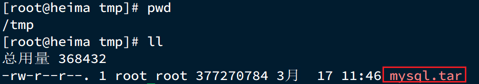
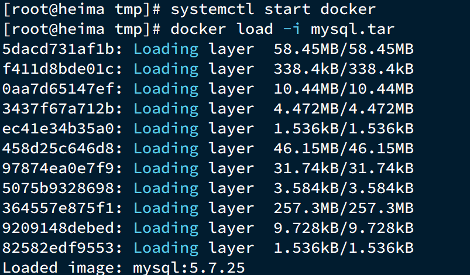
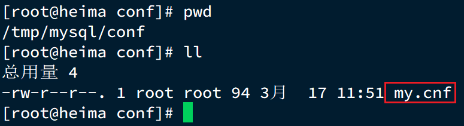

# 0.安装Docker

Docker 分为 CE 和 EE 两大版本。CE 即社区版（免费，支持周期 7 个月），EE 即企业版，强调安全，付费使用，支持周期 24 个月。

Docker CE 分为 `stable` `test` 和 `nightly` 三个更新频道。

官方网站上有各种环境下的 [安装指南](https://docs.docker.com/install/)，这里主要介绍 Docker CE 在 CentOS上的安装。

# 1.CentOS安装Docker

Docker CE 支持 64 位版本 CentOS 7，并且要求内核版本不低于 3.10， CentOS 7 满足最低内核的要求，所以我们在CentOS 7安装Docker。


## 1.1.卸载（可选）

如果之前安装过旧版本的Docker，可以使用下面命令卸载：

```
yum remove docker \
                  docker-client \
                  docker-client-latest \
                  docker-common \
                  docker-latest \
                  docker-latest-logrotate \
                  docker-logrotate \
                  docker-selinux \
                  docker-engine-selinux \
                  docker-engine \
                  docker-ce
```


## 1.2.安装docker

首先需要大家虚拟机联网，安装yum工具

```sh
yum install -y yum-utils \
           device-mapper-persistent-data \
           lvm2 --skip-broken
```


然后更新本地镜像源：

```shell
# 设置docker镜像源
yum-config-manager \
    --add-repo \
    https://mirrors.aliyun.com/docker-ce/linux/centos/docker-ce.repo
    
sed -i 's/download.docker.com/mirrors.aliyun.com\/docker-ce/g' /etc/yum.repos.d/docker-ce.repo

yum makecache fast
```


然后输入命令：

```shell
yum install -y docker-ce
```

docker-ce为社区免费版本。稍等片刻，docker即可安装成功。


## 1.3.启动docker

Docker应用需要用到各种端口，逐一去修改防火墙设置。非常麻烦，因此建议大家直接关闭防火墙！

启动docker前，一定要关闭防火墙！！

启动docker前，一定要关闭防火墙！！

启动docker前，一定要关闭防火墙！！


```sh
# 关闭
systemctl stop firewalld
# 禁止开机启动防火墙
systemctl disable firewalld
```


通过命令启动docker：

```sh
systemctl start docker  # 启动docker服务

systemctl stop docker  # 停止docker服务

systemctl restart docker  # 重启docker服务
```


然后输入命令，可以查看docker版本：

```
docker -v
```

如图：

 


## 1.4.配置镜像加速

docker官方镜像仓库网速较差，我们需要设置国内镜像服务：

参考阿里云的镜像加速文档：https://cr.console.aliyun.com/cn-hangzhou/instances/mirrors


# 2.Docker安装MySQL


## 2.1.上传

在将课前资料中的mysql.tar文件上传到虚拟机的/tmp目录：



通过load命令加载为镜像：

```sh
docker load -i mysql.tar
```

效果：




## 2.2.创建目录

创建两个目录，作为数据库的数据卷：

创建目录/tmp/mysql/data

创建目录/tmp/mysql/conf

```sh
# 创建目录
mkdir -p /tmp/mysql/data
mkdir -p /tmp/mysql/conf
```


将课前资料提供的my.cnf文件上传到/tmp/mysql/conf，如图：




## 2.3.运行docker命令

运行命令：

```sh
docker run \
 --name mysql \
 -e MYSQL_ROOT_PASSWORD=123 \
 -p 3306:3306 \
 -v /tmp/mysql/conf/my.cnf:/etc/mysql/conf.d/hmy.cnf \
 -v /tmp/mysql/data:/var/lib/mysql \
 -d \
 mysql:5.7.25
```


