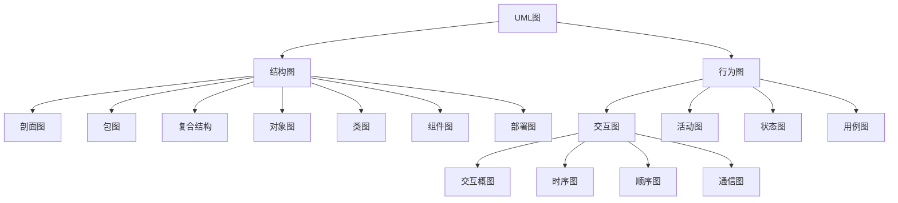
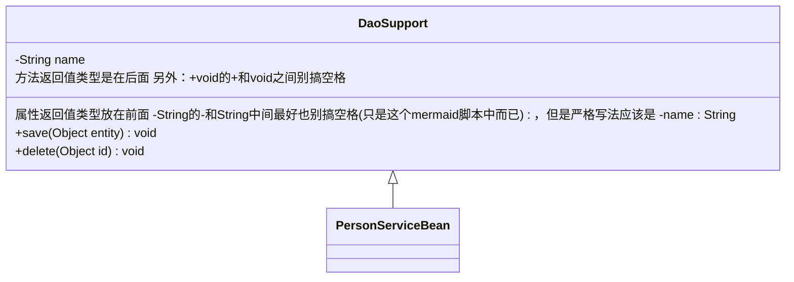
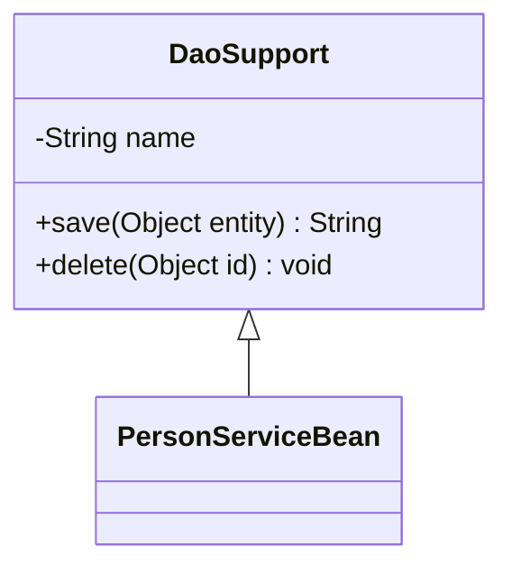
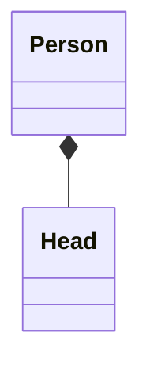
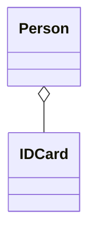

# [#](#UML统一建模语言) UML统一建模语言


> **定义：** 用于软件系统设计与分析的语言工具
>
> **目的：** 帮助开发人员更好的梳理逻辑、思路
>
> **官网：** https://www.omg.org/spec/UML
>
> 画图工具可以用在线网址：https://app.diagrams.net/ 或者是 https://www.processon.com/ 也可以用其他的
>


## [#](#UML组成结构) UML组成结构




## [#](#用例图) 用例图

> **定义：** 用来显示一组用例、参与者以及它们之间关系的图
>
> 是从需求分析出发，不考虑代码实现的事，描述用户希望如何使用一个系统。通过用例图可以知道谁是系统相关的用户，他们希望系统提供哪些服务，以及他们需要为系统提供什么样的服务


### [#](#用例图组成) 用例图组成

| **名称**                | 含义                                                         | **图例**                                                     |
| ----------------------- | ------------------------------------------------------------ | ------------------------------------------------------------ |
| 参与者 <br />(Actor)    | 也叫角色，**表示系统的用户**（在系统之外，但与系统直接交互的对象）<br />**注：这里的用户并不一定是指人，如：做的是公共API接口，那API的调用者就是用户** |  |
| 用例 <br />(Use Case)   | 描述参与者可以感受到的系统服务或者功能(换言之：**描述系统为了实现用户的目标而执行的<span style="color:blue">一个</span>系统功能单元**)<br /><br />**注：**用例的目标是要定义系统的一个行为，但并不显示系统的内部结构 / 某个功能的具体实现 |  |
| 系统边界                | 也叫容器(但这个名字词不达意)，**系统与系统之间的界限**       | 两种都对，但最常用的是矩形 |
| 子系统<br />(SubSystem) | 一堆用例的集合，这堆用例之间有着紧密关系(换言之：**展示系统的<span style="color:blue">一部分</span>功能**) |  |


### [#](#用例图之间的关系) 用例图之间的关系

| **符号**                                                     | **名称**    | **说明**                                                     | **图示**                                                     |
| ------------------------------------------------------------ | ----------- | ------------------------------------------------------------ | ------------------------------------------------------------ |
| `——————`                                                     | 关联        | 参与者与用例之间的通信（参与者 和 用例之间的关系）           |  |
| `-------->`                                                  | 包含        | 提取公共交互，提高复用<br />换言之：**一个用例需要某种功能，而该功能被另外一个用例定义，那么在用例的执行过程中，就可以调用已经定义好的用例**（用例 与 用例之间的关系）<br /><br />**箭头指向：**指向分解出来的功能用例 |  |
|  | 扩展        | 基用例保持不动，动态扩展基用例的功能（用例 与 用例之间的关系）<br />**扩展关系的限制规则（也是区别包含关系的手段）：**将一些常规的动作放在一个基本用例中，将**可选的或只在特定条件下**才执行的动作放在它的扩展用例中<br /><br />**箭头指向：**指向基用例 | 表示方式使用表中左边说的那种符号或者下图这种和包含一样，构造型换一下也行（通常用的是下面这种）<br /> |
|  | 泛化 / 继承 | 子用例中的特殊行为都可以作为父用例中的备选流存在（用例 与 用例之间的关系[父子用例] ）<br /><br />**箭头指向：**指向父用例（箭头实心和空心都可以，严格来讲是空心） |  |
| `<<include>>`                                                | 构造型      | 就是扩展的意思(UML中通用的扩展表现形式)，相当于说明<br /><br />`include `是包含关系关键字<br />`extend `是扩展关系关键字 |  |


### [#](#用例图实例) 用例图实例

注：下图 出钞 和 凭条与退卡 是说的物理机ATM保险柜的功能，并不是说出钞 和 凭条与退卡 是客户从提款机中看到的这二者功能（ PS：ATM分为两部分，一部分是我们所做的软件系统，即：下图的ATM系统，另一部分是ATM保险柜[钱真正在的地方]，可以说就是硬件，自动取款只是通过我们编写的软件系统去操作了保险柜，从而把钱吐出来）


## [#](#活动图) 活动图

活动图本质是流程图，从流程图演变而来的

> **定义：** 对系统的动态行为建模的一种工具，描述的是活动的顺序，即：从一种活动到另一种活动的控制流（本质：活动之间控制权的转换）


**对于上述我所谓的活动之间控制权的转换的说明：** 如：我去进行核酸检测（下图不严谨，当流程图来看，只是混入了活动图的图标在里面）

通过下图可以推论出：**控制权不会丢失，可以<span style="color:red">分散 / 分支</span>、最后也会<span style="color:red">合并</span>，不会消失，只是从一个活动到了另一个活动“手里”而已**（像能量守恒一样）


### [#](#活动图的基本组成) 活动图的基本组成

| **名称**    | **定义**                                                     | **符号**                                                     |
| ----------- | ------------------------------------------------------------ | ------------------------------------------------------------ |
| 开始状态    | 表示活动开始的一个状态<br /><br />**注：**开始状态**只能**有一个 | 下面两种表示方式都可以<br /> |
| 结束状态    | 表示活动结束的一个状态<br /><br />**注：**结束状态可以有多个 | 下面两种都行<br /> |
| 活动 / 动作 | 很多动作的集合<br />一个动作就是一个步骤<br /><br />如：打篮球就是一个活动，但是：里面却可以有很多动作，譬如：分组、进攻、防守......当然这些还可以再细分<br /><br />另外：动作其实就是子图（即：一个活动的内部逻辑。后续会说明） |  |
| 状态        | 和活动等价<br />特别点：严格来讲状态只分为开始状态和结束状态，活动符号并没有上面那种表示法（新版。旧版有），现在官网中对活动符号的表示如下：<br /> | **注意：**和活动符号的图不太一样，当然：用哪一个都可以<br /> |
| 控制流      | 就是控制权的流动方向，也有人叫“转移”                         | 下面两种表示方式都可以<br /> |
| 对象        | 某个类的实例或者是某些活动输出的结果（可以理解为是一个参数，某个活动状态需要借助某个参数，借助的这个参数就是一个对象）<br />在整个活动图中一个对象是可以多次出现的（类的实例嘛） | 注意对象名称下面是有下划线的<br /><br />另外：对象名称注意用名词来进行命名 |
| 对象流      | 可以理解为数据流<br />就是活动与对象之间的数据传递，也就是活动之间需要某个 / 某些对象来参与，那么：控制流就变成了对象流 | 下面二者都可以<br /> |
| 流终止      | 表示控制流 / 对象流的结束<br />这个其实可以不要，终止了不在图中表示出来不就表示终止了吗 |  |
| 事件        | 可以理解为信号<br />分为发出信号 和 接收信号<br />           | 下图的中间两个，左为发出信号，右为接收信号<br /><br />逻辑：<br />处理订单后，发出请求付款的信号<br />活动等待接收确认付款的信号<br />活动接收到了付款信号之后，即发货<br /><br />还有一种事件：叫时间事件（也可以当做是一个活动）<br />就是等待某一个时间才能触发某个活动<br />时间名称放在符号下方<br /> |
| 判定活动    | 就是流程图中的逻辑判断                                       | 注意：这个不是分支或者合并，还差一点东西才能变成分支 或 合并（就是几根控制流的线），有了这一步才能说创建分支 |
| 同步条      | 就是控制流（控制权）的控制<br />下面看到了分叉与会合之后就一清二楚了 | 分为水平同步 和 垂直同步（二者没区别，是画图的方向问题，看画的图箭头方向是怎样的，然后选择对应的同步条即可）<br /> |


### [#](#分支与合并：都需要判定活动参与) 分支与合并：都需要判定活动参与

**分支**：可以理解为控制权的分散（一个活动的控制权分给了多个活动），**要求：必须是一个控制输入流、两个及以上的控制输出流**，符号表示方式如下(菱形+四个控制流箭头）


- **注意：**判定活动（即：菱形）不是分支，判定活动+控制流才是分支


**合并**：可以理解为控制权的融合（多个活动的控制权给到了一个活动），就是分支的逆向。**要求：多个控制输入流、一个控制输出流**，符号表示如下


### [#](#分叉与会合：都需要同步条参与) 分叉与会合：都需要同步条参与

**分叉：**用于将一个控制流分为两个或多个**并发运行**的分支，**要求：必须是一个控制输入流、两个及以上的控制输出流**，符号表示如下


**会合：**用于将两个或多个控制流合并到一起形成一个单向的控制流，**要求：多个控制输入流、一个控制输出流**，符号表示如下


### [#](#泳道) 泳道

**定义：**表明每个活动是由哪些对象负责完成的（换言之：表示活动的发起者是谁，对象不一定非要是人，可以是系统、会员........），也可以说是：一个对象进行了哪些活动。当然：可以换个名字就更好理解了，即：分区（一个区域中有哪些活动状态）


**泳道分类：**水平泳道和垂直泳道，和前面的同步条是一样的，水平和垂直没什么区别，也是画图方向的问题，符号表示如下


**实例：**


### [#](#子图：也叫子活动图) 子图：也叫子活动图

在前面的表格中提到过，就是动作（活动是动作的集合体，类似Java中的对象 ---抽象---->类，很多动作 ------抽象------>活动），可以理解为：是对某个活动画的补充图，只不过这个补充图是较为详细的逻辑表现（类似一个活动需要引入的粗糙点的流程图）


**定义：**对某个活动进行的续图说明，**符号表示就是一个倒着的“扫把”（下图这种颜色的图是我在官网下载的文档中嫖的，版本是2.5.1）**


左边活动中有一个倒着的扫把就表示这个活动要引入一个子图，而右边就是引入的子图内容


**注意：动作和活动这两个不能说完全等价（钻字眼儿），用上图举例**

- 如果左边的活动里面的一部分流程描述 / 活动组成内容刚好在另一个真正的活动图中分毫不差地体现了，而左边这个活动需要引入，那么此时就可以说子图就是活动，即：动作等价于活动
- 如果左边的活动里面需要的部分流程描述 / 活动组成内容没有找到其他活动图来完全贴合其描述，那么就是需要新画一个子图来对左边的活动进行简略描述，继而在左边活动中引入，则：此时子图是动作，而不是真正的活动，即：动作不等价于活动


### [#](#扩展区域) 扩展区域：也叫扩充区 或 扩展区

**定义：**将一个需要体现在活动图中的**循环过程**进行提取（不需要体现在活动图中的，可以直接使用活动节点来略写），有点类似于子图，但是扩展区的关键就是提取的是一个活动中的循环过程，但不是把循环过程重新弄成一个活动图，而是就在当前活动图中


**符号表示如下（左为简单写法，右为完整写法[）：**


**实例：**


## [#](#类图、对象图) 类图、对象图

> **定义（人话）：** 就是表示一个类 / 接口的组成结构
>
> - 对于属性：看修饰符是什么(public、private、static等)、数据类型是什么、属性名叫什么、是否有默认值
>
> - 对于方法：看修饰符是什么(public、private、static等)、返回值是什么、方法名是什么、参数类型和名字是什么
>
> ..................


#### [#](#类图中的标识符) 类图中的标识符

| **关键字** | **表示方式**                                                 |
| ---------- | ------------------------------------------------------------ |
| public     | 用 `+` 表示                                                  |
| private    | 用 `-` 表示                                                  |
| protected  | 用`#` 表示                                                   |
| package    | 用`~` 表示                                                   |
| abstract   | 用`*`表示                                                    |
| static     | 用`$`表示                                                    |
| 泛型       | 用`~泛型类型~`表示 如：`List~int~ position`                  |
| 注解       | 用`以<<开头 注解内容 以>>结尾`<br /><br />可以用一个特定的标记文本来注释，如：<br />`<<Interface>>` 代表一个接口<br />`<<abstract>>` 代表一个抽象类<br />`<<Service>>` 代表一个服务类<br />`<<enumeration>>` 代表一个枚举 |
| 注释       | 用`%%注释内容`表示<br />注释开始到下一个换行符之前的任何文本都将被视为注释，包括任何类图语法<br />这是对类图进行注释，即：说明，不是说属性、方法.....都搞这个 |


**对于类：** 以 https://www.processon.com 网址中的为例（下列名字见名知意，对照上面的人话定义即可）


**对于接口：** 和上面的类图是相通的


#### [#](#类图之间的关系) 类图之间的关系

| **名字**          | **指向**                                                     | **示例**                                                     | **图示**                                                     |
| ----------------- | ------------------------------------------------------------ | ------------------------------------------------------------ | ------------------------------------------------------------ |
| **泛化 / 继承**   | **子类 指向 父类** <br />**子抽象类 指向 父抽象类**          | 学生类 继承 人类                                             | 实心三角箭头 和 空心三角箭头都行<br /> |
| **组合**          | **菱形部分指向整体**<br />是属于包含关系中的一种（组合、聚合、关联）<br />是`A has - a B`的关系。一句话：一荣俱荣、一毁俱毁<br />整体和部分关系、整体部分不可分离、比聚合更强<br />如：一个类中的一个属性为`private Head head = new Head(); `，直接绑定在一起的 | 大雁和大雁翅膀的关系，两者是同生共死的                       |  |
| **聚合**          | **菱形部分指向整体[箭头指向个体，这个箭头可有可无]**<br />是属于包含关系中的一种（组合、聚合、关联）<br />是`A has - a B`的关系。<br />还是整体和部分的关系，但是创建时有可能是分隔开的<br />如：一个类中的属性为`private IDCard card;`这个属性值可能会后续在其他地方传进来（有参构造） | 大雁和雁群之间的关系<br />更如：电脑和主板                   |  |
| **关联 / 关联类** | **箭头指向成员变量类(单关联）。这种单关联注意一种模型图（最严格的一种写法）：在没有箭头的一方可能会有一个“×”，这表示：箭头的一方一定没有关联“×”的一方。反之：没有“×”表示当前模型中没有明确说明无箭头一方是否关联有箭头一方**<br /><br />**箭头指向彼此（双关联），如：A类中有B类作为成员变量（属性），B类中有A类作为属性，此时彼此都产生关联，即为双向箭头 / 双关联**<br /><br />**还有一种写法：两边都没有箭头，就是一根实线，这种直接说是包含关系（是一种不严谨的写法），这种直接当做属性，A类和B类至于是单关联还是双关联都行**<br /><br /><br />**注意一种情况：下面这种 下图不等价于上图（它们表示“不同组”，即：上图表示Car关联的是驾驶这辆Car的Person，而Person驾驶的是同一辆Car；而下图表示Car关联的是驾驶这辆Car的Person，但Person关联 / 驾驶的是另外的Car[某辆车需要人类中的某个人来驾驶，而人类中的另外某个人可以驾驶另外型号的车]）**<br /><br />关联关系是属于包含关系中的一种（组合、聚合、关联)<br />是`A has - a B`的关系<br />是整体和部分的关系，可以分割，是后来组合在一起的<br />换言之：两个类之间的关联，也可以是一个类和自身的关联<br /> | 班级类和学生类，学生类作为成员变量存在于班级类中<br />也如：人有汽车、人有电脑 |  |
| **类关联**        | 这就是比关联类更细节性的画图（让某些情景不产生歧义）<br />抽象了多对多的本身（A集合和B集合各自全集的笛卡尔乘积的子集） | 下图为**关联类**<br /><br />上图表达的逻辑：1、一个人有多条出席会议记录，对应的是一个会议[图符合，因为这个人可能会和不同的人开同一个会议]；2、一个会议有2或以上条出席会议记录，对应的是一个人[图也符合，因为这个会议某个人可能参加了多次]。所以虽然图看起来没问题，但是不贴合现实[一个人出席了同一个会议那记录为1就可以了，按上图来看就会出现某个人有多条出席会议记录 - 即：重复了]，所以上图中“总的出席会议记录数量大小”在数学上应该是：多人、多会议各自全集的笛卡尔乘积的子集[会排除重复的]，因此为了贴合现实图就改造为如下的**类关联**：<br /><br />逻辑：1、2或以上的人对应多个会议（多对多)；2、出席会议记录类关联了人和会议两个类，并且出席会议记录最后的结果为两边集合各自的全集的笛卡尔乘积的子集[排除重复的结果]) |  |
| **依赖**          | **箭头指向入参类**<br />`A need - a B` 的关系                | 班级类和学生类，班级类作为学生类的方法入参                   |  |
| **实现**          | **箭头指向接口**                                             | 学生类实现人类                                               |  |


#### [#](#各类图关系实例) 各类图关系实例

##### [#](#继承：也叫泛化) 继承：也叫泛化

```java

public class DaoSupport{
    
    private String name;
    
    public void save(Object entity){}
    
    public void delete(Object id){} 
}


public class PersonServiceBean extends Daosupport{
}

```


使用typora的mermaid脚本画图

> **语法学习地址**：[Markdown教程-慕课网 (imooc.com)](https://www.imooc.com/wiki/markdownlesson/markdownclassdiagram.html)
> **mermaid语法学习地址**：https://mermaid-js.github.io/mermaid/#/

```txt
语法：
	<|--	表示继承	箭头指向的一方是被继承者

+	表示  public

-	表示	private
```


````json


````

效果如下：




##### [#](#组合) 组合

```java
public class Person {
    
    // 组合关系：某个类的对象 当做 当前类的属性，并已经new了
    private Head head = new Head(); 
}
```


```txt
mermaid脚本画图语法：

​	*--  表示组合，星 * 指向的是整体 即：菱形指向整体
```


````json
```mermaid

    classDiagram

        class Person{

        }

        Person *-- Head  // 表示的是：Person 组合 Head
```
````

效果如下：




##### [#](#聚合) 聚合

```java
public class Person {
    // 聚合关系
    private IDCard card;
    
    // 对照：组合关系
    private Head head = new Head();
}
```

````json
```mermaid

classDiagram
	class Person{
	
	}
	
	Person o-- IDCard  // 这是字母o 不是0，菱形指向整体 即：Person聚合了IDCard

```
````

效果如下：




##### [#](#关联、依赖、实现) 关联、依赖、实现

| **符号** | **描述** |
| -------- | -------- |
| `<|--`   | 继承关系 |
| `*--`    | 组合关系 |
| `o--`    | 聚合关系 |
| `-->`    | 关联关系 |
| `..>`    | 依赖关系 |
| `..|>`   | 实现关系 |
| `--`     | 实线链接 |
| `..`     | 虚线链接 |


## [#](#对象图) 对象图

> **定义：** 表示在某时刻对象和对象之间的关系(由于对象存在生命周期，因此对象图只能在系统某一时间段存在)
>
> **对象图是类图的实例，几乎使用与类图完全相同的标识**。一个对象图可看成一个类图的特殊用例


## [#](#顺序图和通信图) 顺序图 和 通信图

### [#](#顺序图) 顺序图：也叫时序图

> **定义：** 用来表达对象间消息传递的顺序
>
> 一般来说：顺序图也叫时序图、序列图（这三个在英文中都是`Sequence `），但是：严格来说（电子通讯方面），顺序图是顺序图，时序图 / 序列图是时序图 / 序列图（在电子通讯方面，这个实在要对应的话，就对应UML中的时间图`Timing Diagram`），在电子通讯领域这二者要表达的意思并不一样，但是对于我们编程这一行业来说：直接把顺序图、时序图、序列图等价也没错，叫其中哪一个名字都无所谓


#### [#](#顺序图组成) 顺序图组成

> markdown中画时序图语法（本质是使用了mermaid脚本）：https://www.imooc.com/wiki/markdownlesson/markdownsequencediagram.html
>
> mermaid脚本语法：https://mermaid-js.github.io/mermaid/#/sequenceDiagram


| **名称**           | **说明**                                                     | **图示**                                                     |
| ------------------ | ------------------------------------------------------------ | ------------------------------------------------------------ |
| **参与者**         | 也叫角色，**表示系统的用户**（在系统之外，但与系统直接交互的对象）<br />**注：这里的用户并不一定是指人，如：做的是公共API接口，那API的调用者就是用户** |  |
| 对象               | 就是对象图中的对象，可理解成某个类的实例                     | <br />如果只显示类名，则：去掉上图中“对象名”即可，即：`:某个类类型`<br />如果只显示对象名而不显示类名，则：去掉 `:` 及之后的即可，即:`对象名` |
| **生命线**         | 表示对象的生存时间（就是一条向下的虚线）                     |  |
| **激活**           | 表示某种行为的开始或结束，就是一个小矩形<br />反之：没有小矩形的那些虚线就是对象的休眠 |  |
| **消息**           | 分为同步消息 和 异步消息<br />在UML中，指的是：对象与对象之间的通信<br />在顺序图中是用 两个对象之间带箭头的线来表示 | 注：下图真实含义是另一个，拆开看，单独只看两个带箭头的线即可，整个图的场景是另一个意思<br /><br />**带实心箭头的实线：发送消息 / 方法调用**<br />**带开放式的三角箭头的虚线：返回消息 / 返回值（特别需要返回消息时就用，不特别需要的话，那么采用下面同步那种简化画法就可以了)** |
| 同步消息           | 就是消息发送完毕了，就返回消息（一条龙服务）<br />当然：这也意味着阻塞和等待 | <br />当然：上图也可以换成前面那种用“开放式的三角箭头的虚线返回消息”，上图这种是简写形式<br />注意：1、图中参数哪里要是没有，不表示就没有消息的发送（调用方法，方法本身就是消息发送)；2、如果没有返回值，即：`void`那也不表示没有返回消息（当进行方法调用时，右边已经激活，一样会进行阻塞，即：右边激活条做完该做的事情，照样给左边返回信息，告知调用者事情做完了，只是图中不会显示地画出来而已，但内部逻辑还是有的) |
| 异步消息           | 和同步换一下，就是消息发送完毕了，返回消息可以后面给（中间可以做完另外的事情再给）<br />同理：这就意味着非阻塞 | <br /><br />注意：和同步消息画法不一样（箭头不一样)，另外：异步中返回消息不是虚线，是实线（就是变成右边对象向左边对象发送消息：内容就是左边对象要的返回消息 / 返回值) |
| 持续消息时间       | 字面意思<br />出现的情况：有些消息需要持续很长一段时间，从而需要标注出来（如：大文件上传） | 第一种：使用**带有实心箭头的倾斜的线**表示（下图中  `{}`  中括号中是条件控制，在后续会介绍）<br /><br />第二种：表达准确的时间（在第一种的基础上，继续加入东西)<br /><br />上图表示：在2h内上传文件，然后返回结果之后等待5min以上，检查上传情况 |
| 重入消息           | A对象给B对象发消息，在B还未返回消息之前，B给A发了一条消息    |  |
| 自我调用           | 是重入消息的特例（A给B发消息，在B未返回之前，A又给自己发了一条消息）<br />所以就是自己玩自己（俗称：自wei） | 下面两种画法都可以(严格来讲是第一种）<br /> |
| 无触发和无接收消息 | 上面那些都是基于系统本身内部的，但是：有些可能需要使用到系统外部的某些东西（对象、参与者....）<br />在技术实施开发层面一般不会见到，其他岗位会有 |  |
| 对象的创建         | 字面意思                                                     | 被创建对象会比生命线矮一截（就是下图中右边比左边矮一点） |
| 对象的销毁         | 字面意思，表示方式就是在对象销毁时打一个“×”                  |  |


#### [#](#执行控制) 执行控制

| **关键字** | **说明**                                                     |
| ---------- | ------------------------------------------------------------ |
| **alt**    | 备用多个片段：只执行条件为真的片段（就是条件分支`if else`）  |
| **opt**    | 可选项：仅当提供的条件为真时才执行片段。相当于只有一条痕迹线的alt |
| **par**    | 并行：每个片段并行运行                                       |
| **loop**   | 循环：片段可以执行多次，并且防护指示迭代的基础               |
| region     | 关键区域：片段只能有一个线程一次执行它                       |
| neg        | 否定：片段显示无效的交互                                     |
| ref        | 参考：指在另一个图中定义的交互，绘制框架以覆盖交互中涉及的生命线（可以定义参数和返回值） |
| sd         | 序列图：用于包围整个序列图                                   |

上面的都是官方话，接下来举一些常用的例子。


##### [#](#条件分支) 条件分支 alt


##### [#](#可选项) 可选项 opt

> 包含一个可能发生或不发生的序列


只要当我成绩score小于60时，老妈打我这件事情肯定会发生。大于就不会发生


##### [#](#循环) 循环 loop

图是网上偷的，看懂了分支，那循环也能很容易看懂了


##### [#](#并行) 并行 par


#### [#](#顺序图示例) 顺序图示例

SpringMVC执行流程原理


转化为顺序图


### [#](#通信图) 通信图

> 通信图和顺序图可以等价互转
>
> 通信图牺牲了顺序上的直观性，增强了布局和关联上的直观性；而顺序图是相反的
>
> 要搞逻辑就看序号（`1:`、`1.1:`、`2:`、`2.1:`..........）

假如一个序列图如下


转化为通信图（两张图对照看就懂了）：


## [#](#状态图) 状态图：状态机图 或 转移图

> **定义：** 状态图又名状态机图或转移图，指的是：一个特定对象的所有可能的状态以及引起状态转换的事件
>
> 一个对象必然会经历一个从开始创建到最终消亡的完整过程，这称之为对象的生命周期。对象在其生命周期内是不可能完全孤立的，它必然会接受消息来改变自身，或者发送消息来影响其他对象。而状态机就是用于说明对象在其生命周期中响应时间所经历的状态序列以及其对这些事件的响应。在状态机的语境中，一个事件就是一次激发的产生，每个激发都可以触发一个状态转换


### [#](#状态图的组成) 状态图的组成

一份简单的状态图


状态图组成如下：

| **名称** | **说明**                                                     |
| -------- | ------------------------------------------------------------ |
| 状态     | 指的是对象在其生命周期中的一种状况，处于某个特定状态中的对象必然会满足某些条件、执行某些动作或者是等待某些事件 |
| 动作     | 指的是状态机中可以执行的哪些原子操作<br />原子操作：指的是他们在运行的过程中不能被其他消息中断，必须一直执行下去，以至最终导致状态的变更或者返回一个值 |
| 事件     | 指的是发生在时间和空间上对状态机来讲有意义的那些事情<br />事件通常会引起状态的变迁，促使状态机从一种状态切换到另一种状态 |
| 活动     | 指的是状态机中做的那些非原子操作                             |
| 转移     | 指的是两个不同状态之间的一种关系，表明对象在第一个状态中执行一定的动作，并且在满足某个特定条件下由某个事件触发进入第二个状态 |


#### [#](#状态图的五要素) 状态图的五要素


**注意：**

- 上图中“触发事件”和“监护条件”要同时生效的，即：只有“触发事件”满足“监护条件”，才能执行“动作”，从而让第一个状态转移为第二个状态
  - “监护条件”写法就是`[监护条件]`，`[]`不能丢
- 上图中整个“带箭头的三角的实线（单纯地这根线）”就是“转移”，或者称之为：行为状态也行
- 上图中整个“带箭头的三角的实线+上面的触发事件[监护条件]/动作”就是事件，其中：触发事件[监护条件]/动作 三者少哪一个都行，甚至全没有也行


#### [#](#状态图中的状态) 状态图中的状态

> **提示**
>
> 初态和终态都不是真正的状态，而是：伪状态

| **名字** | **说明**                                                     | **图示**                                                     |
| -------- | ------------------------------------------------------------ | ------------------------------------------------------------ |
| 初态     | 一个状态图有且只有一个初态                                   | 黑色实心<br /> |
| 终态     | 一个状态图中可以有一个或多个终态，也可以没有终态             | 一对同心圆（内圆为实心圆）<br /> |
| 中间态   | 用圆角矩形表示，可以用一条水平横线把它分成上、下两部分。（**上**面部分为**状态的名称[必有]**；**下**面部分是**活动表[可选]**）<br /><br />有些软件是分成了三部分：**上**面部分为**状态的名称（必有）**；**中**间部分为**状态变量的名字和值（可选）**；**下**面部分是**活动表（可选）** |  |
| 子状态   | 就是状态中套状态                                             |  |
| 历史状态 | 就是一个对象曾经已经发生过的状态的记录，类似历史日志<br />作用：用来恢复状态的。如：断电了，导致系统整个状态结束了，恢复电之后想要回到断电时的状态就可以用 | 可以多层嵌套，就是一个套一个（有可能要恢复的状态在很多层里面）<br /><br />举例： |

对于上面表格的**中间态中说的活动表**的说明：

- 活动表又名转换域

- 表达式语法为：**事件名(参数表)/动作表达式**，其中：参数表也可以没有，如下


- 在活动表中经常使用的3种标准事件
  - `do` 上图已经见过了，指的是：在该状态下的动作
  - `entry` 进入该状态的动作
  - `exit` 退出该状态的动作


### [#](#组件图) 组件图：也叫构件图

> **定义：** 用来描述一个系统 / 功能的物理构件( 组件与组件之间的关系 )。包括文件，可执行文件，库等。换言之：构成系统某一特定方面的实现结构
>
> **组件图 = 构件 / 组件（Component）+接口（Interface）+关系（Relationship）+端口（Port）+连接器（Connector）**


#### [#](#组件图的组成) 组件图的组成

##### [#](#组件) 组件

> **定义：** 是一个封装好的物理实现单元，隐藏内部的实现，对外提供了一组接口
> 具有自己的身份标示和定义明确的接口。由于它对接口的实现过程与外部元素独立，所以组件具有可替换性
>
> 
>
>
> 人话：组件就是一个实际的文件或者多个文件组成的可执行程序【通俗的话来说[严格来讲不能这么理解，但是为了理解而理解，可以用]】：组件就相当于Java的抽象和封装思想


**组件的种类：**

1. **源代码组件**：一个源代码文件或者与一个包对应的若干个源代码文件
2. **二进制组件**：一个目标码文件，一个静态的或者动态的库文件
3. **可执行组件**：在一台处理器上可运行的一个可执行的程序单位，即所谓的可执行程序


**组件长什么样子(UML1.x的画法）**


##### [#](#组件盒：就是组件) 组件盒：就是组件

> **定义：** 就是一个用来装组件的盒子
>
> 当然：组件盒其实就是组件，这二者就是等价的，因为这盒子里面装的就是组件，因此：UML2.x中，**组件就是组件盒**

**组件盒长什么样子**


**因此：组件的画法就可以弄成下面几种了**

1. **矩形+图标**


2. **矩形+构造型标签**，就是上面组件盒的画法，下图构造型标签`<<>>`中写组件中文名字也行（但：建议用英文关键字）


3. 前面**两者都有**的画法，这种画法构造型标签`<<component>>`就只起到标识作用


##### [#](#接口) 接口

> **分为两类：提供接口 和 需求接口**
>
>**提供接口：**又被称为导出接口或供给接口，由提供操作的组件提供，是组件为其他组件提供服务的操作的集合（如：商品组件提供商品相关的一堆接口）
> **需求接口：**又被称为引入接口，是组件向其他组件请求相应服务时的接口（订单组件需要调用商品组件提供的接口）

**提供接口长什么样子？**


**需求接口长什么样子？**


##### [#](#端口) 端口

这个已经在熟悉不过了：**就是一个被封装的组件的对外窗口**，即我们平时所说的端口

> 在封装的组件中，所有出入组件的交互都要通过端口。它是被封装的组件与外界的交互点，遵循指定接口的组件通过它来收发消息

**表示方式：就是一个小矩形**


##### [#](#连接器) 连接器

**指的就是组件间的连接**，换言之：就是组件之间的关系，也就是在类图中的实线、泛化关系........等等，所以：连接器不只是在组件图中，在UML图中都有，就是那些线嘛（在组件图中，这种关系有个专业名词叫：组装连接器，还有一个委托连接器：连接外部接口的端口和内部接口[这个不需要多了解]）

- **实现关系：用直线表示**
- **依赖关系：用带箭头的虚线表示**


**额外补充：组件依赖的表示方式（下图中上面那种也叫插座表示法，和下面的表示方式是等价的）**


##### [#](#前几者组合在一起的样子) 前几者组合在一起的样子

外面大的那个就是**容器**，和包图很像（但不太一样）


既然提到了包图，那就一次性弄完：

- **包图**：见名知意。和平时接触的包依赖关系一样。如：A包导入B包，那A包可以使用B包的东西


单个包图完整样子是下面这个鬼样


搞到了包图，那就解释一下前面连接器那里：**为什么连接器是通用的问题**

有个包关系是如下的样子


即：混合结构（`Composite Structures`）中导入了类图（`classes`），后面的依次看，继而推出：混合结构（`Composite Structures`）是类图（`classes`）的一种扩展，同理：组件图中就有了混合结构和类


##### [#](#混合结构) 混合结构

上面提到了混合结构，那也来搞一下

**混合结构的意思就是字面意思，混合嘛，即：类图、组件图......混合使用（开发中的那个画法就是）**


解读：

- 整个`Car`大框就是类图;
- 类图中的属性（`Car`下面的那个属性的大框）变成了组件图（组件图中再套组件图.......）;
- 组件图中的属性表示方式和类图中一样（`-`为private、`+`为public，属性名、属性类型.....）


#### [#](#组件图示例) 组件图示例

在网上嫖的图，意思意思


## [#](#部署图) 部署图

> **定义：** 描述的就是物理层面的模型，就是让系统和硬件打上交道


> **部署图与组件图相同的构成元素：**
>
> - 组件、接口、组件实例，提供接口（组件向外提供服务）、需求接口（组件要求外部提供的服务）
>
> **部署图与构件图的关系：**
>
> - 部署图表现组件实例； 组件图表现组件类型的定义
>
> - 部署图偏向于描述组件在节点中运行时的状态，描述了组件运行的环境
>
> - 组件图偏向于描述组件之间相互依赖支持的基本关系

上面提到了组件和组件实例，其实只是不同的称呼而已，在组件图中都已经见过，只是换成部署图中名字有细微区别而已，符号都是一样的


### [#](#部署图的组成) 部署图的组成

#### [#](#组件) 物件：也叫构建 或 组件

> **定义：** 就是被部署的东西

长什么样子在组件图中已经见过了（参考前面内容：组件）


#### [#](#节点) 节点

> **定义：** 运行时对象和组件实例驻留的位置
>
> 把方向放大一点：也可以说是物件要部署的目标位置，即：物件要部署到哪里去

**节点画法：**


**1、针对于各对象 / 各节点的部署来说：描述的各节点之间的关系（也叫实例层部署）**

前面玩过的那些类图、对象图、组件图中的关系都可以用，部署图就看部署的是什么

**1）、各对象关系部署**：就是对象图简化版，换个意思，换个场景（部署），细微换一下画法罢了。支持：一对多、多对多


官方文档中是这样介绍这种部署的


**2）、各节点关系部署**、支持：一对多、多对多


再变一下就变成官方文档中说的：节点实例部署，支持：一对多、多对多


**2、针对节点以及其包含的组件的部署（这种也叫描述层部署）。** 官方文档称之为：组件 / 工件部署（工件：指的是任何留下记录的事物都可以称之为工件），叫法无所谓，支持：一对多、多对多


#### [#](#物件与节点的关系：部署) 物件与节点的关系：部署

就是下图中组件和整个节点的关系（deploy）


如官方文档中


#### [#](#节点与节点的关系：通信路径) 节点与节点的关系：通信路径

指的就是下图中的那根线 + 通信方式


# [#](#设计原则) 设计原则


> **单一职责（Single Responsibility Principle）：**一个类和方法只做一件事（有且仅有一个原因引起它的[类和接口]改变）
>
> **开闭原则（Open Closed Principle）：**抽象架构，扩展实现
>
> **里氏替换（Liskov Substitution Principle）：**多态，子类可以扩展父类
>
> **迪米特原则（Law of Demeter）：**最少知道，降低藕合
>
> **接口隔离（Interface Segregation Principle）：**建立单一接口 / 接口不可再分
>
> **依赖倒置（Dependence Inversion Principle）：**细节依赖抽象，下层依赖上层（也可以叫做面向接口编程）
>
> 
>
> 以上几个的第一个单词首字母合起来就是（里氏替换原则和迪米特法则的首字母重复，只取一个）： SOLID（坚硬的）


## [#](#单一职责原则) 单一职责原则

> **定义：** 一个类和方法只做一件事（有且仅有一个原因引起它的[类和接口]改变）

如打电话分为：拨通、交流、挂断，类图如下


但是这样是有问题的，因为：`dial`拨通、`hangup`挂断是属于链接管理，而`chat`交流是属于数据传送，因为这个`IPhone`接口就有两个原因导致它发生变化了，因此：进行改造，抽离（面向接口编程，对外公布接口，不公布实现类）


## [#](#开闭原则) 开闭原则

> **定义：** 抽象架构，扩展实现
>
> 具体意思：指一个软件实体如类、模块和函数应该对扩展开放，对修改关闭。也就是说一个软件实体应该通过扩展来实现变化，而不是通过修改已有的代码来实现变化

如书店卖书，类图如下：


接下来搞打折活动，这时不可能说是去修改IBook接口，在里面新增一个打折`getOffPrice()`的方法吧，这样的话，那实现类`NovelBook`需要改源码，而关联类`BookStroe`也需要修改。甚至也不可能直接在实现类`NovelBook`中把`getPrice()`的逻辑进行修改，这两个方法都不行，因此：应该改成如下的样子

重新来一个`OffNovelBook`类继承`NovelBook`，从而重写`getPrice()`方法，这样就做到：对扩展开放[原价格可以在`NovelBook`类的`getPrice()`中拿到，打折后的价格可以在扩展类`OffNovelBook`的`getPrice()`方法中拿到]、对修改关闭[并不需要动原有的代码]


## [#](#里氏替换原则) 里氏替换原则

> **定义：** 多态，子类可以扩展父类

里氏替换原则通俗易懂的定义是：只要父类能出现的地方，子类就可以出现，而且替换为子类也不会产生任何错误或异常（在开发中的场景是：定义一个接口或抽象类，然后在使用其实现类时，传入接口类型的参数，即：多态），但是：又包含4层含义

1. **子类必须完全实现父类的方法**

2. **子类可以有自己的属性和方法**

3. **覆盖或实现父类的方法时，<span style="color:red">输入参数</span>可以被放大（如：父类中方法的参数类型是hashMap，子类重写时参数类型可以Map类型）**

4. **覆盖或实现父类的方法时，<span style="color:red">输出结果</span>可以被缩小（对照3）**


## [#](#迪米特原则) 迪米特原则

> **定义：** 也叫最少知道原则，即：一个对象对其他对象应该有最少的了解，有另外一个英文解释：Only talk to your immediate friends(只和直接的朋友交流)
>
> **核心观念就是类间解耦，弱耦合，只有弱耦合了以后，类的复用率才可以提升上去**

例子的话：生活中最常见，即：脚踏两只船，针对于两个女票之间，这两个对象最好还是少知道点彼此的事情比较好吧，不然试试？


## [#](#接口隔离原则) 接口隔离原则

> **定义：** 建立单一接口 / 接口不可再分，或者说是：类间的依赖关系应该建立在最小的接口上

如搜索美女，类图设计假如是下面的样子


但是如果按上图来弄的话，那`IBeauty`美女接口中定义的是：好颜值 or 好身材 or 好气质的才是美女，可是：每个人的品味都不一样啊，可能有人认为这三者中的任意一种组合就叫美女，因此：需要把上面的类图改造成如下的样子：


重构以后，不管以后需要颜值美女，还是需要身材美女，亦或气质美女，都可以保持接口的稳定性

以上把一个臃肿的接口拆分为三个独立的接口所依赖的原则就是接口隔离原则，即：最小接口 / 建立单一接口嘛


## [#](#依赖倒置原则) 依赖倒置原则

> **定义：** 细节依赖抽象，下层依赖上层（也可以叫做面向接口编程）
>
> 1. 模块间的依赖通过抽象发生，实现类之间不直接发生依赖关系，其依赖关系是通过接口或抽象类产生的；
>
> 2. 接口或抽象类不依赖于实现类；
>
> 3. 实现类依赖接口或抽象类
>
>   
>
>   **依赖倒置原则可以减少类间的耦合性，提高系统的稳定性，降低并行开发引起的风险，提高代码的可读性和可维护性**


**依赖倒置原则的使用建议：**

1. 每个类尽量都有接口或抽象类，或者接口和抽象类两者都具备。

2. 变量的表面类型尽量是接口或抽象类。

3. 任何类都不应该从具体类派生。

4. 尽量不要重写基类的方法。如果基类是一个抽象类，而且这个方法已经实现了，子类尽量不要重写。

5. 结合里氏替换原则使用


