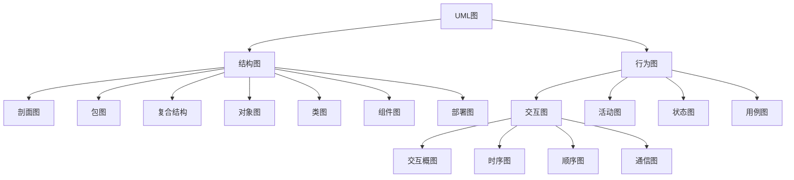
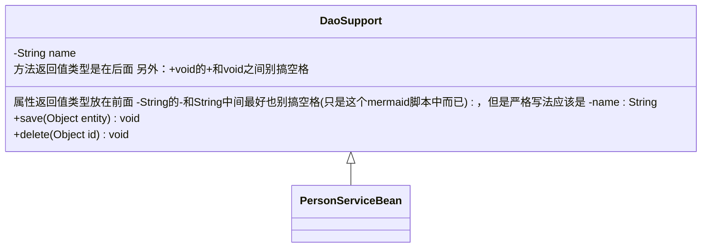
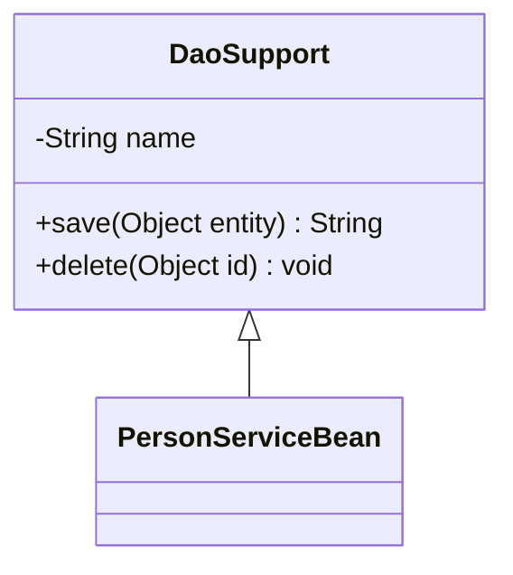
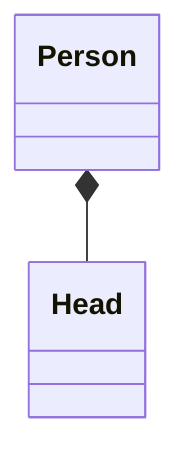
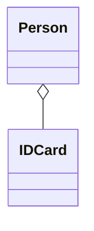

# 1、UML统一建模语言


> **定义：用于软件系统设计与分析的语言工具**
>
> **目的：帮助开发人员更好的梳理逻辑、思路**
> 		**学习地址：**[UML概述_w3cschool](https://www.w3cschool.cn/uml_tutorial/uml_tutorial-c1gf28pd.html)
>
> **官网：https://www.omg.org/spec/UML**


## 1.1、UML组成结构




## 1.2、各类UML图示例

- **画图工具可以用亿图图示或其他工具，亿图图示可以自行在微信订阅号中搜索：亿图图示V10破解即可**
  - 懒得找的话也可以直接去这里：https://mp.weixin.qq.com/s/bfg_D8ADLZ7KV7PjGBEH5A


### 1.2.1、用例图

> **定义：用来显示一组用例、参与者以及它们之间关系的图**
>
> 是从需求分析出发，不考虑代码实现的事，描述用户希望如何使用一个系统。通过用例图可以知道谁是系统相关的用户，他们希望系统提供哪些服务，以及他们需要为系统提供什么样的服务


#### 1.2.1.1、用例图组成

| **名称**                | 含义                                                         | **图例**                                                     |
| ----------------------- | ------------------------------------------------------------ | ------------------------------------------------------------ |
| 参与者 <br />(Actor)    | 也叫角色，**表示系统的用户**（在系统之外，但与系统直接交互的对象）<br />**注：这里的用户并不一定是指人，如：做的是公共API接口，那API的调用者就是用户** |  |
| 用例 <br />(Use Case)   | 描述参与者可以感受到的系统服务或者功能(换言之：**描述系统为了实现用户的目标而执行的<span style="color:blue">一个</span>系统功能单元**)<br /><br />**注：**用例的目标是要定义系统的一个行为，但并不显示系统的内部结构 / 某个功能的具体实现 |  |
| 系统边界                | 也叫容器(但这个名字词不达意)，**系统与系统之间的界限**       | 两种都对，但最常用的是矩形 |
| 子系统<br />(SubSystem) | 一堆用例的集合，这堆用例之间有着紧密关系(换言之：**展示系统的<span style="color:blue">一部分</span>功能**) |  |


#### 1.2.1.2、用例图之间的关系


| **符号**                                                     | **名称**    | **说明**                                                     | **图示**                                                     |
| ------------------------------------------------------------ | ----------- | ------------------------------------------------------------ | ------------------------------------------------------------ |
| `——————`                                                     | 关联        | 参与者与用例之间的通信（参与者 和 用例之间的关系）           |  |
| `-------->`                                                  | 包含        | 提取公共交互，提高复用<br />换言之：**一个用例需要某种功能，而该功能被另外一个用例定义，那么在用例的执行过程中，就可以调用已经定义好的用例**（用例 与 用例之间的关系）<br /><br />**箭头指向：**指向分解出来的功能用例 |  |
|  | 扩展        | 基用例保持不动，动态扩展基用例的功能（用例 与 用例之间的关系）<br />**扩展关系的限制规则（也是区别包含关系的手段）：**将一些常规的动作放在一个基本用例中，将**可选的或只在特定条件下**才执行的动作放在它的扩展用例中<br /><br />**箭头指向：**指向基用例 | 表示方式使用表中左边说的那种符号或者下图这种和包含一样，构造型换一下也行（通常用的是下面这种）<br /> |
|  | 泛化 / 继承 | 子用例中的特殊行为都可以作为父用例中的备选流存在（用例 与 用例之间的关系[父子用例] ）<br /><br />**箭头指向：**指向父用例（箭头实心和空心都可以，严格来讲是空心） |  |
| `<<include>>`                                                | 构造型      | 就是扩展的意思(UML中通用的扩展表现形式)，相当于说明<br /><br />`include `是包含关系关键字<br />`extend `是扩展关系关键字 |  |


**用例图实例展示**

- 注：下图 出钞 和 凭条与退卡 是说的物理机ATM保险柜的功能，并不是说出钞 和 凭条与退卡 是客户从提款机中看到的这二者功能（ PS：ATM分为两部分，一部分是我们所做的软件系统，即：下图的ATM系统，另一部分是ATM保险柜[钱真正在的地方]，可以说就是硬件，自动取款只是通过我们编写的软件系统去操作了保险柜，从而把钱吐出来）


### 1.2.2、活动图

活动图本质是流程图，从流程图演变而来的。

> **定义：对系统的动态行为建模的一种工具，描述的是活动的顺序，即：从一种活动到另一种活动的控制流（本质：活动之间控制权的转换）**


**对于上述我所谓的活动之间控制权的转换的说明，如：我去进行核酸检测（下图不严谨，当流程图来看，只是混入了活动图的图标在里面）**

- 通过下图可以推论出：**控制权不会丢失，可以<span style="color:blue">分散 / 分支</span>、最后也会<span style="color:blue">合并</span>，不会消失，只是从一个活动到了另一个活动“手里”而已**（像能量守恒一样）


#### 1.2.2.1、活动图的组成

##### 1.2.2.1.1、基本组成

| **名称**    | **定义**                                                     | **符号**                                                     |
| ----------- | ------------------------------------------------------------ | ------------------------------------------------------------ |
| 开始状态    | 表示活动开始的一个状态<br /><br />**注：**开始状态**只能**有一个 | 下面两种表示方式都可以<br /> |
| 结束状态    | 表示活动结束的一个状态<br /><br />**注：**结束状态可以有多个 | 下面两种都行<br /> |
| 活动 / 动作 | 很多动作的集合<br />一个动作就是一个步骤<br /><br />如：打篮球就是一个活动，但是：里面却可以有很多动作，譬如：分组、进攻、防守......当然这些还可以再细分<br /><br />另外：动作其实就是子图（即：一个活动的内部逻辑。后续会说明） |  |
| 状态        | 和活动等价<br />特别点：严格来讲状态只分为开始状态和结束状态，活动符号并没有上面那种表示法（新版。旧版有），现在官网中对活动符号的表示如下：<br /> | **注意：**和活动符号的图不太一样，当然：用哪一个都可以<br /> |
| 控制流      | 就是控制权的流动方向，也有人叫“转移”                         | 下面两种表示方式都可以<br /> |
| 对象        | 某个类的实例或者是某些活动输出的结果（可以理解为是一个参数，某个活动状态需要借助某个参数，借助的这个参数就是一个对象）<br />在整个活动图中一个对象是可以多次出现的（类的实例嘛） | 注意对象名称下面是有下划线的<br /><br />另外：对象名称注意用名词来进行命名 |
| 对象流      | 可以理解为数据流<br />就是活动与对象之间的数据传递，也就是活动之间需要某个 / 某些对象来参与，那么：控制流就变成了对象流 | 下面二者都可以<br /> |
| 流终止      | 表示控制流 / 对象流的结束<br />这个其实可以不要，终止了不在图中表示出来不就表示终止了吗 |  |
| 事件        | 可以理解为信号<br />分为发出信号 和 接收信号<br />           | 下图的中间两个，左为发出信号，右为接收信号<br /><br />逻辑：<br />处理订单后，发出请求付款的信号<br />活动等待接收确认付款的信号<br />活动接收到了付款信号之后，即发货<br /><br />还有一种事件：叫时间事件（也可以当做是一个活动）<br />就是等待某一个时间才能触发某个活动<br />时间名称放在符号下方<br /> |
| 判定活动    | 就是流程图中的逻辑判断                                       | 注意：这个不是分支或者合并，还差一点东西才能变成分支 或 合并（就是几根控制流的线），有了这一步才能说创建分支 |
| 同步条      | 就是控制流（控制权）的控制<br />下面看到了分叉与会合之后就一清二楚了 | 分为水平同步 和 垂直同步（二者没区别，是画图的方向问题，看画的图箭头方向是怎样的，然后选择对应的同步条即可）<br /> |


**分支与合并（都需要判定活动参与）**

- **分支**：可以理解为控制权的分散（一个活动的控制权分给了多个活动），**要求：必须是一个控制输入流、两个及以上的控制输出流**，符号表示方式如下(菱形+四个控制流箭头）：
  - 
  - **注意：**判定活动（即：菱形）不是分支，判定活动+控制流才是分支
- **合并**：可以理解为控制权的融合（多个活动的控制权给到了一个活动），就是分支的逆向。**要求：多个控制输入流、一个控制输出流**，符号表示如下：
  - 


**分叉与会合（都需要同步条参与）**

- **分叉：**用于将一个控制流分为两个或多个**并发运行**的分支，**要求：必须是一个控制输入流、两个及以上的控制输出流**，符号表示如下：
  - 
- **会合：**用于将两个或多个控制流合并到一起形成一个单向的控制流，**要求：多个控制输入流、一个控制输出流**，符号表示如下：
  - 


**泳道**

- **定义：**表明每个活动是由哪些对象负责完成的（换言之：表示活动的发起者是谁，对象不一定非要是人，可以是系统、会员........），也可以说是：一个对象进行了哪些活动。当然：可以换个名字就更好理解了，即：分区（一个区域中有哪些活动状态）
- **泳道分类：**水平泳道和垂直泳道，和前面的同步条是一样的，水平和垂直没什么区别，也是画图方向的问题，符号表示如下：
  - 
  - **实例：**
    - 


**子图 / 子活动图**

- 在前面的表格中提到过，就是动作（活动是动作的集合体，类似Java中的对象 ---抽象---->类，很多动作 ------抽象------>活动），可以理解为：是对某个活动画的补充图，只不过这个补充图是较为详细的逻辑表现（类似一个活动需要引入的粗糙点的流程图）
- **定义：**对某个活动进行的续图说明，**符号表示就是一个倒着的“扫把”（下图这种颜色的图是我在官网下载的文档中嫖的，版本是2.5.1）**
  - 
    - 左边活动中有一个倒着的扫把就表示这个活动要引入一个子图，而右边就是引入的子图内容
- **注意：动作和活动这两个不能说完全等价（钻字眼儿），用上图举例：**
  - 如果左边的活动里面的一部分流程描述 / 活动组成内容刚好在另一个真正的活动图中分毫不差地体现了，而左边这个活动需要引入，那么此时就可以说子图就是活动，即：动作等价于活动
  - 如果左边的活动里面需要的部分流程描述 / 活动组成内容没有找到其他活动图来完全贴合其描述，那么就是需要新画一个子图来对左边的活动进行简略描述，继而在左边活动中引入，则：此时子图是动作，而不是真正的活动，即：动作不等价于活动


**扩展区域 / 扩充区 / 扩展区**

- **定义：**将一个需要体现在活动图中的**循环过程**进行提取（不需要体现在活动图中的，可以直接使用活动节点来略写），有点类似于子图，但是扩展区的关键就是提取的是一个活动中的循环过程，但不是把循环过程重新弄成一个活动图，而是就在当前活动图中
- **符号表示如下（左为简单写法，右为完整写法[）：**
  - 
- **实例：**
  - 


### 1.2.3、类图、对象图

> **定义（人话）：就是表示一个类 / 接口的组成结构**
>
> ​	对于属性：看修饰符是什么(public、private、static等)、数据类型是什么、属性名叫什么、是否有默认值
>
> ​	对于方法：看修饰符是什么(public、private、static等)、返回值是什么、方法名是什么、参数类型和名字是什么
>
> ​	..................


#### 1.2.3.0、类图中的标识符

| **关键字** | **表示方式**                                                 |
| ---------- | ------------------------------------------------------------ |
| public     | 用 `+` 表示                                                  |
| private    | 用 `-` 表示                                                  |
| protected  | 用`#` 表示                                                   |
| package    | 用`~` 表示                                                   |
| abstract   | 用`*`表示                                                    |
| static     | 用`$`表示                                                    |
| 泛型       | 用`~泛型类型~`表示 如：`List~int~ position`                  |
| 注解       | 用`以<<开头 注解内容 以>>结尾`<br /><br />可以用一个特定的标记文本来注释，如：<br />`<<Interface>>` 代表一个接口<br />`<<abstract>>` 代表一个抽象类<br />`<<Service>>` 代表一个服务类<br />`<<enumeration>>` 代表一个枚举 |
| 注释       | 用`%%注释内容`表示<br />注释开始到下一个换行符之前的任何文本都将被视为注释，包括任何类图语法<br />这是对类图进行注释，即：说明，不是说属性、方法.....都搞这个 |


**对于类：以 https://www.processon.com 网址中的为例(下列名字见名知意，对照上面的人话定义即可)**


**对于接口：和上面的类图是相通的**


#### 1.2.3.1、类图之间的关系

| **名字**          | **指向**                                                     | **示例**                                                     | **图示**                                                     |
| ----------------- | ------------------------------------------------------------ | ------------------------------------------------------------ | ------------------------------------------------------------ |
| **泛化 / 继承**   | **子类 指向 父类** <br />**子抽象类 指向 父抽象类**          | 学生类 继承 人类                                             | 实心三角箭头 和 空心三角箭头都行<br /> |
| **组合**          | **菱形部分指向整体**<br />是属于包含关系中的一种（组合、聚合、关联）<br />是`A has - a B`的关系。一句话：一荣俱荣、一毁俱毁<br />整体和部分关系、整体部分不可分离、比聚合更强<br />如：一个类中的一个属性为`private Head head = new Head(); `，直接绑定在一起的 | 大雁和大雁翅膀的关系，两者是同生共死的                       |  |
| **聚合**          | **菱形部分指向整体[箭头指向个体，这个箭头可有可无]**<br />是属于包含关系中的一种（组合、聚合、关联）<br />是`A has - a B`的关系。<br />还是整体和部分的关系，但是创建时有可能是分隔开的<br />如：一个类中的属性为`private IDCard card;`这个属性值可能会后续在其他地方传进来（有参构造） | 大雁和雁群之间的关系<br />更如：电脑和主板                   |  |
| **关联 / 关联类** | **箭头指向成员变量类(单关联）。这种单关联注意一种模型图（最严格的一种写法）：在没有箭头的一方可能会有一个“×”，这表示：箭头的一方一定没有关联“×”的一方。反之：没有“×”表示当前模型中没有明确说明无箭头一方是否关联有箭头一方**<br /><br />**箭头指向彼此（双关联），如：A类中有B类作为成员变量（属性），B类中有A类作为属性，此时彼此都产生关联，即为双向箭头 / 双关联**<br /><br />**还有一种写法：两边都没有箭头，就是一根实线，这种直接说是包含关系（是一种不严谨的写法），这种直接当做属性，A类和B类至于是单关联还是双关联都行**<br /><br /><br />**注意一种情况：下面这种 下图不等价于上图（它们表示“不同组”，即：上图表示Car关联的是驾驶这辆Car的Person，而Person驾驶的是同一辆Car；而下图表示Car关联的是驾驶这辆Car的Person，但Person关联 / 驾驶的是另外的Car[某辆车需要人类中的某个人来驾驶，而人类中的另外某个人可以驾驶另外型号的车]）**<br /><br />关联关系是属于包含关系中的一种（组合、聚合、关联)<br />是`A has - a B`的关系<br />是整体和部分的关系，可以分割，是后来组合在一起的<br />换言之：两个类之间的关联，也可以是一个类和自身的关联<br /> | 班级类和学生类，学生类作为成员变量存在于班级类中<br />也如：人有汽车、人有电脑 |  |
| **类关联**        | 这就是比关联类更细节性的画图（让某些情景不产生歧义）<br />抽象了多对多的本身（A集合和B集合各自全集的笛卡尔乘积的子集） | 下图为**关联类**<br /><br />上图表达的逻辑：1、一个人有多条出席会议记录，对应的是一个会议[图符合，因为这个人可能会和不同的人开同一个会议]；2、一个会议有2或以上条出席会议记录，对应的是一个人[图也符合，因为这个会议某个人可能参加了多次]。所以虽然图看起来没问题，但是不贴合现实[一个人出席了同一个会议那记录为1就可以了，按上图来看就会出现某个人有多条出席会议记录 - 即：重复了]，所以上图中“总的出席会议记录数量大小”在数学上应该是：多人、多会议各自全集的笛卡尔乘积的子集[会排除重复的]，因此为了贴合现实图就改造为如下的**类关联**：<br /><br />逻辑：1、2或以上的人对应多个会议（多对多)；2、出席会议记录类关联了人和会议两个类，并且出席会议记录最后的结果为两边集合各自的全集的笛卡尔乘积的子集[排除重复的结果]) |  |
| **依赖**          | **箭头指向入参类**<br />`A need - a B` 的关系                | 班级类和学生类，班级类作为学生类的方法入参                   |  |
| **实现**          | **箭头指向接口**                                             | 学生类实现人类                                               |  |


##### 1.2.3.1.1、各类图关系实例

###### 1.2.3.1.1.1、泛化 / 继承

```java

public class DaoSupport{
    
    private String name;
    
    public void save(Object entity){}
    
    public void delete(Object id){} 
}


public class PersonServiceBean extends Daosupport{
}

```


**使用typora的mermaid脚本画图**

> **语法：**
> 		<|--` 表示继承`  箭头指向的一方是被继承者
>
> `+`  表示  public
>
> `-` 表示 private
>
> **语法学习地址**：[Markdown教程-慕课网 (imooc.com)](https://www.imooc.com/wiki/markdownlesson/markdownclassdiagram.html)
> **mermaid语法学习地址**：https://mermaid-js.github.io/mermaid/#/


````json


````


**效果如下：**



###### 1.2.3.1.1.2、组合

```java

public class Person {
    
    // 组合关系：某个类的对象 当做 当前类的属性，并已经new了
    private Head head = new Head(); 
}
```


> **mermaid脚本画图语法：**
>
> ​	`*--`  表示组合，星`*` 指向的是整体 即：菱形指向整体

````json
```mermaid

    classDiagram

        class Person{

        }

        Person *-- Head  // 表示的是：Person 组合 Head
```
````


**效果如下：**




###### 1.2.3.1.1.3、聚合

```java

public class Person {
    // 聚合关系
    private IDCard card;
    
    // 对照：组合关系
    private Head head = new Head();
}
```

````json

```mermaid

classDiagram
	class Person{
	
	}
	
	Person o-- IDCard  // 这是字母o 不是0，菱形指向整体 即：Person聚合了IDCard

```
````


**效果如下：**




###### 1.2.3.1.1.4、关联、依赖、实现

| **符号** | **描述** |
| -------- | -------- |
| `<|--`   | 继承关系 |
| `*--`    | 组合关系 |
| `o--`    | 聚合关系 |
| `-->`    | 关联关系 |
| `..>`    | 依赖关系 |
| `..|>`   | 实现关系 |
| `--`     | 实线链接 |
| `..`     | 虚线链接 |


#### 1.2.3.2、对象图

> **定义：表示在某时刻对象和对象之间的关系(由于对象存在生命周期，因此对象图只能在系统某一时间段存在)**
> **对象图是类图的实例，几乎使用与类图完全相同的标识**。一个对象图可看成一个类图的特殊用例


### 1.2.4、顺序图(时序图 / 序列图)和通信图

#### 1.2.4.1、顺序图

> **定义：用来表达对象间消息传递的顺序**
>
> 一般来说：顺序图也叫时序图、序列图（这三个在英文中都是`Sequence `），但是：严格来说（电子通讯方面），顺序图是顺序图，时序图 / 序列图是时序图 / 序列图（在电子通讯方面，这个实在要对应的话，就对应UML中的时间图`Timing Diagram`），在电子通讯领域这二者要表达的意思并不一样，但是对于我们编程这一行业来说：直接把顺序图、时序图、序列图等价也没错，叫其中哪一个名字都无所谓


#### 1.2.4.2、顺序图组成

- **markdown中画时序图语法（本质是使用了mermaid脚本）：https://www.imooc.com/wiki/markdownlesson/markdownsequencediagram.html**
- **mermaid脚本语法：https://mermaid-js.github.io/mermaid/#/sequenceDiagram**

| **名称**           | **说明**                                                     | **图示**                                                     |
| ------------------ | ------------------------------------------------------------ | ------------------------------------------------------------ |
| **参与者**         | 也叫角色，**表示系统的用户**（在系统之外，但与系统直接交互的对象）<br />**注：这里的用户并不一定是指人，如：做的是公共API接口，那API的调用者就是用户** |  |
| 对象               | 就是对象图中的对象，可理解成某个类的实例                     | <br />如果只显示类名，则：去掉上图中“对象名”即可，即：`:某个类类型`<br />如果只显示对象名而不显示类名，则：去掉 `:` 及之后的即可，即:`对象名` |
| **生命线**         | 表示对象的生存时间（就是一条向下的虚线）                     |  |
| **激活**           | 表示某种行为的开始或结束，就是一个小矩形<br />反之：没有小矩形的那些虚线就是对象的休眠 |  |
| **消息**           | 分为同步消息 和 异步消息<br />在UML中，指的是：对象与对象之间的通信<br />在顺序图中是用 两个对象之间带箭头的线来表示 | 注：下图真实含义是另一个，拆开看，单独只看两个带箭头的线即可，整个图的场景是另一个意思<br /><br />**带实心箭头的实线：发送消息 / 方法调用**<br />**带开放式的三角箭头的虚线：返回消息 / 返回值（特别需要返回消息时就用，不特别需要的话，那么采用下面同步那种简化画法就可以了)** |
| 同步消息           | 就是消息发送完毕了，就返回消息（一条龙服务）<br />当然：这也意味着阻塞和等待 | <br />当然：上图也可以换成前面那种用“开放式的三角箭头的虚线返回消息”，上图这种是简写形式<br />注意：1、图中参数哪里要是没有，不表示就没有消息的发送（调用方法，方法本身就是消息发送)；2、如果没有返回值，即：`void`那也不表示没有返回消息（当进行方法调用时，右边已经激活，一样会进行阻塞，即：右边激活条做完该做的事情，照样给左边返回信息，告知调用者事情做完了，只是图中不会显示地画出来而已，但内部逻辑还是有的) |
| 异步消息           | 和同步换一下，就是消息发送完毕了，返回消息可以后面给（中间可以做完另外的事情再给）<br />同理：这就意味着非阻塞 | <br /><br />注意：和同步消息画法不一样（箭头不一样)，另外：异步中返回消息不是虚线，是实线（就是变成右边对象向左边对象发送消息：内容就是左边对象要的返回消息 / 返回值) |
| 持续消息时间       | 字面意思<br />出现的情况：有些消息需要持续很长一段时间，从而需要标注出来（如：大文件上传） | 第一种：使用**带有实心箭头的倾斜的线**表示（下图中  `{}`  中括号中是条件控制，在后续会介绍）<br /><br />第二种：表达准确的时间（在第一种的基础上，继续加入东西)<br /><br />上图表示：在2h内上传文件，然后返回结果之后等待5min以上，检查上传情况 |
| 重入消息           | A对象给B对象发消息，在B还未返回消息之前，B给A发了一条消息    |  |
| 自我调用           | 是重入消息的特例（A给B发消息，在B未返回之前，A又给自己发了一条消息）<br />所以就是自己玩自己（俗称：自wei） | 下面两种画法都可以(严格来讲是第一种）<br /> |
| 无触发和无接收消息 | 上面那些都是基于系统本身内部的，但是：有些可能需要使用到系统外部的某些东西（对象、参与者....）<br />在技术实施开发层面一般不会见到，其他岗位会有 |  |
| 对象的创建         | 字面意思                                                     | 被创建对象会比生命线矮一截（就是下图中右边比左边矮一点） |
| 对象的销毁         | 字面意思，表示方式就是在对象销毁时打一个“×”                  |  |


#### 1.2.4.3、执行控制

| **关键字** | **说明**                                                     |
| ---------- | ------------------------------------------------------------ |
| **alt**    | 备用多个片段：只执行条件为真的片段（就是条件分支`if else`）  |
| **opt**    | 可选项：仅当提供的条件为真时才执行片段。相当于只有一条痕迹线的alt |
| **par**    | 并行：每个片段并行运行                                       |
| **loop**   | 循环：片段可以执行多次，并且防护指示迭代的基础               |
| region     | 关键区域：片段只能有一个线程一次执行它                       |
| neg        | 否定：片段显示无效的交互                                     |
| ref        | 参考：指在另一个图中定义的交互，绘制框架以覆盖交互中涉及的生命线（可以定义参数和返回值） |
| sd         | 序列图：用于包围整个序列图                                   |

上面的都是官方话，接下来举一些常用的例子。


##### 1.2.4.3.1、条件分支 alt


##### 1.2.4.3.2、可选项 opt

- 包含一个可能发生或不发生的序列


- 只要当我成绩score小于60时，老妈打我这件事情肯定会发生。大于就不会发生


##### 1.2.4.3.3、循环 loop

- 图是网上偷的，看懂了分支，那循环也能很容易看懂了


##### 1.2.4.3.4、并行 par


#### 1.2.4.4、顺序图实例

- SpringMVC执行流程原理


- 转化为顺序图


#### 1.2.4.5、通信图

- 通信图和顺序图可以等价互转
- 通信图牺牲了顺序上的直观性，增强了布局和关联上的直观性；而顺序图是相反的
- 要搞逻辑就看序号（`1:`、`1.1:`、`2:`、`2.1:`..........）


- 假如一个序列图如下：


- 转化为通信图（两张图对照看就懂了）：


### 1.2.5、状态图 / 状态机图 / 转移图

> **定义：状态图又名状态机图或转移图，指的是：一个特定对象的所有可能的状态以及引起状态转换的事件**
> 一个对象必然会经历一个从开始创建到最终消亡的完整过程，这称之为对象的生命周期。对象在其生命周期内是不可能完全孤立的，它必然会接受消息来改变自身，或者发送消息来影响其他对象。而状态机就是用于说明对象在其生命周期中响应时间所经历的状态序列以及其对这些事件的响应。在状态机的语境中，一个事件就是一次激发的产生，每个激发都可以触发一个状态转换


#### 1.2.5.1、状态图的组成

- **一份简单的状态图**


**状态图组成**

| **名称** | **说明**                                                     |
| -------- | ------------------------------------------------------------ |
| 状态     | 指的是对象在其生命周期中的一种状况，处于某个特定状态中的对象必然会满足某些条件、执行某些动作或者是等待某些事件 |
| 动作     | 指的是状态机中可以执行的哪些原子操作<br />原子操作：指的是他们在运行的过程中不能被其他消息中断，必须一直执行下去，以至最终导致状态的变更或者返回一个值 |
| 事件     | 指的是发生在时间和空间上对状态机来讲有意义的那些事情<br />事件通常会引起状态的变迁，促使状态机从一种状态切换到另一种状态 |
| 活动     | 指的是状态机中做的那些非原子操作                             |
| 转移     | 指的是两个不同状态之间的一种关系，表明对象在第一个状态中执行一定的动作，并且在满足某个特定条件下由某个事件触发进入第二个状态 |


#### 1.2.5.2、状态图的五要素


**注意：**

- 上图中“触发事件”和“监护条件”要同时生效的，即：只有“触发事件”满足“监护条件”，才能执行“动作”，从而让第一个状态转移为第二个状态
  - “监护条件”写法就是`[监护条件]`，`[]`不能丢
- 上图中整个“带箭头的三角的实线（单纯地这根线）”就是“转移”，或者称之为：行为状态也行
- 上图中整个“带箭头的三角的实线+上面的触发事件[监护条件]/动作”就是事件，其中：触发事件[监护条件]/动作 三者少哪一个都行，甚至全没有也行


#### 1.2.5.3、状态图中的状态

**注：初态和终态都不是真正的状态，而是：伪状态**

| **名字** | **说明**                                                     | **图示**                                                     |
| -------- | ------------------------------------------------------------ | ------------------------------------------------------------ |
| 初态     | 一个状态图有且只有一个初态                                   | 黑色实心<br /> |
| 终态     | 一个状态图中可以有一个或多个终态，也可以没有终态             | 一对同心圆（内圆为实心圆）<br /> |
| 中间态   | 用圆角矩形表示，可以用一条水平横线把它分成上、下两部分。（**上**面部分为**状态的名称[必有]**；**下**面部分是**活动表[可选]**）<br /><br />有些软件是分成了三部分：**上**面部分为**状态的名称（必有）**；**中**间部分为**状态变量的名字和值（可选）**；**下**面部分是**活动表（可选）** |  |
| 子状态   | 就是状态中套状态                                             |  |
| 历史状态 | 就是一个对象曾经已经发生过的状态的记录，类似历史日志<br />作用：用来恢复状态的。如：断电了，导致系统整个状态结束了，恢复电之后想要回到断电时的状态就可以用 | 可以多层嵌套，就是一个套一个（有可能要恢复的状态在很多层里面）<br /><br />举例： |

对于上面表格的**中间态中说的活动表**的说明：

- 活动表又名转换域

- 表达式语法为：**事件名(参数表)/动作表达式**，其中：参数表也可以没有，如下：
  - 
- 在活动表中经常使用的3种标准事件
  - `do` 上图已经见过了，指的是：在该状态下的动作
  - `entry` 进入该状态的动作
  - `exit` 退出该状态的动作


### 1.2.6、组件图 / 构件图

> **定义：用来描述一个系统 / 功能的物理构件( 组件与组件之间的关系 )。包括文件，可执行文件，库等。换言之：构成系统某一特定方面的实现结构**
> **组件图 = 构件 / 组件（Component）+接口（Interface）+关系（Relationship）+端口（Port）+连接器（Connector）**


#### 1.2.6.1、组件图的组成

##### 1.2.6.1.1、组件

> **定义：是一个封装好的物理实现单元，隐藏内部的实现，对外提供了一组接口**
> 具有自己的身份标示和定义明确的接口。由于它对接口的实现过程与外部元素独立，所以组件具有可替换性
>
>
> 人话：**组件就是一个实际的文件或者多个文件组成的可执行程序（通俗的话来说[严格来讲不能这么理解，但是为了理解而理解，可以用]：组件就相当于Java的抽象和封装思想（当然：懂Vue的话，那就懂组件化开发了，那就更不用解释了）**


**组件的种类：**

- **源代码组件**：一个源代码文件或者与一个包对应的若干个源代码文件
- **二进制组件**：一个目标码文件，一个静态的或者动态的库文件
- **可执行组件**：在一台处理器上可运行的一个可执行的程序单位，即所谓的可执行程序


**组件长什么样子(UML1.x的画法）**

- 


##### 1.2.6.1.2、组件盒(就是组件)

> **定义：就是一个用来装组件的盒子**
>
> 当然：组件盒其实就是组件，这二者就是等价的，因为这盒子里面装的就是组件，因此：UML2.x中，**组件就是组件盒**

**组件盒长什么样子**

- 


**因此：组件的画法就可以弄成下面几种了**

- 矩形+图标
  - 
- 矩形+构造型标签，就是上面组件盒的画法，下图构造型标签`<<>>`中写组件中文名字也行（但：建议用英文关键字）
  - 
- 前面两者都有的画法，这种画法构造型标签`<<component>>`就只起到标识作用
  - 


##### 1.2.6.1.3、接口

> **分为两类：提供接口 和 需求接口**
>
>**提供接口：**又被称为导出接口或供给接口，由提供操作的组件提供，是组件为其他组件提供服务的操作的集合（如：商品组件提供商品相关的一堆接口）
> **需求接口：**又被称为引入接口，是组件向其他组件请求相应服务时的接口（订单组件需要调用商品组件提供的接口）

**提供接口长什么样子？**

- 


**需求接口长什么样子？**

- 


##### 1.2.6.1.4、端口

- 这个已经在熟悉不过了
- **就是一个被封装的组件的对外窗口**
- **在封装的组件中，所有出入组件的交互都要通过端口。它是被封装的组件与外界的交互点，遵循指定接口的组件通过它来收发消息**
- **表示方式：就是一个小矩形**
  - 


##### 1.2.6.1.5、连接器

- 指的就是组件间的连接，换言之：就是组件之间的关系，也就是在类图中的实线、泛化关系........等等，所以：连接器不只是在组件图中，在UML图中都有，就是那些线嘛（在组件图中，这种关系有个专业名词叫：组装连接器，还有一个委托连接器：连接外部接口的端口和内部接口[这个不需要多了解]）
  - **实现关系：用直线表示**
  - **依赖关系：用带箭头的虚线表示**
- **额外补充：组件依赖的表示方式**
  - 
  - **上图中上面那种也叫插座表示法，和下面的表示方式是等价的**


##### 1.2.6.1.6、前几者组合在一起的样子

外面大的那个就是**容器**，和包图很像（但不太一样）


既然提到了包图，那就一次性弄完：

- **包图**：见名知意。和平时接触的包依赖关系一样。如：A包导入B包，那A包可以使用B包的东西
  - 
  - 单个包图完整样子是下面这个鬼样
    - 


**搞到了包图，那就解释一下前面连接器那里：为什么连接器是通用的问题**

- **为什么连接器可以通用？**有个包关系是如下的样子
  - 
  - **即：混合结构(`Composite Structures`)中导入了类图(`classes`)，后面的依次看，继而推出：混合结构(`Composite Structures`) 是类图(`classes`)的一种扩展，同理：组件图中就有了混合结构和类**


##### 1.2.6.1.7、混合结构

上面提到了混合结构，那也来搞一下

**混合结构的意思就是字面意思，混合嘛，即：类图、组件图......混合使用（开发中的那个画法就是）**

- 
- 解读：
  - 整个`Car`大框就是类图，类图中的属性（`Car`下面的那个属性的大框）变成了组件图（组件图中再套组件图.......），组件图中的属性表示方式和类图中一样（`-`为private、`+`为public，属性名、属性类型.....）


##### 1.2.6.1.8、组件图示例

- 在网上嫖的图，意思意思


### 1.2.7、部署图

> **定义：描述的就是物理层面的模型，就是让系统和硬件打上交道**


> **部署图与组件图相同的构成元素：**
>
> - 组件、接口、组件实例，提供接口（组件向外提供服务）、需求接口（组件要求外部提供的服务）
>
> **部署图与构件图的关系：**
>
> - 部署图表现组件实例； 组件图表现组件类型的定义
>
> - 部署图偏向于描述组件在节点中运行时的状态，描述了组件运行的环境
>
> - 组件图偏向于描述组件之间相互依赖支持的基本关系


上面提到了组件和组件实例，其实只是不同的称呼而已，在组件图中都已经见过，只是换成部署图中名字有细微区别而已，符号都是一样的

- 


#### 1.2.7.1、部署图的组成

##### 1.2.7.1.1、物件 / 构建 / 组件

> **定义：就是被部署的东西**

长什么样子在组件图中已经见过了（参考：1.2.6.1.1、组件）


##### 1.2.7.1.2、节点

> **定义：运行时对象和组件实例驻留的位置（把方向放大一点：也可以说是物件要部署的目标位置，即：物件要部署到哪里去）**

**节点画法：**

- 
  


**针对于各对象 / 各节点的部署来说：描述的各节点之间的关系（也叫实例层部署）**

- 1、前面玩过的那些类图、对象图、组件图中的关系都可以用，部署图就看部署的是什么
  - 各对象关系部署（就是对象图简化版，换个意思，换个场景[部署]，细微换一下画法罢了），支持：一对多、多对多
    - 
    - 官方文档中是这样介绍这种部署的
      - 
- 2、各节点关系部署，支持：一对多、多对多
  - 
  - 再变一下就变成官方文档中说的：节点实例部署，支持：一对多、多对多
    - 


**针对节点以及其包含的组件的部署（这种也叫描述层部署），官方文档称之为：组件 / 工件部署（工件：指的是任何留下记录的事物都可以称之为工件），叫法无所谓，支持：一对多、多对多**

- 


##### 1.2.7.1.3、物件与结点的关系：部署

就是下图中组件和整个节点的关系（deploy）

- 
- 如官方文档中
  - 


##### 1.2.7.1.4、结点与结点的关系：通信路径

指的就是下图中的那根线+通信方式

- 


# 2、设计原则


> **单一职责（Single Responsibility Principle）：**一个类和方法只做一件事（有且仅有一个原因引起它的[类和接口]改变）
>
> **开闭原则（Open Closed Principle）：**抽象架构，扩展实现
>
> **里氏替换（Liskov Substitution Principle）：**多态，子类可以扩展父类
>
> **迪米特原则（Law of Demeter）：**最少知道，降低藕合
>
> **接口隔离（Interface Segregation Principle）：**建立单一接口 / 接口不可再分
>
> **依赖倒置（Dependence Inversion Principle）：**细节依赖抽象，下层依赖上层（也可以叫做面向接口编程）
>
> 
>
> 以上几个的第一个单词首字母合起来就是（里氏替换原则和迪米特法则的首字母重复，只取一个）： SOLID（坚硬的）


## 2.1、单一职责原则

> **定义：一个类和方法只做一件事（有且仅有一个原因引起它的[类和接口]改变）**


如打电话分为：拨通、交流、挂断，类图如下

- 
- 但是这样是有问题的，因为：`dial`拨通、`hangup`挂断是属于链接管理，而`chat`交流是属于数据传送，因为这个`IPhone`接口就有两个原因导致它发生变化了，因此：进行改造，抽离（面向接口编程，对外公布接口，不公布实现类）
  - 


## 2.2、开闭原则

> **定义：抽象架构，扩展实现**
>
> 具体意思：指一个软件实体如类、模块和函数应该对扩展开放，对修改关闭。也就是说一个软件实体应该通过扩展来实现变化，而不是通过修改已有的代码来实现变化

如书店卖书，类图如下：

- 
  - 接下来搞打折活动，这时不可能说是去修改IBook接口，在里面新增一个打折`getOffPrice()`的方法吧，这样的话，那实现类`NovelBook`需要改源码，而关联类`BookStroe`也需要修改。甚至也不可能直接在实现类`NovelBook`中把`getPrice()`的逻辑进行修改，这两个方法都不行，因此：应该改成如下的样子
    - 重新来一个`OffNovelBook`类继承`NovelBook`，从而重写`getPrice()`方法，这样就做到：对扩展开放[原价格可以在`NovelBook`类的`getPrice()`中拿到，打折后的价格可以在扩展类`OffNovelBook`的`getPrice()`方法中拿到]、对修改关闭[并不需要动原有的代码]
    - 


## 2.3、里氏替换原则

> **定义：多态，子类可以扩展父类**
>
> 里氏替换原则通俗易懂的定义是：只要父类能出现的地方，子类就可以出现，而且替换为子类也不会产生任何错误或异常（在开发中的场景是：定义一个接口或抽象类，然后在使用其实现类时，传入接口类型的参数，即：多态），但是：又包含4层含义
>
> - **1、子类必须完全实现父类的方法**
> - **2、子类可以有自己的属性和方法**
> - **3. 覆盖或实现父类的方法时，<span style="color:blue">输入参数</span>可以被放大（如：父类中方法的参数类型是hashMap，子类重写时参数类型可以Map类型）**
> - **4. 覆盖或实现父类的方法时，<span style="color:blue">输出结果</span>可以被缩小（对照3）**


## 2.4、迪米特原则

> **定义：也叫最少知道原则，即：一个对象对其他对象应该有最少的了解，有另外一个英文解释：Only talk to your immediate friends(只和直接的朋友交流)**
>
> **核心观念就是类间解耦，弱耦合，只有弱耦合了以后，类的复用率才可以提升上去**
>
> 
>
> 例子的话：生活中最常见，即：脚踏两只船，针对于两个女票之间，这两个对象最好还是少知道点彼此的事情比较好吧，不然试试？


## 2.5、接口隔离原则

> **定义：建立单一接口 / 接口不可再分，或者说是：类间的依赖关系应该建立在最小的接口上**

如搜索美女，类图设计假如是下面的样子

- 
- 但是如果按上图来弄的话，那`IBeauty`美女接口中定义的是：好颜值 or 好身材 or 好气质的才是美女，可是：每个人的品味都不一样啊，可能有人认为这三者中的任意一种组合就叫美女，因此：需要把上面的类图改造成如下的样子：
  - 
  - 重构以后，不管以后需要颜值美女，还是需要身材美女，亦或气质美女，都可以保持接口的稳定性
  - 以上把一个臃肿的接口拆分为三个独立的接口所依赖的原则就是接口隔离原则，即：最小接口 / 建立单一接口嘛


## 2.6、依赖倒置原则

> **定义：细节依赖抽象，下层依赖上层（也可以叫做面向接口编程）**
>
> - 1、模块间的依赖通过抽象发生，实现类之间不直接发生依赖关系，其依赖关系是通过接口或抽象类产生的；
>
> - 2、接口或抽象类不依赖于实现类；
>
> - 3、实现类依赖接口或抽象类
>
>   
>
>   **依赖倒置原则可以减少类间的耦合性，提高系统的稳定性，降低并行开发引起的风险，提高代码的可读性和可维护性**


**依赖倒置原则的使用建议：**

- 1、每个类尽量都有接口或抽象类，或者接口和抽象类两者都具备。

- 2、变量的表面类型尽量是接口或抽象类。

- 3、任何类都不应该从具体类派生。

- 4、尽量不要重写基类的方法。如果基类是一个抽象类，而且这个方法已经实现了，子类尽量不要重写。

- 5、结合里氏替换原则使用


# 3、设计模式


**分类：**

- 


- **注：使用设计模式的规范，类名 = 需求名+使用的对应设计模式名，如：StringBuilder，这就是使用了Builder建造者模式**
- **设计模式不是一成不变的，主要是思想，至于形不需要在意，形只是便于理解罢了**


## 3.1、创建型

> **这个类型的模式是专门针对于创建对象的，也就是它的适用机制**
>
> **换言之：这些设计模式提供了一种在创建对象的同时隐藏创建逻辑的方式，而不是使用 new 运算符直接实例化对象**


### 3.1.1、singleton 单例模式

> **定义：保证对象全局唯一，即：保证一个类只有一个实例，哪怕是多线程来进行访问，向外提供一个访问此实例的方法即可**


**使用场景**

- 1、数据库连接池不会反复创建
- 2、Spring中一个单例模式Bean的创建
- 3、开发中设置一些全局的属性进行保存（当然：用Redis更好）

#### 3.1.1.1、static实现

```java
package com.zixieqing.o1static;

import java.util.HashMap;
import java.util.Map;

/**
 * <p>@description  : 该类功能  使用static的方式</p>
 * <p>@package      : com.zixieqing.o1static</p>
 * <p>@author       : ZiXieqing</p>
 * <p>@version      : V1.0.0</p>
 */

public class StaticSingleton {

    private static Map<String, String> CACHE = new HashMap<String, String>();
}

```

- 这种方式在第一次运行时就初始化Map了，不需要延迟加载
- 缺点：需要被继承 或 需要维持一些特定状态时就不适合了


#### 3.1.1.2、懒汉模式

> **定义：体现在一个“懒”字上，即：需要时才去创建对象**

```java
package com.zixieqing.o2lazy;

/**
 * <p>@description  : 该类功能  懒汉式
 *  此种方式不安全：好比多个人抢厕所，会造成不安全，可能有多个人抢到
 * </p>
 * <p>@package      : com.zixieqing.o2lazy</p>
 * <p>@author       : ZiXieqing</p>
 * <p>@version      : V1.0.0</p>
 */

public class LazySingleton {

    /**
     * 1、private static 当前类的属性
     */
    private static LazySingleton LAZY_SINGLETON_INSTANCE;

    /**
     * 2、private 的构造
     */
    private LazySingleton() {
    }

    /**
     * 3、提供public static 创建当前类的对象的方法
     */
    public static LazySingleton getInstance() {
        if (LAZY_SINGLETON_INSTANCE != null) return LAZY_SINGLETON_INSTANCE;

        LAZY_SINGLETON_INSTANCE = new LazySingleton();
        return LAZY_SINGLETON_INSTANCE;

    }

    /**
     * 4、要想稍微安全就加synchronized同步锁
     * 但是：此种方式因为把synchronized加在了方法上，导致所有访问争锁而出现 资源的浪费
     */
/*    public static synchronized lazy_unsafe_singleton getInstance() {
        if (LAZY_UNSAFE_INSTANCE_SINGLETON != null) return LAZY_UNSAFE_INSTANCE_SINGLETON;

        LAZY_UNSAFE_INSTANCE_SINGLETON = new Singleton_lazy_unsafe();
        return LAZY_UNSAFE_INSTANCE_SINGLETON;

    }*/
}

```


#### 3.1.1.3、饿汉模式

> **定义：体现在“饿”字上，即：一开始就初始化**

```java
package com.zixieqing.o3hunger;

/**
 * <p>@description  : 该类功能  饿汉式实现
 * 这种方式和利用static的方式是异曲同工的
 * </p>
 * <p>@package      : com.zixieqing.o3hunger</p>
 * <p>@author       : ZiXieqing</p>
 * <p>@version      : V1.0.0</p>
 */

public class HungerSingleton {

    private static HungerSingleton HUNGER_SINGLETON_INSTANCE = new HungerSingleton();

    private HungerSingleton() {}

    /**
     * 这种方式其实也不安全
     * 因为当多线程在if判断时如果在同一时刻二者都判断成立，就会创建不同的实例
     */
    public static HungerSingleton getInstance() {
        if (HUNGER_SINGLETON_INSTANCE != null) return HUNGER_SINGLETON_INSTANCE;

        HUNGER_SINGLETON_INSTANCE = new HungerSingleton();
        return HUNGER_SINGLETON_INSTANCE;
    }
}

```


#### 3.1.1.4、内部类

```java
package com.zixieqing.o4innerclass;

/**
 * <p>@description  : 该类功能  使用内部类实现 - 推荐的一种</p>
 * <p>@package      : com.zixieqing.o4innerclass</p>
 * <p>@author       : ZiXieqing</p>
 * <p>@version      : V1.0.0</p>
 */

public class InnerClassSingleton {

    /**
     * 1、private的构造
     */
    private InnerClassSingleton() {}

    /**
     * 2、private static的内部类
     * 巧妙之处：使用static修饰，则：做到线程安全，也巧妙借助了第一种实现方式：使用static的形式
     * 同时：内部类可以访问外部类的静态属性和静态方法
     */
    private static class NewInstance{
        public static InnerClassSingleton INSTANCE = new InnerClassSingleton();
    }

    /**
     * 3、public static对外提供获取当前类实例的方法
     */
    public static InnerClassSingleton getInstance() {
        return NewInstance.INSTANCE;
    }
}

```


#### 3.1.1.5、双重锁验证

```java
package com.zixieqing.o5twinlock;

/**
 * <p>@description  : 该类功能  双重锁校验（线程安全）</p>
 * <p>@package      : com.zixieqing.o5twinlock</p>
 * <p>@author       : ZiXieqing</p>
 * <p>@version      : V1.0.0</p>
 */

public class TwinLockSingleton {
    /**
     * 最好加上volatile关键字，它的作用是：不进行指令重排（指令重排是JVM中的）
     */
    private static volatile TwinLockSingleton INSTANCE;

    private TwinLockSingleton() {}

    public static TwinLockSingleton getInstance() {

        if (null != INSTANCE) return INSTANCE;

        // 双重验证：synchronized 和 if
        synchronized (TwinLockSingleton.class) {
            if (null == INSTANCE) return INSTANCE = new TwinLockSingleton();
        }
        return INSTANCE;
    }
}

```


#### 3.1.1.6、CAS

```java
package com.zixieqing.o6cas;

import java.util.concurrent.atomic.AtomicReference;

/**
 * <p>@description  : 该类功能  利用CAS算法实现
 * 好处：CAS的忙等算法是靠底层硬件，所以：保证了线程安全 和 不会产生线程的切换和阻塞的开销，从而提高性能
 *      并且：可以支持较大的并发性
 * </p>
 * <p>@package      : com.zixieqing.o6cas</p>
 * <p>@author       : ZiXieqing</p>
 * <p>@version      : V1.0.0</p>
 */

public class CASSingleton {

    private static CASSingleton CAS_SINGLETON_INSTANCE;

    /**
     * AtomicReference<K> 原子引用  保存“一个”K实例
     */
    private static final AtomicReference<CASSingleton> INSTANCE = new AtomicReference<>();

    public static CASSingleton getInstance() {

        /*
            缺点就在这里：CAS的忙等   从而造成：如果一直没有获取就会处于死循坏当中
         */
        for (;;) {
            CAS_SINGLETON_INSTANCE = INSTANCE.get();
            if (null != CAS_SINGLETON_INSTANCE) return CAS_SINGLETON_INSTANCE;
        /*
            boolean compareAndSet(V expect, V update)
                expect 预期值
                update 要改成的新值
                如果当前值和预期值相等，那么就以原子的方式将值改为新值

             下列逻辑：期望INSTANCE是null，所以将INSTANCE的值改为new Singleton_CAS()
         */
            INSTANCE.compareAndSet(null, new CASSingleton());
            // 获取INSTANCE的值 返回值就是AtomicReference<Singleton_CAS>中的泛型类型
            return INSTANCE.get();
        }
    }
}

```


#### 3.1.1.6、枚举

```java

package com.zixieqing.o7num;

/**
 * <p>@description  : 该类功能  使用枚举来实现（极度推荐）
 * </p>
 * <p>@package      : com.zixieqing.o7num</p>
 * <p>@author       : ZiXieqing</p>
 * <p>@version      : V1.0.0</p>
 */

public enum EnumSingleton {

    /**
     * 对象
     */
    INSTANCE;
    
    /**
    * 根据需要自行配置getter也行
    */
}

```


### 3.1.2、protoType 原型模式

> **定义：根据一个已有对象(原型实例) 创建 新的对象（就是克隆）**
>
> **解决的问题：创建重复对象，而这部分对象本身比较复杂，生成过程从库或者RPC接口中获取数据的耗时时长可能会很长，因此：采用克隆的方式会节省时间，总之：当系统中需要创建相同或相似的对象时，就可以用原型模式**


**场景（在开发中貌似都没用到过）：**

- 1、CV大师（`ctrl+c` 和 `ctrl+v`）
- 2、JavaSE中的`Object.clone()`


**了解两个名词：浅拷贝和深拷贝**

- **浅拷贝**
  - 1、当类的成员变量是基本数据类型时，浅拷贝会将原对象的属性值赋值给新对象
  - 2、当类中成员变量是引用数据类型时，浅拷贝 会将 原对象的引用数据类型的地址 赋值给新对象的成员变量。也就是说 两个对象共享了同一个数据。当其中一个对象修改成员变量的值时，另外一个的值也会随之改变
- **深拷贝**
  - 无论是 基本数据类型还是引用数据类型，都会去开辟额外的空间给新对象


#### 3.1.2.1、用Object.clone() API（不推荐）

##### 3.1.2.1.1、克隆基本数据类型

- **浅拷贝会将原对象的属性值赋值给新对象（拷贝的是值）**

- 注：String底层被final修饰了的，修改值之后是重新创建了一个Sting对象，修改之后不会影响原对象

```java

package com.zixieqing;

/**
 * <p>@description  : 该类功能  原型类（属性都是基本数据类型时）
 * Cloneable 标志Object.clone()方法可以对Person该类的实例进行字段的复制
 * </p>
 * <p>@package      : com.zixieqing</p>
 * <p>@author       : ZiXieqing</p>
 * <p>@version      : V1.0.0</p>
 */

public class Person implements Cloneable{

    private String name;
    
    public Person() {
    }

    public Person(String name) {
        this.name = name;
    }

    @Override
    public String toString() {
        return "Person{" +
                "name='" + name + '\'' +
                '}';
    }

    @Override
    protected Object clone() throws CloneNotSupportedException {
        Person person = null;
        try {
            person = (Person) super.clone();
        } catch (CloneNotSupportedException e) {
            e.printStackTrace();
        }
        return person;
    }

    public String getName() {
        return name;
    }

    public void setName(String name) {
        this.name = name;
    }
}

```


```java

package com.zixieqing;


/**
 * <p>@description  : 该类功能  测试
 * </p>
 * <p>@package      : com.zixieqing</p>
 * <p>@author       : ZiXieqing</p>
 * <p>@version      : V1.0.0</p>
 */

public class Test {

    public static void main(String[] args) throws CloneNotSupportedException {

        Person person = new Person();
        person.setName("紫邪情");

        Person clonePerson = (Person) person.clone();
        System.out.println( "原型对象：" + person);
        System.out.println( "克隆对象：" + clonePerson);

        clonePerson.setName("小紫");

        System.out.println("==========修改之后=============");
        System.out.println(person);
        System.out.println(clonePerson);

    }
}

```


##### 3.1.2.1.2、克隆引用数据类型

- **浅拷贝 会将 原对象的引用数据类型的地址 赋值给新对象的成员变量（拷贝的是地址）。也就是说 两个对象共享了同一个数据。当其中一个对象修改成员变量的值时，另外一个的值也会随之改变**

```java

package com.zixieqing;

/**
 * <p>@description  : 该类功能  原型类（属性是引用数据类型时）
 * </p>
 * <p>@package      : com.zixieqing</p>
 * <p>@author       : ZiXieqing</p>
 * <p>@version      : V1.0.0</p>
 */

public class Peron2 implements Cloneable{
    private Person person;

    public Peron2() {
    }

    public Peron2(Person person) {
        this.person = person;
    }

    @Override
    protected Object clone() throws CloneNotSupportedException {
        Peron2 peron2 = null;

        try {
            peron2 = (Peron2) super.clone();
        } catch (CloneNotSupportedException e) {
            e.printStackTrace();
        }

        return peron2;
    }

    @Override
    public String toString() {
        return "Peron2{" +
                "person=" + person +
                '}';
    }

    public Person getPerson() {
        return person;
    }

    public void setPerson(Person person) {
        this.person = person;
    }
}

```


```java

package com.zixieqing;


/**
 * <p>@description  : 该类功能  测试
 * </p>
 * <p>@package      : com.zixieqing</p>
 * <p>@author       : ZiXieqing</p>
 * <p>@version      : V1.0.0</p>
 */

public class Test {

    public static void main(String[] args) throws CloneNotSupportedException {

        Peron2 peron2 = new Peron2();
        Person person = new Person("法外狂徒");
        peron2.setPerson(person);

        Peron2 clonePerson2 = (Peron2) peron2.clone();

        System.out.println(peron2);
        System.out.println(clonePerson2);

        person.setName("张三");
        clonePerson2.setPerson(person);

        System.out.println("修改之后");
        System.out.println(peron2);
        System.out.println(clonePerson2);
    }
}

```


#### 3.1.2.2、使用序列化（推荐）

```java

package com.zixieqing.o2useserialize;

import com.zixieqing.o1useclone.Person;

import java.io.*;

/**
 * <p>@description  : 该类功能  测试
 * </p>
 * <p>@package      : com.zixieqing.o2useserialize</p>
 * <p>@author       : ZiXieqing</p>
 * <p>@version      : V1.0.0</p>
 */

public class Test {

    public static void main(String[] args) throws IOException {

        Person3 person3 = new Person3(0, new Person("紫邪情"));
        Person3 cloneInstance = cloneInstance(person3);

        System.out.println(person3);
        System.out.println(cloneInstance);

        cloneInstance.setSex(1);

        System.out.println("===========修改之后=============");

        System.out.println(person3);
        System.out.println(cloneInstance);
    }


    /**
     * <p>@description  : 该方法功能 对象序列化克隆
     * </p>
     * <p>@methodName   : cloneInstance</p>
     * <p>@author: ZiXieqing</p>
     * <p>@version: V1.0.0</p>
     * @param person3 要进行序列化克隆的对象
     * @return com.zixieqing.o2useserialize.Person3
     */
    private static Person3 cloneInstance(Person3 person3) throws IOException {
        ByteArrayOutputStream bos = null;
        ObjectOutputStream oos = null;
        ByteArrayInputStream bis;
        ObjectInputStream ois;
        Person3 person = null;

        try {
            // 序列化
            bos = new ByteArrayOutputStream();
            oos = new ObjectOutputStream(bos);
            oos.writeObject(person3);

            bis = new ByteArrayInputStream(bos.toByteArray());
            ois = new ObjectInputStream(bis);
            person = (Person3) ois.readObject();
        } catch (Exception e) {
            e.printStackTrace();
        } finally {
            if (null != bos) bos.close();

            if (null != oos) oos.close();
        }

        return person;
    }
}

```


### * 3.1.3、factory 工厂模式

#### 3.1.3.1、简单工厂（工厂基础）

> **定义：把对类的创建初始化全都交给一个工厂来执行，而用户不需要关心创建的过程是什么样的，只需要告诉工厂，我想要什么就行了**
>
> 设计模式中并没有所谓的简单工厂，这玩意儿严格来说是一种编码规范，但是：也是学工厂模式的基础


**简单工厂的角色**

- 抽象产品：定义产品的规则，即产品有哪些特性和功能，可以是接口、抽象类、普通类也行（但一般不会这么干）
- 具体产品：实现或继承抽象产品的子类
- 产品工厂：提供创建产品的方法，让使用者通过该方法获取产品


**简单工厂逻辑草图**


##### 3.1.3.1.1、简单逻辑

> **开发场景：网上买商品，假设有三种购买方式（前面的数字对应其类型）：1、通过优惠卡；2、通过快播兑换卡；3、啥也没用，直接购买实物商品**，根据前面说的三角色来整活

**准备工作：依赖导入**

```xml

        <dependency>
            <groupId>com.alibaba</groupId>
            <artifactId>fastjson</artifactId>
            <version>1.2.62</version>
        </dependency>
        <dependency>
            <groupId>junit</groupId>
            <artifactId>junit</artifactId>
            <version>4.12</version>
            <scope>test</scope>
        </dependency>
        <!-- LOGGING begin -->
        <dependency>
            <groupId>org.slf4j</groupId>
            <artifactId>slf4j-api</artifactId>
            <version>1.7.5</version>
        </dependency>
        <dependency>
            <groupId>org.slf4j</groupId>
            <artifactId>jcl-over-slf4j</artifactId>
            <version>1.7.5</version>
        </dependency>
        <dependency>
            <groupId>ch.qos.logback</groupId>
            <artifactId>logback-classic</artifactId>
            <version>1.0.9</version>
            <exclusions>
                <exclusion>
                    <artifactId>slf4j-api</artifactId>
                    <groupId>org.slf4j</groupId>
                </exclusion>
            </exclusions>
        </dependency>

```


**1、抽象产品：定义规则**

```java

package com.zixieqing.o1simplefactory.o1simplelogic;

/**
 * <p>@description  : 该类功能  抽象产品：购物
 * </p>
 * <p>@package      : com.zixieqing.o1simplefactory.o1simplelogic</p>
 * <p>@author       : ZiXieqing</p>
 * <p>@version      : V1.0.0</p>
 */

public interface IShopping {

    /**
     * <p>@description  : 该方法功能 发送商品
     * </p>
     * <p>@methodName   : sendCommodity</p>
     * <p>@author: ZiXieqing</p>
     * <p>@version: V1.0.0</p>
     * @param userId 用户id
     * @param goodsName  商品名
     */
    void sendCommodity(String userId, String goodsName) throws Exception;
}

```


**2、具体产品：实现或继承抽象产品的子类**

- 优惠卡方式

    - ```java
        
        package com.zixieqing.o1simplefactory.o1simplelogic.impl;
        
        import com.zixieqing.o1simplefactory.o1simplelogic.IShopping;
        import org.slf4j.Logger;
        import org.slf4j.LoggerFactory;
        
        /**
         * <p>@description  : 该类功能  具体商品：优惠卡
         * </p>
         * <p>@package      : com.zixieqing.o1simplefactory.o1simplelogic.impl</p>
         * <p>@author       : ZiXieqing</p>
         * <p>@version      : V1.0.0</p>
         */
        
        public class CouponService implements IShopping {
        
            private Logger logger = LoggerFactory.getLogger(CouponService.class);
        
            @Override
            public void sendCommodity(String userId, String goodsName) throws Exception {
                logger.info("用户：{}，通过优惠卡xxxxxx，购买了：{}", userId, goodsName);
            }
        }
        
        ```

- 快播兑换卡方式

    - ```java
        
        package com.zixieqing.o1simplefactory.o1simplelogic.impl;
        
        import com.zixieqing.o1simplefactory.o1simplelogic.IShopping;
        import org.slf4j.Logger;
        import org.slf4j.LoggerFactory;
        
        /**
         * <p>@description  : 该类功能  具体商品：快播兑换卡
         * </p>
         * <p>@package      : com.zixieqing.o1simplefactory.o1simplelogic.impl</p>
         * <p>@author       : ZiXieqing</p>
         * <p>@version      : V1.0.0</p>
         */
        
        public class QvodCardService implements IShopping {
        
            private Logger logger = LoggerFactory.getLogger(QvodCardService.class);
        
            @Override
            public void sendCommodity(String userId, String goodsName) throws Exception {
                logger.info("用户：{}，通过快播兑换卡yyyyy，购买了：{}", userId, goodsName);
            }
        }
        
        ```

- 实物够买的方式

    - ```java
        
        package com.zixieqing.o1simplefactory.o1simplelogic.impl;
        
        import com.zixieqing.o1simplefactory.o1simplelogic.IShopping;
        import org.slf4j.Logger;
        import org.slf4j.LoggerFactory;
        
        /**
         * <p>@description  : 该类功能  具体商品：啥也不用，直接实物购买
         * </p>
         * <p>@package      : com.zixieqing.o1simplefactory.o1simplelogic.impl</p>
         * <p>@author       : ZiXieqing</p>
         * <p>@version      : V1.0.0</p>
         */
        
        public class GoodsService implements IShopping {
        
            private Logger logger = LoggerFactory.getLogger(GoodsService.class);
        
            @Override
            public void sendCommodity(String userId, String goodsName) throws Exception {
                logger.info("用户：{}，实物购买了：{}", userId, goodsName);
            }
        }
        
        ```


**3、产品工厂：提供创建产品的方法，让调用者通过该工厂获取产品**

```java

package com.zixieqing.o1simplefactory.o1simplelogic;

import com.zixieqing.o1simplefactory.o1simplelogic.impl.CouponService;
import com.zixieqing.o1simplefactory.o1simplelogic.impl.GoodsService;
import com.zixieqing.o1simplefactory.o1simplelogic.impl.QvodCardService;
import org.slf4j.Logger;
import org.slf4j.LoggerFactory;

/**
 * <p>@description  : 该类功能  产品工厂：购物工厂
 * </p>
 * <p>@package      : com.zixieqing.o1simplefactory.o1simplelogic</p>
 * <p>@author       : ZiXieqing</p>
 * <p>@version      : V1.0.0</p>
 */

public class ShoppingFactory {

    private Logger logger = LoggerFactory.getLogger(ShoppingFactory.class);

    /**
     * <p>@description  : 该方法功能 购物
     * </p>
     * <p>@methodName   : shopping</p>
     * <p>@author: ZiXieqing</p>
     * <p>@version: V1.0.0</p>
     * @param type  购物方式 1、优惠卡；2、快播兑换卡；3、实物购买
     * @return com.zixieqing.o1simplefactory.o1simplelogic.IShopping
     */
    public IShopping shopping(Integer type) {
        if (null == type) return null;

        logger.info("正在拣货.....");

        if (1 == type) return new CouponService();

        if (2 == type) return new QvodCardService();

        if (3 == type) return new GoodsService();

        throw new RuntimeException("不存在的商品服务类型");
    }
}

```

- **注：如果上面这个工厂的方法加上了`static`就变成了静态工厂（静态方法能被继承、但不能被重写）**

- 上面这个工厂可以结合单例模式再做一下优化，如下：

    - ```java
        
        package com.zixieqing.o1simplefactory.o1simplelogic;
        
        import com.zixieqing.o1simplefactory.o1simplelogic.impl.CouponService;
        import com.zixieqing.o1simplefactory.o1simplelogic.impl.GoodsService;
        import com.zixieqing.o1simplefactory.o1simplelogic.impl.QvodCardService;
        import org.slf4j.Logger;
        import org.slf4j.LoggerFactory;
        
        import java.util.HashMap;
        import java.util.Map;
        
        /**
         * <p>@description  : 该类功能  产品工厂：购物工厂
         * </p>
         * <p>@package      : com.zixieqing.o1simplefactory.o1simplelogic</p>
         * <p>@author       : ZiXieqing</p>
         * <p>@createTime   : 2022-10-23</p>
         * <p>@version      : V1.0.0</p>
         */
        
        public class ShoppingFactory {
        
            private Logger logger = LoggerFactory.getLogger(ShoppingFactory.class);
        
            /**
             * 结合单例：这里适合类型不多的情况
             */
            private static Map<Integer, IShopping> SHOP_CACHE = new HashMap<>();
        
            static {
                SHOP_CACHE.put(1, new CouponService());
                SHOP_CACHE.put(2, new QvodCardService());
                SHOP_CACHE.put(3, new GoodsService());
            }
        
            /**
             * <p>@description  : 该方法功能 简单工厂+单例模式实现购物
             * </p>
             * <p>@methodName   : shop</p>
             * <p>@author: ZiXieqing</p>
             * <p>@version: V1.0.0</p>
             * @param type 商品类型
             * @return com.zixieqing.o1simplefactory.o1simplelogic.IShopping
             */
            public IShopping shop(Integer type) {
        
                IShopping shopping = SHOP_CACHE.get(type);
        
                if (null != shopping) return shopping;
        
                throw new RuntimeException("商品类型不合法");
            }
        }
        
        ```


**4、测试：调用者通过工厂获取对应产品**

```java

package com.zixieqing;

import com.zixieqing.o1simplefactory.o1simplelogic.IShopping;
import com.zixieqing.o1simplefactory.o1simplelogic.ShoppingFactory;

/**
 * <p>@description  : 该类功能  测试
 * </p>
 * <p>@package      : com.zixieqing</p>
 * <p>@author       : ZiXieqing</p>
 * <p>@version      : V1.0.0</p>
 */

public class APITest {

    public static void main(String[] args) throws Exception{

        ShoppingFactory shoppingFactory = new ShoppingFactory();

        // 1、优惠卡类型
        IShopping shopping_1 = shoppingFactory.shopping(1);
        shopping_1.sendCommodity(System.nanoTime()+"", "充气娃娃");

        System.out.println("================华丽的分割线===================");

        // 2、快播兑换卡
        IShopping shopping_2 = shoppingFactory.shopping(2);
        shopping_2.sendCommodity(System.nanoTime()+"", "AI女票");

        System.out.println("================华丽的分割线===================");

        IShopping shopping_3 = shoppingFactory.shopping(3);
        shopping_3.sendCommodity(System.nanoTime()+"", "枸杞");

    }
}

```


**上面就是理解简单工厂的逻辑，总结一丢丢**

- **简单工厂的逻辑：**
    - 
- **由上图也可知，简单工厂优点就是调用者可以免除直接创建产品对象的责任，而仅仅"消费"产品，明确责任边界，降低耦合性，当然其缺点也很明显**
    - 1、违背了开闭原则
        - 
        - 
        - **所以从上图可知：简单工厂就是横向发展（不断加实现类、工厂类中不断加逻辑判断）**


##### 3.1.3.1.2、更加贴合开发场景的逻辑

**1、先决条件：先简单搞个返回结果集的工具类**

```java

package com.zixieqing.o1simplefactory.o2complex.util;

/**
 * <p>@description  : 该类功能  返回结果集工具类
 * </p>
 * <p>@package      : com.zixieqing.o1simplefactory.o2complex.util</p>
 * <p>@author       : ZiXieqing</p>
 * <p>@version      : V1.0.0</p>
 */

public class ResultUtil {

    /**
     * 编码
     */
    private String code;

    /**
     * 信息
     */
    private String info;

    public ResultUtil(String code, String info) {
        this.code = code;
        this.info = info;
    }
    
    public String getCode() {
        return code;
    }

    public void setCode(String code) {
        this.code = code;
    }

    public String getInfo() {
        return info;
    }

    public void setInfo(String info) {
        this.info = info;
    }
}

```


**2、优惠卡服务**

```java

package com.zixieqing.o1simplefactory.o2complex.coupon;

import com.zixieqing.o1simplefactory.o2complex.util.ResultUtil;
import org.slf4j.Logger;
import org.slf4j.LoggerFactory;

/**
 * <p>@description  : 该类功能  模拟发放优惠券业务
 * </p>
 * <p>@package      : com.zixieqing.o1simplefactory.o2complex.coupon</p>
 * <p>@author       : ZiXieqing</p>
 * <p>@version      : V1.0.0</p>
 */

public class CouponService {

    private Logger logger = LoggerFactory.getLogger(CouponService.class);

    /**
     * <p>@description  : 该方法功能 发放优惠券
     * </p>
     * <p>@methodName   : sendCoupon</p>
     * <p>@author: ZiXieqing</p>
     * <p>@version: V1.0.0</p>
     * @param uId 用户id
     * @param couponNumber 分配的优惠券号码
     * @param uuid  随机生成的uuid号
     * @return com.zixieqing.o1simplefactory.o2complex.util.ResultUtil
     */
    public ResultUtil sendCoupon(String uId, String couponNumber, String uuid) {
        logger.info("发放优惠券业务准备启动..........");

        logger.info("用户：{}，获得了优惠券：{}", uId, uId + couponNumber + uuid);

        return new ResultUtil("0000", "优惠券发放成功");
    }
}

```


**3、快播兑换卡业务**

```java
package com.zixieqing.o1simplefactory.o2complex.qvod;

import com.zixieqing.o1simplefactory.o2complex.util.ResultUtil;
import org.slf4j.Logger;
import org.slf4j.LoggerFactory;

/**
 * <p>@description  : 该类功能  快播兑换卡业务
 * </p>
 * <p>@package      : com.zixieqing.o1simplefactory.o2complex.qvod</p>
 * <p>@author       : ZiXieqing</p>
 * <p>@version      : V1.0.0</p>
 */

public class QvodService {

    private Logger logger = LoggerFactory.getLogger(QvodService.class);

    /**
     * <p>@description  : 该方法功能 授予兑换卡
     * </p>
     * <p>@methodName   : grentToken</p>
     * <p>@author: ZiXieqing</p>
     * <p>@version: V1.0.0</p>
     * @param phone 用户手机号
     * @param cardId  随机生成的卡号
     * @return com.zixieqing.o1simplefactory.o2complex.util.ResultUtil 
     */
    public ResultUtil grentToken(String phone, String cardId) {
        logger.info("授予的兑换卡为：{}", phone + cardId);
        return new ResultUtil("0000", phone + cardId);
    }
}

```


**4、实物购买商品业务**

- 辅助对象

    - ```java
          
      package com.zixieqing.o1simplefactory.o2complex.goods;
        
        /**
         * <p>@description  : 该类功能  实物购买：支付要求对象
         * </p>
         * <p>@package      : com.zixieqing.o1simplefactory.o2complex.goods</p>
         * <p>@author       : ZiXieqing</p>
         * <p>@version      : V1.0.0</p>
         */
        
        public class DeliverRequest {
        
        
            /**
             * 用户姓名
             */
            private String userName;
            /**
             * 用户手机
             */
            private String userPhone;
            /**
             * 商品SKU：库存保有单位
             */
            private String sku;
            /**
             * 订单ID
             */
            private String orderId;
            /**
             * 收货人姓名
             */
            private String consigneeUserName;
            /**
             * 收货人手机
             */
            private String consigneeUserPhone;
            /**
             * 收获人地址
             */
            private String consigneeUserAddress;
        
            public String getUserName() {
                return userName;
            }
        
            public void setUserName(String userName) {
                this.userName = userName;
            }
        
            public String getUserPhone() {
                return userPhone;
            }
        
            public void setUserPhone(String userPhone) {
                this.userPhone = userPhone;
            }
        
            public String getSku() {
                return sku;
            }
        
            public void setSku(String sku) {
                this.sku = sku;
            }
        
            public String getOrderId() {
                return orderId;
            }
        
            public void setOrderId(String orderId) {
                this.orderId = orderId;
            }
        
            public String getConsigneeUserName() {
                return consigneeUserName;
            }
        
            public void setConsigneeUserName(String consigneeUserName) {
                this.consigneeUserName = consigneeUserName;
            }
        
            public String getConsigneeUserPhone() {
                return consigneeUserPhone;
            }
        
            public void setConsigneeUserPhone(String consigneeUserPhone) {
                this.consigneeUserPhone = consigneeUserPhone;
            }
        
            public String getConsigneeUserAddress() {
                return consigneeUserAddress;
            }
        
            public void setConsigneeUserAddress(String consigneeUserAddress) {
                this.consigneeUserAddress = consigneeUserAddress;
            }
        }
        
      ```
    
- 业务

    - ```java
        package com.zixieqing.o1simplefactory.o2complex.goods;
        
        import com.alibaba.fastjson.JSON;
        import com.zixieqing.o1simplefactory.o2complex.util.ResultUtil;
        import org.slf4j.Logger;
        import org.slf4j.LoggerFactory;
        
        /**
         * <p>@description  : 该类功能  实物购买商品业务
         * </p>
         * <p>@package      : com.zixieqing.o1simplefactory.o2complex.goods</p>
         * <p>@author       : ZiXieqing</p>
         * <p>@version      : V1.0.0</p>
         */
        
        public class GoodsService {
        
            private Logger logger = LoggerFactory.getLogger(GoodsService.class);
        
            /**
             * <p>@description  : 该方法功能 发货
             * </p>
             * <p>@methodName   : deliverGoods</p>
             * <p>@author: ZiXieqing</p>
             * <p>@version: V1.0.0</p>
             * @param deliverRequest  辅助：支付对象
             * @return com.zixieqing.o1simplefactory.o2complex.util.ResultUtil 
             */
            public ResultUtil deliverGoods(DeliverRequest deliverRequest) {
                logger.info("模拟发送实物商品一个：{}", JSON.toJSONString(deliverRequest));
                return new ResultUtil("0000", "发货成功：" + deliverRequest);
            }
        }
        
        ```


**5、抽象产品：定义规则**

```java
package com.zixieqing.o1simplefactory.o2complex;

import java.util.Map;

/**
 * <p>@description  : 该类功能  商品
 * </p>
 * <p>@package      : com.zixieqing.o1simplefactory.o2complex</p>
 * <p>@author       : ZiXieqing</p>
 * <p>@version      : V1.0.0</p>
 */

public interface ICommodityService {

    /**
     * <p>@description  : 该方法功能 发送商品
     * </p>
     * <p>@methodName   : sendCommodity</p>
     * <p>@author: ZiXieqing</p>
     * <p>@version: V1.0.0</p>
     * @param uId 用户id
     * @param commodityId 商品id
     * @param bizId 业务id
     * @param extMap  扩展信息
     */
    void sendCommodity(String uId, String commodityId, String bizId, Map<String, String> extMap) throws Exception;
}

```


**6、具体商品：实现或继承抽象产品的子类**

- 优惠卡

    - ```java
        
        package com.zixieqing.o1simplefactory.o2complex.impl;
        
        import com.zixieqing.o1simplefactory.o2complex.ICommodityService;
        import com.zixieqing.o1simplefactory.o2complex.coupon.CouponService;
        import com.zixieqing.o1simplefactory.o2complex.util.ResultUtil;
        import org.slf4j.Logger;
        import org.slf4j.LoggerFactory;
        
        import java.util.Map;
        import java.util.UUID;
        
        /**
         * <p>@description  : 该类功能  优惠券购买商品
         * </p>
         * <p>@package      : com.zixieqing.o1simplefactory.o2complex.impl</p>
         * <p>@author       : ZiXieqing</p>
         * <p>@version      : V1.0.0</p>
         */
        
        public class CouponCommodityServiceImpl implements ICommodityService {
            
            private Logger logger = LoggerFactory.getLogger(CouponCommodityServiceImpl.class);
        
            /**
             * 模拟@autowried注入
             */
            private CouponService couponService = new CouponService();
        
            @Override
            public void sendCommodity(String uId, String commodityId, String bizId, Map<String, String> extMap) throws Exception {
                ResultUtil result = couponService.sendCoupon(uId, commodityId, UUID.randomUUID().toString());
                
                if (!"0000".equals(result.getCode()))
                    throw new RuntimeException(result.getInfo());
            }
        }
        
        ```

- 快播兑换卡

    - ```java
        
        package com.zixieqing.o1simplefactory.o2complex.impl;
        
        import com.zixieqing.o1simplefactory.o2complex.ICommodityService;
        import com.zixieqing.o1simplefactory.o2complex.qvod.QvodService;
        import com.zixieqing.o1simplefactory.o2complex.util.ResultUtil;
        import org.slf4j.Logger;
        import org.slf4j.LoggerFactory;
        
        import java.util.Map;
        
        /**
         * <p>@description  : 该类功能  快播兑换卡发货
         * </p>
         * <p>@package      : com.zixieqing.o1simplefactory.o2complex.impl</p>
         * <p>@author       : ZiXieqing</p>
         * <p>@version      : V1.0.0</p>
         */
        
        public class QvodCommodityServiceImpl implements ICommodityService {
        
            private Logger logger = LoggerFactory.getLogger(CouponCommodityServiceImpl.class);
        
            /**
             * 模拟注入
             */
            private QvodService qvodService = new QvodService();
        
            @Override
            public void sendCommodity(String uId, String commodityId, String bizId, Map<String, String> extMap) throws Exception {
                // 这里把电话号码定死，模拟而已
                ResultUtil result = qvodService.grentToken("12345678910", bizId + commodityId);
        
                logger.info("通过快播兑换卡：{}，获取商品：{}", bizId + commodityId, commodityId);
                
                if (!"0000".equals(result.getCode()))
                    throw new RuntimeException(result.getInfo());
            }
        }
        
        ```

- 实物购买

    - ```java
        
        package com.zixieqing.o1simplefactory.o2complex.impl;
        
        import com.zixieqing.o1simplefactory.o2complex.ICommodityService;
        import com.zixieqing.o1simplefactory.o2complex.goods.DeliverRequest;
        import com.zixieqing.o1simplefactory.o2complex.goods.GoodsService;
        import com.zixieqing.o1simplefactory.o2complex.util.ResultUtil;
        import org.slf4j.Logger;
        import org.slf4j.LoggerFactory;
        
        import java.util.Map;
        
        /**
         * <p>@description  : 该类功能  实物购买商品
         * </p>
         * <p>@package      : com.zixieqing.o1simplefactory.o2complex.impl</p>
         * <p>@author       : ZiXieqing</p>
         * <p>@version      : V1.0.0</p>
         */
        
        public class GoodsCommodityServiceImpl implements ICommodityService {
        
            private Logger logger = LoggerFactory.getLogger(GoodsCommodityServiceImpl.class);
        
            /**
             * 模拟注入
             */
            private GoodsService goodsService = new GoodsService();
        
            @Override
            public void sendCommodity(String uId, String commodityId, String bizId, Map<String, String> extMap) throws Exception {
                DeliverRequest deliverRequest = new DeliverRequest();
                // 下面这些信息去数据库搞出来
                deliverRequest.setUserName("紫邪情");
                deliverRequest.setUserPhone("123143124342");
                deliverRequest.setSku(commodityId);
                deliverRequest.setOrderId(bizId);
                deliverRequest.setConsigneeUserName(extMap.get("consigneeUserName"));
                deliverRequest.setConsigneeUserPhone(extMap.get("consigneeUserPhone"));
                deliverRequest.setConsigneeUserAddress(extMap.get("consigneeUserAddress"));
        
                ResultUtil result = goodsService.deliverGoods(deliverRequest);
                
                if (!"0000".equals(result.getCode()))
                    throw new RuntimeException(result.getInfo());
            }
        }
        
        ```


**7、产品工厂：提供创建产品的方法，让调用者通过该方法获取产品**

```java

package com.zixieqing.o1simplefactory.o2complex;

import com.zixieqing.o1simplefactory.o2complex.impl.CouponCommodityServiceImpl;
import com.zixieqing.o1simplefactory.o2complex.impl.GoodsCommodityServiceImpl;
import com.zixieqing.o1simplefactory.o2complex.impl.QvodCommodityServiceImpl;

/**
 * <p>@description  : 该类功能  产品工厂
 * </p>
 * <p>@package      : com.zixieqing.o1simplefactory.o2complex</p>
 * <p>@author       : ZiXieqing</p>
 * <p>@version      : V1.0.0</p>
 */

public class CommodityFactory {

    /**
     * <p>@description  : 该方法功能 获取产品
     * </p>
     * <p>@methodName   : getCommodity</p>
     * <p>@author: ZiXieqing</p>
     * <p>@version: V1.0.0</p>
     * @param type  产品类型
     * @return com.zixieqing.o1simplefactory.o2complex.ICommodityService 
     */
    public ICommodityService getCommodity(Integer type) {
        if (1 == type) return new CouponCommodityServiceImpl();
        
        if (2 == type) return new QvodCommodityServiceImpl();
        
        if (3 == type) return new GoodsCommodityServiceImpl();

        throw new RuntimeException("不合法的商品类型");
    }
}

```


**8、测试**

```java

package com.zixieqing;

import com.zixieqing.o1simplefactory.o1simplelogic.IShopping;
import com.zixieqing.o1simplefactory.o1simplelogic.ShoppingFactory;
import com.zixieqing.o1simplefactory.o2complex.CommodityFactory;
import com.zixieqing.o1simplefactory.o2complex.ICommodityService;

import java.util.UUID;

/**
 * <p>@description  : 该类功能  测试
 * </p>
 * <p>@package      : com.zixieqing</p>
 * <p>@author       : ZiXieqing</p>
 * <p>@version      : V1.0.0</p>
 */

public class APITest {

    public static void main(String[] args) throws Exception{

        System.out.println("================华丽的分割线：简单结合业务开发进行测试===================");

        CommodityFactory commodityFactory = new CommodityFactory();

        // 1、优惠卡类型
        ICommodityService commodity_1 = commodityFactory.getCommodity(1);
        commodity_1.sendCommodity(System.nanoTime() + "",
                System.currentTimeMillis() + "",
                UUID.randomUUID() + "",
                null);

        // 2、快播兑换卡
        ICommodityService commodity_2 = commodityFactory.getCommodity(2);
        commodity_2.sendCommodity(System.nanoTime() + "",
                System.currentTimeMillis() + "",
                UUID.randomUUID() + "",
                null);

        // 3、实物购买
        ICommodityService commodity_3 = commodityFactory.getCommodity(3);
        HashMap<String, String> extMap = new HashMap<>();
        extMap.put("consigneeUserName", "紫邪情");
        extMap.put("consigneeUserPhone", "31343214321432");
        extMap.put("consigneeUserAddress", "浙江省.杭州市.余杭区.XX街道.YY小区.324134321431");
        commodity_3.sendCommodity(System.nanoTime() + "",
                System.currentTimeMillis() + "",
                UUID.randomUUID() + "",
                extMap);
    }
}

```


##### 3.1.3.1.3、构建出简单工厂的方式

**废话文学**

- 1、思考要创建的几个实例（具体产品）之间有什么共通性
- 2、将多个实例的共通性抽取成一个接口（抽象产品）
- 3、使用一个工厂来对创建的实例进行判断，从而让调用者根据条件得到想要的实例对象（还可以结合反射来创建对象）
- 4、然后根据下图进行架构即可


#### 3.1.3.2、工厂方法模式

> **定义：定义一个创建对象的接口，但由子类（具体工厂）决定要实例化的类是哪一个。工厂方法让类把实例化推迟到子类**
>
> **解决的问题：明确地计划不同条件下创建不同实例时就可以考虑是否采用工厂模式，从而提高扩展性，减少以后的改代码量**


**废话文学：**

- **工厂方法模式的角色**
    - 抽象工厂角色：工厂方法模式的核心，是具体工厂角色必须实现的接口或者继承的父类
    - 具体工厂角色：含有和具体业务逻辑有关的代码，由业务调用创建对应的具体产品的对象
    - 抽象产品角色：是具体产品继承的父类或者是实现的接口
    - 具体产品角色：具体工厂角色所创建的对象就是此角色的实例

- 工厂方法模式这玩意儿其实就是在简单工厂的基础上稍微变了一下而已，多了一层罢了（没什么是加一层解决不了的，一层不行，那就再来一层），这里加的这一层就是对业务层再抽象了一下而已 
- **简单工厂是横向发展（不断横向添加实现类），而工厂方法模式本质是为了解决简单工厂模式的问题（违背开闭原则），所以优点和简单工厂模式一样，其是纵向发展（不断纵向添加工厂类+实现类）**
- 简单工厂模式
    - 
- 工厂方法模式：
    - 
    - **从上图可以看出：工厂方法模式做的是同一类产品（一条流水线开机时不会还搞多产品加工吧），这个点就是和下面抽象工厂的最大区别（抽象工厂针对的是产品簇）**


##### 3.1.3.2.1、Java中使用工厂方法模式的地方

这个东西其实在刚刚前面的代码中有一个东西就用到了，即：SLF4J日志门面，前面用了一个`LoggerFactory`，它里面就用到了工厂方法模式


**1、进入getLogger()**

```java
// 进入getLogger()
private Logger logger = LoggerFactory.getLogger(QvodService.class);


// 得到的代码
    public static Logger getLogger(Class clazz) {
        // 进入这里的getLogger()
        return getLogger(clazz.getName());
    }

// 得到代码
    public static Logger getLogger(String name) {
        // 再看一下getILoggerFactory()
        ILoggerFactory iLoggerFactory = getILoggerFactory();
        return iLoggerFactory.getLogger(name);
    }

// getILoggerFactory()的代码
    public static ILoggerFactory getILoggerFactory() {
        if (INITIALIZATION_STATE == 0) {
            INITIALIZATION_STATE = 1;
            performInitialization();
        }

        switch(INITIALIZATION_STATE) {
        case 1:
			// 重点1、static SubstituteLoggerFactory TEMP_FACTORY = new SubstituteLoggerFactory();
            return TEMP_FACTORY;
        case 2:
            throw new IllegalStateException("org.slf4j.LoggerFactory could not be successfully initialized. See also http://www.slf4j.org/codes.html#unsuccessfulInit");
        case 3:
            return StaticLoggerBinder.getSingleton().getLoggerFactory();
        case 4:
			// 重点2、static NOPLoggerFactory NOP_FALLBACK_FACTORY = new NOPLoggerFactory();
            return NOP_FALLBACK_FACTORY;
        default:
            throw new IllegalStateException("Unreachable code");
        }
    }

```

- **上面的两个：`TEMP_FACTORY`、`NOP_FALLBACK_FACTORY`都实现了`ILoggerFactory`**


**2、看一眼ILoggerFactory**

```java
// 这个就是根工厂：定义最大规则的那个叼毛
public interface ILoggerFactory {
    // 进入Logger
    Logger getLogger(String var1);
}

```


**3、进入logger**

```java

//
// Source code recreated from a .class file by IntelliJ IDEA
// (powered by FernFlower decompiler)
//

package org.slf4j;

public interface Logger {
    String ROOT_LOGGER_NAME = "ROOT";

    String getName();

    boolean isTraceEnabled();

    void trace(String var1);

    void trace(String var1, Object var2);

    void trace(String var1, Object var2, Object var3);

    void trace(String var1, Object... var2);

    void trace(String var1, Throwable var2);

    boolean isTraceEnabled(Marker var1);

    void trace(Marker var1, String var2);

    void trace(Marker var1, String var2, Object var3);

    void trace(Marker var1, String var2, Object var3, Object var4);

    void trace(Marker var1, String var2, Object... var3);

    void trace(Marker var1, String var2, Throwable var3);

    boolean isDebugEnabled();

    void debug(String var1);

    void debug(String var1, Object var2);

    void debug(String var1, Object var2, Object var3);

    void debug(String var1, Object... var2);

    void debug(String var1, Throwable var2);

    boolean isDebugEnabled(Marker var1);

    void debug(Marker var1, String var2);

    void debug(Marker var1, String var2, Object var3);

    void debug(Marker var1, String var2, Object var3, Object var4);

    void debug(Marker var1, String var2, Object... var3);

    void debug(Marker var1, String var2, Throwable var3);

    boolean isInfoEnabled();

    void info(String var1);

    void info(String var1, Object var2);

    void info(String var1, Object var2, Object var3);

    void info(String var1, Object... var2);

    void info(String var1, Throwable var2);

    boolean isInfoEnabled(Marker var1);

    void info(Marker var1, String var2);

    void info(Marker var1, String var2, Object var3);

    void info(Marker var1, String var2, Object var3, Object var4);

    void info(Marker var1, String var2, Object... var3);

    void info(Marker var1, String var2, Throwable var3);

    boolean isWarnEnabled();

    void warn(String var1);

    void warn(String var1, Object var2);

    void warn(String var1, Object... var2);

    void warn(String var1, Object var2, Object var3);

    void warn(String var1, Throwable var2);

    boolean isWarnEnabled(Marker var1);

    void warn(Marker var1, String var2);

    void warn(Marker var1, String var2, Object var3);

    void warn(Marker var1, String var2, Object var3, Object var4);

    void warn(Marker var1, String var2, Object... var3);

    void warn(Marker var1, String var2, Throwable var3);

    boolean isErrorEnabled();

    void error(String var1);

    void error(String var1, Object var2);

    void error(String var1, Object var2, Object var3);

    void error(String var1, Object... var2);

    void error(String var1, Throwable var2);

    boolean isErrorEnabled(Marker var1);

    void error(Marker var1, String var2);

    void error(Marker var1, String var2, Object var3);

    void error(Marker var1, String var2, Object var3, Object var4);

    void error(Marker var1, String var2, Object... var3);

    void error(Marker var1, String var2, Throwable var3);
}

```


**逆向回来，逻辑就变成如下的样子**

- 


**废话文学**

- **在开发中怎么使用工厂方法模式（下列逻辑不止适用于此模式，创建型、行为型、结构型均适合，了解每种类型针对的是对什么做架构即可，如：是对类中方法、还是类本身等等做架构来进行抽离，最后时间长了一看需求就知道咋个设计了）**

    - 1、思考自己要创建的几个实例（ 即：具体产品）有什么共通性

    - 2、将共通性抽取出来变成一个接口或抽象类（即：抽象产品）

    - 3、思考对每一个实例（产品）弄一个工厂类之后（即：具体工厂），那这几个工厂类之间又有什么共通性

    - 4、将工厂类的共通性抽取出来变成一个接口（即：抽象工厂）
    - 5、当然：再考虑以后应该会在什么地方添加功能、是否会扩展的话更好，但这一条需要经验积累

    - 6、然后使用下图方式做架构即可


##### 3.1.3.2.2、实例

> **场景：文件解析，假设有两种：1、xml文件解析；2、json文件解析**

**逻辑如下**

- 


**1、抽象产品**

```java

package com.zixieqing.o2factorymethod;

/**
 * <p>@description  : 该类功能  文件解析器
 * </p>
 * <p>@package      : com.zixieqing.o2factorymethod</p>
 * <p>@author       : ZiXieqing</p>
 * <p>@version      : V1.0.0</p>
 */

public interface IFileParser {

    String parse();
}

```


**2、具体产品**

- json解析

    - ```java
        
        package com.zixieqing.o2factorymethod.impl;
        
        import com.zixieqing.o2factorymethod.IFileParser;
        
        /**
         * <p>@description  : 该类功能  json文件解析器
         * </p>
         * <p>@package      : com.zixieqing.o2factorymethod.impl</p>
         * <p>@author       : ZiXieqing</p>
         * <p>@version      : V1.0.0</p>
         */
        
        public class JsonFileParse implements IFileParser {
            @Override
            public String parse() {
                return "这里就搞json文件解析的逻辑";
            }
        }
        
        ```

- xml解析

    - ```java
        
        package com.zixieqing.o2factorymethod.impl;
        
        import com.zixieqing.o2factorymethod.IFileParser;
        
        /**
         * <p>@description  : 该类功能  xml文件解析器
         * </p>
         * <p>@package      : com.zixieqing.o2factorymethod</p>
         * <p>@author       : ZiXieqing</p>
         * <p>@version      : V1.0.0</p>
         */
        
        public class XMLFileParse implements IFileParser {
            @Override
            public String parse() {
                return "这里就搞xml文件的解析逻辑";
            }
        }
        
        ```


**3、抽象工厂**

```java

package com.zixieqing.o2factorymethod.factory;

import com.zixieqing.o2factorymethod.IFileParser;

/**
 * <p>@description  : 该类功能  解析器抽象工厂
 * </p>
 * <p>@package      : com.zixieqing.o2factorymethod</p>
 * <p>@author       : ZiXieqing</p>
 * <p>@version      : V1.0.0</p>
 */

public interface IParserFactory {

    IFileParser parse();
}

```


**4、具体工厂**

- json解析工厂

    - ```java
        
        package com.zixieqing.o2factorymethod.factory.impl;
        
        import com.zixieqing.o2factorymethod.IFileParser;
        import com.zixieqing.o2factorymethod.factory.IParserFactory;
        import com.zixieqing.o2factorymethod.impl.JsonFileParse;
        
        /**
         * <p>@description  : 该类功能  json解析工厂
         * </p>
         * <p>@package      : com.zixieqing.o2factorymethod.factory</p>
         * <p>@author       : ZiXieqing</p>
         * <p>@version      : V1.0.0</p>
         */
        
        public class JsonParseFactory implements IParserFactory {
        
            @Override
            public IFileParser parse() {
                return new JsonFileParse();
            }
        }
        
        ```

- xml解析工厂

    - ```java
        
        package com.zixieqing.o2factorymethod.factory.impl;
        
        import com.zixieqing.o2factorymethod.IFileParser;
        import com.zixieqing.o2factorymethod.factory.IParserFactory;
        import com.zixieqing.o2factorymethod.impl.XMLFileParse;
        
        /**
         * <p>@description  : 该类功能  xml解析工厂
         * </p>
         * <p>@package      : com.zixieqing.o2factorymethod.factory</p>
         * <p>@author       : ZiXieqing</p>
         * <p>@version      : V1.0.0</p>
         */
        
        public class XMLParseFactory implements IParserFactory {
            @Override
            public IFileParser parse() {
                return new XMLFileParse();
            }
        }
        
        ```


#### 3.1.3.3、抽象工厂模式

> **定义：在工厂方法模式的基础上，对工厂进行变化一下**
>
> **解决的问题：产品簇的问题（一个中心工厂来创建其他工厂）**
>
> **对于产品簇百度有一个通俗易懂的解释：指具有相同或相似的功能结构或性能，共享主要的产品特征、组件或子结构，并通过变型配置来满足特定市场的一组产品的聚类**
>
> **废话文学对产品簇的解释：产品簇是指工厂生产出的产品们之间彼此具备强关联。比如：AK47工厂生产的 AK47步枪、AK47专配的子弹，一旦 AK47装错了子弹是无法正常开枪的（甚至会炸膛）**


**抽象工厂模式的角色**

- 抽象工厂角色：工厂方法模式的核心，是具体工厂角色必须实现的接口或者继承的父类
- 具体工厂角色：含有和具体业务逻辑有关的代码，由业务调用创建对应的具体产品的对象
- 抽象产品角色：是具体产品继承的父类或者是实现的接口
- 具体产品角色：具体工厂角色所创建的对象就是此角色的实例


**抽象工厂模式逻辑举例（上面的四角色自行对应）**


##### 3.1.3.3.1、简单逻辑实现

就用上面说的家具来举例


**1、椅子接口（抽象产品）**

```java
package com.zixieqing.o3abstractfactory;

/**
 * <p>@description  : 该类功能  抽象产品：椅子接口
 * </p>
 * <p>@package      : com.zixieqing.o3abstractfactory</p>
 * <p>@author       : ZiXieqing</p>
 * <p>@version      : V1.0.0</p>
 */

public interface IChair {

    /**
     * <p>@description  : 该方法功能 生产椅子
     * </p>
     * <p>@methodName   : createChair</p>
     * <p>@author: ZiXieqing</p>
     * <p>@version: V1.0.0</p>
     *
     * @return java.lang.String
     */
    String create();
}

```

- **1.1、木质桌子（具体产品）**

```java

package com.zixieqing.o3abstractfactory.impl;

import com.zixieqing.o3abstractfactory.IChair;

/**
 * <p>@description  : 该类功能  具体产品：木质椅子
 * </p>
 * <p>@package      : com.zixieqing.o3abstractfactory.impl</p>
 * <p>@author       : ZiXieqing</p>
 * <p>@version      : V1.0.0</p>
 */

public class WoodenChair implements IChair {
    @Override
    public String create() {
        return "木质椅子";
    }
}

```

- **1.2、塑料桌子（具体产品）**

```java

package com.zixieqing.o3abstractfactory.impl;

import com.zixieqing.o3abstractfactory.IChair;

/**
 * <p>@description  : 该类功能  具体产品：塑料椅子
 * </p>
 * <p>@package      : com.zixieqing.o3abstractfactory.impl</p>
 * <p>@author       : ZiXieqing</p>
 * <p>@version      : V1.0.0</p>
 */

public class PlasticChair implements IChair {
    @Override
    public String create() {
        return "塑料椅子";
    }
}

```


**2、桌子接口（抽象产品）**

```java

package com.zixieqing.o3abstractfactory;

/**
 * <p>@description  : 该类功能  抽象产品：桌子接口
 * </p>
 * <p>@package      : com.zixieqing.o3abstractfactory</p>
 * <p>@author       : ZiXieqing</p>
 * <p>@version      : V1.0.0</p>
 */

public interface IDesk {

    /**
     * <p>@description  : 该方法功能 生产桌子
     * </p>
     * <p>@methodName   : create</p>
     * <p>@author: ZiXieqing</p>
     * <p>@version: V1.0.0</p>
     *
     * @return java.lang.String
     */
    String create();

}

```

- **木质桌子**

```java

package com.zixieqing.o3abstractfactory.impl;

import com.zixieqing.o3abstractfactory.IDesk;

/**
 * <p>@description  : 该类功能  具体产品：木质桌子
 * </p>
 * <p>@package      : com.zixieqing.o3abstractfactory.impl</p>
 * <p>@author       : ZiXieqing</p>
 * <p>@version      : V1.0.0</p>
 */

public class WoodenDesk implements IDesk {
    @Override
    public String create() {
        return "木质桌子";
    }
}

```

- **塑料桌子**

```java

package com.zixieqing.o3abstractfactory.impl;

import com.zixieqing.o3abstractfactory.IDesk;

/**
 * <p>@description  : 该类功能  具体产品：塑料桌子
 * </p>
 * <p>@package      : com.zixieqing.o3abstractfactory.impl</p>
 * <p>@author       : ZiXieqing</p>
 * <p>@version      : V1.0.0</p>
 */

public class PlastidDeck implements IDesk {
    @Override
    public String create() {
        return "塑料桌子";
    }
}

```


**3、家具抽象工厂**

```java
package com.zixieqing.o3abstractfactory;

/**
 * <p>@description  : 该类功能  抽象工厂：家具工厂
 * </p>
 * <p>@package      : com.zixieqing.o3abstractfactory</p>
 * <p>@author       : ZiXieqing</p>
 * <p>@version      : V1.0.0</p>
 */

public interface IFurnitureFactory {

    IChair createChair();

    IDesk createDesk();
}

```

- **木质家具工厂**

```java

package com.zixieqing.o3abstractfactory.factory;

import com.zixieqing.o3abstractfactory.IChair;
import com.zixieqing.o3abstractfactory.IDesk;
import com.zixieqing.o3abstractfactory.IFurnitureFactory;
import com.zixieqing.o3abstractfactory.impl.WoodenChair;
import com.zixieqing.o3abstractfactory.impl.WoodenDesk;

/**
 * <p>@description  : 该类功能  具体工厂：专门生产木质家具这一产品簇需要的东西
 * </p>
 * <p>@package      : com.zixieqing.o3abstractfactory.factory</p>
 * <p>@author       : ZiXieqing</p>
 * <p>@version      : V1.0.0</p>
 */

public class WoodenIFurnitureFactory implements IFurnitureFactory {
    @Override
    public IChair createChair() {
        return new WoodenChair();
    }

    @Override
    public IDesk createDesk() {
        return new WoodenDesk();
    }
}

```

- **塑料家具工厂**

```java

package com.zixieqing.o3abstractfactory.factory;

import com.zixieqing.o3abstractfactory.IChair;
import com.zixieqing.o3abstractfactory.IDesk;
import com.zixieqing.o3abstractfactory.IFurnitureFactory;
import com.zixieqing.o3abstractfactory.impl.PlasticChair;
import com.zixieqing.o3abstractfactory.impl.PlastidDeck;

/**
 * <p>@description  : 该类功能  具体工厂：专门生产塑料家具这一产品簇需要的东西
 * </p>
 * <p>@package      : com.zixieqing.o3abstractfactory</p>
 * <p>@author       : ZiXieqing</p>
 * <p>@version      : V1.0.0</p>
 */

public class PlasticFurnitureFactory implements IFurnitureFactory {
    @Override
    public IChair createChair() {
        return new PlasticChair();
    }

    @Override
    public IDesk createDesk() {
        return new PlastidDeck();
    }
}

```


**4、测试**

```java

package com.zixieqing;

import com.zixieqing.o3abstractfactory.factory.PlasticFurnitureFactory;
import com.zixieqing.o3abstractfactory.factory.WoodenIFurnitureFactory;

/**
 * <p>@description  : 该类功能  测试
 * </p>
 * <p>@package      : com.zixieqing</p>
 * <p>@author       : ZiXieqing</p>
 * <p>@version      : V1.0.0</p>
 */

public class AbstractFactoryTest {

    public static void main(String[] args) {
        // 木质椅子
        String chair = new WoodenIFurnitureFactory().createChair().create();
        // 木质桌子
        String desk = new PlasticFurnitureFactory().createDesk().create();

        System.out.println(chair + "+" +desk);

        // 想要塑料家具这个产品簇的东西，就去找塑料家具工厂即可
    }
}

```


#### 3.1.3.2、工厂方法VS抽象工厂模式

**废话文学**

- 1、首先两个模式都可以生产产品 / 创建实例

- 2、其次看前面的定义：
    - 工厂方法针对的是“某种产品”，继而成为“某种产品A” 对应 “某工厂A”
    - 抽象工厂针对的是“某类产品”，继而变成“某工厂B” 生产 “某类产品”（可以得到这类产品的实例，也可以得到这类产品的零部件）
- 3、情景理解：
    - 工厂方法模式就像华为手机专卖店一样，卖的是这一种手机
    - 抽象工厂模式就像手机售卖店一样，可以买到华为、小米等手机，同时也可以根据自己需要买到自己手机的零部件
- 4、在场景上（注意看下图，两个很像的，但注意看下图中抽象工厂、抽象产品这两个地方）：
    - 工厂方法模式：它是让某一条产品线上的产品更易被扩展（要扩展就是下图加工厂和实现类呗）
        - 
    - 抽象工厂模式：它是让多条产品线中，既保证这多条产品线中的单条产品线的产品更易被扩展的同时，又保证多条产品线之间遵循着同样的约束
        - 
        - 


### * 3.1.4、builder 建造者模式

> **定义：将一个复杂对象的构建与表示分离，使得同样的构建过程可以创建不同的表示；另外：建造者模式又叫生成器模式**
>
> 换言之：将多个简单对象通过一步一步组装，最后变成复杂对象的过程；同时：简单对象之间的组装（相同的物料）通过相似的组装过程可以得到不一样的复杂对象（即：相同 / 相似的物料，不同的繁琐组装，得到不同的对象[此对象是一个复杂对象组合起来的]）
>
> 典型例子：计算机有显示器、鼠标、键盘等等部件，不同用户想要的电脑样子、配置不一样，但都只需要和售卖员讲一下自己要的，最后店铺就会组装好用户想要的电脑给用户
>
> **注意：核心点是“相同 或 相似的组成成分”**，即：创建对象需要很多步骤，但是步骤的顺序不一定固定，这种场景才是使用建造者模式的最佳场景（开发经典例子：一个类的内部结构很复杂，如有很多属性时，就可以考虑用建造者模式改造一下）


**建造者角色**

- **产品（Product）：**就是最终要创建的产品对象
- **抽象建造者（Builder）：**规范产品对象的各个组成部分的建造；可以是接口或抽象类；相当于：老板，专门约束下级的
- **具体建造者（ConcreteBuilder）：**实现或继承抽象建造者的子类；是创建产品对象的执行者；相当于：真正干活的人
- **指挥者（Director）：**负责产品对象的构建次序（**注：这个叼毛可有可无**），就相当于：有图纸的工程师；它和抽象建造者是关联关系（即：这里面的方法返回值类型是抽象建造者类型）
    - 可有可无的原因：调用者万一就是个懂行的，那还要专门找个看图纸的干嘛，直接上场指挥产品应该按什么顺序构建就可以了
    - 由于这个指挥者可有可无，所以这个建造者模式的写法相当灵活，**建造者模式的核心是抽象建造者和具体建造者，其他的随意变（结合其他设计模式、结合自己认为不影响逻辑的设计都可以），要么接口+实现类，要么抽象类+继承类，但是也得注意：抽象建造者里面的成员需要满足的条件，即：方法或属性的设计（换言之：就是依赖倒置原则，只是对属性或方法进行了要求，从而做到让对象的构建独立（产品对象的属性构建顺序：可以通过指挥者、也可以直接完全交给调用者），表示分离（直接交给具体构建者，最后得到一个产品对象即可）**


#### 3.1.4.1、简单逻辑

##### 3.1.4.1.1、有指挥者的情况

**注：以下逻辑不是固定的，可以随意变化**

- 大体类图如下


- 1-1、产品对象

```java

package com.zixieqing.o1simple;

/**
 * <p>@description  : 该类功能  产品对象：电脑
 * </p>
 * <p>@package      : com.zixieqing.o1simple</p>
 * <p>@author       : ZiXieqing</p>
 * <p>@version      : V1.0.0</p>
 */

public class Computer {

    /**
     * 电脑主机
     */
    private String host;

    /**
     * 电脑显示器
     */
    private String monitor;

    /**
     * 扩展信息
     */
    private String extendMap;

    @Override
    public String toString() {
        return "Computer{" +
                "host='" + host + '\'' +
                ", monitor='" + monitor + '\'' +
                ", extendMap='" + extendMap + '\'' +
                '}';
    }

    public void setHost(String host) {
        this.host = host;
    }

    public void setMonitor(String monitor) {
        this.monitor = monitor;
    }

    public void setExtendMap(String extendMap) {
        this.extendMap = extendMap;
    }
}

```


- 1-2、抽象建造者

```java

package com.zixieqing.o1simple.builder;

import com.zixieqing.o1simple.Computer;

/**
 * <p>@description  : 该类功能  抽象建造者：老板 约束下级
 * </p>
 * <p>@package      : com.zixieqing.o1simple</p>
 * <p>@author       : ZiXieqing</p>
 * <p>@version      : V1.0.0</p>
 */

public interface IComputerBuilder {

    IComputerBuilder buildHost();

    IComputerBuilder buildMonitor();

    IComputerBuilder buildExtendMap();

    Computer getComputer();
}

```


- 1-3、具体建造者

```java
package com.zixieqing.o1simple.builder;

import com.zixieqing.o1simple.Computer;

/**
 * <p>@description  : 该类功能  具体建造者：干活的员工
 * </p>
 * <p>@package      : com.zixieqing.o1simple.builder</p>
 * <p>@author       : ZiXieqing</p>
 * <p>@version      : V1.0.0</p>
 */

public class ComputerBuilder implements IComputerBuilder{

    /**
     * 组合产品对象
     */
    private Computer computer = new Computer();


    /**
     * 产品对象零部件：建造主机
     */
    @Override
    public ComputerBuilder buildHost() {
        computer.setHost("主机配置");
      /*
        返回this就是成为链式调用的关键，如：
        computerBuilder.buildMonitor()
                        .buildHost()
                        .buildExtendMap()
                        .getComputer();
      */
        return this;
    }

    /**
     * 产品对象零部件：显示器类型
     */
    @Override
    public ComputerBuilder buildMonitor() {
        computer.setMonitor("显示器类型");
        return this;
    }

    /**
     * 产品对象零部件：额外信息
     */
    @Override
    public ComputerBuilder buildExtendMap() {
        computer.setExtendMap("额外信息");
        return this;
    }

    /**
     * 返回构建好的复杂对象 / 产品对象
     */
    @Override
    public Computer getComputer() {
        return computer;
    }
}

```


- 1-4、指挥者

```java

package com.zixieqing.o1simple.builder;

import com.zixieqing.o1simple.Computer;

/**
 * <p>@description  : 该类功能  指挥者：拿图纸的工程师，负责产品对象的构建顺序
 * </p>
 * <p>@package      : com.zixieqing.o1simple.builder</p>
 * <p>@author       : ZiXieqing</p>
 * <p>@version      : V1.0.0</p>
 */

public class ComputerDirector {

    private static IComputerBuilder computerBuilder = new ComputerBuilder();

    public static Computer getComputer() {
        // 1、先搞显示器
        return computerBuilder.buildMonitor()
                // 在搞主机配置(这里能够进行链式调用，就是因为具体建造者中建造各部件(属性)时使用了return this的原因)
                .buildHost()
                // 最后弄其他配置信息
                .buildExtendMap()
                .getComputer();
    }
}

```


- 1-5、测试

```java

package com.zixieqing;

import com.zixieqing.o1simple.builder.ComputerDirector;

/**
 * <p>@description  : 该类功能  测试
 * </p>
 * <p>@package      : com.zixieqing</p>
 * <p>@author       : ZiXieqing</p>
 * <p>@version      : V1.0.0</p>
 */

public class APITest {

    public static void main(String[] args) {

        System.out.println(ComputerDirector.getComputer());
    }
}

```


- 1-6、结果

```json

Computer{host='主机配置', monitor='显示器类型', extendMap='额外信息'}

```


##### 3.1.4.1.2、没有指挥者的情况

有的时候会面临一种情况


- 上面这个指挥者中的代码多此一举了，这种应该直接交给调用者就行了，由调用者自己来安排产品对象的构建顺序是怎么样的，因此：稍微变一下，把指挥者去掉，然后调用者直接去找建造者即可（抽象建造者、具体建造者代码不变，直接去掉指挥者），那调用就变成如下的样子

```java

package com.zixieqing;

import com.zixieqing.o1simple.Computer;
import com.zixieqing.o1simple.builder.ComputerBuilder;
import com.zixieqing.o1simple.builder.ComputerDirector;
import com.zixieqing.o1simple.builder.IComputerBuilder;

/**
 * <p>@description  : 该类功能  测试
 * </p>
 * <p>@package      : com.zixieqing</p>
 * <p>@author       : ZiXieqing</p>
 * <p>@version      : V1.0.0</p>
 */

public class APITest {

    public static void main(String[] args) {

        IComputerBuilder computerBuilder = new ComputerBuilder();

        Computer computer = computerBuilder.buildHost()
                .buildExtendMap()
                .buildMonitor()
                .getComputer();

        System.out.println(computer);
    }
}

```

- 看到上面这个样子是不是感觉熟悉了，就是JDK中`StringBuilder`的`append()`这个API的设计模式，当然：要是使用过MyBatis的xml开发模式，那里面有一个使用`SqlSessionFactoryBuilder`来获取`SqlSessionFactory`，这里也用到了这个设计模式，甚至Spring底层的`BeanDefinitionBuilder`通过`getBeanDefinition`获取`BeanDefinition`对象也用到了

```java

        StringBuilder builder = new StringBuilder();

        builder.append("张三")
               .append("李四")
               .append("大刀王五")
               .append("王麻子");

```

- 看到上面这种是自己传值进去的，所以抽象建造者就又可以变一下了呗（产品对象的各部件对象的构建，值优调用者传进去），如：

```java
package com.zixieqing.o1simple.builder;

import com.zixieqing.o1simple.Computer;

/**
 * <p>@description  : 该类功能  抽象建造者：老板 约束下级
 * </p>
 * <p>@package      : com.zixieqing.o1simple</p>
 * <p>@author       : ZiXieqing</p>
 * <p>@version      : V1.0.0</p>
 */

public interface IComputerBuilder {

    // 这样甩手掌柜就可以甩得稍微彻底点了
    IComputerBuilder buildHost(String host);

    IComputerBuilder buildMonitor(String monitor);

    IComputerBuilder buildExtendMap(String extendMap);

    Computer getComputer();
}

```

- 甚至说：要是是类似于SpringBoot的自动转配呢？需要的一些东西在配置文件中，可不可以结合工厂模式去进行加载呢（单例模式随便一个地方都可以扔进去）？


## 3.2、行为型

> **这类设计模式是专门用于：对象间的高效沟通和职责委派**
>
> 在玩这些模式之前建议了解一下另外一种建模：领域建模和领域驱动设计（DDD）对理解这里面的东西有好处，而现在很多人都习惯了Spring+ORM这种事务性编程模型，这种模型只关心数据，数据对象只有getter和setter，没有任何的业务方法，即：所谓的贫血模式，适合业务不大的情况，而业务很大时就不适合这种模型，不然就会造成业务代码很烂，自己看着不舒服别人接手也不爽。对于业务复杂的改为领域建模之后，想要进行重构其实就变得容易多了
>
> **领域建模链接：https://blog.csdn.net/significantfrank/article/details/79614915**
>
> **领域驱动（DDD和COLA架构）设计：https://blog.csdn.net/weixin_43431766/article/details/108797848**


### * 3.2.1、chain of responsibility 责任链模式

> **定义：责任链模式又名职责链模式，指的是：对某个请求的所有处理构成一条链，如果链上的某一处理者可以处理，则处理后返回。如果不能处理则将请求传递给链上的下一个处理者**
>
> 废话文学：所谓责任链模式就是为了避免请求发送者与多个请求处理者耦合在一起，于是将所有请求的处理者通过前一对象记住其下一个对象的引用而连成一条链；当有请求发生时，可将请求沿着这条链传递，直到有对象处理它为止
>
> 场景理解：开发中的捕获异常，只有遇到对应的某一个 或 某一类异常时，才会有对应的处理机制；还有Servlet编程中的Filter过滤器；以及SpringMVC执行原理（请求经过DispatcherServlet，然后经其转到HandletMapping，然后通过HandlerExcuttionChain这条执行链将结果返回给DispatcherServlet.....，）
>
> 图示理解：使用的是Servlet的Filter举例
>
> 
>
> 生活中的例子：跳槽离职，要找好多人审批
>
> **使用场景：在处理消息的时候要过滤很多道时就可以使用责任链模式**


 **责任链模式的角色**

- **抽象处理者：**一个请求接口，里面包含抽象的处理请求的方法 和 后继链接
- **具体处理者：**抽象处理者的子类，实现了处理请求方法，判断请求是否能够处理，能则处理返回结果，否则将请求传给它的后继者
- **客户端：**创建处理链，并向链头的具体处理者对象提交请求，它不关心处理细节和请求的传递过程


**责任链模式的类图**


#### 3.2.1.1、简单逻辑


**1、抽象处理者**

```java

package com.zixieqing.handler;

/**
 * <p>@description  : 该类功能  抽象处理者：做用户名判断
 * </p>
 * <p>@package      : com.zixieqing</p>
 * <p>@author       : ZiXieqing</p>
 * <p>@version      : V1.0.0</p>
 */

public abstract class AbstractHakimHandler {

    private AbstractHakimHandler next;

    public AbstractHakimHandler getNext() {
        return next;
    }

    public void setNext(AbstractHakimHandler next) {
        this.next = next;
    }

    public abstract String hakim(String name);
}

```


**2、具体处理者**

- ```java
    package com.zixieqing.handler;
    
    import com.zixieqing.UsernameEnum;
    import org.slf4j.Logger;
    import org.slf4j.LoggerFactory;
    
    /**
     * <p>@description  : 该类功能  第一个处理者
     * </p>
     * <p>@package      : com.zixieqing</p>
     * <p>@author       : ZiXieqing</p>
     * <p>@version      : V1.0.0</p>
     */
    
    public class OneHakimHandler extends AbstractHakimHandler{
    
        private Logger logger = LoggerFactory.getLogger(OneHakimHandler.class);
    
        @Override
        public String hakim(String name) {
            logger.info("进入OneHakimHandler处理器");
    
            // 如果当前处理者能处理该请求，则进行处理，返回结果
            if (UsernameEnum.ZIXIEQING.toString().equals(name.trim().toUpperCase())) {
                return "欢迎：" + name + " 进入系统";
            }
    
            // 如果当前处理者不能处理该请求，则丢给后继者
            if (null != getNext())
                return getNext().hakim(name);
    
            return "没有处理者能够处理该请求";
        }
    }
    
    ```

- ```java
    package com.zixieqing.handler;
    
    import com.zixieqing.UsernameEnum;
    import org.slf4j.Logger;
    import org.slf4j.LoggerFactory;
    
    /**
     * <p>@description  : 该类功能  第二个处理者
     * </p>
     * <p>@package      : com.zixieqing.handler</p>
     * <p>@author       : ZiXieqing</p>
     * <p>@version      : V1.0.0</p>
     */
    
    public class TwoHakimHandler extends AbstractHakimHandler{
    
        private Logger logger = LoggerFactory.getLogger(OneHakimHandler.class);
    
        @Override
        public String hakim(String name) {
            logger.info("进入TwoHakimHandler处理器");
    
            if (UsernameEnum.ZIMINGXUAN.toString().equals(name.trim().toUpperCase())) {
                logger.info("正在进行数据查询..........");
                logger.info("查询到用户：{}", name);
                return "欢迎：" + name + " 进入系统";
            }
    
            if (null != getNext())
                return getNext().hakim(name);
    
            return "没有处理者能够处理该请求";
        }
    }
    
    ```

- **上述涉及到的枚举类**

    - ```java
        
        package com.zixieqing;
        
        /**
         * <p>@description  : 该类功能  用户名集合
         * </p>
         * <p>@package      : com.zixieqing</p>
         * <p>@author       : ZiXieqing</p>
         * <p>@version      : V1.0.0</p>
         */
        
        public enum UsernameEnum {
        
            /**
             * 紫邪情
             */
            ZIXIEQING,
        
            /**
             * 紫明轩
             */
            ZIMINGXUAN,
        
            ;
        
        }
        
        ```


**3、客户端**

```java
package com.zixieqing;

import com.zixieqing.handler.OneHakimHandler;
import com.zixieqing.handler.TwoHakimHandler;

/**
 * <p>@description  : 该类功能  客户端:这部分的代码可以封装起来，然后提供一个公共方法给外部调用即可
 * </p>
 * <p>@package      : com.zixieqing</p>
 * <p>@author       : ZiXieqing</p>
 * <p>@version      : V1.0.0</p>
 */

public class APITest{

    public static void main(String[] args) {

        // 创建处理链 并 将请求丢给链头的处理者
        OneHakimHandler handler1 = new OneHakimHandler();
        handler1.setNext(new TwoHakimHandler());

        System.out.println(handler1.hakim("LISI"));

        System.out.println("============华丽的分隔符=============");

        System.out.println(handler1.hakim("ZIXIEQING"));

        System.out.println("============华丽的分隔符=============");

        System.out.println(handler1.hakim("zimingxuan"));
    }
}

```


**责任链模式的不足**

- 不能保证每个请求一定能被处理，如：上面的“LISI"，原因：因为请求没有明确的接收者，所以一个请求可能一直传到处理链的末端都还未被处理
- 责任链是否合理需要靠客户端来进行创建，所以增加了客户端的复杂性，可能出现客户端中责任链的错误设置而导致系统出错
- 如果客户端中的责任链过长，那么就需要很多个处理对象的参与，所以系统性能会受到影响


### * 3.2.2、command 命令模式

> **定义：指的是请求以命令的形式包裹在对象中，并传给调用对象。调用对象寻找可以处理该命令的合适的对象，并把该命令传给相应的对象，该对象执行命令**
>
> 命令模式是将操作请求（行为请求者）和逻辑实现（行为实现者）进行了分离，从而降低耦合、方便扩展
>
> **适用场景：** 只要认为是命令的地方都可以使用，如：CMD、GUI界面中的按钮............


**命令模式类图**


- **场景理解：**
    - 电视机换台：1、想要换台（调用者：发起请求）；2、按下遥控器的换台按钮（将请求包装成了命令对象）；3、电视机进行换台（接收者：执行请求相应的操作）
    - 去饭店吃饭：1、你要吃饭（调用者：你要菜单上的某菜，整个菜单就是所有可以调用的命令）；2、跟服务员讲你要菜单上的什么菜（命令对象：服务员在本子上记下菜名，即：将请求转成了命令对象）；3、服务员将写有菜名的纸交给厨师（接收者：厨师通过命令对象接收到调用者的请求，开始对应的操作：炒菜）


#### 3.2.2.1、简单逻辑

使用上面去饭店吃饭为例，对这个场景进行拆解，可以得到如下的逻辑图

- **服务员：**调用者
- **菜单：**命令
- **厨师：**接收者
- 逻辑顺序是：调用者（invoker）——> 命令（command) ——> 接收者（receiver）；而我写代码的习惯顺序是逆向的


**1、先决条件**

- **菜组成**

```java
package com.zixieqing;

import lombok.Data;
import lombok.ToString;
import lombok.experimental.Accessors;

import java.util.List;

/**
 * <p>@description  : 该类功能  菜
 * </p>
 * <p>@package      : com.zixieqing</p>
 * <p>@author       : ZiXieqing</p>
 * <p>@version      : V1.0.0</p>
 */

@Data
@ToString
@Accessors(chain = true)
public class Food {

    /**
     * 菜名
     */
    private String name;

    /**
     * 油：菜油、猪油、地沟油(^_^)......
     */
    private String oil;

    /**
     * 辣椒类型：有线辣椒、小米椒、青椒、朝天椒..........
     */
    private String chili;

    /**
     * 配料：食盐、味精、八角、糖、酱油、耗油、醋、料酒、姜、葱、蒜.........
     */
    private List<String> excipients;

    /**
     * 容器：碗、锅、盘子
     */
    private String container;
}

```


- **菜单枚举类**

```java

package com.zixieqing;

/**
 * <p>@description  : 该类功能  菜单枚举类：就是去点菜时需要看有哪些菜的菜单
 * </p>
 * <p>@package      : com.zixieqing</p>
 * <p>@author       : ZiXieqing</p>
 * <p>@version      : V1.0.0</p>
 */

public enum MenuEnum {

    /**
     * 鱼香肉丝
     */
    YU_XIANG_ROU_SI("鱼香肉丝", "18"),

    /**
     * 鸳鸯锅
     */
    YUAN_YANG_GUO("鸳鸯锅", "50"),
    
    ;

    private String foodName;

    private String price;

    MenuEnum(String foodName, String price) {
        this.foodName = foodName;
        this.price = price;
    }

    public String getFoodName() {
        return foodName;
    }

    public void setFoodName(String foodName) {
        this.foodName = foodName;
    }

    public String getPrice() {
        return price;
    }

    public void setPrice(String price) {
        this.price = price;
    }
}

```


**2、接收者：厨师**

```java

package com.zixieqing.command;

import com.zixieqing.Food;

import java.util.List;

/**
 * <p>@description  : 该类功能  厨师
 * </p>
 * <p>@package      : com.zixieqing.command</p>
 * <p>@author       : ZiXieqing</p>
 * <p>@version      : V1.0.0</p>
 */

public interface IChef {

    Food cook(List<String> foodList);
}

```

- **张师：专做火锅系列**

```java

package com.zixieqing.command.impl;

import com.zixieqing.Food;
import com.zixieqing.MenuEnum;
import com.zixieqing.command.IChef;
import org.slf4j.Logger;
import org.slf4j.LoggerFactory;

import java.util.ArrayList;
import java.util.List;

/**
 * <p>@description  : 该类功能  张师：假如他是专门做火锅系列的
 * </p>
 * <p>@package      : com.zixieqing.command.impl</p>
 * <p>@author       : ZiXieqing</p>
 * <p>@version      : V1.0.0</p>
 */

public class ZhangChefImpl implements IChef {

    private Logger logger = LoggerFactory.getLogger(ZhangChefImpl.class);

    @Override
    public Food cook(List<String> foodList) {
        for (String name : foodList) {
            if (MenuEnum.YUAN_YANG_GUO.getFoodName().equals(name)) {
                logger.info("张师正在准备做：{}", name);

                List<String> excipients = new ArrayList<>();
                excipients.add("食盐半勺");
                excipients.add("味精少量");
                excipients.add("八角微量");
                excipients.add("糖少许");
                excipients.add("酱油半勺");
                excipients.add("耗油微量");
                excipients.add("葱姜蒜适量");

                Food food = new Food();
                food.setName(name)
                        .setOil("菜油")
                        .setChili("朝天椒")
                        .setExcipients(excipients)
                        .setContainer("鸳鸯锅");

                logger.info("张师做好了：{}，成品为：{}", name, food);

                return food;
            }
        }

        return null;
    }
}

```


- **李师：专做炒菜系列**

```java

package com.zixieqing.command.impl;

import com.zixieqing.Food;
import com.zixieqing.MenuEnum;
import com.zixieqing.command.IChef;
import org.slf4j.Logger;
import org.slf4j.LoggerFactory;

import java.util.ArrayList;
import java.util.List;

/**
 * <p>@description  : 该类功能  李师：假如他是专门做炒菜系列的
 * </p>
 * <p>@package      : com.zixieqing.command.impl</p>
 * <p>@author       : ZiXieqing</p>
 * <p>@version      : V1.0.0</p>
 */

public class LiChefImpl implements IChef {

    private Logger logger = LoggerFactory.getLogger(LiChefImpl.class);

    @Override
    public Food cook(List<String> foodList) {
        for (String name : foodList) {
            if (MenuEnum.YU_XIANG_ROU_SI.getFoodName().equals(name)) {
                logger.info("李师正在准备做：{}", name);

                List<String> excipients = new ArrayList<>();
                excipients.add("食盐少量");
                excipients.add("味精少许");
                excipients.add("葱蒜少许");

                Food food = new Food();
                food.setName(name)
                        .setOil("猪油")
                        .setChili("青椒")
                        .setExcipients(excipients)
                        .setContainer("盘子");

                logger.info("李师做好了：{}，成品为：{}", name, food);

                return food;
            }
        }
        return null;
    }
}

```


**3、命令：菜单**

```java

package com.zixieqing.command;

import java.util.List;

/**
 * <p>@description  : 该类功能  菜单：就是服务员在纸上写的那些菜名，即：命令对象
 * </p>
 * <p>@package      : com.zixieqing.command</p>
 * <p>@author       : ZiXieqing</p>
 * <p>@version      : V1.0.0</p>
 */

public interface IMenu {

    void make(List<String> foodList);
}

```

- **火锅类型菜单**

```java

package com.zixieqing.command.impl;

import com.zixieqing.command.IChef;
import com.zixieqing.command.IMenu;

import java.util.List;

/**
 * <p>@description  : 该类功能  火锅类型的菜单
 * </p>
 * <p>@package      : com.zixieqing.command.impl</p>
 * <p>@author       : ZiXieqing</p>
 * <p>@version      : V1.0.0</p>
 */

public class HuoGuoMenuImpl implements IMenu {

    private IChef chef;

    public HuoGuoMenuImpl(IChef chef) {
        this.chef = chef;
    }

    @Override
    public void make(List<String> foodList) {
        chef.cook(foodList);
    }
}

```


- **炒菜类型菜单**

```java

package com.zixieqing.command.impl;

import com.zixieqing.command.IChef;
import com.zixieqing.command.IMenu;

import java.util.List;

/**
 * <p>@description  : 该类功能  炒菜类型的菜单
 * </p>
 * <p>@package      : com.zixieqing.command.impl</p>
 * <p>@author       : ZiXieqing</p>
 * <p>@version      : V1.0.0</p>
 */

public class ChaoCaiMenuImpl implements IMenu {

    private IChef chef;

    public ChaoCaiMenuImpl(IChef chef) {
        this.chef = chef;
    }

    @Override
    public void make(List<String> foodList) {
        chef.cook(foodList);
    }
}

```


**4、调用者：服务员**

```java

package com.zixieqing.command;

import com.zixieqing.MenuEnum;
import org.slf4j.Logger;
import org.slf4j.LoggerFactory;

import java.util.ArrayList;
import java.util.List;

/**
 * <p>@description  : 该类功能  服务员
 * </p>
 * <p>@package      : com.zixieqing.command</p>
 * <p>@author       : ZiXieqing</p>
 * <p>@version      : V1.0.0</p>
 */

public class Waiter {

    private Logger logger = LoggerFactory.getLogger(Waiter.class);

    /**
     * 服务员本子上记的菜名
     */
    private List<String> foodList = new ArrayList<>();
    /**
     * 本店菜单
     */
    private MenuEnum[] values = MenuEnum.values();

    private IMenu menu;

    public Waiter(IMenu menu) {
        this.menu = menu;
    }

    /**
     * <p>@description  : 该方法功能 点单
     * </p>
     * <p>@methodName   : order</p>
     * <p>@author: ZiXieqing</p>
     * <p>@version: V1.0.0</p>
     * @param foodName  菜名
     */
    public void order(String foodName) {

        for (MenuEnum value : values) {
            // 判断客人所说的菜名是否在本店的菜单中
            if (foodName.trim().equals(value.getFoodName()))
                this.foodList.add(foodName);
        }
    }

    /**
     * <p>@description  : 该方法功能 下单
     * </p>
     * <p>@methodName   : placeOrder</p>
     * <p>@author: ZiXieqing</p>
     * <p>@version: V1.0.0</p>
     *
     */
    public void placeOrder() {
        menu.make(foodList);

        foodList.clear();
    }
}

```


**5、测试**

```java

package com.zixieqing;

import com.zixieqing.command.Waiter;
import com.zixieqing.command.impl.ChaoCaiMenuImpl;
import com.zixieqing.command.impl.HuoGuoMenuImpl;
import com.zixieqing.command.impl.LiChefImpl;
import com.zixieqing.command.impl.ZhangChefImpl;

/**
 * <p>@description  : 该类功能  测试
 * </p>
 * <p>@package      : com.zixieqing</p>
 * <p>@author       : ZiXieqing</p>
 * <p>@version      : V1.0.0</p>
 */

public class APITest {

    public static void main(String[] args) {
        
        Waiter waiter = new Waiter(new HuoGuoMenuImpl(new ZhangChefImpl()));

        // 点单
        waiter.order("鸳鸯锅");

        // 下单
        waiter.placeOrder();

        System.out.println("==========华丽的分隔符==========");

        Waiter newWaiter = new Waiter(new ChaoCaiMenuImpl(new LiChefImpl()));

        // 点单
        newWaiter.order("鱼香肉丝");

        // 下单
        newWaiter.placeOrder();
    }
}

```

- **结果**

```json

11:43:54.317 [main] INFO  c.z.command.impl.ZhangChefImpl - 张师正在准备做：鸳鸯锅
11:43:54.320 [main] INFO  c.z.command.impl.ZhangChefImpl - 张师做好了：鸳鸯锅，成品为：Food(name=鸳鸯锅, oil=菜油, chili=朝天椒, excipients=[食盐半勺, 味精少量, 八角微量, 糖少许, 酱油半勺, 耗油微量, 葱姜蒜适量], container=鸳鸯锅)
==========华丽的分隔符==========
11:43:54.320 [main] INFO  c.zixieqing.command.impl.LiChefImpl - 李师正在准备做：鱼香肉丝
11:43:54.320 [main] INFO  c.zixieqing.command.impl.LiChefImpl - 李师做好了：鱼香肉丝，成品为：Food(name=鱼香肉丝, oil=猪油, chili=青椒, excipients=[食盐少量, 味精少许, 葱蒜少许], container=盘子)

```


**命令模式的优点：**

- 将发出命令的责任和执行命令的责任分隔开（请求者 / 调用者 和 执行者 / 接收者没有必然联系），请求的一方不必知道接收请求的一方的接口，更不必知道请求如何被接收、操作是否被执行、何时被执行，以及是怎么被执行的，所以降低了请求发出者和请求执行者之间的耦合，当然也方便扩展（Command命令采用的是接口+实现类 或是 抽象类+实现类）

**命令模式的缺点：**

- 和简单工厂模式差不多，要是命令Command很多的话，那么实现类就会变多，造成类臃肿，比较繁琐


### * 3.2.3、iterator 迭代器模式

> **定义：迭代、迭代，就是遍历呗，所以指的就是：提供一种顺序访问集合容器 / 复杂对象中各个元素的方法，又无须暴露集合容器的内部表示**
>
> 本质：就是将一个集合容器的遍历方法抽取出来，然后单独弄到一个迭代器对象中，从而：做到让我们**以相同的方式，可以遍历不同数据结构的集合容器（这也是这个模式的应用场景）**
>
> 典型例子：List、Set系列的集合，他们都继承了`Iterable`接口，都有`Iterator`类型的`iterator(`)方法，而`hasNext()`和`next()`方法就在`Iterator`接口中
>
> 


**迭代器模式的角色**

- **抽象迭代器（Iterator）：**负责定义访问和遍历元素的接口，通常包含` hasNext()`、`next()` 等方法
- **具体迭代器（Concretelterator）：**实现抽象迭代器接口中所定义的方法，完成对聚合对象的遍历，记录遍历的当前位置
- **抽象容器（Aggregate）：**负责定义创建具体迭代器的接口、以及所谓的对集合容器 / 复杂对象的增删改这些方法
- **具体容器（ConcreteAggregate）：**抽象容器的子类，负责创建具体迭代器 / 返回迭代器实例


**迭代器模式的逻辑**

- 从上面那个list的构成其实也知道了


#### 3.2.3.1、简单逻辑

- **注：下面这个逻辑没多大意思，就意思意思而已，只是为了理解逻辑，因为搞的就是套娃**


**1、抽象迭代器**

```java

package com.zixieqing.o1simple;

/**
 * <p>@description  : 该类功能  抽象迭代器
 * </p>
 * <p>@package      : com.zixieqing.o1simple</p>
 * <p>@author       : ZiXieqing</p>
 * <p>@version      : V1.0.0</p>
 */

public interface Iterator<E> {

    boolean hasNext();

    E next();
}

```


**2、具体迭代器**

```java

package com.zixieqing.o1simple.impl;

import com.zixieqing.o1simple.Iterator;

import java.util.List;

/**
 * <p>@description  : 该类功能  具体迭代器
 * </p>
 * <p>@package      : com.zixieqing.o1simple.impl</p>
 * <p>@author       : ZiXieqing</p>
 * <p>@version      : V1.0.0</p>
 */

public class IteratorImpl<E> implements Iterator<E> {

    /**
     * 下一个元素的索引
     */
    private int cursor;

    /**
     * 最后一个元素的索引，如果没有就返回-1
     */
    private int lastRet = -1;

    private List<E> list;

    public IteratorImpl(List<E> list) {
        this.list = list;
    }

    @Override
    public boolean hasNext() {
        return this.cursor < list.size();
    }

    @Override
    public E next() {
        return this.list.get(cursor++);
    }
}

```


**3、抽象容器**

```java

package com.zixieqing.o1simple;

/**
 * <p>@description  : 该类功能  抽象容器
 * </p>
 * <p>@package      : com.zixieqing.o1simple</p>
 * <p>@author       : ZiXieqing</p>
 * <p>@version      : V1.0.0</p>
 */

public interface ICollection<E> {

    Iterator<E> iterator();

    boolean add(E element);
}

```


**4、具体容器**

```java

package com.zixieqing.o1simple;

import com.zixieqing.o1simple.impl.IteratorImpl;

import java.util.ArrayList;
import java.util.List;

/**
 * <p>@description  : 该类功能  具体容器
 * </p>
 * <p>@package      : com.zixieqing.o1simple</p>
 * <p>@author       : ZiXieqing</p>
 * <p>@version      : V1.0.0</p>
 */

public class NewList<E> implements ICollection<E>{

    private List<E> list = new ArrayList<>();

    @Override
    public Iterator<E> iterator() {
        return new IteratorImpl<>(list);
    }

    @Override
    public boolean add(E element) {
        return list.add(element);
    }
}

```


**5、测试**

```java

package com.zixieqing;

import com.zixieqing.o1simple.Iterator;
import com.zixieqing.o1simple.NewList;

/**
 * <p>@description  : 该类功能  测试
 * </p>
 * <p>@package      : com.zixieqing</p>
 * <p>@author       : ZiXieqing</p>
 * <p>@version      : V1.0.0</p>
 */

public class ApiTest {

    public static void main(String[] args) {
        NewList<Integer> newList = new NewList<>();
        newList.add(1);
        newList.add(2);
        newList.add(3);
        newList.add(4);
        newList.add(5);

        Iterator<Integer> iterator = newList.iterator();
        while (iterator.hasNext())
            System.out.println(iterator.next());
    }
}

```


**迭代器模式的优点：**

- 在不需要暴露聚合对象的内部结构的情况下，可以让我们以相同的方式遍历不同数据结构（链表、数组、树.......）的聚合对象 / 集合容器的各个元素

**迭代器模式的缺点：**

- 它的缺点和工厂方法模式的缺点是类似的，因为迭代器模式是将容器存储数据和遍历数据进行了分离，所以就会造成：新增聚合对象就可能需要新增迭代器类（主要为具体迭代器）

**使用场景：**

- 想要遍历不同的聚合结构，这时提供一个统一的接口（迭代器）
- 想要为聚合对象提供多种遍历方式


### * 3.2.4、mediator 中介者模式

> **定义：我拿你的钱，办你的事儿；所谓的中介者就是一个和事佬**
>
> **处理的问题：对象之间存在的依赖关系（多个类相互耦合，形成了网状结构），**即：一个类的方法中用到了另一个的对象（可以是把A类对象当做B类方法的参数；可以是B类方法中new了A类的实例；也可以是B类中的属性引用了A类对象[但：没有new，即：聚合]，然后在B类方法中new出实例。如果有很多个类之间存在依赖关系，那么就会造成只要动一个类，则很多类都要进行整改，这就是所谓的牵一发而动全身，典型例子就是如下的关系：
>
> 


**中介者模式的角色**

- **抽象中介者（Mediator）：**定义统一的接口，用于各同事角色之间的通信
- **具体中介者（ConcreteMediator）：**通过协调各同事对象实现协作行为，因此它必须依赖于各个同事角色
- **同事类（Colleague）：**每一个同事角色都知道中介者角色，而且与其他的同事角色通信的时候，一定要通过中介者角色协作。每个同事类的行为分为两种：
    - 一种是同事本身的行为，比如改变对象本身的状态，处理自己的行为等，这种行为叫做自发行为，与其他的同事类或中介者没有任何的依赖
    - 第二种是必须依赖中介者才能完成的行为，叫做依赖方法
    - 当然：根据需要也可以把同事类进行抽取，进而变成：抽象同事类+具体同事类


#### 3.2.4.1、简单逻辑

情景：男女分手+中间调和者，类图逻辑如下：


**1、抽象中介者 / 抽象协调者**

```java

package com.zixieqing.o1simple;

import org.slf4j.Logger;
import org.slf4j.LoggerFactory;

/**
 * <p>@description  : 该类功能  抽象协调者
 * </p>
 * <p>@package      : com.zixieqing.o1simple</p>
 * <p>@author       : ZiXieqing</p>
 * <p>@version      : V1.0.0</p>
 */

public abstract class Coordinator {

    private Logger logger = LoggerFactory.getLogger(Coordinator.class);

    protected Man man;

    protected Woman woman;

    public Coordinator() {
        man = new Man(this);
        woman = new Woman(this);
    }

    /**
     * 中介者 / 协调者的核心方法：处理同事角色关系
     *
     * @param type  事件类型 1、传话；2、退还物品
     * @param thing 发生对应类型时要做的事
     */
    public abstract void handler(int type, String thing);

    /**
     * 传话
     *
     * @param context 传话内容
     */
    public abstract void message(String context);

    /**
     * 退还物品
     *
     * @param thing 要退还的东西
     */
    public abstract void handover(String thing);
}

```


**2、具体中介者**

```java
package com.zixieqing.o1simple;

import org.slf4j.Logger;
import org.slf4j.LoggerFactory;

/**
 * <p>@description  : 该类功能  具体协调者
 * </p>
 * <p>@package      : com.zixieqing.o1simple</p>
 * <p>@author       : ZiXieqing</p>
 * <p>@version      : V1.0.0</p>
 */

public class ConsreteConnrdinator extends Coordinator {

    private Logger logger = LoggerFactory.getLogger(ConsreteConnrdinator.class);

    /**
     * 代表吵架
     */
    private static final int QUARREL = 1;

    /**
     * 代表退还物品
     */
    private static final int HANDOVER = 2;

    /**
     * MAG_FLAG 消息标识 1、给女传话；2、给男传话
     * HANDOVER_FLAG 退还物品标识 1、给女退还物品；2、给男退还物品
     */
    public static int MSG_FLAG = 1, HANDOVER_FLAG = 1;

    /**
     * 中介者 / 协调者的核心方法，也是对外暴露的方法：处理同事角色关系
     * @param type 事件类型 1、传话；2、退还物品
     * @param thing 发生对应类型时要做的事
     */
    @Override
    public void handler(int type, String thing) {
        switch (type) {
            case QUARREL:
                this.message(thing);
                break;
            case HANDOVER:
                this.handover(thing);
                break;
            default:
                logger.info("贫道爱莫能助，只能摆烂..........");
        }
    }

    /**
     * 传话
     * @param context 传话内容
     */
    private void message(String context) {
        if (1==MSG_FLAG)
            super.woman.talkToFriend(context);

        if (2==MSG_FLAG)
            super.man.love(context);
    }

    /**
     * 退还物品
     *
     * @param thing 要退还的东西
     */
    private void handover(String thing) {
        if (1==HANDOVER_FLAG)
            super.woman.talkToFriend(thing);

        if (2==HANDOVER_FLAG)
            super.man.love(thing);
    }
}

```


**3、同事类：男人**

```java

package com.zixieqing.o1simple;

import org.slf4j.Logger;
import org.slf4j.LoggerFactory;

import java.util.Scanner;

/**
 * <p>@description  : 该类功能  男人：同事类A
 * </p>
 * <p>@package      : com.zixieqing.o1simple</p>
 * <p>@author       : ZiXieqing</p>
 * <p>@version      : V1.0.0</p>
 */

public class Man {

    private Logger logger = LoggerFactory.getLogger(Man.class);

    /**
     * 聚合协调者
     */
    private Coordinator coordinator;

    /**
     * 姓名
     */
    private String name;

    /**
     * 年龄
     */
    private int age;

    /**
     * 敏感词
     */
    private String filter = "不听，不听，分手";

    public Man(Coordinator coordinator) {
        this.coordinator = coordinator;
    }

    /**
     * 吃
     * @param foodName 食物名
     */
    public void eat(String foodName) {
        logger.info("这个男人今天吃了：{}", foodName);
    }

    /**
     * 喝
     * @param drinkName 饮料名
     */
    public void drink(String drinkName) {
        logger.info("这个男人刚刚喝了：{}", drinkName);
    }

    /**
     * 做饭
     * @param foodName 菜名
     */
    public void cook(String foodName) {
        logger.info("这个男人正在做：{}", foodName);
    }

    /**
     * 谈恋爱
     * @param thing 做的是恋爱中的什么事
     */
    public void love(String thing) {
        logger.info("女：{}", thing);
        if (thing.trim().equals(filter)) {
            ConsreteConnrdinator.MSG_FLAG = 1;
            coordinator.handler(1,"你这娘们儿简直不可理喻，分就分");
        }

        ConsreteConnrdinator.MSG_FLAG = 1;
        Scanner input = new Scanner(System.in);
        coordinator.handler(1,input.next());
    }


    public String getName() {
        return name;
    }

    public void setName(String name) {
        this.name = name;
    }

    public int getAge() {
        return age;
    }

    public void setAge(int age) {
        this.age = age;
    }
}

```


**4、同事类：女人**

```java
package com.zixieqing.o1simple;

import org.slf4j.Logger;
import org.slf4j.LoggerFactory;

import java.util.Scanner;

/**
 * <p>@description  : 该类功能  女人：同事类B
 * </p>
 * <p>@package      : com.zixieqing.o1simple</p>
 * <p>@author       : ZiXieqing</p>
 * <p>@version      : V1.0.0</p>
 */

public class Woman {

    private Logger logger = LoggerFactory.getLogger(Woman.class);

    private Coordinator coordinator;

    private String name;

    private int age;

    /**
     * 火药桶
     */
    private String gunpowder = "你这娘们儿简直不可理喻，分就分";

    public Woman(Coordinator coordinator) {
        this.coordinator = coordinator;
    }

    /**
     * 逛街购物
     */
    public void shopping() {
        logger.info("这个仙女今天去哪里逛街，又买了xxxxxxxxxxx");
    }

    /**
     * 耍朋友
     */
    public void talkToFriend(String context) {
        logger.info("男：{}",context);
        // 如果触碰火药桶，那就退还物品
        if (context.trim().equals(gunpowder)) {
            logger.info("分就分，把他的破东西拿回去..........");
            ConsreteConnrdinator.HANDOVER_FLAG = 2;
            ConsreteConnrdinator.MSG_FLAG = 2;
            Scanner input = new Scanner(System.in);
            String goods = input.next();
            // 退还物品
            coordinator.handler(2,goods);
        }
        // 否则就是继续交流
        ConsreteConnrdinator.MSG_FLAG = 2;
        Scanner input = new Scanner(System.in);
        coordinator.handler(1,input.next());
    }


    public String getName() {
        return name;
    }

    public void setName(String name) {
        this.name = name;
    }

    public int getAge() {
        return age;
    }

    public void setAge(int age) {
        this.age = age;
    }
}

```


**5、测试**

```java

package com.zixieqing;

import com.zixieqing.o1simple.ConsreteConnrdinator;
import com.zixieqing.o1simple.Coordinator;
import com.zixieqing.o1simple.Man;
import com.zixieqing.o1simple.Woman;

/**
 * <p>@description  : 该类功能  测试
 * </p>
 * <p>@package      : com.zixieqing</p>
 * <p>@author       : ZiXieqing</p>
 * <p>@version      : V1.0.0</p>
 */

public class ApiTest {

    public static void main(String[] args) {

        Coordinator connrdinator = new ConsreteConnrdinator();

        Woman woman = new Woman(connrdinator);
        // 同事类的独有方法
        woman.shopping();

        Man man = new Man(connrdinator);
        // 同事类独有方法
        man.eat("闭门羹");
        man.drink("寂寞");
        man.cook("空气");

        // 提供给外部，进行协调的方法
        woman.talkToFriend("");
        // 提供给外部，进行协调的方法
        man.love("");
    }
}

```

自娱自乐的聊天室就来了


当然：中介者被称为协调者，那也得协调协调，做点事情嘛，不能只当个传话筒，这个就根据开发场景自由发挥了

同时：上面的同事类是可以抽离成一个接口，变成抽象同事类+实现类


**分析一丢丢中介者模式：**

- 1、每个同事类对象只与中介者产生依赖关系，同事类彼此之间不产生依赖
- 2、具体协调者中加入了用private修饰的用于处理各同事类关系的方法，从而让一个对象依赖多个对象的情况移到这个中介者中来进行处理了
- 3、同事类中都加入了中介者，从而让各个同事类都具有中介者的特性，这样做之后：**各个同事类就可以只负责自己的行为**（独有方法），而**不需要自己负责的 / 需要协调的就丢给中介者进行处理**（这样做也取消了各个同事类之间产生依赖或关联关系）
    - 同事类只负责自己的行为，不需要负责的就丢给中介者处理，这样好处就是：各个同事类之间可以不用知道彼此的存在，它只需要和中介者打交道即可
    - 同事类只负责自己的行为，需要协调的就丢给中介者进行处理，这样可能会造成这个模式滥用的情况（慎用），因为这样做一不注意就可能导致：同事类之间知道彼此的存在了，即：各同事类之间一不注意就产生关联或依赖关系，那这模式架构就当白做了（别被我上面弄的男女耍朋友给搞混了，谁跟你说他们知道彼此存在的，我没说，万一这里面有故事呢）


**当然上面这些都可以说是中介者模式的优点，相应地就有缺点**

- 原本是各个同事类之间产生依赖或关联关系，现在是变成同事类和中介者之间产生依赖关系，这样就造成：同事类越多，那么中介者就越肿大（需要聚合的同事类就变多，核心方法[事件方法]中需要处理的逻辑就越复杂），这个缺点也是决定到底要不要用中介者模式的核心，否则就成为乱整，要用这个模式就一定要考虑是否会让中介者变得肿大的问题


### 3.2.5、memento 备忘录模式

> **定义：备忘录模式又称为快照模式，备忘、备忘嘛，指的就是在不破坏封装性的前提下，获取到一个对象的内部状态，并在对象之外记录或保存这个状态，在有需要的时候可将该对象恢复到原先保存的状态**。使用备忘录模式可以对操作对象提供回滚操作，但对资源消耗过大，每操作一次都需要记录操作前数据
>
> 人话：就是为了防丢失、撤销、恢复等事情的（即：**需要记录一个对象的内部状态，目的就是为了允许用户取消不确定或者错误的操作，能够恢复到他原先的状态，有 "后悔药" 可吃，这也是这个模式的适用场景**）
>
> 注意上面的官方话定义：
>
> - 获取对象内部状态（内部还有什么状态，就属性值呗），并在对象之外保存这个状态（即：在要保存的对象中会有一个save方法用来把其当前属性值保存到另一个对象[即：备忘录对象]中
>
> - 在有需要时可将对象恢复到原先保存的状态：也就是说在要保存对象中还会有一个提供和撤销 / 回滚类似的方法，从而让对象回到上一步的状态


**备忘录模式的角色**

- **备忘录（Memento）：**负责存储发起人的内部状态，在需要的时候提供这些内部状态给发起人

- **发起人（Originator）：**需要备忘的对象，记录当前时刻的内部状态信息，**提供将当前时刻的内部状态状态信息保存到备忘录中，并将备忘录对象返回 以及 从备忘录中记录的状态信息恢复此对象状态的方法**
- **负责人（Caretaker）：**用于管理备忘录，**提供保存与获取备忘录对象的功能（getter、setter）**，但其**不能直接对备忘录中的内容进行操作（要操作备忘录中的内容只能找备忘录本身才可以）**


**备忘录模式逻辑关系草图**


 


#### 3.4.5.1、简单逻辑

**1、备忘录：存储发起人的内部状态信息，并在需要时能将数据交出去**

```java
package com.zixieqing.o1simple;

/**
 * <p>@description  : 该类功能  备忘录：存储发起人的内部状态信息，并在需要时能够将存储的数据交出去
 * </p>
 * <p>@package      : com.zixieqing.o1simple</p>
 * <p>@author       : ZiXieqing</p>
 * <p>@version      : V1.0.0</p>
 */

public class Memento {
    private Object state;

    public Memento(Object state) {
        this.state = state;
    }

    public Object getState() {
        return state;
    }
}

```


**2、负责人：管理备忘录，提供获取、保存备忘录对象的方法，但不可对备忘录中的内容进行操作**

```java

package com.zixieqing.o1simple;

/**
 * <p>@description  : 该类功能  负责人：管理备忘录，提供获取、保存备忘录对象的方法，但不可以对备忘录中的内容进行操作
 * </p>
 * <p>@package      : com.zixieqing.o1simple</p>
 * <p>@author       : ZiXieqing</p>
 * <p>@version      : V1.0.0</p>
 */

public class Caretaker {

    private Memento memento;

    public Memento getMemento() {
        return memento;
    }

    public void setMemento(Memento memento) {
        this.memento = memento;
    }
}

```


**3、发起人：要进行备忘的对象，记录当前时刻的内部属性信息到备忘录中 并返回备忘录对象，同时在需要时可从备忘录中恢复当前对象的内部信息**

```java
package com.zixieqing.o1simple;

/**
 * <p>@description  : 该类功能  发起人：需要进行备忘的对象，记录当前时刻的内部属性信息到备忘录中，并返回备忘录对象
 * 并在需要时可从备忘录中记录的状态信息恢复数据
 * </p>
 * <p>@package      : com.zixieqing.o1simple</p>
 * <p>@author       : ZiXieqing</p>
 * <p>@version      : V1.0.0</p>
 */

public class Orginal {

    private Object field;

    /**
     * 保存当前时刻的状态信息到备忘录中，并返回备忘录对象
     */
    public Memento saveToMemento() {
        return new Memento(this.field);
    }

    /**
     * 从备忘录中恢复当前对象的内部状态信息
     * @param memento 备忘录
     */
    public void rollbackFromMemento(Memento memento) {
        this.field = memento.getState();
    }


    @Override
    public String toString() {
        return "Orginal{" +
                "field=" + field +
                '}';
    }

    public Object getField() {
        return field;
    }

    public void setField(Object field) {
        this.field = field;
    }
}

```


**4、测试**

```java
package com.zixieqing;

import com.zixieqing.o1simple.Memento;
import com.zixieqing.o1simple.Orginal;

/**
 * <p>@description  : 该类功能  测试
 * </p>
 * <p>@package      : com.zixieqing</p>
 * <p>@author       : ZiXieqing</p>
 * <p>@version      : V1.0.0</p>
 */

public class ApiTest {

    public static void main(String[] args) {

        // 要进行保存的对象
        Orginal orginal = new Orginal();
        orginal.setField("稀里哗啦保存了一堆的东西");

        // 将对象的当前时刻的内部信息保存到备忘录中
        Memento memento = orginal.saveToMemento();

        System.out.println(orginal);
        
        // 模拟
        orginal.setField("噼里啪啦又是一顿操作，保存了数据");
        System.out.println(orginal);

        System.out.println("=============芜湖~断电咯================");
        System.out.println("。。。。。。。。。。。。。。。。。。。。");
        System.out.println("=============耶吼~电力恢复啦=============");

        // 从记录的备忘录中恢复对象内部状态
        orginal.rollbackFromMemento(memento);

        System.out.println("=============对象恢复之后的状态===========");
        System.out.println(orginal);
    }
}

```


**备忘录模式的缺点：**

- 如果要保存的对象的内部状态信息（属性）很多的话，那内存资源消耗是很大的，所以有时可以使用单例、命令模式这些来进行数据保存，当然更可以通过第三方中间件保存


### * 3.2.6、observer 观察者模式

> **定义：指的是多个观察者同时监听一个主题对象，每当主题对象发生变化时，都会通知监听 / 依赖它的所有观察者，从而让观察者自动更新自身相关的数据。因此主题对象和观察者之间就是一对多的依赖关系**
>
> 核心：将观察者和被观察者进行了解耦，并通过类似于消息发送的机制让两者进行联动，从而做到被观察者发生变化时，监听 / 依赖于它的所有观察者都会得到通知并做出响应（更新自身数据）
>
> **使用场景：**
>
> - 1、一个对象的改变将导致一个或多个对象的改变时可以使用
> - 2、一个对象必须通知其他对象，并不知道这些对象是谁
> - 3、需要在系统中创建一个触发链时使用，如：A对象的行为要影响到B对象，B对象的行为影响到C对象，就可以用此模式形成触发机制


**观察者模式的角色（可以当做发布订阅模式来理解，但：这二者不能完全等价，发布订阅模式在观察者和被观察者之间再套了一层[套的这一层就是发布订阅中的事件机制 Event Channel]，自行面向百度编程）：**

- **抽象主题（Subject）：**被观察的对象，是接口或抽象类。**也就是发布者，包含了：增加、删除、通知观察者对象的方法**
- **具体主题（ConcreteSubject）：**具体被观察者，是抽象主题的子类。当其内部状态发生改变时会通知所有依赖与它的观察者
- **抽象观察者（Observer）：**观察者模型，**也就是订阅者，定义了响应通知的更新方法**
- **具体观察者（ConcreteObserver）：**是抽象观察者的子类，在收到主题对象状态发生改变的通知后，会立刻对其进行响应，并更新自身的相关数据


**观察者模式逻辑草图**


#### 3.2.6.1、简单逻辑

场景：博主与粉丝，博主发文章，粉丝收到通知


**1、先决条件：文章类**

```java

package com.zixieqing.o1simple;

import lombok.Data;
import lombok.ToString;
import lombok.experimental.Accessors;

import java.util.Date;

/**
 * <p>@description  : 该类功能  文章
 * </p>
 * <p>@package      : com.zixieqing.o1simple</p>
 * <p>@author       : ZiXieqing</p>
 * <p>@version      : V1.0.0</p>
 */

@Data
@ToString
@Accessors(chain = true)
public class Article {

    /**
     * 文章标题
     */
    private String title;

    /**
     * 文章内容
     */
    private String context;

    /**
     * 发布人编号
     */
    private Long publisherId;

    /**
     * 发布时间
     */
    private Date createTime;

    /**
     * 文章所属标签
     */
    private String articleLabel;

}

```


**2、博主接口：抽象主题 即发布者，包含增加、删除、通知观察者对象等方法**

```java

package com.zixieqing.o1simple;

/**
 * <p>@description  : 该类功能  博主接口：抽象主题 包含增加、删除、通知观察者对象的方法
 * </p>
 * <p>@package      : com.zixieqing.o1simple</p>
 * <p>@author       : ZiXieqing</p>
 * <p>@version      : V1.0.0</p>
 */

public interface IBlogger {

    /**
     * 将粉丝添加到通知列表中，能够让粉丝接受到通知
     * @param fan 粉丝
     * @return true / false
     */
    boolean add(IFan fan);

    /**
     * 将粉丝拉入黑名单，不让其接收到通知
     * @param fan 粉丝
     * @return true / false
     */
    boolean remove(IFan fan);

    /**
     * 通知观察者
     * @param article 消息体
     */
    void notice(Article article);
}

```

- **具体博主：具体主题**

```java
package com.zixieqing.o1simple.impl;

import com.zixieqing.o1simple.Article;
import com.zixieqing.o1simple.IBlogger;
import com.zixieqing.o1simple.IFan;
import org.slf4j.Logger;
import org.slf4j.LoggerFactory;

import java.util.ArrayList;
import java.util.List;

/**
 * <p>@description  : 该类功能  一个叫紫邪情的厚脸皮博主
 * </p>
 * <p>@package      : com.zixieqing.o1simple.impl</p>
 * <p>@author       : ZiXieqing</p>
 * <p>@version      : V1.0.0</p>
 */

public class Zixieqing implements IBlogger {

    private Logger logger = LoggerFactory.getLogger(Zixieqing.class);

    /**
     * 粉丝列表：一对多
     */
    private List<IFan> fanList = new ArrayList<>();

    @Override
    public boolean add(IFan fan) {
        if (!fanList.contains(fan))
            return fanList.add(fan);

        return false;
    }

    @Override
    public boolean remove(IFan fan) {
        if (!add(fan))
            return fanList.remove(fan);

        return false;
    }

    @Override
    public void notice(Article article) {
        for (IFan fan : fanList) {
            fan.response(article);
        }
    }
}

```

- **注：还是补上吧，上面通知的方法，若是再加上"满足什么条件就触发通知方法"，把这句话再进行抽取一下搞到另外合适的地方去，就变成了触发机制，即：被观察者满足什么条件触发通知，从而让所依赖的所有观察者都收到通知，并更新自身相关数据。这里抽取出来的触发机制就是事件通道Event channel，抽取出来之后，这个观察者模式就可以变成发布-订阅模式了**


**3、粉丝接口：即订阅者 得到通知之后进行响应并改变自身和主题相关的数据**

```java

package com.zixieqing.o1simple;

/**
 * <p>@description  : 该类功能  粉丝接口：抽象观察者 得到通知之后，更新自身相关数据 / 做自己要做的事情
 * </p>
 * <p>@package      : com.zixieqing.o1simple</p>
 * <p>@author       : ZiXieqing</p>
 * <p>@version      : V1.0.0</p>
 */

public abstract class IFan {

    public abstract boolean response(Article article);
}

```

- **具体粉丝Q**

```java

package com.zixieqing.o1simple.impl;

import com.zixieqing.o1simple.Article;
import com.zixieqing.o1simple.IFan;
import org.slf4j.Logger;
import org.slf4j.LoggerFactory;

import java.util.ArrayList;
import java.util.List;

/**
 * <p>@description  : 该类功能  一个叫Q的粉丝
 * </p>
 * <p>@package      : com.zixieqing.o1simple.impl</p>
 * <p>@author       : ZiXieqing</p>
 * <p>@version      : V1.0.0</p>
 */

public class QFan extends IFan {

    private Logger logger = LoggerFactory.getLogger(QFan.class);

    /**
     * 粉丝感兴趣的博文列表
     */
    private static List<String> interestList = new ArrayList<>();
    static {
        interestList.add("设计模式");
        interestList.add("爱码有道");
        interestList.add("Java");
    }

    @Override
    public boolean response(Article article) {
        for (String interest : interestList) {
            if (article.getTitle().equals(interest)) {
                logger.info("粉丝：{}，接收了通知：{}，并开始去做一系列和自身数据相关的事情",
                        this.getClass().getSimpleName(),
                        article);
                return true;
            }
        }
        return false;
    }
}

```

- **具体粉丝X**

```java

package com.zixieqing.o1simple.impl;

import com.zixieqing.o1simple.Article;
import com.zixieqing.o1simple.IFan;
import org.slf4j.Logger;
import org.slf4j.LoggerFactory;

import java.util.ArrayList;
import java.util.List;

/**
 * <p>@description  : 该类功能  一个叫X的粉丝
 * </p>
 * <p>@package      : com.zixieqing.o1simple.impl</p>
 * <p>@author       : ZiXieqing</p>
 * <p>@version      : V1.0.0</p>
 */

public class XFan extends IFan {

    private Logger logger = LoggerFactory.getLogger(XFan.class);

    /**
     * 粉丝感兴趣的博文列表
     */
    private static List<String> interestList = new ArrayList<>();
    static {
        interestList.add("消息中间件");
        interestList.add("爱码有道");
        interestList.add("分布式事务");
        interestList.add("分布式事务");
    }

    @Override
    public boolean response(Article article) {
        for (String interest : interestList) {
            if (article.getTitle().equals(interest)) {
                logger.info("粉丝：{}，接收了通知：{}，并开始去做一系列和自身数据相关的事情",
                        this.getClass().getSimpleName(),
                        article);
                return true;
            }
        }
        return false;
    }
}

```


**4、测试**

```java

package com.zixieqing;

import com.zixieqing.o1simple.Article;
import com.zixieqing.o1simple.IBlogger;
import com.zixieqing.o1simple.impl.QFan;
import com.zixieqing.o1simple.impl.XFan;
import com.zixieqing.o1simple.impl.Zixieqing;

import java.util.Date;

/**
 * <p>@description  : 该类功能  测试
 * </p>
 * <p>@package      : com.zixieqing</p>
 * <p>@author       : ZiXieqing</p>
 * <p>@version      : V1.0.0</p>
 */

public class ApiTest {
    public static void main(String[] args) {
        IBlogger blogger = new Zixieqing();

        // 让指定粉丝能收到通知
        QFan qFan = new QFan();
        XFan xFan = new XFan();
        blogger.add(qFan);
        blogger.add(xFan);

        // 博主开始写文章
        Article article = new Article();
        String context = "设计莫斯一共有23种，分为创建型、行为型、结构型，这三类其实就是不同层别的架构，" +
                "如：创建型就是专门用于new实例的架构；即：对象，而行为型体现在行为上，也就是所谓的方法，" +
                "变来变去其实本质就是对类中方法的架构" +
                "学完全部设计模式之后，感受就会起来了，然后只需要知晓每个设计模式解决的场景是什么，" +
                "最后开发中遇到对应的设计模式场景就套用，然后思路就出来，也熟练了";
        article.setTitle("设计模式")
                .setPublisherId(System.nanoTime())
                .setContext(context)
                .setArticleLabel("设计")
                .setCreateTime(new Date());

        // 将文章推给粉丝
        blogger.notice(article);


        System.out.println("=============华丽的分隔符===============");

        // blogger.remove(xFan);
        article.setTitle("爱码有道")
                .setPublisherId(System.nanoTime())
                .setContext("正式开发时还是遵循开发规范比较好")
                .setArticleLabel("代码整洁")
                .setCreateTime(new Date());

        // 将文章推给粉丝
        blogger.notice(article);
    }
}

```


#### 3.2.6.2、分析观察者模式

**观察者模式的优点**

- 被观察者（Subject主题） 和 观察者（Observer）是松耦合的，包含关系嘛，同时也是面向接口编程的（即：符合依赖倒置原则）


- 将表示层（观察者） 和 数据逻辑层（被观察者）进行了分离，只要被观察者的自身状态发生改变就可以让观察者相应的数据也发生改变，即：制定了一套触发机制，从而做到数据逻辑层的数据变化可以相应到多个表示层上
- 使用了一对多的机制，被观察者的状态发生改变，只有满足同一套触发机制的观察者才能接收到通知，这样的机制可以做很多事，比如：兴趣分发、事件注册等机制


**观察者模式的缺点**

- 因为观察者是被放在被观察者的一个容器中，那众多的观察者在这个容器中就产生了类似于链化的情况，而只要是容器那就逃不开遍历的事（像链表一样，或者说线性关系更恰当），这就有缺点了，若是观察者很多的话，那通知所有的观察者就需要耗费时间了


- 基于前面的线性关系的情况，还有造成一个问题：只要一个观察者没处理好，导致出现卡死的情况，那么后续的观察者也别通知了（换言之：后续观察者可能出现接收不到通知的情况），相当于后续观察者死翘翘了


### * 3.2.7、state 状态模式

> **定义：一个对象在其内部状态改变时改变它的行为**
>
> **解决的问题：**解决复杂对象的状态转换以及不同状态下行为的封装问题，一句话：对象在不同状态下有不同行为时就可以使用状态模式
>
> **核心：**将一个对象的状态从该对象中分离出来，封装到专门的状态类中（抽象状态+实现类），从而使得对象状态可以灵活变化
>
> **本质：**在代码中对对象属性进行的大量`if-else`判断进行抽离（如代码：`if(p.getxxxx().equals("yyyy")){}`，状态模式解决的差不多就是这种代码)，在对象内部提供外部调用的方法，从而让其自身根据状态的不同去走对应的逻辑（状态实现类中的逻辑），如：一个界面登录是一种样子，未登录又是另一种样子，状态不同行为不同。这也是这个模式的适用场景，即：**代码中包含大量与对象状态有关的条件语句时（`if-else`和`switch`）就可以使用状态模式进行改造**


**状态模式的角色**

- **上下文（Context）：**状态所属者，维护具体状态类的实例，这个实例存储其当前状态
- **抽象状态（State）：**封装与Context的一个特定状态相关的行为操作（这里面可以定义多个方法的，这是和命令模式的一个小区别）
- **具体状态（ConcreteState）：**每一个具体的状态类实现一个与Context的一个状态相关的行为，在需要时也可以进行状态切换


**状态模式的逻辑草图**


#### 3.2.7.1、简单逻辑

场景：去ATM中取款


**1、抽象状态：ATM状态对应的行为封装**

```java

package com.zixieqing;

/**
 * <p>@description  : 该类功能  抽象状态：ATM状态对应的行为
 * 封装与Context状态所属者的状态 / 属性相关的行为
 * </p>
 * <p>@package      : com.zixieqing</p>
 * <p>@author       : ZiXieqing</p>
 * <p>@version      : V1.0.0</p>
 */

public interface ATMState {
    /**
     * 插卡
     */
    void insertCard();

    /**
     * 提交密码
     */
    void submitPwd();

    /**
     * 取款
     */
    void getCash();

    /**
     * 查询余额
     */
    void queryBalance();

    /**
     * 退卡
     */
    void checkOut();
}

```


**2、具体状态**

- **准备状态**

```java

package com.zixieqing.impl;

import com.zixieqing.ATMContext;
import com.zixieqing.ATMState;
import org.slf4j.Logger;
import org.slf4j.LoggerFactory;

/**
 * <p>@description  : 该类功能  具体状态：准备状态
 * 具体状态：1、实现Context的一个状态的相关行为逻辑
 *         2、在需要时进行状态切换
 *              状态切换可以是本状态中的不同行为切换，也可以是切换到不同具体状态者
 * </p>
 * <p>@package      : com.zixieqing.impl</p>
 * <p>@author       : ZiXieqing</p>
 * <p>@version      : V1.0.0</p>
 */

public class ReadyState implements ATMState {

    private Logger logger = LoggerFactory.getLogger(ReadyState.class);

    /**
     * 依赖：保留状态所属者Context的引用，作用：方便对其进行操作
     *      接口ATMState 是对状态进行了抽象
     *      实现类（ReadyState或其他实现类）是具体的状态
     * 这些具体状态者（实现类）都只是状态本身而已，而状态所属者是Context，最后状态是要回到所属者身边的
     * 如果这个具体状态者中没有 对 状态所属者Context进行相应操作，那：具体状态者 和 状态所属者就是割裂 / 分开的
     */
    private ATMContext atmContext;

    public ReadyState(ATMContext atmContext) {
        this.atmContext = atmContext;
    }

    @Override
    public void insertCard() {
        logger.info("完成插卡");
    }

    @Override
    public void submitPwd() {
        logger.info("正在进行密码校验............");
        if ("123456".equals(atmContext.getPwd())) {
            logger.info("密码校验成功");
        }else {
            logger.info("密码不正确");
            // 状态切换：退卡 / 重新进入准备状态..........
            checkOut();
        }
    }

    @Override
    public void getCash() {
        // 如果ATM中没钱了，那就不能再提供服务
        if (atmContext.getATMBalance() == 0) {
            logger.info("无法使用服务，请去另外机子进行业务办理");

            // 弹卡
            checkOut();

            /*
                状态切换
                注意这里：这里没有用new，而是用的atmContext的setter，这也是前面说保留atmContext引用的好处之一
                好处：降低耦合（迪米特原则：最少知道原则），获取弹性
             */
            atmContext.setCurrState(atmContext.getNoServiceState());
        }else {
            if (atmContext.getMoney() <= atmContext.getATMBalance() && atmContext.getMoney() <= atmContext.getBalance()) {
                // 出钞、减少用户的账户余额
                logger.info("出钞￥：{}",atmContext.getMoney());
                atmContext.setBalance(atmContext.getBalance() - atmContext.getMoney());

                // 减少ATM中的钞票金额
                atmContext.setATMBalance(atmContext.getATMBalance() - atmContext.getMoney());

                // 打印发票、回到准备状态...........

                // 弹卡
                checkOut();
            }else {
                logger.info("余额不足");
                checkOut();
            }
        }
    }

    @Override
    public void queryBalance() {
        logger.info("账户余额为：{}", atmContext.getBalance());
    }

    @Override
    public void checkOut() {
        logger.info("退卡成功");
    }
}

```

- **无法提供服务状态**

```java

package com.zixieqing.impl;

import com.zixieqing.ATMContext;
import com.zixieqing.ATMState;
import org.slf4j.Logger;
import org.slf4j.LoggerFactory;

/**
 * <p>@description  : 该类功能  具体状态：停止服务
 * </p>
 * <p>@package      : com.zixieqing.impl</p>
 * <p>@author       : ZiXieqing</p>
 * <p>@version      : V1.0.0</p>
 */

public class NoServiceState implements ATMState {

    private ATMContext atmContext;

    public NoServiceState(ATMContext atmContext) {
        this.atmContext = atmContext;
    }

    private Logger logger = LoggerFactory.getLogger(NoServiceState.class);

    @Override
    public void insertCard() {
        logger.info("服务停止，请去其他取款机进行业务办理");
    }

    @Override
    public void submitPwd() {
        logger.info("服务停止，请去其他取款机进行业务办理");
    }

    @Override
    public void getCash() {
        logger.info("服务停止，请去其他取款机进行业务办理");
    }

    @Override
    public void queryBalance() {
        logger.info("服务停止，请去其他取款机进行业务办理");
    }

    @Override
    public void checkOut() {
        logger.info("服务停止，请去其他取款机进行业务办理");
    }
}

```


**3、核心：Context上下文对象**

```java

package com.zixieqing;

import com.zixieqing.impl.NoServiceState;
import com.zixieqing.impl.ReadyState;
import lombok.Data;
import lombok.ToString;
import lombok.experimental.Accessors;

/**
 * <p>@description  : 该类功能  Context上下文对象（这个Context是核心）
 * 状态所属者：1、维护具体状态者实例；
 *           2、也可以有它自己的特有状态；
 *           3、将状态改变时其对应的行为交给对应的状态对象，即：状态改变时让其走对应的逻辑（供外部调用的）
 * 上面2、3根据情况决定可有可无
 * </p>
 * <p>@package      : com.zixieqing</p>
 * <p>@author       : ZiXieqing</p>
 * <p>@version      : V1.0.0</p>
 */

@Data
@ToString
@Accessors(chain = true)
public class ATMContext {

    // 假设此Context对象有如下的独有状态（实质是：老衲待会儿测试需要，一次性写在这里了）
    /**
     * 密码
     */
    private String pwd;

    /**
     * 用户取款金额
     */
    private int money;

    /**
     * 用户的账户余额（假设为int类型）
     */
    private int balance;

    /**
     * ATM机中的钞票余额
     */
    private int ATMBalance;

    // 下面这些就是这个Context所维护的具体状态者实例
    /**
     * 当前状态
     */
    private ATMState currState;
    /**
     * 准备状态
     */
    private ATMState readyState;
    /**
     * 无服务状态
     */
    private ATMState noServiceState;

    /**
     * 初始化所有状态
     * @param pwd 密码
     * @param money 用户取款金额
     * @param balance 用户的账户余额
     * @param ATMBalance ATM机中的钞票余额
     */
    public ATMContext(String pwd, int money, int balance, int ATMBalance) throws Exception {
        this.pwd = pwd;
        this.money = money;
        this.balance = balance;
        this.ATMBalance = ATMBalance;

        this.readyState = new ReadyState(this);
        this.noServiceState = new NoServiceState(this);
        if (this.getATMBalance() > 0) {
            this.currState = readyState;
        } else if (this.getATMBalance() < 0) {
            this.currState = noServiceState;
        }else {
            throw new Exception();
        }
    }

    // 下面这些就是这个Context在其状态改变时将具体行为委托给具体状态对象（可以直接供外部调用）

    /**
     * 转换到插卡行为
     */
    public void insertCard() {
        this.currState.insertCard();
    }

    /**
     * 提交密码
     */
    public void submitPwd() {
        this.currState.submitPwd();
    }

    /**
     * 取款
     */
    public void getCash() {
        this.currState.getCash();
    }

    /**
     * 查询余额
     */
    public void queryBalance() {
        this.currState.queryBalance();
    }

    public void checkOut() {
        this.currState.checkOut();
    }
}

```


**4、测试**

```java

package com.zixieqing;

/**
 * <p>@description  : 该类功能  测试
 * </p>
 * <p>@package      : com.zixieqing</p>
 * <p>@author       : ZiXieqing</p>
 * <p>@version      : V1.0.0</p>
 */

public class ApiTest {
    public static void main(String[] args) throws Exception {

        ATMContext atmContext = new ATMContext("123456", 300, 200000, 100000);

        System.out.println("===============初始状态===================");
        System.out.println(atmContext);

        atmContext.insertCard();
        atmContext.submitPwd();
        atmContext.getCash();
        atmContext.queryBalance();
        atmContext.checkOut();

        System.out.println("===============结束状态===================");
        System.out.println(atmContext);
    }
}

```

- **结果**

```json

===============初始状态===================
ATMContext(pwd=123456, money=300, balance=200000, ATMBalance=100000, currState=com.zixieqing.impl.ReadyState@5d6f64b1, readyState=com.zixieqing.impl.ReadyState@5d6f64b1, noServiceState=com.zixieqing.impl.NoServiceState@32a1bec0)
17:50:01.410 [main] INFO  com.zixieqing.impl.ReadyState - 完成插卡
17:50:01.413 [main] INFO  com.zixieqing.impl.ReadyState - 正在进行密码校验............
17:50:01.413 [main] INFO  com.zixieqing.impl.ReadyState - 密码校验成功
17:50:01.413 [main] INFO  com.zixieqing.impl.ReadyState - 出钞￥：300
17:50:01.413 [main] INFO  com.zixieqing.impl.ReadyState - 退卡成功
17:50:01.413 [main] INFO  com.zixieqing.impl.ReadyState - 账户余额为：199700
17:50:01.413 [main] INFO  com.zixieqing.impl.ReadyState - 退卡成功
===============结束状态===================
ATMContext(pwd=123456, money=300, balance=199700, ATMBalance=99700, currState=com.zixieqing.impl.ReadyState@5d6f64b1, readyState=com.zixieqing.impl.ReadyState@5d6f64b1, noServiceState=com.zixieqing.impl.NoServiceState@32a1bec0)

```


#### 3.2.7.2、分析状态模式

**状态模式的优点**

- 消除了使用对象属性的条件分支语句（`if-else`或`switch`），通过Context状态所属者中的状态行为托管，将属性 / 状态的逻辑处理迁移到了State子类来进行，降低了相互间的依赖。**使代码结构清晰的同时也易扩展和易维护**
- 显式化进行状态转换：为不同的状态引入独立的对象，使得状态的转换变得更加明确。而且状态对象可以保证上下文不会发生内部状态不一致的状况，因为上下文中只有一个变量来记录状态对象，只要为这一个变量赋值就可以了


- 将所有与某个状态有关的行为放到一个类中，并且可以方便地增加新的状态，只需要改变对象状态即可改变对象的行为


**状态模式的缺点**

- 因为此模式就是让对象随着其状态改变而改变行为，从而让其本身看起来像改变了一样，这其实就违背了“开闭原则”，因为若是添加新的具体状态类，那就需要在Context中维护此具体状态实例（修改负责状态转换的源代码），否则就无法切换到新增状态


- 状态模式的结构和实现逻辑一般都是很复杂的，如果一不注意搞不好就会导致程序结构和代码混乱


> **使用状态模式的建议：**
>
> 1、具体状态类一般不要超过5个左右，不然维护起来也是很麻烦的，因为每一个具体状态类中不同行为逻辑本身就很复杂，而且不同行为之间会进行切换，甚至会切换到另外的状态去，例子如下（这还不是复杂的，一般真要用这个模式时复杂程度不算低）：
>
> 


#### 3.2.7.3、状态模式 VS 命令模式

这两个模式的思路，或者说结构吧，是有点像的，但还是有区别的，还有一个策略模式，但这个还没玩呢，后续比较时再加入

状态模式和命令模式最大的区别是下面这些

- 首先第一点：状态模式中在抽象状态中是可以定义很多方法的，而命令模式的抽象命令中一般都是一个方法


- 其次第二点：要区分开二者的定义
  - 状态模式：Context状态所属者自己内部维护着状态，会随着公共方法（前面示例中哪些供外部调用的，如：下图的）的调用而切换状态，外界不需要知道状态的真实变化情况（变化情况实质在具体状态类中，会根据情况进行状态切换）
    - 
  - 命令模式：根据请求封装相应的命令，请求发起者不需要知道真正的命令是什么、该怎么处理（如：电视换台，只需要按下相应按钮，这按钮对应的底层命令是什么、会怎么进行处理，按下按钮的人不需要知道），只需要去调用抽象命令中的`execute()`接口就行（当然：也不是一定要叫这个接口名


### * 3.2.8、strategy 策略模式

> **定义：又名政策模式（Policy），指的是针对一组算法，将每一个算法封装到具有共同接口的独立的类中，使得它们可以互换（实现同一个接口：里氏替换原则），可以让算法随着调用者的变化而变化**
>
> **解决的问题 / 适用场景：**在有多种算法相似（同类可替代的行为逻辑算法）的情况下，去掉使用条件分支语句（`if-else`或`switch`）所带来的复杂性和难以维护
>
> **场景理解：**不同类型的交易方式（微信、支付宝、银行卡）；生成唯一主键策略（UUID、DB自增、DB自增+Redis、Leaf算法），这些就可以使用策略模式对不同的行为进行封装，供外部调用


**策略模式的角色**

- **上下文 / 环境类（Context）：**负责查询要做什么。这里面也可以封装着具体策略对象需要的数据，具体策略对象通过回调上下文的方法来获取这些数据，这玩意儿可以在必要时当做参数（即：关联）传给具体策略对象

- **抽象策略（Strategy）：**算法的抽象 / 算法的规范。接口或抽象类都可以
- **具体策略（ConcreteStrategy）：**具体的某一个算法 /  行为实现。若是有必要可以从上下文中回调它里面的方法来获取所需要的数据


**策略模式的逻辑草图（可以对照命令模式来看，二者结构很像的）**


#### 3.2.8.1、简单逻辑

场景：就用上面说的不同类型交易方式（微信、支付宝）


**1、上下文Context：在必要时存储具体策略需要的数据；负责调用者要做什么**

```java

package com.zixieqing;

import org.slf4j.Logger;
import org.slf4j.LoggerFactory;

/**
 * <p>@description  : 该类功能  上下文 / 环境类
 *                      1、可以在必要时存储具体策略对象需要的数据
 *                      2、负责调用者要做什么
 * </p>
 * <p>@package      : com.zixieqing</p>
 * <p>@author       : ZiXieqing</p>
 * <p>@version      : V1.0.0</p>
 */

public class PayContext {
    private Logger logger = LoggerFactory.getLogger(PayContext.class);

    private PayStrategy payStrategy;

    /**
     * 让调用者自己决定用哪种支付策略
     * @param payStrategy 支付方式
     */
    public PayContext(PayStrategy payStrategy) {
        this.payStrategy = payStrategy;
    }

    /**
     * 负责要做什么：支付
     */
    public void pay() {
        this.payStrategy.pay();
    }
}

```


**2、抽象策略：对同组不同算法进行抽象，制定规范**

```java

package com.zixieqing;

/**
 * <p>@description  : 该类功能  抽象策略：对同组不同算法进行抽象
 * </p>
 * <p>@package      : com.zixieqing</p>
 * <p>@author       : ZiXieqing</p>
 * <p>@version      : V1.0.0</p>
 */

public interface PayStrategy {

    void pay();
}

```

- **微信支付（微信支付顺序图如下）**
- 

```java
package com.zixieqing.impl;

import com.zixieqing.PayStrategy;
import org.slf4j.Logger;
import org.slf4j.LoggerFactory;

/**
 * <p>@description  : 该类功能  具体策略：微信支付方式
 * </p>
 * <p>@package      : com.zixieqing.impl</p>
 * <p>@author       : ZiXieqing</p>
 * <p>@version      : V1.0.0</p>
 */

public class WeChatPayImpl implements PayStrategy {

    private Logger logger = LoggerFactory.getLogger(WeChatPayImpl.class);

    @Override
    public void pay() {
        logger.info("本微信系统：收到商户平台中传来的 创建订单请求");
        logger.info("本微信系统：正在创建 预付单");
        logger.info("本微信系统：预付单生成成功：返回商户平台预付单标识");

        logger.info("这中间就是商户平台生成带签名的支付信息、用户发起支付请求、商户平台找微信客户端调起微信支付");

        logger.info("本微信系统：收到微信客户端(即：微信APP)发起的支付请求，开始验证支付授权权限");
        logger.info("本微信系统：给微信客户端返回支付授权");

        logger.info("用户：确认支付、输入密码，即提交授权给本微信支付系统");

        logger.info("本微信系统：正在验证支付授权");

        logger.info("本微信系统：异步通知商户平台：支付结果");

        logger.info("商户平台：保存支付通知，并返回本微信支付系统成功接收、处理与否");

        logger.info("本微信系统：给微信客户端返回支付结果，并发微信消息提醒（即：微信中的那个微信支付的消息）");

        logger.info("最后就是另外的一堆逻辑处理情况");
    }
}

```

- **支付宝支付**

```java

package com.zixieqing.impl;

import com.zixieqing.PayStrategy;
import org.slf4j.Logger;
import org.slf4j.LoggerFactory;

/**
 * <p>@description  : 该类功能  具体策略：支付宝支付
 * </p>
 * <p>@package      : com.zixieqing.impl</p>
 * <p>@author       : ZiXieqing</p>
 * <p>@version      : V1.0.0</p>
 */

public class AliPayImpl implements PayStrategy {

    private Logger logger = LoggerFactory.getLogger(AliPayImpl.class);

    @Override
    public void pay() {
        logger.info("支付宝支付和微信支付逻辑差不多的，假设这里就是一堆的支付宝支付逻辑，意思意思");
    }
}

```


**3、测试**

```java

package com.zixieqing;

import com.zixieqing.impl.AliPayImpl;
import com.zixieqing.impl.WeChatPayImpl;

/**
 * <p>@description  : 该类功能  测试
 * </p>
 * <p>@package      : com.zixieqing</p>
 * <p>@author       : ZiXieqing</p>
 * <p>@version      : V1.0.0</p>
 */

public class ApiTest {
    public static void main(String[] args) {
        PayContext payContext = new PayContext(new WeChatPayImpl());
        payContext.pay();

        System.out.println("==================华丽的分隔符====================");

        PayContext payContext1 = new PayContext(new AliPayImpl());
        payContext1.pay();
    }
}

```

- **结果**

```json
16:56:43.248 [main] INFO  com.zixieqing.impl.WeChatPayImpl - 本微信系统：收到商户平台中传来的 创建订单请求
16:56:43.250 [main] INFO  com.zixieqing.impl.WeChatPayImpl - 本微信系统：正在创建 预付单
16:56:43.250 [main] INFO  com.zixieqing.impl.WeChatPayImpl - 本微信系统：预付单生成成功：返回商户平台预付单标识
16:56:43.250 [main] INFO  com.zixieqing.impl.WeChatPayImpl - 这中间就是商户平台生成带签名的支付信息、用户发起支付请求、商户平台找微信客户端调起微信支付
16:56:43.250 [main] INFO  com.zixieqing.impl.WeChatPayImpl - 本微信系统：收到微信客户端(即：微信APP)发起的支付请求，开始验证支付授权权限
16:56:43.250 [main] INFO  com.zixieqing.impl.WeChatPayImpl - 本微信系统：给微信客户端返回支付授权
16:56:43.250 [main] INFO  com.zixieqing.impl.WeChatPayImpl - 用户：确认支付、输入密码，即提交授权给本微信支付系统
16:56:43.251 [main] INFO  com.zixieqing.impl.WeChatPayImpl - 本微信系统：正在验证支付授权
16:56:43.251 [main] INFO  com.zixieqing.impl.WeChatPayImpl - 本微信系统：异步通知商户平台：支付结果
16:56:43.251 [main] INFO  com.zixieqing.impl.WeChatPayImpl - 商户平台：保存支付通知，并返回本微信支付系统成功接收、处理与否
16:56:43.251 [main] INFO  com.zixieqing.impl.WeChatPayImpl - 本微信系统：给微信客户端返回支付结果，并发微信消息提醒（即：微信中的那个微信支付的消息）
16:56:43.251 [main] INFO  com.zixieqing.impl.WeChatPayImpl - 最后就是另外的一堆逻辑处理情况
==================华丽的分隔符====================
16:56:43.251 [main] INFO  com.zixieqing.impl.AliPayImpl - 支付宝支付和微信支付逻辑差不多的，假设这里就是一堆的支付宝支付逻辑，意思意思
```


#### 3.2.8.2、分析策略模式

**策略模式的优点**

- 首先就是它的适用场景就是优点：避免代码中使用多重条件分支语句来判定采用哪种策略方式，从而变为采用new的方式，即：面向对象


- 符合开闭原则，当要新增策略时，只需要去实现接口，然后编写相应的策略逻辑即可

- 由于实现同一接口，同时在Context上下文中拥有接口的引用，所以方便客户端对不同策略进行自由切换


**策略模式的缺点**

- 可能会造成过多的具体策略类，即：在需要的代码中可以需要new好多个具体策略类（可以通过后续玩的亨元模式来减少一定的对象数量）
- 因为具体采用哪种策略时客户端来决定，所以：就会导致客户端需要知道所有的具体策略类，并且知道这些具体策略类之间有什么不同


#### 3.2.8.3、策略模式 VS 状态模式 VS 命令模式

状态模式和命令模式已在前面玩状态模式时进行了对比


##### 3.2.8.3.1、策略模式 VS 状态模式


这二者可以说是"亲兄弟"，二者在结构上很像，但是二者有区别

- 最主要的区别在定义上，也就是适用场景
  - 1、策略模式讲究的是同组不同算法，从而让这些相似的算法之间根据客户端需要可以自由切换，具体算法之间没有交互。即：策略模式讲的是客户端控制对象使用什么策略。策略可自由切换是因为Context类中有Strategy策略类的引用（即：策略类之间依赖注入到Context类中)
    - 
  - 2、状态模式讲究的是对象内部状态时行为也跟着改变，同时这些行为、状态之间可能有交互（即：状态切换）。即：状态模式讲的是自动改变状态（具体状态类中会根据相关逻辑进行状态切换）。可进行自动改变状态是因为具体状态类中有状态所属者Context的引用，从而在状态子类中已根据情况进行状态切换
    - 
- 其次区别于做的事情上
  - 策略模式做的是同一件事情。如：前面的例子微信支付、支付宝支付，这些都是针对于支付方式这一件事
  - 状态模式在不同状态下会做不同事情。如：前面的例子ATM在准备状态、无服务状态对于同一方法(插卡、提交密码、取款......)做的都是不同的事情，方法之间不具有可替代性
- 然后就是对于Context这个核心的上下文对象
  - 策略模式在具体策略类中并不持有Context的引用，只供Context本身使用
  - 状态模式在具体状态类中会持有Context的引用，目的就是对Context类进行操作，从而让状态最后回归到Context这个所属者身上（即：方便进行状态切换）


##### 3.2.8.3.2、策略模式 VS 命令模式


这二者在结构上"有点像"，命令模式可以抽象地认为是一种策略模式(命令模式多了一个"接收者")  且 命令处理的问题也更复杂，二者区别如下：

- 首先从定义上来看：

  - 策略模式：是同组不同算法。它认为"算法"是一个已经不可拆分的业务(即：一件事，如：支付)，只是这个业务有不同方式的实现而已，目的是为了让每个"具体算法"独立，并彼此之间可替代，让客户端来抉择使用哪一种"算法"。所以：此模式的关注重心在于"算法"的可替代问题

  - 命令模式：它是将动作进行解耦（即：将请求包裹在命令对象中传给调用对象，由调用对象来找能处理该命令的对象进行处理），换言之：就是将一个动作分为了执行行为(命令对象)、执行对象(接收者角色)，让这二者彼此独立而不相互影响。所以：此模式的关注重心在于动作的解耦问题

- 负责点不同(策略模式的抽象策略+具体策略、命令的接收者[也可拆为抽象接收者+具体接收者])

  - 策略模式：具体策略是一个完整的逻辑，对客户端负责，所以具体策略要做即做完，同时一旦修改就意味着对"算法"的整体调整
  - 命令模式：只对命令负责，至于请求是什么跟它关系不大(如：前面示例的厨师，它只需要负责做菜即可，至于用户请求是什么关其叼事)；接收者可以不是一个完整的逻辑，事情没做好不直接影响客户端(影响的是命令对象)，所以修改它不需要客户端操心(如：某个厨师可以不做某个菜、菜怎么做不需要客户单教他)

- 适用场景不同

  - 策略模式：适用于"算法"要求变换的场景
  - 命令模式：适用于解耦两个有紧耦合关系的对象场合 或 多命令多撤销的场景


### * 3.2.9、template method 模板方法模式

> **定义：模板方法模式也可以叫模板模式，指的是：在一个方法中定义一个算法的骨架(即：算法的结构)，而一些其他非公共的步骤推迟到子类中去实现**
>
> **一句话：封装公有部分，扩展非公有**
>
> **场景理解：**建房子。工地上会把地基、走线、水管.....通用的东西搭建好(毛坯房)，然后根据情况加壁柜、加栅栏....这些有差异的就是其他接手了这个毛坯房的装修者来弄
>
> **适用场景：**有多个子类共有的方法，并且逻辑相同；当然对于重要的、复杂的方法，也可以使用模板模式
>
> **注意点：**因为是在父类中定义"算法"骨架，并实现一些公有操作，而子类是不可以改变这个"算法"骨架的，因此：模板方法一般加上`final`关键字，即：不可更改


**模板方法模式的角色：**

- **抽象模板(Template)：**定义"算法"模板、公有的具体操作、抽象操作
- **具体模板(ConcreteTemplate)：**抽象模板的子类，实现抽象操作(即：非公有部分的逻辑)


**模板方法模式的逻辑草图：**


#### 3.2.9.1、简单逻辑

场景：搞豆浆，分为选原料、添加原料、浸泡、打碎，添加原料是非公有的(可为红豆、绿豆、黑豆、赤小豆.........)


**1、抽象模板**

```java
package com.zixieqing;

import org.slf4j.Logger;
import org.slf4j.LoggerFactory;

/**
 * <p>@description  : 该类功能  抽象模板
 *                      1、定义模板方法    制定要做的这件事的算法结构
 *                      2、封装公有部分 实现其逻辑
 *                      3、抽象非公有部分 等着子类来实现逻辑
 * </p>
 * <p>@package      : com.zixieqing</p>
 * <p>@author       : ZiXieqing</p>
 * <p>@version      : V1.0.0</p>
 */

public abstract class AbstractSoyMilk {

    private Logger logger = LoggerFactory.getLogger(AbstractSoyMilk.class);

    /**
     * 模板方法：制定"算法"结构
     */
    protected final void make() {
        // 1、选择原料
        choose();
        // 2、添加调料
        add();
        // 3、浸泡
        soak();
        // 4、打碎
        smashed();
    }

    /**
     * 添加调料：非公有逻辑交由子类来实现
     */
    protected abstract void add();

    /**
     * 选择原料：封装公有部分
     */
    protected void choose() {
        logger.info("{} 正在准备添加原料 ",this.getClass().getSimpleName());

        logger.info("正在选择原料");
    }

    /**
     * 浸泡：封装公有部分
     */
    protected void soak() {
        logger.info("{} 正在准备添加原料 ",this.getClass().getSimpleName());

        logger.info("正在进行浸泡！");
    }

    /**
     * 打碎：封装公有部分
     */
    protected void smashed() {
        logger.info("{} 正在准备添加原料 ",this.getClass().getSimpleName());

        logger.info("正在进行打碎");
    }
}

```


**2、具体模板**

- 红豆

```java
package com.zixieqing;

import org.slf4j.Logger;
import org.slf4j.LoggerFactory;

/**
 * <p>@description  : 该类功能  具体模板：对非公有部分进行实现
 * </p>
 * <p>@package      : com.zixieqing</p>
 * <p>@author       : ZiXieqing</p>
 * <p>@version      : V1.0.0</p>
 */

public class RedBeans extends AbstractSoyMilk{

    private Logger logger = LoggerFactory.getLogger(RedBeans.class);

    @Override
    protected void add() {

        logger.info("{} 正在准备添加原料 ",this.getClass().getSimpleName());

        logger.info("价值3个W的红豆已添加");
    }
}

```

- 绿豆

```java
package com.zixieqing;

import org.slf4j.Logger;
import org.slf4j.LoggerFactory;

/**
 * <p>@description  : 该类功能  具体模板：对非公有部分进行实现
 * </p>
 * <p>@package      : com.zixieqing</p>
 * <p>@author       : ZiXieqing</p>
 * <p>@version      : V1.0.0</p>
 */

public class GreenBeans extends AbstractSoyMilk{

    private Logger logger = LoggerFactory.getLogger(GreenBeans.class);

    @Override
    protected void add() {
        logger.info("{} 正在准备添加原料 ",this.getClass().getSimpleName());

        logger.info("已经添加成功适合你颜色的绿豆");
    }
}

```


**3、测试**

```java
package com.zixieqing;

/**
 * <p>@description  : 该类功能  测试
 * </p>
 * <p>@package      : com.zixieqing</p>
 * <p>@author       : ZiXieqing</p>
 * <p>@version      : V1.0.0</p>
 */

public class ApiTest {

    public static void main(String[] args) {
        // 红豆型豆浆
        AbstractSoyMilk redBeans = new RedBeans();
        redBeans.make();

        System.out.println("=====================华丽的分隔符==================");

        // 绿豆型豆浆
        AbstractSoyMilk greenBeans = new GreenBeans();
        greenBeans.make();
    }
}

```

- **结果**

```json
15:05:06.896 [main] INFO  com.zixieqing.AbstractSoyMilk - RedBeans 正在准备添加原料 
15:05:06.899 [main] INFO  com.zixieqing.AbstractSoyMilk - 正在选择原料
15:05:06.899 [main] INFO  com.zixieqing.RedBeans - RedBeans 正在准备添加原料 
15:05:06.899 [main] INFO  com.zixieqing.RedBeans - 价值3个W的红豆已添加
15:05:06.899 [main] INFO  com.zixieqing.AbstractSoyMilk - RedBeans 正在准备添加原料 
15:05:06.899 [main] INFO  com.zixieqing.AbstractSoyMilk - 正在进行浸泡！
15:05:06.899 [main] INFO  com.zixieqing.AbstractSoyMilk - RedBeans 正在准备添加原料 
15:05:06.899 [main] INFO  com.zixieqing.AbstractSoyMilk - 正在进行打碎
=====================华丽的分隔符==================
15:05:06.899 [main] INFO  com.zixieqing.AbstractSoyMilk - GreenBeans 正在准备添加原料 
15:05:06.899 [main] INFO  com.zixieqing.AbstractSoyMilk - 正在选择原料
15:05:06.899 [main] INFO  com.zixieqing.GreenBeans - GreenBeans 正在准备添加原料 
15:05:06.899 [main] INFO  com.zixieqing.GreenBeans - 已经添加成功适合你颜色的绿豆
15:05:06.899 [main] INFO  com.zixieqing.AbstractSoyMilk - GreenBeans 正在准备添加原料 
15:05:06.899 [main] INFO  com.zixieqing.AbstractSoyMilk - 正在进行浸泡！
15:05:06.899 [main] INFO  com.zixieqing.AbstractSoyMilk - GreenBeans 正在准备添加原料 
15:05:06.899 [main] INFO  com.zixieqing.AbstractSoyMilk - 正在进行打碎
```


#### 3.2.9.2、分析模板方法模式

**模板方法模式的优点**

- **提取公共代码，便于维护；封装了不变部分，扩展可变部分**
- **算法的结构由父类控制，子类只实现部分逻辑。** 即扩大了代码的复用，父类中定义了模板方法、公有部分逻辑，子类在需要时可以直接复用


**模板方法模式的缺点**

- 对于可变部分，每一个不同的实现方式需要不同的类来实现(如：前面示例的红豆、绿豆)，这样类的个数变多时，系统就变得复杂


### 3.2.10、visitor 访问者模式

> **定义：使用了一个访问者类，它改变了元素类的执行算法。通过这种方式，元素的执行算法可以随着访问者改变而改变。** 元素对象已接受访问者对象，这样访问者对象就可以处理元素对象上的操作
>
> **解决的问题：** 稳定的数据结构和易变的操作耦合问题(方式：在被访问的类里面加一个对外提供接待访问者的接口)
>
> **适用场景：** 需要对一个对象结构中的对象进行很多不同的并且不相关的操作，而需要避免让这些操作"玷污"这些对象的类(即：这些对象所在类的原有的数据结构)，使用访问者模式将这些封装到类中。通俗易懂的话：就是一个东西不同的人看到的是不一样的结果也可以用，如：公司查账和税务局查账


**访问者模式的角色**

- **抽象元素(Element)：** 接收访问者访问的方法
- **具体元素(ConcreteElement)：** 抽象元素的子类，实现方法
- **抽象访问者(Visitor)：** 定义访问每个具体元素的方法
- **具体访问者(ConcreteVisitor)：** 抽象访问者的子类，对方法进行实现
- **对象结构(Subject Structure)：** 定义维护/添加元素、提供访问者能够访问所有元素的方法。**注：**这个是可以根据情况来变的
  - 一是可以采用直接实现抽象接口，和抽象元素并为一个层次，然后里面做对象结构相应的事情即可
  - 二是可以直接起一个对象结构的类，这里面一样的做对象结构相应的事情即可


#### 3.2.10.1、访问者模式是怎么变出来的

**1、首先知道原有数据结构指的是什么。** 肯定用过如下的代码

```java

@Data
public class Person {

    private String name;

}


class Test{
    public static void main(String[] args) {
        Person person = new Person();
        person.setName("紫邪情");

        System.out.println(person.getName());
    }
}

```

- 这整个`Person`就是数据结构，而`name`就是所谓的元素，而`person.setName("紫邪情")`就是对元素的操作，而访问者模式就是解决对这种数据结构中的对象(元素)进行很多不同且不相关的操作，从而避免这些操作"玷污"这些对象(元素，如上面的`name·`)的类(如上面的`Person`)的原有数据结构(即：`Person`原来的结构)


**2、抽象元素：接收访问者能够访问的方法**

- 要访问的就是元素，也就是要访问`name`，因此：对类的所有要进行不同且不相关操作的属性 进行 抽象化


```java
/**
 * <p>@description  : 该类功能  抽象元素：把原有对象的所有属性 进行 抽象化
 *                      1、接收访问者访问的方法
 * </p>
 * <p>@package      : com.zixieqing.o1derive</p>
 * <p>@author       : ZiXieqing</p>
 * <p>@version      : V1.0.0</p>
 */

public interface People {

    /**
     * 接收访问者访问的方法   方法名不一定是这个，
     *  根据对要进行不同且不相关操作的属性操作的抽象化命名即可
     * @param visitor 访问者
     */
    void accept(Visitor visitor);
}
```

- 把对原有数据结构中要进行不同且不相关操作的属性进行抽象化了
- 具体元素：原有数据结构(原有类，如：`Person`)中要进行不同且不相关操作的属性(如：`name`......)，这些每一个属性就是一个具体元素(子类)，同时：这些子类都有访问者的引用，所以都能够让访问者访问了；相应地，具体元素中的构成就变成要对这个元素(属性)进行的那些不同且不相关的操作(如：简单的那种setter，但不是真搞这种无趣的操作)


```java
package com.zixieqing.o1derive.impl;

import com.zixieqing.o1derive.People;
import com.zixieqing.o1derive.Visitor;
import org.slf4j.Logger;
import org.slf4j.LoggerFactory;

/**
 * <p>@description  : 该类功能  具体元素
 *                      1、让访问者能够对原有类中的属性进行操作
 * </p>
 * <p>@package      : com.zixieqing.o1derive.impl</p>
 * <p>@author       : ZiXieqing</p>
 * <p>@version      : V1.0.0</p>
 */

public class Name implements People {

    private Logger logger = LoggerFactory.getLogger(Name.class);
    
    @Override
    public void accept(Visitor visitor) {
        logger.info("{}这个类就是原来类中的属性，这个{}类中就可以进行这个{}属性的不同且不相关的操作", 
                this.getClass().getSimpleName(),
                this.getClass().getSimpleName(),
                this.getClass().getSimpleName().toLowerCase());
    }
}

```


**3、访问者：提供访问所有元素的方法** 访问所有元素，就是访问原有类(如：`Perosn`)的属性，而现在属性变成了一个单独的类(即：具体元素)

```java

import com.zixieqing.o1derive.impl.Name;

/**
 * <p>@description  : 该类功能  抽象访问者：提供能够访问所有元素(原来类中属性)的方法
 * </p>
 * <p>@package      : com.zixieqing.o1derive</p>
 * <p>@author       : ZiXieqing</p>
 * <p>@version      : V1.0.0</p>
 */

public interface Visitor {

    /**
     * 访问原有类的name属性 / 访问name元素
     *      要是还有其他的就继续加 如：sex........
     * @param name 要访问的元素
     */
    void visit(Name name);
}
```

- 具体访问者就是去访问元素，而元素的引用也有了，那执行


```java
package com.zixieqing.o1derive.impl;

import com.zixieqing.o1derive.Visitor;
import org.slf4j.Logger;
import org.slf4j.LoggerFactory;

/**
 * <p>@description  : 该类功能  具体访问者
 * </p>
 * <p>@package      : com.zixieqing.o1derive.impl</p>
 * <p>@author       : ZiXieqing</p>
 * <p>@version      : V1.0.0</p>
 */

public class ConcreteVisitor implements Visitor {

    private Logger logger = LoggerFactory.getLogger(ConcreteVisitor.class);

    @Override
    public void visit(Name name) {
        
        logger.info("{}访问者即将开始元素访问",this.getClass().getSimpleName());

        // 需要访问者，当前这个就是一个具体的访问者，当然：也可以根据情况来弄
        name.accept(this);
    }
}

```


**4、对象结构：维护元素、提供访问者访问所有元素的方法**

- 原有类Person类中要进行不同且不相关操作的属性被抽象化为了：抽象元素(接收访问者访问)+具体操作(该元素进行的不同且不相关的操作)
- 访问每个具体元素的也有了：抽象访问者+具体访问者
- 那现在还得有一个东西将元素+访问者进行连接，即：对象结构(添加元素+让访问者能访问所有的元素)


```java
package com.zixieqing.o1derive;

import java.util.ArrayList;
import java.util.List;

/**
 * <p>@description  : 该类功能  对象结构
 *                      1、添加元素 / 维护元素
 *                      2、让访问者能访问所有元素
 * </p>
 * <p>@package      : com.zixieqing.o1derive</p>
 * <p>@author       : ZiXieqing</p>
 * <p>@version      : V1.0.0</p>
 */

public class SubjectStructure {

    private List<People> peoples = new ArrayList<>();

    /**
     * 添加元素
     * @param people 要添加的元素
     * @return true/false
     */
    public boolean addElement(People people) {
        return peoples.add(people);
    }

    /**
     * 让访问者能够访问所有元素
     * @param visitor 访问者
     */
    public void getPeoples(Visitor visitor) {
        for (People people : peoples) {
            people.accept(visitor);
        }
    }
}

```


**5、现在我们要添加元素、获取元素就找"对象结构"+访问者**

```java
package com.zixieqing;

import com.zixieqing.o1derive.SubjectStructure;
import com.zixieqing.o1derive.impl.ConcreteVisitor;
import com.zixieqing.o1derive.impl.Name;

/**
 * <p>@description  : 该类功能  测试
 * </p>
 * <p>@package      : com.zixieqing</p>
 * <p>@author       : ZiXieqing</p>
 * <p>@version      : V1.0.0</p>
 */

public class ApiTest {

    public static void main(String[] args) {
        SubjectStructure subjectStructure = new SubjectStructure();
        // 添加要访问的元素
        subjectStructure.addElement(new Name());
        // 通过对象结构+具体访问者进行元素访问
        subjectStructure.getPeoples(new ConcreteVisitor());
    }
}

```


**因此：现在这个模式的逻辑草图就出来了**


#### 3.2.10.2、简单逻辑

场景：同一问题不同角度观察，校长对于学生、老师的关注点(升学率)；家长对学生老师的关注点(成绩)


**1、抽象元素：接收访问者访问**

```java
package com.zixieqing.o2simple.user;

import com.zixieqing.o2simple.visitor.Visitor;

/**
 * <p>@description  : 该类功能  抽象元素：用户信息
 *                      1、接收访问者访问
 * </p>
 * <p>@package      : com.zixieqing.o2simple</p>
 * <p>@author       : ZiXieqing</p>
 * <p>@version      : V1.0.0</p>
 */

public abstract class User {

    /**
     * 姓名
     */
    public String name;
    /**
     * 身份；重点班、普通班 | 特级教师、普通教师、实习教师
     */
    public String identity;
    /**
     * 班级
     */
    public String clazz;

    public User(String name, String identity, String clazz) {
        this.name = name;
        this.identity = identity;
        this.clazz = clazz;
    }

    /**
     * 核心访问方法
     * @param visitor 访问者
     */
    public abstract void accept(Visitor visitor);


}

```

- **具体元素：学生**

```java
package com.zixieqing.o2simple.user.impl;

import com.zixieqing.o2simple.user.User;
import com.zixieqing.o2simple.visitor.Visitor;

/**
 * <p>@description  : 该类功能  具体元素：学生
 * </p>
 * <p>@package      : com.zixieqing.o2simple.user.impl</p>
 * <p>@author       : ZiXieqing</p>
 * <p>@version      : V1.0.0</p>
 */

public class Student extends User {

    public Student(String name, String identity, String clazz) {
        super(name, identity, clazz);
    }

    public void accept(Visitor visitor) {
        visitor.visit(this);
    }

    /**
     * 对这个元素进行的不同且不相关操作之一：排名
     * @return int 排名
     */
    public int ranking() {
        return (int) (Math.random() * 100);
    }
}

```

- **具体元素：老师**

```java
package com.zixieqing.o2simple.user.impl;

import com.zixieqing.o2simple.user.User;
import com.zixieqing.o2simple.visitor.Visitor;

import java.math.BigDecimal;

/**
 * <p>@description  : 该类功能  具体元素：老师
 * </p>
 * <p>@package      : com.zixieqing.o2simple.user.impl</p>
 * <p>@author       : ZiXieqing</p>
 * <p>@version      : V1.0.0</p>
 */

public class Teacher extends User {
    public Teacher(String name, String identity, String clazz) {
        super(name, identity, clazz);
    }

    @Override
    public void accept(Visitor visitor) {
        visitor.visit(this);
    }


    /**
     * 对这个具体元素进行的不同且不相关的操作之一：升本率
     * @return double 升学率
     */
    public double entranceRatio() {
        return BigDecimal.valueOf(Math.random() * 100).setScale(2, BigDecimal.ROUND_HALF_UP).doubleValue();
    }
}

```


**2、访问者：访问每个具体元素**

```java

package com.zixieqing.o2simple.visitor;

import com.zixieqing.o2simple.user.impl.*;

/**
 * <p>@description  : 该类功能  访问者：访问每个具体元素
 * </p>
 * <p>@package      : com.zixieqing.o2simple.visitor</p>
 * <p>@author       : ZiXieqing</p>
 * <p>@version      : V1.0.0</p>
 */

public interface Visitor {
    /**
     * 访问学生信息
     * @param student 具体元素：学生
     */
    void visit(Student student);

    /**
     * 访问老师信息
     * @param teacher 具体元素：老师
     */
    void visit(Teacher teacher);

}

```

- **具体访问者：校长**

```java

package com.zixieqing.o2simple.visitor.impl;

import com.zixieqing.o2simple.visitor.Visitor;
import org.slf4j.Logger;
import org.slf4j.LoggerFactory;
import com.zixieqing.o2simple.user.impl.*;

/**
 * <p>@description  : 该类功能  具体访问者：校长
 * </p>
 * <p>@package      : com.zixieqing.o2simple.visitor.impl</p>
 * <p>@author       : ZiXieqing</p>
 * <p>@version      : V1.0.0</p>
 */

public class Principal implements Visitor {

    private Logger logger = LoggerFactory.getLogger(Principal.class);

    public void visit(Student student) {
        logger.info("学生信息 姓名：{} 班级：{}", student.name, student.clazz);
    }

    public void visit(Teacher teacher) {
        logger.info("学生信息 姓名：{} 班级：{} 升学率：{}", teacher.name, teacher.clazz, teacher.entranceRatio());
    }
}

```

- **具体访问者：家长**

```java

package com.zixieqing.o2simple.visitor.impl;

import com.zixieqing.o2simple.visitor.Visitor;
import org.slf4j.Logger;
import org.slf4j.LoggerFactory;
import com.zixieqing.o2simple.user.impl.*;

/**
 * <p>@description  : 该类功能  具体访问者：家长
 * </p>
 * <p>@package      : com.zixieqing.o2simple.visitor.impl</p>
 * <p>@author       : ZiXieqing</p>
 * <p>@version      : V1.0.0</p>
 */

public class Parent implements Visitor {
    private Logger logger = LoggerFactory.getLogger(Parent.class);

    public void visit(Student student) {
        logger.info("学生信息 姓名：{} 班级：{} 排名：{}", student.name, student.clazz, student.ranking());
    }

    public void visit(Teacher teacher) {
        logger.info("老师信息 姓名：{} 班级：{} 级别：{}", teacher.name, teacher.clazz, teacher.identity);
    }
}

```


**3、对象结构/数据看板**

```java

package com.zixieqing.o2simple;

import com.zixieqing.o2simple.user.User;
import com.zixieqing.o2simple.user.impl.Student;
import com.zixieqing.o2simple.user.impl.Teacher;
import com.zixieqing.o2simple.visitor.Visitor;

import java.util.ArrayList;
import java.util.List;

/**
 * <p>@description  : 该类功能  对象结构/数据看板
 *                      1、添加元素
 *                      2、访问所有元素
 * </p>
 * <p>@package      : com.zixieqing.o2simple</p>
 * <p>@author       : ZiXieqing</p>
 * <p>@version      : V1.0.0</p>
 */

public class DataView {
    private List<User> userList = new ArrayList<User>();

    public DataView() {
        userList.add(new Student("谢飞机", "重点班", "一年一班"));
        userList.add(new Student("windy", "重点班", "一年一班"));
        userList.add(new Student("大毛", "普通班", "二年三班"));
        userList.add(new Student("Shing", "普通班", "三年四班"));
        userList.add(new Teacher("BK", "特级教师", "一年一班"));
        userList.add(new Teacher("娜娜Goddess", "特级教师", "一年一班"));
        userList.add(new Teacher("dangdang", "普通教师", "二年三班"));
        userList.add(new Teacher("泽东", "实习教师", "三年四班"));
    }

    /**
     * 获取所有元素
     * @param visitor 访问者
     */
    public void show(Visitor visitor) {
        for (User user : userList) {
            user.accept(visitor);
        }
    }
}

```


**4、测试**

```java

package com.zixieqing;

import com.zixieqing.o2simple.DataView;
import com.zixieqing.o2simple.visitor.impl.Parent;
import com.zixieqing.o2simple.visitor.impl.Principal;
import org.slf4j.Logger;
import org.slf4j.LoggerFactory;

/**
 * <p>@description  : 该类功能  测试
 * </p>
 * <p>@package      : com.zixieqing</p>
 * <p>@author       : ZiXieqing</p>
 * <p>@version      : V1.0.0</p>
 */

public class ApiTest {

    public static void main(String[] args) {
        Logger logger = LoggerFactory.getLogger(ApiTest.class);

        DataView dataView = new DataView();

        logger.info("\r\n家长视角访问：");
        // 家长
        dataView.show(new Parent());

        logger.info("\r\n校长视角访问：");
        // 校长
        dataView.show(new Principal());
    }
}

```

- **结果**

```json

10:53:55.565 [main] INFO  com.zixieqing.ApiTest - 
家长视角访问：
10:53:55.568 [main] INFO  c.z.o2simple.visitor.impl.Parent - 学生信息 姓名：谢飞机 班级：一年一班 排名：54
10:53:55.568 [main] INFO  c.z.o2simple.visitor.impl.Parent - 学生信息 姓名：windy 班级：一年一班 排名：83
10:53:55.568 [main] INFO  c.z.o2simple.visitor.impl.Parent - 学生信息 姓名：大毛 班级：二年三班 排名：84
10:53:55.568 [main] INFO  c.z.o2simple.visitor.impl.Parent - 学生信息 姓名：Shing 班级：三年四班 排名：91
10:53:55.568 [main] INFO  c.z.o2simple.visitor.impl.Parent - 老师信息 姓名：BK 班级：一年一班 级别：特级教师
10:53:55.568 [main] INFO  c.z.o2simple.visitor.impl.Parent - 老师信息 姓名：娜娜Goddess 班级：一年一班 级别：特级教师
10:53:55.568 [main] INFO  c.z.o2simple.visitor.impl.Parent - 老师信息 姓名：dangdang 班级：二年三班 级别：普通教师
10:53:55.568 [main] INFO  c.z.o2simple.visitor.impl.Parent - 老师信息 姓名：泽东 班级：三年四班 级别：实习教师
10:53:55.568 [main] INFO  com.zixieqing.ApiTest - 
校长视角访问：
10:53:55.569 [main] INFO  c.z.o2simple.visitor.impl.Principal - 学生信息 姓名：谢飞机 班级：一年一班
10:53:55.569 [main] INFO  c.z.o2simple.visitor.impl.Principal - 学生信息 姓名：windy 班级：一年一班
10:53:55.569 [main] INFO  c.z.o2simple.visitor.impl.Principal - 学生信息 姓名：大毛 班级：二年三班
10:53:55.569 [main] INFO  c.z.o2simple.visitor.impl.Principal - 学生信息 姓名：Shing 班级：三年四班
10:53:55.571 [main] INFO  c.z.o2simple.visitor.impl.Principal - 学生信息 姓名：BK 班级：一年一班 升学率：44.54
10:53:55.571 [main] INFO  c.z.o2simple.visitor.impl.Principal - 学生信息 姓名：娜娜Goddess 班级：一年一班 升学率：45.49
10:53:55.571 [main] INFO  c.z.o2simple.visitor.impl.Principal - 学生信息 姓名：dangdang 班级：二年三班 升学率：70.92
10:53:55.571 [main] INFO  c.z.o2simple.visitor.impl.Principal - 学生信息 姓名：泽东 班级：三年四班 升学率：78.14

```


#### 3.2.10.3、分析访问者模式

**访问者模式的优点：**

- 符合单一职责
- 拥有良好的扩展性，要扩展只需添加相应的元素+访问者即可


**访问者模式的缺点：**

- 因为元素类中有访问者的引用，即：元素的细节对访问者是公开的，这违反了迪米特法则(最少知道原则)
- 在访问者中用的是具体元素的引用，而不是抽象元素的引用，所以：这违反了里氏替换原则(即：多态)


**访问者模式的重点：元素+访问者**


### 3.2.11、解释器模式

> **定义：指预先定义一种语法，然后根据语法对传入数据进行解析**
>
> **场景理解：** Java中正则表达式解析
>
> **适用场景：**可利用场景较少，需要时再看。[菜鸟教程](https://m.runoob.com/design-pattern/interpreter-pattern.html)


## 3.3、结构型

> **这些设计模式关注类和对象的组合。将类和对象组合在一起，从而形成更大的结构**


### * 3.3.1、proxy 代理模式

> **定义：为某对象提供一种代理以控制对该对象的访问。即：客户端通过代理间接地访问该对象，从而限制、增强或修改该对象的一些特性**
>
> **适用场景：**想在访问某个类时做一些操作
>
> 代理模式分为静态代理和动态代理


#### 3.3.1.1、静态代理

> **定义：静态的定义代理类，编译前定义好**


**静态代理的角色：**

- **抽象角色：**真实角色的抽象化，抽象类或接口均可
- **真实角色：**被代理者，也是真正完成业务服务功能的地方
- **代理角色：**代理真实角色，间接访问真实角色，从而限制、增强、修改真实角色的一些特性。也可以有自己的一些附属操作，即：做真实角色做不了的事情
- **客户角色：**使用代理角色对真实角色进行一些操作


**静态代理逻辑草图(用租房举例)**


##### 3.3.1.1.1、简单逻辑

先看没有代理的情况，举例：使用前面的租房来理解逻辑

**1、抽象角色**

```java

package com.zixieqing.o1staticproxy;

/**
 * <p>@description  : 该类功能  抽象角色
 * </p>
 * <p>@package      : com.zixieqing.o1staticproxy</p>
 * <p>@author       : ZiXieqing</p>
 * <p>@version      : V1.0.0</p>
 */

public interface IHouse {

    void rent();
}

```


**2、真实角色：房东**

```java

package com.zixieqing.o1staticproxy.impl;

import com.zixieqing.o1staticproxy.IHouse;
import org.slf4j.Logger;
import org.slf4j.LoggerFactory;

/**
 * <p>@description  : 该类功能  真实角色：房东
 * </p>
 * <p>@package      : com.zixieqing.o1staticproxy.impl</p>
 * <p>@author       : ZiXieqing</p>
 * <p>@version      : V1.0.0</p>
 */

public class Landlord implements IHouse {

    private Logger logger = LoggerFactory.getLogger(Landlord.class);

    @Override
    public void rent() {
        logger.info("{}有房子出售",this.getClass().getSimpleName());
    }
}

```


**3、测试**

```java

package com.zixieqing;

import com.zixieqing.o1staticproxy.impl.Landlord;
import com.zixieqing.o1staticproxy.impl.ProxyLandlord;

/**
 * <p>@description  : 该类功能  测试
 * </p>
 * <p>@package      : com.zixieqing</p>
 * <p>@author       : ZiXieqing</p>
 * <p>@version      : V1.0.0</p>
 */

public class ApiTest {
    public static void main(String[] args) {

        // 无代理的情况
        Landlord landlord = new Landlord();
        landlord.rent();
    }
}

```


结果现在领导来一个需求：说要统计执行`rent()`方法的耗时时间，从而弄到监控系统中去

要实现这个事情不可能说去修改源代码，改变房东类中的`rent()`方法的逻辑吧，就算这个很简单，那要是后面再加需求说什么在方法执行前做什么操作.........，那再改源代码不得裂开了


所以：使用静态代理模式即可，实现如下：

**1、抽象角色**

```java

package com.zixieqing.o1staticproxy;

/**
 * <p>@description  : 该类功能  抽象角色
 * </p>
 * <p>@package      : com.zixieqing.o1staticproxy</p>
 * <p>@author       : ZiXieqing</p>
 * <p>@version      : V1.0.0</p>
 */

public interface IHouse {

    void rent();
}

```

- **真实角色：房东**


```java

package com.zixieqing.o1staticproxy.impl;

import com.zixieqing.o1staticproxy.IHouse;
import org.slf4j.Logger;
import org.slf4j.LoggerFactory;

/**
 * <p>@description  : 该类功能  真实角色：房东
 * </p>
 * <p>@package      : com.zixieqing.o1staticproxy.impl</p>
 * <p>@author       : ZiXieqing</p>
 * <p>@version      : V1.0.0</p>
 */

public class Landlord implements IHouse {

    private Logger logger = LoggerFactory.getLogger(Landlord.class);

    @Override
    public void rent() {
        logger.info("{}有房子出售",this.getClass().getSimpleName());
    }
}

```

- **代理角色：中介**


```java
package com.zixieqing.o1staticproxy.impl;

import com.zixieqing.o1staticproxy.IHouse;
import org.slf4j.Logger;
import org.slf4j.LoggerFactory;

/**
 * <p>@description  : 该类功能  代理角色：
 *                      代理真实角色，间接访问真实角色，从而限制、增强、修改真是角色的一些特性
 * </p>
 * <p>@package      : com.zixieqing.o1staticproxy.impl</p>
 * <p>@author       : ZiXieqing</p>
 * <p>@version      : V1.0.0</p>
 */

public class ProxyLandlord implements IHouse {

    private Logger logger = LoggerFactory.getLogger(ProxyLandlord.class);

    /**
     * 目标：真实角色
     */
    private IHouse target;

    public ProxyLandlord(IHouse target) {
        this.target = target;
    }

    /**
     * 需求：在执行真实角色方法执行，统计耗时时长，从而提交到监控系统中让其使用
     */
    @Override
    public void rent() {
        long startTime = System.currentTimeMillis();

        // 执行真实角色中的方法
        target.rent();

        long endTime = System.currentTimeMillis();

        logger.info("耗时：{} 毫秒", (endTime - startTime));
        
        foo();
    }

    // 以下即为代理角色特有的一些操作：看房子、签合同、收费、交钱给房东........


    private void foo() {
        logger.info("中介者还可以吃喝嫖赌............");
    }
}

```


**2、测试**

```java

package com.zixieqing;

import com.zixieqing.o1staticproxy.impl.Landlord;
import com.zixieqing.o1staticproxy.impl.ProxyLandlord;

/**
 * <p>@description  : 该类功能  测试
 * </p>
 * <p>@package      : com.zixieqing</p>
 * <p>@author       : ZiXieqing</p>
 * <p>@version      : V1.0.0</p>
 */

public class ApiTest {
    public static void main(String[] args) {

        // 静态代理测试

        Landlord landlord = new Landlord();
        ProxyLandlord proxyLandlord = new ProxyLandlord(landlord);

        // 使用代理角色访问真实角色
        proxyLandlord.rent();
    }
}

```

- **结果**


```json

09:51:06.346 [main] INFO  c.z.o1staticproxy.impl.Landlord - Landlord有房子出售
09:51:06.347 [main] INFO  c.z.o1staticproxy.impl.ProxyLandlord - 耗时：0 毫秒
09:51:06.347 [main] INFO  c.z.o1staticproxy.impl.ProxyLandlord - 中介者还可以吃喝嫖赌............

```


##### 3.3.1.1.2、分析静态代理

首先：和行为型中的责任链模式对比一下


从上面也就可以看出：静态代理模式其实就是责任链模式的一种变体


**静态代理的优点：**

- 首先第一点就是一眼可看出的：在不修改真实对象源代码的前提下，通过代理角色就对真实角色进行了限制、增强、修改等操作
- 其次就是因为真实角色+代理角色都是实现自同一个接口，换言之就是真实角色+代理角色的公共部分均在实现的接口中，而此公共部分被抽离出来之后方便了管理，需要相应部分时就直接在接口中添加，那真实角色+代理角色就能进行更新(当然：这是优点，也是缺点，因需要动真实角色的源代码，违背开闭原则)
- 最后就是业务分工明确。真实角色做自己该做的事情，代理角色根据后续需要对其做限制、增强、修改(即：真实角色做不了的事情代理对象可以帮它做)


**静态代理的缺点：**

- 每有一个真实角色，一般就会有一个代理角色,因此：会造成代码量的扩大，甚至真实角色中的方法很多的时候，那构建代理角色的代码量也会很大


#### 3.3.1.2、动态代理

> **定义：动态的生成代理**
>
> 动态代理一般有两种：JDK动态代理和CGLIB动态代理


##### 3.3.1.2.1、JDK动态代理

> 这种方式是基于`java.lang.reflect.Proxy` 和 `java.lang.reflect.InvocationHandler`这两个反射东西来搞的


###### 3.3.1.2.1.1、认识Proxy


**认识这个类中所谓的静态方法**

```java

/**
 * 为指定的接口创建代理类，返回代理类的Class对象
 * @param loader	代理类的类加载器
 * param interfaces	指定需要实现的接口列表，创建的代理默认会按顺序实现interfaces指定的接口
 */
public static Class<?> getProxyClass(ClassLoader loader,Class<?>... interfaces){}


/**
 * 创建代理类的实例对象(先为指定的接口创建代理类，然后会生成代理类的一个实例)
 * @param loader	代理类的类加载器
 * @param interfaces	指定需要实现的接口列表，创建的代理默认会按顺序实现interfaces指定的接口
 * @param invocationHandler 是个接口，会返回一个代理对象
 */
public static Object newProxyInstance(ClassLoader loader,
                                      Class<?>[] interfaces,
                                      InvocationHandler invocationHandler){}
/**
 * InvocationHandler接口：返回一个代理对象，当调用代理对象的任何方法的时候，会就被InvocationHandler 接口的 invoke 方法处理
 */
public Object invoke(Object proxy, Method method, Object[] args) throws Throwable;


/**
 * 判断指定的类是否是一个代理类
 */
public static boolean isProxyClass(Class<?> cl){}
  

/**
 * 获取代理对象的InvocationHandler调用处理程序
 */
public static InvocationHandler getInvocationHandler(Object proxy) throws IllegalArgumentException

```


###### 3.3.1.2.1.2、认识InvocationHandler


上面第一点说实现`InvocationHandler`接口，那就去瞄一眼


- 上图中的`invoke()`中的方法是`Method`，翻译问题，具体的信息直接看jdk_1.8_api文档


###### 3.3.1.2.1.3、方式一：jdk动态代理

```json

1、调用 Proxy.getProxyClass 方法获取代理类的Class对象
2、使用 InvocationHandler接口 创建代理类的处理器
3、通过 代理类和InvocationHandler 创建代理对象
4、上面已经创建好代理对象了，接着我们就可以使用代理对象了

```


```java

@Test
public void o1jdkProxy() throws NoSuchMethodException, IllegalAccessException, InvocationTargetException, InstantiationException {

  // 1、获取接口的代理类Class对象
  Class<IHouse> proxyClass = (Class<IHouse>) Proxy.getProxyClass(IHouse.class.getClassLoader(), IHouse.class);

  // 2、创建代理类的处理器
  InvocationHandler invocationHandler = new InvocationHandler() {
    /**
             * InvocationHandler接口下的invoke方法，处理代理实例上的方法调用
             * @param proxy 调用该方法的代理实例
             * @param method 调用代理实例上的接口方法的实例
             * @param args 代理实例的参数值的对象
             * @return
             * @throws Throwable
             */
    @Override
    public Object invoke(Object proxy, Method method, Object[] args) throws Throwable {
      logger.info("这里是InvocationHandler，被调用的方法是：{}",method.getName());

      return null;
    }
  };

  // 3、创建代理实例
  IHouse iHouse = proxyClass.getConstructor(InvocationHandler.class).newInstance(invocationHandler);

  // 4、调用代理实例上的方法
  iHouse.rent();
}
```

- **结果**

```json

 com.zixieqing.ApiTest - 这里是InvocationHandler，被调用的方法是：rent

```


###### 3.3.1.2.1.4、方式二：jdk动态代理

```txt

步骤：
	1、使用 InvocationHandler接口 创建代理类的处理器
	2、使用 Proxy类的静态方法newProxyInstance 直接创建代理对象
	3、使用代理对象

```


```java

@Test
public void simpleWayProxy() {
  // 1、使用invocationHandler接口创建代理类的处理器
  InvocationHandler invocationHandler = new InvocationHandler() {
    @Override
    public Object invoke(Object proxy, Method method, Object[] args) throws Throwable {
      logger.info("这是InvocationHandler，被调用的方法是：{}", method.getName());
      return null;
    }
  };

  // 2、直接调用Proxy的静态方法newProxyInstance()创建代理对象
  IHouse ihouse = (IHouse) Proxy.newProxyInstance(IHouse.class.getClassLoader(), new Class[]{IHouse.class}, invocationHandler);

  // 3、使用代理对象操作真实对象
  ihouse.rent();
}

```

- **结果**

```json

com.zixieqing.ApiTest - 这是InvocationHandler，被调用的方法是：rent

```


###### 3.3.1.2.1.5、JDK代理示例

```java

import org.slf4j.Logger;
import org.slf4j.LoggerFactory;

import java.lang.reflect.InvocationHandler;
import java.lang.reflect.Method;
import java.lang.reflect.Proxy;

/**
 * <p>@description  : 该类功能  jdk动态代理示例：接口耗时统计
 * </p>
 * <p>@package      : com.zixieqing.o1staticproxy</p>
 * <p>@author       : ZiXieqing</p>
 * <p>@version      : V1.0.0</p>
 */

// 1、实现InvocationHandler接口   每个代理实例都有一个关联的调用处理程序对象，它实现了接口InvocationHandler
public class CostTimeInvocationHandler implements InvocationHandler {

    private Logger logger = LoggerFactory.getLogger(CostTimeInvocationHandler.class);

    /**
     * 2、聚合真实对象
     */
    private Object target;

    public CostTimeInvocationHandler(Object target) {
        this.target = target;
    }

    @Override
    public Object invoke(Object proxy, Method method, Object[] args) throws Throwable {

        long startTime = System.nanoTime();

        Object result = method.invoke(this.target, args);

        logger.info("{} 的 {}方法 耗时 {} 纳秒", this.target.getClass(), method.getName(), (System.nanoTime() - startTime));

        return result;
    }

    /**
     * 创建代理对象
     * @param target 真实角色
     * @param targetInterface 这个真实角色实现的接口
     * @param <T>
     * @return
     */
    public static <T> T createProxy(Object target, Class<T> targetInterface) {
        if (!targetInterface.isInterface())
            throw new IllegalStateException("targetInterface必须是一个接口类型");

        if (!targetInterface.isAssignableFrom(target.getClass()))
            throw new IllegalStateException("target必须是targetInterface的实现类");

        return (T) Proxy.newProxyInstance(target.getClass().getClassLoader(),
                                          target.getClass().getInterfaces(),
                                          new CostTimeInvocationHandler(target));
    }
}

```


**测试**

```java

@Test
public void jdkProxyDemo() {
  // 获取代理对象
  IHouse house = CostTimeInvocationHandler.createProxy(new Landlord(), IHouse.class);

  // 使用代理对象调用真实对象中的方法，自然会进入InvocationHandler接口的invoke()中
  house.rent();
}

```

- **结果**

```json

INFO  c.z.o1staticproxy.impl.Landlord - Landlord有房子出售
INFO  c.z.o.CostTimeInvocationHandler - class com.zixieqing.o1staticproxy.impl.Landlord 的 rent方法 耗时 4229600 纳秒

```


从上面这一系列的操作之后可以了解到：**JDK动态代理最大的不足就是只能对接口生成代理类，要是想为具体某个类生成代理的话，那JDK动态代理就做不到**

**通过Proxy创建代理对象，当调用代理对象任意方法时候，会被`InvocationHandler`接口中的`invoke()`进行处理，这个接口内容是关键**


##### 3.3.1.2.2、cglib动态代理

> **jdk动态代理只能为接口创建代理**，使用上有局限性。实际的场景中我们的类不一定有接口，此时如果我
> 们想为普通的类也实现代理功能，我们就需要用到cglib来实现
>
> cglib是一个强大、高性能的字节码生成库，它用于在运行时扩展Java类和实现接口；本质上它是通过动
> 态的生成一个子类去覆盖所要代理的类（非final修饰的类和方法）
>
> Enhancer可能是CGLIB中最常用的一个类，和jdk中的Proxy不同的是：**Enhancer既能够代理普通的class，也能够代理接口**
>
> **Enhancer创建一个被代理对象的子类并且拦截所有的方法调用**（包括从Object中继承的`toString()`和`hashCode()`）
>
> **Enhancer不能够拦截final方法**，例如`Object.getClass()`方法，这是由于Java final方法语义决定的。基于同样的道理，Enhancer也不能对final类进行代理操作
>
> **CGLIB官网：https://github.com/cglib/cglib**


###### 3.3.1.2.2.1、CGLIB组成结构


CGLIB底层使用了ASM（一个短小精悍的字节码操作框架）来操作字节码生成新的类。除了CGLIB库外，脚本语言（如Groovy和BeanShell）也使用ASM生成字节码。ASM使用类似SAX的解析器来实现高性能

**spring已将第三方cglib jar包中所有的类集成到spring自己的jar包中**


###### 3.3.1.2.2.2、MethodInterceptor 拦截所有方法

**1、先决条件：假如有如下的逻辑的代码**

```java

package com.zixieqing.o2dynamicproxy;

/**
 * <p>@description  : 该类功能  假设有一个业务，这里面有两个方法m1、m2
 * </p>
 * <p>@package      : com.zixieqing.o2dynamicproxy</p>
 * <p>@author       : ZiXieqing</p>
 * <p>@version      : V1.0.0</p>
 */

public interface IService {

    void m1();

    void m2();
}

```

- ```java
  
  package com.zixieqing.o2dynamicproxy.impl;
  
  import com.zixieqing.o2dynamicproxy.IService;
  import org.slf4j.Logger;
  import org.slf4j.LoggerFactory;
  
  /**
   * <p>@description  : 该类功能  业务A
   * </p>
   * <p>@package      : com.zixieqing.o2dynamicproxy.impl</p>
   * <p>@author       : ZiXieqing</p>
   * <p>@version      : V1.0.0</p>
   */
  
  public class ServiceA implements IService {
  
      private Logger logger = LoggerFactory.getLogger(ServiceA.class);
  
      @Override
      public void m1() {
          logger.info("这是{}类的 m1 方法",this.getClass().getSimpleName());
      }
  
      @Override
      public void m2() {
          logger.info("这是{}类的 m2 方法",this.getClass().getSimpleName());
      }
  }
  
  ```

- ```java
  
  package com.zixieqing.o2dynamicproxy.impl;
  
  import com.zixieqing.o2dynamicproxy.IService;
  import org.slf4j.Logger;
  import org.slf4j.LoggerFactory;
  
  /**
   * <p>@description  : 该类功能  业务B
   * </p>
   * <p>@package      : com.zixieqing.o2dynamicproxy.impl</p>
   * <p>@author       : ZiXieqing</p>
   * <p>@version      : V1.0.0</p>
   */
  
  public class ServiceB implements IService {
  
      private Logger logger = LoggerFactory.getLogger(ServiceB.class);
  
      @Override
      public void m1() {
          logger.info("这是{}类的 m1 方法",this.getClass().getSimpleName());
      }
  
      @Override
      public void m2() {
          logger.info("这是{}类的 m2 方法",this.getClass().getSimpleName());
      }
  }
  
  ```


**2、使用`enhancer + callback子类MethodInterceptor`实现拦截所有方法** 

```xml

        <dependency>
            <groupId>org.springframework</groupId>
            <artifactId>spring-context</artifactId>
            <version>5.2.15.RELEASE</version>
        </dependency>

```


```java

package com.zixieqing;

import com.zixieqing.o2dynamicproxy.impl.ServiceA;
import org.junit.Test;
import org.slf4j.Logger;
import org.slf4j.LoggerFactory;
import org.springframework.cglib.proxy.Enhancer;
import org.springframework.cglib.proxy.MethodInterceptor;
import org.springframework.cglib.proxy.MethodProxy;

import java.lang.reflect.Method;

/**
 * <p>@description  : 该类功能  动态代理之CGLIB动态代理的MethodInterceptor拦截所有方法测试
 * </p>
 * <p>@package      : com.zixieqing</p>
 * <p>@author       : ZiXieqing</p>
 * <p>@version      : V1.0.0</p>
 */

public class CglibProxyTest {

    private Logger logger = LoggerFactory.getLogger(CglibProxyTest.class);

    @Test
    public void methodInterceptorTest() {
        // 1、创建enhancer
        Enhancer enhancer = new Enhancer();

        // 2、设置给谁做代理：Enhancer创建一个被代理对象的子类并且拦截所有的方法调用（非final修饰的类或方法）
        enhancer.setSuperclass(ServiceA.class);

        /*3、设置回调：现org.springframework.cglib.proxy.Callback接口，MethodInterceptor接口也是其子接口
        当调用代理对象的任何方法的时候，都会被MethodInterceptor接口的invoke方法处理*/
        enhancer.setCallback(new MethodInterceptor() {
            /**
             * 代理对象的方法拦截器
             * @param proxy 代理对象的实例
             * @param method 真实角色的方法，即：ServiceA中的方法
             * @param objects 调用方法传递的参数
             * @param methodProxy 方法的代理对象
             * @return
             * @throws Throwable
             */
            @Override
            public Object intercept(Object proxy, Method method, Object[] objects, MethodProxy methodProxy) throws Throwable {

                logger.info("这是Enhancer的方法拦截器MethodInterceptor中的invoke，即将调用；{}",method.getName());
                return methodProxy.invokeSuper(proxy, objects);

            }
        });

        // 4、创建代理对象 强转
        ServiceA service = (ServiceA) enhancer.create();

        // 5、通过代理对象访问真实对象
        service.m1();

        System.out.println("================华丽的分隔符=============");

        service.m2();
    }
```

- **结果**

```json

INFO  com.zixieqing.CglibProxyTest - 这是Enhancer的方法拦截器MethodInterceptor中的invoke，即将调用；m1
INFO  c.z.o2dynamicproxy.impl.ServiceA - 这是ServiceA$$EnhancerByCGLIB$$931fd35c类的 m1 方法
================华丽的分隔符=============
INFO  com.zixieqing.CglibProxyTest - 这是Enhancer的方法拦截器MethodInterceptor中的invoke，即将调用；m2
INFO  c.z.o2dynamicproxy.impl.ServiceA - 这是ServiceA$$EnhancerByCGLIB$$931fd35c类的 m2 方法

```

- 从上面结果可以看出：m1和m2的方法都被拦截了，当然：也可以在ServiceA的m1中调用m2进行测试，m2还是会被拦截的。**这种方式是Spring解析@configuration+@Bean的一个点（保证多个@Bean中用到的同一个实例是一样的，这里就用了cglib）**


###### 3.3.1.2.2.3、FixedValue 拦截所有方法并返回固定值

这个直接可以猜到咋个用的了，前面用的是MethodInterceptor，那换成FixedValue，然后加上要返回的内容即可


```java

package com.zixieqing.o2dynamicproxy.impl;

import org.slf4j.Logger;
import org.slf4j.LoggerFactory;

/**
 * <p>@description  : 该类功能  业务C
 * </p>
 * <p>@package      : com.zixieqing.o2dynamicproxy.impl</p>
 * <p>@author       : ZiXieqing</p>
 * <p>@version      : V1.0.0</p>
 */

public class ServiceC {

    private Logger logger = LoggerFactory.getLogger(ServiceC.class);

    public String m1() {
        logger.info("这是普通类{}的 m1 方法",this.getClass().getSimpleName());

        return "tall is cheap";
    }

    public String m2() {
        logger.info("这是普通类{}的 m1 方法",this.getClass().getSimpleName());

        return "show me the code";
    }
}

```


```java

@Test
public void fixedValueTest() {
  // 1、创建enhancer
  Enhancer enhancer = new Enhancer();

  // 2、设置给谁做代理：Enhancer创建一个被代理对象的子类并且拦截所有的方法调用（非final修饰的类或方法）
  enhancer.setSuperclass(ServiceC.class);

  /*3、设置回调：现org.springframework.cglib.proxy.Callback接口，FixedValue接口也是其子接口
        当调用代理对象的任何方法的时候，都会被FixedValue接口的loadObject方法处理*/
  enhancer.setCallback(new FixedValue() {
    /**
		 * 代理对象：拦截所有方法 并 返回固定的内容
		 * @return 要返回的内容
	 	 * @throws Exception
		 */
    @Override
    public Object loadObject() throws Exception {
      logger.info("这是Enhancer的FixedValue拦截所有方法 并 返回给定内容");

      return "代理对象的FixedValue已经执行完毕";
    }
  });

  // 4、创建代理对象 强转
  ServiceC service = (ServiceC) enhancer.create();

  // 5、通过代理对象访问真实对象
  logger.info(service.m1());


  logger.info(service.m2());
}
```


###### 3.3.1.2.2.3、NoOp.INSTANCE 不做任何处理

见名知意，就是直接放行，不做任何处理


```java

    @Test
    public void noOP_INSTANCETest() {
        Enhancer enhancer = new Enhancer();
        enhancer.setSuperclass(ServiceC.class);
        // 不做任何处理，直接放行
        enhancer.setCallback(NoOp.INSTANCE);
        ServiceC serviceC = (ServiceC) enhancer.create();

        System.out.println(serviceC.m1());
        System.out.println(serviceC.m2());
    }

```

- **结果**

```json

INFO  c.z.o2dynamicproxy.impl.ServiceC - 这是普通类ServiceC$$EnhancerByCGLIB$$8fecfa56的 m1 方法
tall is cheap
INFO  c.z.o2dynamicproxy.impl.ServiceC - 这是普通类ServiceC$$EnhancerByCGLIB$$8fecfa56的 m1 方法
show me the code

```


###### 3.3.1.2.2.4、CallbackFilter 不同方法用不同拦截器

 ```java
 
 package com.zixieqing.o2dynamicproxy.impl;
 
 import org.slf4j.Logger;
 import org.slf4j.LoggerFactory;
 
 /**
  * <p>@description  : 该类功能  业务D
  * </p>
  * <p>@package      : com.zixieqing.o2dynamicproxy.impl</p>
  * <p>@author       : ZiXieqing</p>
  * <p>@version      : V1.0.0</p>
  */
 
 public class ServiceD {
 
     private Logger logger = LoggerFactory.getLogger(ServiceD.class);
 
     public void insertA() {
         logger.info("{}的insertA方法插入了一条数据", this.getClass().getSimpleName());
     }
 
     public String getB() {
         logger.info("这是{}的方法getB", this.getClass().getSimpleName());
         return "紫邪情";
     }
 }
 
 ```


```java

/**
 * 需求：
 * insert开头的方法统计耗时时间
 * get开头的方法直接返回固定内容
 */
@Test
public void callbackFilterTest() {
  Enhancer enhancer = new Enhancer();
  enhancer.setSuperclass(ServiceD.class);
  // 数组写法
  Callback[] callbacks = {
    new MethodInterceptor() {
      /**
			* 对象代理：insert开头的方法应该做的逻辑：统计耗时时间
			* @param o 代理对象
			* @param method 真实对象中的方法
			* @param objects 调用方法传递的参数
			* @param methodProxy 方法代理
			* @return
			* @throws Throwable
			*/
      @Override
      public Object intercept(Object o, Method method, Object[] objects, MethodProxy methodProxy) throws Throwable {
        long startTime = System.nanoTime();
        Object result = methodProxy.invokeSuper(o, objects);
        logger.info("执行时间为：{}纳秒", (System.nanoTime()) - startTime);
        return result;
      }
    },
    new FixedValue() {
      /**
      * get开头的方法应该做的逻辑：返回固定字符串
      * @return
      * @throws Exception
      */
      @Override
      public Object loadObject() throws Exception {
        return "当前库正在进行迁移，无法访问！！";
      }
    }
  };

  // 第二个变化的地方：调用setCallbacks，将上一步的数组写法Callback[] callbacks传进去
  enhancer.setCallbacks(callbacks);

  // 多一步：设置过滤逻辑
  enhancer.setCallbackFilter(new CallbackFilter() {
    /**
    * 方法过滤
    * @param method 真实对象中的方法
    * @return 索引值
    */
    @Override
    public int accept(Method method) {
      // 如果方法是以insert开头，那就去找callbacks[0] 即：上面的MethodInterceptor，否则就是FixedValue
      return method.getName().startsWith("insert") ? 0 : 1;
    }
  });

  ServiceD serviceD = (ServiceD) enhancer.create();

  // insert统计耗时
  serviceD.insertA();
  // get返回固定字符串
  System.out.println(serviceD.getB());
}
```

- **结果**

```json

INFO  c.z.o2dynamicproxy.impl.ServiceD - ServiceD$$EnhancerByCGLIB$$7d40391b的insertA方法插入了一条数据
INFO  com.zixieqing.CglibProxyTest - 执行时间为：10712800纳秒
当前库正在进行迁移，无法访问！！

```


###### 3.3.1.2.2.5、CallbackHelper 封装

这个封装其实就是对MethodInterceptor和FixedValue进行了一些封装，所以：做的就是对前面CallbackFilter的一些简化而已


```java

@Test
public void callbackHelperTest() {

  Enhancer enhancer = new Enhancer();
  enhancer.setSuperclass(ServiceD.class);

  // 方法是insert开头时要做的事情
  Callback costTime = (MethodInterceptor) (Object o,
                                           Method method,
                                           Object[] objects,
                                           MethodProxy methodProxy) -> {
    long startTime = System.currentTimeMillis();
    Object result = methodProxy.invokeSuper(o, objects);
    System.out.println("此任务花费了：" + (System.currentTimeMillis() - startTime) + "毫秒");
    return result;
  };

  // 以get开头的方法要做的事情
  Callback returnConstStr = (FixedValue) () -> "紫邪情";

  // CallbackHelper(Class superclass, Class[] interfaces)
  CallbackHelper callbackHelper = new CallbackHelper(ServiceD.class, null) {
    /**
		* 判断业务该怎么走
		* @param method 方法
		* @return
		*/
    @Override
    protected Object getCallback(Method method) {
      return method.getName().startsWith("insert") ? costTime : returnConstStr;
    }
  };

  // 给enhancer添加Callbacks数组
  enhancer.setCallbacks(callbackHelper.getCallbacks());
  // 让CallbackHelper成为enhancer的过滤对象
  enhancer.setCallbackFilter(callbackHelper);

  /*
		测试
	*/
  ServiceD serviceD = (ServiceD) enhancer.create();
  serviceD.insertA();

  System.out.println("================华丽的分隔符=============");

  System.out.println(serviceD.getB());
}
```

- **结果**

```json

INFO  c.z.o2dynamicproxy.impl.ServiceD - ServiceD$$EnhancerByCGLIB$$cf1c3128的insertA方法插入了一条数据
此任务花费了：11纳秒
================华丽的分隔符=============
紫邪情

```


##### 3.3.1.2.3、jdk动态代理 VS cglib动态代理

1. JDK动态代理只能够对接口进行代理，不能对普通的类进行代理（因为所有生成的代理类的父类为Proxy，Java类继承机制不允许多重继承）；CGLIB能够代理普通类
2. JDK动态代理使用Java原生的反射API进行操作，在生成类上比较高效；CGLIB使用ASM框架直接对字节码进行操作，在类的执行过程中比较高效


### * 3.3.2、bridge 桥接模式

> 这个模式一直都在用
>
> **定义：将抽象部分和实现部分分离，把多种可匹配的使用进行组合，使得抽象和实现都可以独立变化**
>
> **场景理解：** A类中有一个B类接口，然后创建A类时通过有参构造传入一个B类接口[实现类]，这里的B类就是设计的**桥**，也就是所谓的聚合，重构继承的一种方式（组合、聚合、关联关系都可以使用此模式进行重构，但此模式缺点也在这几个关系的选择上）
>
> **适用场景：多角度多模式问题。** 如：微信+密码=支付；微信+指纹=支付；微信+人脸=支付，相应的支付宝也是密码、指纹、人脸等等，这就是**多角度**[微信、支付宝]**多模式**[密码、指纹、人脸]。**换一个话来说：不希望使用继承或多层次继承导致类的个数急剧增加的系统就可以使用此模式**
>
> **开发场景：**
>
> - **1、银行转账：转账方式(网上银行、柜台、ATM)、转账用户类型(普通用户、银卡用户、金卡用户)**
> - **2、消息管理：消息分类(即时消息、延时消息)、消息种类(QQ消息、微信消息、邮件消息、钉钉消息)**
>
> **关键点：选择的桥接拆分点（谁聚合谁的关系）。** 如上面的微信和支付宝支付，这种就可以将*支付方式[微信、支付宝]和支付模式[密码、指纹、人脸]*进行拆分，通过*抽象类依赖实现类*进行桥接，而支付和模式这两个也是可以独立使用和变化的，只需要在需要时把支付模式传递给支付方式即可。如果业务中能找到这种类似的相互组合就可用此模式，否则：不一定非要用它


**桥接模式的角色：**

1. **抽象化（Abstraction）角色：**定义抽象类，并包含一个对实现化对象的引用
2. **扩展抽象化（Refined Abstraction）角色：**是抽象化角色的子类，实现父类中的业务方法，并通过组合关系调用实现化角色中的业务方法
3. **实现化（Implementor）角色：**定义实现化角色的接口，供扩展抽象化角色调用
4. **具体实现化（Concrete Implementor）角色：**给出实现化角色接口的具体实现


示例就用前面的微信、支付宝支付

**1、实现化、具体实现化角色**

```java

package com.zixieqing.mode;

/**
 * <p>@description  : 该类功能  实现化角色：支付模式
 * </p>
 * <p>@package      : com.zixieqing.mode</p>
 * <p>@author       : ZiXieqing</p>
 * <p>@version      : V1.0.0</p>
 */

public interface IPayMode {

    boolean check(String uId);
}

```

- ```java
  
  package com.zixieqing.mode;
  
  import org.slf4j.Logger;
  import org.slf4j.LoggerFactory;
  
  /**
   * <p>@description  : 该类功能  具体实现化角色：密码校验
   * </p>
   * <p>@package      : com.zixieqing.mode</p>
   * <p>@author       : ZiXieqing</p>
   * <p>@version      : V1.0.0</p>
   */
  
  public class PwdCheckImpl implements IPayMode{
  
      private Logger logger = LoggerFactory.getLogger(PwdCheckImpl.class);
  
      @Override
      public boolean check(String uId) {
          logger.info("{} 正在进行风控校验，校验用户为：{}", this.getClass().getSimpleName(), uId);
  
          return true;
      }
  }
  
  ```

- ```java
  
  package com.zixieqing.mode;
  
  import org.slf4j.Logger;
  import org.slf4j.LoggerFactory;
  
  /**
   * <p>@description  : 该类功能  具体实现化角色：指纹校验
   * </p>
   * <p>@package      : com.zixieqing.mode</p>
   * <p>@author       : ZiXieqing</p>
   * <p>@version      : V1.0.0</p>
   */
  
  public class FingerprintCheckImpl implements IPayMode{
  
      private Logger logger = LoggerFactory.getLogger(FingerprintCheckImpl.class);
  
      @Override
      public boolean check(String uId) {
          logger.info("{} 正在进行风控校验，校验用户为：{}", this.getClass().getSimpleName(), uId);
  
          return true;
      }
  }
  
  ```


**2、抽象化、扩展抽象化角色**

```java

package com.zixieqing.channel;

import com.zixieqing.mode.IPayMode;

import java.math.BigDecimal;

/**
 * <p>@description  : 该类功能  抽象化角色：聚合一个具体化对象引用
 * </p>
 * <p>@package      : com.zixieqing.channel</p>
 * <p>@author       : ZiXieqing</p>
 * <p>@version      : V1.0.0</p>
 */

public abstract class AbstractPayWay {

    /**
     * 聚合支付模式
     */
    protected IPayMode iPayMode;

    protected AbstractPayWay(IPayMode iPayMode) {
        this.iPayMode = iPayMode;
    }

    /**
     * 支付方式
     *      如果直接采用if-else，那实现类中这里直接if判断是支付宝还是微信，里面又继续判断是密码、人脸、指纹...，之后做逻辑即可
     *      而：采用桥接模式进行桥街点拆分之后，抽象（AbstractPayWay）依赖实现（IPayMode），想要什么组合按照自己需要即可
     *      这样就让抽象和实现都可以独立使用和变化
     * @param uId 用户ID
     * @param tradeId 交易ID
     * @param amount 金额
     * @return 受理情况
     */
    public abstract String transfer(String uId, String tradeId, BigDecimal amount);
}

```

- ```java
  
  package com.zixieqing.channel;
  
  import com.zixieqing.mode.IPayMode;
  import org.slf4j.Logger;
  import org.slf4j.LoggerFactory;
  
  import java.math.BigDecimal;
  
  /**
   * <p>@description  : 该类功能  扩展抽象化角色
   * </p>
   * <p>@package      : com.zixieqing.channel</p>
   * <p>@author       : ZiXieqing</p>
   * <p>@version      : V1.0.0</p>
   */
  
  public class WeChatPay extends AbstractPayWay{
  
      private Logger logger = LoggerFactory.getLogger(WeChatPay.class);
  
      public WeChatPay(IPayMode iPayMode) {
          super(iPayMode);
      }
  
      @Override
      public String transfer(String uId, String tradeId, BigDecimal amount) {
          logger.info("模拟微信渠道支付划账开始。uId：{} tradeId：{} amount：{}", uId, tradeId, amount);
          boolean check = iPayMode.check(uId);
          logger.info("模拟微信渠道支付风控校验。uId：{} tradeId：{} security：{}", uId, tradeId, check);
          if (!check) {
              logger.info("模拟微信渠道支付划账拦截。uId：{} tradeId：{} amount：{}", uId, tradeId, amount);
              return "0001";
          }
          logger.info("模拟微信渠道支付划账成功。uId：{} tradeId：{} amount：{}", uId, tradeId, amount);
          return "0000";
      }
  }
  
  ```

- ```java
  
  package com.zixieqing.channel;
  
  import com.zixieqing.mode.IPayMode;
  import org.slf4j.Logger;
  import org.slf4j.LoggerFactory;
  
  import java.math.BigDecimal;
  
  /**
   * <p>@description  : 该类功能  扩展抽象化角色
   * </p>
   * <p>@package      : com.zixieqing.channel</p>
   * <p>@author       : ZiXieqing</p>
   * <p>@version      : V1.0.0</p>
   */
  
  public class AliPay extends AbstractPayWay{
  
      private Logger logger = LoggerFactory.getLogger(AliPay.class);
  
      public AliPay(IPayMode iPayMode) {
          super(iPayMode);
      }
  
      @Override
      public String transfer(String uId, String tradeId, BigDecimal amount) {
          logger.info("模拟支付宝渠道支付划账开始。uId：{} tradeId：{} amount：{}", uId, tradeId, amount);
          boolean check = iPayMode.check(uId);
          logger.info("模拟支付宝渠道支付风控校验。uId：{} tradeId：{} security：{}", uId, tradeId, check);
          if (!check) {
              logger.info("模拟支付宝渠道支付划账拦截。uId：{} tradeId：{} amount：{}", uId, tradeId, amount);
              return "0001";
          }
          logger.info("模拟支付宝渠道支付划账成功。uId：{} tradeId：{} amount：{}", uId, tradeId, amount);
          return "0000";
      }
  }
  
  ```


**3、测试**

```java

package com.zixieqing;

import com.zixieqing.channel.AliPay;
import com.zixieqing.channel.WeChatPay;
import com.zixieqing.mode.FingerprintCheckImpl;
import com.zixieqing.mode.PwdCheckImpl;
import org.junit.Test;

import java.math.BigDecimal;
import java.util.UUID;

/**
 * <p>@description  : 该类功能  测试
 * </p>
 * <p>@package      : com.zixieqing</p>
 * <p>@author       : ZiXieqing</p>
 * <p>@version      : V1.0.0</p>
 */

public class ApiTest {

    @Test
    public void MyTest() {

        // 1、微信+密码=支付
        WeChatPay weChatPay = new WeChatPay(new PwdCheckImpl());
        weChatPay.transfer("weixin-".concat(UUID.randomUUID().toString()),
                    System.nanoTime() + "",
                            new BigDecimal(1000));

        System.out.println();

        // 2、支付宝+指纹=支付
        AliPay aliPay = new AliPay(new FingerprintCheckImpl());
        aliPay.transfer("zfb-".concat(UUID.randomUUID().toString()),
                System.nanoTime() + "",
                new BigDecimal(1000));
    }
}

```

- **结果**


```json

14:58:42.349 [main] INFO  com.zixieqing.channel.WeChatPay - 模拟微信渠道支付划账开始。uId：weixin-872c5f47-c529-44ca-949f-3dd772197b6e tradeId：20617275744700 amount：1000
14:58:42.351 [main] INFO  com.zixieqing.mode.PwdCheckImpl - PwdCheckImpl 正在进行风控校验，校验用户为：weixin-872c5f47-c529-44ca-949f-3dd772197b6e
14:58:42.351 [main] INFO  com.zixieqing.channel.WeChatPay - 模拟微信渠道支付风控校验。uId：weixin-872c5f47-c529-44ca-949f-3dd772197b6e tradeId：20617275744700 security：true
14:58:42.351 [main] INFO  com.zixieqing.channel.WeChatPay - 模拟微信渠道支付划账成功。uId：weixin-872c5f47-c529-44ca-949f-3dd772197b6e tradeId：20617275744700 amount：1000

14:58:42.351 [main] INFO  com.zixieqing.channel.AliPay - 模拟支付宝渠道支付划账开始。uId：zfb-65f4f190-6f63-4a1c-bde9-0c10a950d4d4 tradeId：20617281349700 amount：1000
14:58:42.352 [main] INFO  c.z.mode.FingerprintCheckImpl - FingerprintCheckImpl 正在进行风控校验，校验用户为：zfb-65f4f190-6f63-4a1c-bde9-0c10a950d4d4
14:58:42.352 [main] INFO  com.zixieqing.channel.AliPay - 模拟支付宝渠道支付风控校验。uId：zfb-65f4f190-6f63-4a1c-bde9-0c10a950d4d4 tradeId：20617281349700 security：true
14:58:42.352 [main] INFO  com.zixieqing.channel.AliPay - 模拟支付宝渠道支付划账成功。uId：zfb-65f4f190-6f63-4a1c-bde9-0c10a950d4d4 tradeId：20617281349700 amount：1000

```


#### 3.3.2.1、分析桥接模式

**桥接模式的优点：**

- 第一点就在定义中：将抽象和实现进行了分离
- 其次就是抽象化和具体化是抽象类和接口，扩展能力好咯


- 抽象化里面聚合了实现化的引用，所以在调用时`WeChatPay weChatPay = new WeChatPay(new PwdCheckImpl());`就需要传入具体实现化，即：对于调用者来说细节是透明的


**桥接模式的缺点：**

- 官方话：桥接模式的引入会增加系统的理解与设计难度，由于聚合关联关系建立在抽象层，要求开发者针对抽象进行设计与编程


### 3.3.3、adapter 适配器模式

> **定义：也可以叫转换器模式，指的是：把原本不兼容的接口，通过修改适配做到统一(兼容接口)**
>
> **场景理解：** 二孔插座 弄为需要的 三孔插座；电脑网线转接器；物理中学的电压转换（美国119V，中国220V，在需要二者链接时就需要转换，即：适配）...........
>
> **解决的问题：** 解决在软件系统中，常常要将一些"现存的对象"放到新的环境中，而新环境要求的接口是现对象不能满足的
>
> **适用场景：** 
>
> - 系统需要使用现有的类，而此类的接口不符合系统的需要
> - 想要建立一个可以重复使用的类，用于与一些彼此之间没有太大关联的一些类，包括一些可能在将来引进的类一起工作，这些源类不一定有一致的接口
> - 通过接口转换，将一个类插入另一个类系中（比如老虎和飞禽，现在多了一个飞虎，在不增加实体的需求下，增加一个适配器，在里面包容一个虎对象，实现飞的接口）


**适配器模式的角色：**

- **源角色（Adapee）：** 就是项目中已有的对象，即：想要进行转换的东西
- **目标角色（target）：** 就是想要最终转换出来的东西是什么样的
- **适配器角色（Adapter）：** 此模式的核心。通过操作将源角色 转成 目标角色


#### 3.3.3.1、简单逻辑

首先这个模式我个人认为并没有固定的套路，很随心所欲，**重点为：利用系统中已有的东西 转换成 适应当前环境的东西即可。** 所以想要玩成这么一个需求是可以通过很多方式做到的。以下的示例是用来体会的


##### 3.3.3.1.1、类适配

> **定义：适配器类继承或依赖源角色（一般是多重继承），从而来实现目标角色**


**场景：**

- 有一个 *MediaPlayer* 接口和一个实现了 *MediaPlayer* 接口的实体类 *AudioPlayer*。默认情况下，*AudioPlayer* 可以播放 mp3 格式的音频文件。

- 还有另一个接口 *AdvancedMediaPlayer* 和实现了 *AdvancedMediaPlayer* 接口的实体类。该类可以播放 vlc 和 mp4 格式的文件
- 想要让 *AudioPlayer* 播放其他格式的音频文件


**按照定义来进行拆分，类图如下：**


**1、高级媒体播放器**

```java

package com.zixieqing;

import org.slf4j.Logger;
import org.slf4j.LoggerFactory;

/**
 * <p>@description  : 该类功能  高级媒体播放器
 * </p>
 * <p>@package      : com.zixieqing</p>
 * <p>@author       : ZiXieqing</p>
 * <p>@version      : V1.0.0</p>
 */

public interface AdvanceMediaPlayer {

    Logger LOGGER = LoggerFactory.getLogger(AdvanceMediaPlayer.class);

    /**
     * 播放vlc格式
     * @param fileName 文件名
     */
    void playVlc(String fileName);

    /**
     * 播放mp4格式
     * @param fileName 文件名
     */
    void playMp4(String fileName);
}

```

- ```java
  
  package com.zixieqing.impl;
  
  import com.zixieqing.AdvanceMediaPlayer;
  
  /**
   * <p>@description  : 该类功能  播放vlc格式的播放器
   * </p>
   * <p>@package      : com.zixieqing.impl</p>
   * <p>@author       : ZiXieqing</p>
   * <p>@version      : V1.0.0</p>
   */
  
  public class VlcPlayer implements AdvanceMediaPlayer {
      /**
       * 播放vlc格式
       *
       * @param fileName 文件名
       */
      @Override
      public void playVlc(String fileName) {
          LOGGER.info("进行vlc播放的一些逻辑处理");
      }
  
      /**
       * 播放mp4格式
       *
       * @param fileName 文件名
       */
      @Override
      public void playMp4(String fileName) {
          // 不做事
      }
  }
  
  ```

- ```java
  
  package com.zixieqing.impl;
  
  import com.zixieqing.AdvanceMediaPlayer;
  
  /**
   * <p>@description  : 该类功能  mp4格式播放器
   * </p>
   * <p>@package      : com.zixieqing.impl</p>
   * <p>@author       : ZiXieqing</p>
   * <p>@version      : V1.0.0</p>
   */
  
  public class Mp4Player implements AdvanceMediaPlayer {
      /**
       * 播放vlc格式
       *
       * @param fileName 文件名
       */
      @Override
      public void playVlc(String fileName) {
          // 不做事
      }
  
      /**
       * 播放mp4格式
       *
       * @param fileName 文件名
       */
      @Override
      public void playMp4(String fileName) {
          LOGGER.info("mp4格式播放器该做的逻辑处理");
      }
  }
  
  ```


**2、媒体播放器**

```java

package com.zixieqing;

/**
 * <p>@description  : 该类功能  媒体播放器
 * </p>
 * <p>@package      : com.zixieqing</p>
 * <p>@author       : ZiXieqing</p>
 * <p>@version      : V1.0.0</p>
 */

public interface MediaPlayer {

    /**
     * 媒体播放
     * @param audioType 音频类型
     * @param fileName 文件名
     */
    void play(String audioType, String fileName);
}

```

- ```java
  
  package com.zixieqing.impl;
  
  import com.zixieqing.MediaPlayer;
  import com.zixieqing.MediaPlayerAdapter;
  import com.zixieqing.TypeEnum;
  import org.slf4j.Logger;
  import org.slf4j.LoggerFactory;
  
  /**
   * <p>@description  : 该类功能  音频播放器
   * </p>
   * <p>@package      : com.zixieqing.impl</p>
   * <p>@author       : ZiXieqing</p>
   * <p>@version      : V1.0.0</p>
   */
  
  public class AudioPlayer implements MediaPlayer {
  
      private Logger logger = LoggerFactory.getLogger(AudioPlayer.class);
  
      private MediaPlayerAdapter mediaPlayerAdapter;
  
      /**
       * 媒体播放
       * @param audioType 音频类型
       * @param fileName 文件名
       */
      @Override
      public void play(String audioType, String fileName) {
          // 支持原有的格式 mp3
          if ("mp3".equalsIgnoreCase(audioType)) {
              logger.info("原有格式mp3播放的一系列逻辑");
  
          // 让其支持其他格式的音频播放
          } else if (TypeEnum.VLC.toString().equalsIgnoreCase(audioType)
                  || TypeEnum.MP4.toString().equalsIgnoreCase(audioType)) {
              // 找适配器转
              mediaPlayerAdapter = new MediaPlayerAdapter(audioType);
              mediaPlayerAdapter.play(audioType, fileName);
          } else {
              throw new IllegalStateException("音频格式不对，请切换符合的格式");
          }
      }
  }
  
  ```

- **涉及到的枚举类**

```java

package com.zixieqing;

/**
 * <p>@description  : 该类功能  音频格式类型枚举
 * </p>
 * <p>@package      : com.zixieqing</p>
 * <p>@author       : ZiXieqing</p>
 * <p>@version      : V1.0.0</p>
 */

public enum TypeEnum {

    VLC,
    MP4,
    MP3,
}

```


**3、适配器类**

```java

package com.zixieqing;

import com.zixieqing.impl.Mp4Player;
import com.zixieqing.impl.VlcPlayer;

/**
 * <p>@description  : 该类功能  适配器：
 * </p>
 * <p>@package      : com.zixieqing</p>
 * <p>@author       : ZiXieqing</p>
 * <p>@version      : V1.0.0</p>
 */

public class MediaPlayerAdapter implements MediaPlayer{

    private AdvanceMediaPlayer advanceMediaPlayer;

    public MediaPlayerAdapter(String audioType) {
        if (TypeEnum.VLC.toString().equalsIgnoreCase(audioType))
            advanceMediaPlayer = new VlcPlayer();

        if (TypeEnum.MP4.toString().equalsIgnoreCase(audioType))
            advanceMediaPlayer = new Mp4Player();
    }

    /**
     * 媒体播放
     *
     * @param audioType 音频类型
     * @param fileName 文件名
     */
    @Override
    public void play(String audioType, String fileName) {
        if (TypeEnum.VLC.toString().equalsIgnoreCase(audioType))
            advanceMediaPlayer.playVlc(fileName);

        if (TypeEnum.MP4.toString().equalsIgnoreCase(audioType))
            advanceMediaPlayer.playMp4(fileName);

    }
}

```


**4、测试**

```java

package com.zixieqing;

import com.zixieqing.o1classadapter.impl.AudioPlayer;
import org.junit.Test;

/**
 * <p>@description  : 该类功能  测试
 * </p>
 * <p>@package      : com.zixieqing</p>
 * <p>@author       : ZiXieqing</p>
 * <p>@version      : V1.0.0</p>
 */

public class ApiTest {

    @Test
    public void test() {

        AudioPlayer audioPlayer = new AudioPlayer();
        audioPlayer.play("mp3","大悲咒");
        audioPlayer.play("mp4","画江湖");
        
        audioPlayer.play("flac","葫芦娃");
    }
}

```

```json

15:21:13.769 [main] INFO  c.z.o1classadapter.impl.AudioPlayer - 原有格式mp3播放的一系列逻辑
15:21:13.772 [main] INFO  c.z.o.AdvanceMediaPlayer - mp4格式播放器该做的逻辑处理

java.lang.IllegalStateException: 音频格式不对，请切换符合的格式

	at com.zixieqing.o1classadapter.impl.AudioPlayer.play(AudioPlayer.java:42)
	at com.zixieqing.ApiTest.test(ApiTest.java:23)

	.....................

```


**上面这种方式是不友好的，是用*if*来进行条件判断的，换言之：要是还有另外的音频格式，那就是继续判断+实现类**


##### 3.3.3.1.2、对象适配

场景：消息的转换。假如：系统中已有了两种消息体格式(内部订单和第三方订单)，现在将像内部订单、第三方订单等等这些各种消息转成一个通用消息体


**假如系统已有的两种消息体格式是如下的样子，一般是从其他地方来的，中台做整合**

```java

package com.zixieqing.o2instanceadapter.msg;

import java.util.Date;

/**
 * <p>@description  : 该类功能  源角色：系统已有对象  内部订单消息体
 * </p>
 * <p>@package      : com.zixieqing.o2instanceadapter</p>
 * <p>@author       : ZiXieqing</p>
 * <p>@version      : V1.0.0</p>
 */

public class InternalOrder {

    /**
     * 用户ID
     */
    private String uid;
    /**
     * 商品
     */
    private String sku;
    /**
     * 订单ID
     */
    private String orderId;
    /**
     * 下单时间
     */
    private Date createOrderTime;

    public String getUid() {
        return uid;
    }

    public void setUid(String uid) {
        this.uid = uid;
    }

    public String getSku() {
        return sku;
    }

    public void setSku(String sku) {
        this.sku = sku;
    }

    public String getOrderId() {
        return orderId;
    }

    public void setOrderId(String orderId) {
        this.orderId = orderId;
    }

    public Date getCreateOrderTime() {
        return createOrderTime;
    }

    public void setCreateOrderTime(Date createOrderTime) {
        this.createOrderTime = createOrderTime;
    }

    @Override
    public String toString() {
        return "InternalOrder{" +
                "uid='" + uid + '\'' +
                ", sku='" + sku + '\'' +
                ", orderId='" + orderId + '\'' +
                ", createOrderTime=" + createOrderTime +
                '}';
    }
}

```


```java
package com.zixieqing.o2instanceadapter.msg;

import java.math.BigDecimal;
import java.util.Date;

/**
 * <p>@description  : 该类功能  源角色：系统已有对象  第三方订单消息体
 * </p>
 * <p>@package      : com.zixieqing.o2instanceadapter</p>
 * <p>@author       : ZiXieqing</p>
 * <p>@version      : V1.0.0</p>
 */

public class POPOrder {

    /**
     * 用户ID
     */
    private String uId;
    /**
     * 订单号
     */
    private String orderId;
    /**
     * 下单时间
     */
    private Date orderTime;
    /**
     * 商品
     */
    private Date sku;
    /**
     * 商品名称
     */
    private Date skuName;
    /**
     * 金额
     */
    private BigDecimal decimal;

    public String getuId() {
        return uId;
    }

    public void setuId(String uId) {
        this.uId = uId;
    }

    public String getOrderId() {
        return orderId;
    }

    public void setOrderId(String orderId) {
        this.orderId = orderId;
    }

    public Date getOrderTime() {
        return orderTime;
    }

    public void setOrderTime(Date orderTime) {
        this.orderTime = orderTime;
    }

    public Date getSku() {
        return sku;
    }

    public void setSku(Date sku) {
        this.sku = sku;
    }

    public Date getSkuName() {
        return skuName;
    }

    public void setSkuName(Date skuName) {
        this.skuName = skuName;
    }

    public BigDecimal getDecimal() {
        return decimal;
    }

    public void setDecimal(BigDecimal decimal) {
        this.decimal = decimal;
    }

    @Override
    public String toString() {
        return "POPOrder{" +
                "uId='" + uId + '\'' +
                ", orderId='" + orderId + '\'' +
                ", orderTime=" + orderTime +
                ", sku=" + sku +
                ", skuName=" + skuName +
                ", decimal=" + decimal +
                '}';
    }
}

```


**现在需要转换成的统一消息体如下（注意下面*setter*方法做了一个小动作，关系到后面进行适配的事）：**

```java

package com.zixieqing.o2instanceadapter;

import java.util.Date;

/**
 * <p>@description  : 该类功能  目标角色：统一消息体
 * </p>
 * <p>@package      : com.zixieqing.o2instanceadapter</p>
 * <p>@author       : ZiXieqing</p>
 * <p>@createTime   : 2022-12-12</p>
 * <p>@version      : V1.0.0</p>
 */

public class Message {

    /**
     * 用户ID
     */
    private String userId;
    /**
     * 业务ID
     */
    private String bizId;
    /**
     * 业务时间
     */
    private Date bizTime;
    /**
     * 业务描述
     */
    private String desc;

    public String getUserId() {
        return userId;
    }

    public void setUserId(String userId) {
        this.userId = userId;
    }

    public String getBizId() {
        return bizId;
    }

    public void setBizId(String bizId) {
        this.bizId = bizId;
    }

    public Date getBizTime() {
        return bizTime;
    }

    public void setBizTime(Date bizTime) {
        this.bizTime = bizTime;
    }

  /**
   * 注意这里做了一个小动作
   */
    public void setBizTime(String bizTime) {
        this.bizTime = new Date(Long.parseLong(bizTime));
    }

    public String getDesc() {
        return desc;
    }

    public void setDesc(String desc) {
        this.desc = desc;
    }
}

```


**适配器编写如下：**

```java

package com.zixieqing.o2instanceadapter;

import com.alibaba.fastjson.JSON;

import java.lang.reflect.InvocationTargetException;
import java.util.Map;

/**
 * <p>@description  : 该类功能  消息适配器
 * </p>
 * <p>@package      : com.zixieqing.o2instanceadapter</p>
 * <p>@author       : ZiXieqing</p>
 * <p>@version      : V1.0.0</p>
 */

public class MessageAdapter {

    /**
     * 消息适配
     * @param jsonStr 要适配的对象字符串 如：InternalOrder
     * @param filedMap 字段映射关系   如：userId ——> uId
     * @return 转换成的统一消息体
     */
    public static Message msgAdapter(String jsonStr, Map<String, String> filedMap) throws NoSuchMethodException,
            IllegalAccessException, InvocationTargetException {

        Map instance = JSON.parseObject(jsonStr, Map.class);

        Message message = new Message();

        for (String key : filedMap.keySet()) {
            Object val = instance.get(filedMap.get(key));
            // 给消息通用体Message赋值
            Message.class.getMethod("set" + key.substring(0, 1).toUpperCase() + key.substring(1), String.class)
                    .invoke(message, val.toString());
        }
        return message;
    }
}

```


**测试**

```java

package com.zixieqing;

import com.alibaba.fastjson.JSON;
import com.zixieqing.o2instanceadapter.msg.InternalOrder;
import com.zixieqing.o2instanceadapter.Message;
import com.zixieqing.o2instanceadapter.MessageAdapter;
import org.junit.Test;
import org.slf4j.Logger;
import org.slf4j.LoggerFactory;

import java.lang.reflect.InvocationTargetException;
import java.text.ParseException;
import java.text.SimpleDateFormat;
import java.util.Date;
import java.util.HashMap;

/**
 * <p>@description  : 该类功能  测试
 * </p>
 * <p>@package      : com.zixieqing</p>
 * <p>@author       : ZiXieqing</p>
 * <p>@version      : V1.0.0</p>
 */

public class ApiTest {

    private Logger logger = LoggerFactory.getLogger(ApiTest.class);

    @Test
    public void instanceAdapterTest() throws ParseException, NoSuchMethodException,
            IllegalAccessException, InvocationTargetException {

        Date data = new SimpleDateFormat("yyyy-MM-dd HH:mm:ss").parse("2022-12-13 10:39:40");

        InternalOrder internalOrder = new InternalOrder();
        internalOrder.setOrderId(System.nanoTime() + "");
        internalOrder.setUid(System.currentTimeMillis() + "");
        internalOrder.setCreateOrderTime(data);
        internalOrder.setSku("10888787897898798");

        HashMap<String, String> filedMap = new HashMap<>();
        filedMap.put("userId", "uid");
        filedMap.put("bizId", "orderId");
        filedMap.put("bizTime", "createOrderTime");

        // 进行转换
        Message msgAdapter = MessageAdapter.msgAdapter(JSON.toJSONString(internalOrder), filedMap);

        logger.info("适配前：{}",JSON.toJSONString(internalOrder));
        logger.info("适配后：{}", JSON.toJSONString(msgAdapter));

    }
}

```

```json

11:26:45.453 [main] INFO  com.zixieqing.ApiTest - 适配前：{"createOrderTime":1670899180000,"orderId":"4803316410300","sku":"10888787897898798","uid":"1670902005394"}
11:26:45.457 [main] INFO  com.zixieqing.ApiTest - 适配后：{"bizId":"4803316410300","bizTime":1670899180000,"userId":"1670902005394"}

```


### * 3.3.4、decorator 装饰器模式

> **定义：在不改变原有类的前提下，新增功能（特征+行为）。换言之就是开闭原则的体现**
>
> **重点：不改变原有类（结构+功能/方法）**
>
> **联想到的东西：** AOP切面编程，即代理模式；继承。但继承会增加子类，AOP会增加复杂性，而装饰器模式会更灵活。所以装饰器模式其实就是继承的一种替代方案
>
> **场景理解：** 最常见的就是这样的代码：`new BufferedReader(new FileReader(""));  `，俗称套娃，这就是装饰器模式的一种体现
>
> **适用场景：在继承不适合的情况下。如孙猴子72变，可以变化N种东西（就有了猴子+变的那东西的特征和行为），不可能这N个东西都搞继承，用子类实现吧？**
>
> - 扩展一个类的功能
> - 动态增加功能，动态撤销


**装饰器模式的角色：**

- **抽象组件（Component）：** 规定被装饰的对象的行为。可以是接口或抽象类
- **具体组件（ConcreteComponent）：** 即 要被装饰的对象（你用抽象装饰器+具体装饰器装饰的就是它）。是抽象组件的子类
- **抽象装饰器（Decorator）：** 对具体组件进行装饰。其内部必然有一个Component抽象组件的引用（可是属性+构造传入；可以是方法参数传入）；其一般是一个抽象类
- **具体装饰器（ConcreteDecorator）：** 抽象装饰器的子类。理论上，每个具体装饰器都扩展了Component对象的一种功能


**装饰器模式的大概草图**


#### 3.3.4.1、简单逻辑

**1、抽象组件**

```java

package com.zixieqing;

/**
 * <p>@description  : 该类功能  抽象组件：电话
 * </p>
 * <p>@package      : com.zixieqing</p>
 * <p>@author       : ZiXieqing</p>
 */

public interface AbstractPhone {

    /**
     * 基本功能：通话
     * @return 通话内容
     */
    String call();

    /**
     * 基本功能：发短信
     * @return 短信内容
     */
    String sendMessage();
}

```

- **具体组件**


```java

package com.zixieqing.impl;

import com.zixieqing.AbstractPhone;

/**
 * <p>@description  : 该类功能  具体组件：实现抽象组件的行为
 * </p>
 * <p>@package      : com.zixieqing.impl</p>
 * <p>@author       : ZiXieqing</p>
 */

public class PhoneImpl implements AbstractPhone {
    /**
     * 基本功能：通话
     *
     * @return 通话内容
     */
    @Override
    public String call() {
        return "电话基本功能：进行通话";
    }

    /**
     * 基本功能：发短信
     *
     * @return 短信内容
     */
    @Override
    public String sendMessage() {
        return "电话基本功能：发短信";
    }
}

```


**2、抽象装饰器**

```java

package com.zixieqing.decorator;

import com.zixieqing.AbstractPhone;

/**
 * <p>@description  : 该类功能  抽象装饰器：对具体组件进行扩展
 * </p>
 * <p>@package      : com.zixieqing.decorator</p>
 * <p>@author       : ZiXieqing</p>
 */

public abstract class AbstractPhoneDecorator implements AbstractPhone{

    /**
     * 聚合抽象组件
     *    如果这个类中只有一个方法的话，可以直接把抽象组件引用做参数传递，参考：Spring的BeanDefinitionDecorator
     *    也可以根据情况选择耦合度更强一点的组合，看实际情况即可，只要这个抽象装饰器中有抽象组件的引用即可，设计模式不是一层不变的
     */
    protected AbstractPhone abstractPhone;

    public AbstractPhoneDecorator(AbstractPhone abstractPhone) {
        this.abstractPhone = abstractPhone;
    }


    /**
     * 基本功能：通话
     *
     * @return 通话内容
     */
    @Override
    public String call() {
        return this.abstractPhone.call();
    }

    /**
     * 基本功能：发短信
     *
     * @return 短信内容
     */
    @Override
    public String sendMessage() {
        return this.abstractPhone.sendMessage();
    }

    /**
     * 扩展功能：看电视
     */
    public abstract void watchTV();
}

```

- **具体装饰器**


```java

package com.zixieqing.decorator.impl;

import com.zixieqing.AbstractPhone;
import com.zixieqing.decorator.AbstractPhoneDecorator;
import org.slf4j.Logger;
import org.slf4j.LoggerFactory;

/**
 * <p>@description  : 该类功能  具体装饰器：不改变原有类（具体组件）的前提下，扩展其功能
 * </p>
 * <p>@package      : com.zixieqing.decorator.impl</p>
 * <p>@author       : ZiXieqing</p>
 */

public class PhoneImplDecorator extends AbstractPhoneDecorator {

    private Logger logger = LoggerFactory.getLogger(PhoneImplDecorator.class);

    public PhoneImplDecorator(AbstractPhone abstractPhone) {
        super(abstractPhone);
    }

    /**
     * 扩展功能：看电视
     */
    @Override
    public void watchTV() {
        logger.info("正在观看：精钢葫芦娃");
    }
}

```


**3、测试**

```java

package com.zixieqing;

import com.zixieqing.decorator.impl.PhoneImplDecorator;
import com.zixieqing.impl.PhoneImpl;
import org.junit.Test;


/**
 * <p>@description  : 该类功能  测试
 * </p>
 * <p>@package      : com.zixieqing</p>
 * <p>@author       : ZiXieqing</p>
 */

public class ApiTest {

    @Test
    public void decoratorTest() {
        // 没有装饰器的情况下
        PhoneImpl phone = new PhoneImpl();
        System.out.println(phone.call());
        System.out.println(phone.sendMessage());

        System.out.println("==============华丽的分隔符==============");

        PhoneImplDecorator phoneImplDecorator = new PhoneImplDecorator(phone);
        System.out.println(phoneImplDecorator.call());
        System.out.println(phoneImplDecorator.sendMessage());
        // 扩展
        phoneImplDecorator.watchTV();
    }
}

```

- **结果**


```json

电话基本功能：进行通话
电话基本功能：发短信
==============华丽的分隔符==============
电话基本功能：进行通话
电话基本功能：发短信
正在观看：精钢葫芦娃

```


#### 3.3.4.2、分析装饰器模式


**装饰器模式的优点：**

- 可以在不改变原有类的结构和功能的前提下，动态的添加新的功能，同时相比继承更灵活
- 组件（抽象组件+具体组件） 和 装饰器（抽象装饰器+具体装饰器）可以相互独立，耦合度降低（继承>组合>聚合>关联>依赖）


**装饰器模式的缺点：**

- 包裹层数较多时，难以理解和排查问题（想感受一下的话可以去Spring中看一下`BeanDefinitionDecorator + AbstractInterceptorDrivenBeanDefinitionDecorator`，或者只看`AbstractInterceptorDrivenBeanDefinitionDecorator`也行），所以这个模式好是好，但别泛滥使用
- 没遵守*里氏替换原则（其他原则均已遵守）*


#### 3.3.4.3、装饰器模式 VS 代理模式

**注：这里说的是静态代理模式，动态代理就不比较了**


**相同点：**

- 代理模式中代理类+真实角色实现同一接口；装饰器模式的具体组件+抽象装饰器实现同一接口
- 二者都是在不改变原有类的结构和功能的前提下，对一个类进行动态扩展


**不同点：**

- 定义上：
  - 代理模式指的是在不改变原有类的情况下，提供代理类对真实角色的**访问控制**，所以强调的是：控制真实角色这个对象，因此代理模式是让别人（代理类）做真实角色做不了或不相关的事情（如：设置缓存、记录日志那些，参考房东与中介）
  - 装饰器模式指的是在不改变原有类的前提下，对其新增功能，即：强调的是对具体组件进行**增强**，你能够在具体装饰器中调用增强后的功能，而被装饰着（具体组件）还是它
- 结构上
  - 
  - 代理模式的代理角色一般是**普通类**，而装饰器模式的装饰器一般是**抽象类+实现类**


### 3.3.5、facade 外观模式

> **定义：外观模式又名门面模式（即：单词facade），指的是：向客户端提供一个客户端可以访问系统的接口，即：向现有的系统提供一个接口，从而隐藏系统的复杂性**
>
> **场景理解：controller ——> service，前端进行访问的就是我们暴露出去的这个controller接口层，但在Java里面这是类——类，将这个东西进行放大，controller为门面，service直接变为一个子系统（这子系统中就是N多类），而客户端想要访问子系统，就避免不了和子系统中各个类进行打交道，而现在提供了门面facade，然后由facade去和子系统进行打交道，然后客户端只需要和facade进行交互即可，这样就隐藏系统的复杂性了，图示如下：**
>
> 
>
> **适用场景：**
>
> - 1、客户端不需要知道系统内部的复杂联系，整个系统只需提供一个"接待员"即可
> -  2、定义系统的入口时
> - 3、子系统相对独立时
> - 4、预防低水平人员带来的风险时


**外观模式的角色：**

- **门面角色（facade）：**客户端可以调用这个角色的方法。此角色知晓相关的（一个或多个）子系统的功能和职责。在正常情况下，本角色会将所有从客户端发来的请求委派到相应的子系统去
- **子系统（subSystem）：**可以同时有一个或多个子系统。每一个子系统都不是一个单独的类，而是一个类的集合。每一个子系统都可以被客户端直接调用，或者被门面角色调用。**子系统并不知道门面的存在，对于子系统而言，门面仅仅是另一个客户端而已**


**一个系统可以有几个门面类？**

- 每一个子系统有一个门面类，并且此**门面类只有一个实例（即：单例类）**，整个系统可以有数个门面类


**外观模式的优点：**

- 减少系统相互依赖
- 提高灵活性
- 提高了安全性


**外观模式的缺点：**

- 不符合开闭原则。因为如果子系统中添加了新行为时，需要让门面类中囊括进去这个新行为，从而让客户端进行调用，此时一是修改门面类（不可取）；二是继承门面类，加入新行为（但继承能少用则少用）；三是在设计时就考虑这点，然后配合装饰器模式，从而方便后续扩展
- 因为把子系统中的很多东西都糅合到门面类中了，所以可能会操作不当，从而带来另外未知风险，因此：这点也是慎用这个模式的原因


#### 3.3.5、简单逻辑

场景：使用一个文件加载、简单加密的示例


**1、读取文件**

```java

package com.zixieqing;

import org.slf4j.Logger;
import org.slf4j.LoggerFactory;

import java.io.BufferedReader;
import java.io.FileReader;
import java.io.IOException;

/**
 * <p>@description  : 该类功能  充当子系统功能之一：文件加载
 * </p>
 * <p>@package      : com.zixieqing</p>
 * <p>@author       : ZiXieqing</p>
 */

public class FileLoad {
    private Logger logger = LoggerFactory.getLogger(FileLoad.class);

    /**
     * 加载文件
     * @param filePath 文件路径
     * @return 加载出来的内容
     */
    public String loadFile(String filePath) {
        logger.info("即将读取文件内容！");

        BufferedReader br = null;
        StringBuffer result = new StringBuffer();
        try {
            br = new BufferedReader(new FileReader(filePath));
            String data = "";
            while (null != (data = br.readLine())) {
                result.append("\n").append(data);
            }
        } catch (IOException e) {
            e.printStackTrace();
        } finally {
            if (null != br) {
                try {
                    br.close();
                    logger.info("文件读取完毕！");
                } catch (IOException e) {
                    e.printStackTrace();
                }
            }
        }

        return result.toString();
    }
}

```


**2、文件加密**

```java

package com.zixieqing;

import org.slf4j.Logger;
import org.slf4j.LoggerFactory;

/**
 * <p>@description  : 该类功能  充当子系统功能之一：文件加密
 * </p>
 * <p>@package      : com.zixieqing</p>
 * <p>@author       : ZiXieqing</p>
 */

public class FileEncrypt {
    private Logger logger = LoggerFactory.getLogger(FileEncrypt.class);

    /**
     * <p>@description  : 该方法功能 加密文件
     * </p>
     * <p>@methodName   : encryptFile</p>
     * <p>@author: ZiXieqing</p>
     * @param text  要加密的内容
     * @return java.lang.String 加密后的内容
     */
    public String encryptFile(String text) {
        logger.info("即将对文件内容进行加密！");
        // 简单地对文本内容进行反转
        String result = new StringBuffer(text).reverse().toString();

        logger.info("文件内容加密成功");

        return result;
    }
}

```


**3、写入文件**

```java

package com.zixieqing;

import org.slf4j.Logger;
import org.slf4j.LoggerFactory;

import java.io.FileOutputStream;
import java.io.IOException;
import java.nio.charset.StandardCharsets;

/**
 * <p>@description  : 该类功能  充当子系统功能之一：写文件
 * </p>
 * <p>@package      : com.zixieqing</p>
 * <p>@author       : ZiXieqing</p>
 */

public class FileWrite {
    private Logger logger = LoggerFactory.getLogger(FileWrite.class);

    /**
     * <p>@description  : 该方法功能 写文件
     * </p>
     * <p>@methodName   : writeFile</p>
     * <p>@author: ZiXieqing</p>
     * @param filePath 要写入的路径
     * @param text  要写入的内容
     * @return boolean 是否写入成功
     */
    public boolean writeFile(String filePath, String text) {
        FileOutputStream fos = null;
        try {
            logger.info("正在进行文件写入！");
            fos = new FileOutputStream(filePath);
            fos.write(text.getBytes(StandardCharsets.UTF_8));
            logger.info("文件写入完毕！");
            return true;
        } catch (IOException e) {
            logger.info("文件写入失败!");
            e.printStackTrace();
            return false;
        } finally {
            if (null != fos) {
                try {
                    fos.close();
                } catch (IOException e) {
                    e.printStackTrace();
                }
            }
        }
    }
}

```


**4、门面角色**

```java

package com.zixieqing;

import java.util.concurrent.atomic.AtomicReference;

/**
 * <p>@description  : 该类功能  门面角色：单例的
 * </p>
 * <p>@package      : com.zixieqing</p>
 * <p>@author       : ZiXieqing</p>
 */

public class FileFacade {
    private static final AtomicReference<FileFacade> INSTANCE = new AtomicReference<>();
    /**
     * 加载文件
     */
    private FileLoad fileLoad;
    /**
     * 写入文件
     */
    private FileWrite fileWrite;
    /**
     * 文件加密
     */
    private FileEncrypt fileEncrypt;

    private FileFacade() {
        fileLoad = new FileLoad();
        fileWrite = new FileWrite();
        fileEncrypt = new FileEncrypt();
    }

    /**
     * <p>@description  : 该方法功能 加载文件
     * </p>
     * <p>@methodName   : fileLoad</p>
     * <p>@author: ZiXieqing</p>
     * @param filePath  文件路径
     * @return java.lang.String 加载出来的文件
     */
    public String fileLoad(String filePath) {
        return fileLoad.loadFile(filePath);
    }

    /**
     * <p>@description  : 该方法功能 加密文件
     * </p>
     * <p>@methodName   : fileEncrypt</p>
     * <p>@author: ZiXieqing</p>
     * @param text  要加密的内容
     * @return java.lang.String 加密后的内容
     */
    public String fileEncrypt(String text) {
        return fileEncrypt.encryptFile(text);
    }

    /**
     * <p>@description  : 该方法功能 写文件
     * </p>
     * <p>@methodName   : fileWrite</p>
     * <p>@author: ZiXieqing</p>
     * @param filePath 要写入的路径
     * @param text  要写入的内容
     * @return boolean 是否写入成功
     */
    public boolean fileWrite(String filePath, String text) {
        return fileWrite.writeFile(filePath, text);
    }

    public static FileFacade getInstance() {
        while (true) {
            FileFacade FILEFACADE_INSTANCE = INSTANCE.get();

            if (null != FILEFACADE_INSTANCE) return FILEFACADE_INSTANCE;

            INSTANCE.compareAndSet(null, new FileFacade());

            return INSTANCE.get();
        }
    }
}

```


**5、测试**

```java

package com.zixieqing;

import org.junit.Test;

/**
 * <p>@description  : 该类功能  测试
 * </p>
 * <p>@package      : com.zixieqing</p>
 * <p>@author       : ZiXieqing</p>
 */

public class ApiTest {

    @Test
    public void facadeTest() {
        FileFacade fileFacade = FileFacade.getInstance();
        boolean result = fileFacade.fileWrite("src/main/resources/encryptText.txt",
                fileFacade.fileEncrypt(fileFacade.fileLoad("src/main/resources/originalText.txt")));

        System.out.println("result = " + result);
    }
}

```

- **结果**


```json

23:22:54.968 [main] INFO  com.zixieqing.FileLoad - 即将读取文件内容！
23:22:54.971 [main] INFO  com.zixieqing.FileLoad - 文件读取完毕！
23:22:54.971 [main] INFO  com.zixieqing.FileEncrypt - 即将对文件内容进行加密！
23:22:54.971 [main] INFO  com.zixieqing.FileEncrypt - 文件内容加密成功
23:22:54.971 [main] INFO  com.zixieqing.FileWrite - 正在进行文件写入！
23:22:54.971 [main] INFO  com.zixieqing.FileWrite - 文件写入完毕！
result = true

```


### * 3.3.6、composite 组合模式

> **定义：按照单词composite翻译叫做合成模式也行，有时也会叫部分-整体模式（part-whole）。指的是：将一组相似的对象（也可以称为方法）组合成一组可被调用的==结构树==对象（或叫组成一个单一的对象）**
>
> **意图：**将对象组合成树形结构以表示"部分-整体"的层次结构。组合模式使得用户对单个对象和组合对象的使用具有一致性
>
> **适用场景：**
>
> 1. 想表示对象的部分-整体层次结构（树形结构）
> 2. 希望客户端忽略组合对象（树枝对象）与个体对象（树叶对象）的不同
>    1. **忽略组合对象与单个对象的不同：**客户端可以把一个个单独的个体对象和由它们组成的复合对象同等看待（像操作个体对象一样操作复合对象），从而使得客户端与复杂对象的内部结构解耦
>
> **场景理解：**
>
> 1. 树形菜单
> 2. 文件夹、文件的管理


#### 3.3.6.1、结构树

上面组合模式的定义中说到了“结构树”，所以这里就顺便提一下“结构树”这个玩意儿


##### 3.3.6.1.1、从上到下结构树


每个树枝节点都有箭头指向它的所有的子节点，从而一个客户端可以要求一个树枝节点给出所有的子节点，而一个子节点却并不知道它的父节点。在这样的树结构上，信息可以按照箭头所指的方向从上到下传播


##### 3.3.6.1.2、从下到上结构树


每一个子节点都有指向它的父节点，但是一个父节点却不知道其子节点。在这样的树结构上，信息可以按照箭头所指的方向从下到上传播


##### 3.3.6.1.3、双向结构树


每一个子节点都同时知道它的父节点和所有的子节点，在这样的树结构上，信息可以按照箭头所指的方向向两个方向传播


#### 3.3.6.2、树结构的节点

一个树结构由两种节点组成：树枝节点和树叶节点。树枝节点可以有子节点，而一个树叶节点不可以有子节点

- ==一个树枝节点可以不带有任何叶子，但是它因为有带有叶子的能力，因此仍然是树枝节点，而不会称为叶子结点，一个树叶节点则永远不可能带有子节点==


**根节点**

- 一个树结构中总有至少一个节点是特殊的节点，称为根节点
- 一个根节点没有父节点，因为它是树结构的根
- 一个树的根节点一般是树枝节点


#### 3.3.6.3、组合模式的角色

**抽象组件角色（component）：**是一个接口或抽象类。给参加组合的对象指定规约，给出共有的接口及其默认行为。**这个角色尽量多“重”才好**，这里的多“重”其实就是下面的要说的安全式组合模式 和 透明式组合模式，但各有各的好处和缺点，根据实际情况选择即可

**树叶组件角色（leaf）：**代表参加组合的树叶对象，它没有下级的子对象，定义出参加组合的原始对象的行为。相当于部门中的某个人，如：小张

**树枝组件角色（composite）：**代表参加组合的有子对象的对象，即 定义的是具有子节点的组件的行为。相当于整个部门，整个部门就是像小张这样的一个个对象组成


**组合模式逻辑草图**


根据上面这种结构，可以搞出两种设计方式：**透明式 和 安全式**，至于具体用哪一种，根据实际情况选择适合的即可


**透明式**

- 即在Component中声明所有用来管理子类对象的方法，包括`add()、remove()、getChild()`
- 好处：所有的组件类都有相同的接口，在客户端看来，树叶类对象与合成类对象的区别起码在接口层次上消失了，客户端可以同等地对待所有的对象
- 缺点：不够安全。因为树叶类对象和合成类对象在本质上是有区别的。树叶类对象不可能有下一个层次的对象，因此 `add()、remove()、getChild()`没有意义，但在编译时期不会出错，只会在运行时期才会出错
- 类图结构如下：


- 这种设计有时会面临一个问题：对于组合对象（Composite）来说 有管理方法`add（）添加子组件、remove()删除子组件、getChildren()`很正常，因为它会有下级的子对象，但是对于单体对象（Leaf）来说，它没有下级子对象，它是组成组合对象的单个对象，所以它关注的是“原始对象”的行为。因此：这里需要变一下，让其成为安全式组合模式


**安全式**

- 即在 Composite 类中声明所有的用来管理子类对象的方法
- 好处：安全。因为树叶类对象根本就没有管理子类对象的方法，因此，如果客户端对树叶类对象使用这些方法时，程序会在编译时就出错，编译通不过就不会出现运行时错误
- 缺点：不够透明。因为树叶类和合成类将具有不同的即可欧
- 类图结构如下：


#### 3.3.6.4、示例


**1、抽象组件：MenuComponent**

```java

package com.zixieqing.o1transparent;

/**
 * <p>@description  : 该类功能  透明式组合模式：抽象组件
 * 定义出树叶组件和数纸组件共同遵守的约定
 * </p>
 * <p>@package      : com.zixieqing.o1transparent</p>
 * <p>@author       : ZiXieqing</p>
 */

public abstract class MenuComponent {
    /**
     * 菜单或菜单项的名字
     * @return String
     */
    public abstract String getName();

    /**
     * 添加下级子菜单
     * @param menuComponent 要添加的子菜单组件
     * @return boolean
     */
    public boolean add(MenuComponent menuComponent) {
        throw new UnsupportedOperationException();
    }

    /**
     * 删除下级子菜单项
     * @param menuComponent 要删除的子菜单组件
     * @return boolean
     */
    public boolean remove(MenuComponent menuComponent) {
        throw new UnsupportedOperationException();
    }

    /**
     * 获取子菜单项
     * @param i 第i个子菜单
     * @return MenuComponent
     */
    public MenuComponent getChild(int i) {
        throw new UnsupportedOperationException();
    }

    /**
     * 打印菜单
     */
    public abstract void print();
}

```


**2、树叶组件角色：MenuItem**

```java

package com.zixieqing.o1transparent.impl;

import com.zixieqing.o1transparent.MenuComponent;
import org.slf4j.Logger;
import org.slf4j.LoggerFactory;

/**
 * <p>@description  : 该类功能  透明式组合模式：树叶角色 个体对象
 * 一个个的个体对象 组成 组合对象
 * 定义组合对象的原始对象的行为
 * 此对象没有下级的子对象，因此：add、remove、getChild管理下级子对象的方法不支持
 * </p>
 * <p>@package      : com.zixieqing.o1transparent.impl</p>
 * <p>@author       : ZiXieqing</p>
 */

public class MenuItem extends MenuComponent {

    private Logger logger = LoggerFactory.getLogger(MenuItem.class);

    /**
     * 菜单项的名字
     */
    private String name;

    public MenuItem(String name) {
        this.name = name;
    }

    /**
     * 菜单或菜单项的名字
     *
     * @return String
     */
    @Override
    public String getName() {
        return this.name;
    }

    @Override
    public void print() {
        logger.info("{}",getName());
    }
}

```


**3、树枝组件角色：Menu**

```java

package com.zixieqing.o1transparent.impl;

import com.zixieqing.o1transparent.MenuComponent;
import org.slf4j.Logger;
import org.slf4j.LoggerFactory;

import java.util.ArrayList;
import java.util.Iterator;
import java.util.List;

/**
 * <p>@description  : 该类功能  透明式组合模式：树枝角色
 * 此角色有下级的子对象，因此：有管理下级子对象的add、remove、getChild方法
 * </p>
 * <p>@package      : com.zixieqing.o1transparent.impl</p>
 * <p>@author       : ZiXieqing</p>
 */

public class Menu extends MenuComponent {

    private Logger logger = LoggerFactory.getLogger(Menu.class);

    private List<MenuComponent> menuComponents = new ArrayList<>();

    /**
     * 菜单的名字
     */
    private String name;

    public Menu(String name) {
        this.name = name;
    }

    /**
     * 菜单或菜单项的名字
     *
     * @return String
     */
    @Override
    public String getName() {
        return this.name;
    }

    @Override
    public boolean add(MenuComponent menuComponent) {
        return this.menuComponents.add(menuComponent);
    }

    @Override
    public boolean remove(MenuComponent menuComponent) {
        return this.menuComponents.remove(menuComponent);
    }

    @Override
    public MenuComponent getChild(int i) {
        return this.menuComponents.get(i);
    }

    @Override
    public void print() {
        logger.info("{}", getName());

        Iterator<MenuComponent> componentIterator = this.menuComponents.iterator();
        while (componentIterator.hasNext()) {
            MenuComponent menuComponent = (MenuComponent)componentIterator.next();
            menuComponent.print();
        }
    }
}

```


**4、测试**

```java

package com.zixieqing;

import com.zixieqing.o1transparent.MenuComponent;
import com.zixieqing.o1transparent.impl.Menu;
import com.zixieqing.o1transparent.impl.MenuItem;
import org.junit.Test;

/**
 * <p>@description  : 该类功能  测试
 * </p>
 * <p>@package      : com.zixieqing</p>
 * <p>@author       : ZiXieqing</p>
 */

public class ApiTest {

    @Test
    public void transparentTest() {
        /*
        * 构建树形结构
        *            开发用户手册
        *              /   \
        *        管理             运维服务
        *         |                 |
        *      日志记录         数据同步    DB维护    资产申报    DB主机容器管理
        * */

        MenuComponent userManualMenu = new Menu("开发用户手册");
        MenuComponent manageMenu = new Menu("管理");
        MenuComponent devOpsServiceMenu = new Menu("运维服务");

        userManualMenu.add(manageMenu);
        userManualMenu.add(devOpsServiceMenu);
        manageMenu.add(new MenuItem("日志记录"));
        devOpsServiceMenu.add(new MenuItem("数据同步"));
        devOpsServiceMenu.add(new MenuItem("DB维护"));
        devOpsServiceMenu.add(new MenuItem("资产申报"));
        devOpsServiceMenu.add(new MenuItem("DB主机容器管理"));

        userManualMenu.print();
    }
}

```

- **结果**


```json

14:34:10.142 [main] INFO  c.zixieqing.o1transparent.impl.Menu - 开发用户手册
14:34:10.144 [main] INFO  c.zixieqing.o1transparent.impl.Menu - 管理
14:34:10.144 [main] INFO  c.z.o1transparent.impl.MenuItem - 日志记录
14:34:10.144 [main] INFO  c.zixieqing.o1transparent.impl.Menu - 运维服务
14:34:10.144 [main] INFO  c.z.o1transparent.impl.MenuItem - 数据同步
14:34:10.144 [main] INFO  c.z.o1transparent.impl.MenuItem - DB维护
14:34:10.144 [main] INFO  c.z.o1transparent.impl.MenuItem - 资产申报
14:34:10.144 [main] INFO  c.z.o1transparent.impl.MenuItem - DB主机容器管理

```


上面只是简单示例，为了便于理解罢了，也可以弄文件夹+文件，或者将树叶、树枝组件角色是另外的组合进来的对象，这些对象有什么节点名字、节点类型（树枝、树叶节点）、节点ID、节点值等等属性这些，发散思维随便扩展即可，还是那句话：**设计模式是思想，形只是便于理解，按照思想可以随意发挥，不要拘泥于本内容所弄的那些类图形式**


#### 3.3.6.5、组合模式与命令模式的关系

这两个模式可以说是很要好的“基友”，二者一起使用的情况很多，因为当命令/请求很多的时候，接收者不断接收不太好，所以可以使用组合模式将命令进行组合之后，让接收者一次性接收

场景理解：饭店点菜，点一个厨师炒一个 和 将所有的菜都弄在一张纸上全部给厨师


#### 3.3.6.6、组合模式与责任链模式的关系


上图就是这两个模式结合在一起的切入点，在组合模式的树枝节点中切入责任链模式也好；将责任链模式的处理链弄为组合模式也罢，都可以

另外：上面代码截图框起来那里，用了迭代器，即：**合成模式的组合对象遍历子对象就用的是 迭代器模式**


#### 3.3.6.7、组合模式与装饰器模式的关系


类似地，在组合模式中，后期需要加新的行为时，既要保证组合对象身上可以执行新的行为也要保证原始对象也有，这时就可以利用“装饰器模式”的思想进行新行为添加，装饰器模式类图如下(和组合模式很像)：


### 3.3.7、flyweight 亨元模式

> **定义：共享通用对象，减少内存的使用，提高系统访问率** 这部分共享对象通常很耗费内存 或 需要查询大量接口 亦或 使用数据库资源，因此将这种对象进行抽离，进行共享（**这也是此模式的适用场景**）
>
> **亨元模式能够进行共享的关键：内蕴状态和外蕴状态**
>
> 1. **内蕴状态：** 保存在亨元对象内部，不会随着环境改变而改变。因此一个亨元对象可以具有内蕴状态并可进行共享
> 2. **外蕴状态：** 必须保存在客户端，会随着环境的改变而改变。在亨元对象被创建后，在需要时再传入到亨元对象内部
> 3. **注：** 外蕴状态不可以影响内蕴状态，彼此是独立的
>
> **场景理解：** 一个文本编辑器，有很多字体，可将每个字母弄为一个亨元对象。内蕴状态就是这个字母，而外蕴状态就是字母在文本中的位置和字模风格等其他信息（如：字母Z可出现在文本很多地方，虽然这些字母Z的位置和字模风格不同，但这些所有地方使用的都是同一个字母对象）
>
> **Java中的应用：** String中便用到了此模式；还有数据库的数据池
>
> - String是不可变的，一旦创建处理就不能改变，需要改变就只能新建一个String。在JVM内部，String是共享的，如果两个String包含的字符串是一样的，那么JVM就会只创建一个String对象给两个引用，从而实现String共享。即：熟知的**有则返回，如果没有则创建一个字符串保存在字符串缓存池里面**
> - String的`intern()`可以获取这个字符串在共享池中的唯一实例
>
> **优点：**
>
> - 大大减少对象的创建，降低系统的内存，使效率提高
>
> **缺点：**
>
> - 提高了系统的复杂度。需要分离出外部状态和内部状态，而且外部状态具有固有化的性质，不应该随着内部状态的变化而变化，否则会造成系统的混乱


**由亨元对象的内部表象的不同，亨元模式分为单纯亨元模式 和 复合亨元模式**


#### 3.3.7.1、单纯亨元模式

**逻辑草图如下：**


**单纯亨元模式的角色：**

- **抽象亨元角色（Flyweight）：** 制订出需要实现的公共姐。那些需要外蕴状态（External State）的操作可通过调用业务方法（operation）以参数传入
- **具体亨元角色(ConcreteFlyweight)：** 抽象亨元角色的子类，实现公共接口。若这个具体亨元角色有内蕴状态的话，**必须**负责为内蕴状态提供存储空间。亨元对象的内蕴状态**必须**与对象所处的环境无关，从而使得亨元对象可在系统内共享
- **亨元工厂（Flyweight)：** 负责创建于管理亨元角色。此角色必须保证亨元对象可以被系统适当地共享。当一个客户端对象调用一个亨元对象时，亨元工厂会检查系统中是否已经有一个符合要求的亨元对象，若有则提供这个已有的亨元对象，若无则亨元工厂应创建一个合适的亨元对象
- **客户端(Client)：** 此角色需要维护一个对所有亨元对象的引用（即：抽象亨元角色），**本角色需要存储所有亨元对象的外蕴状**


**示例代码**

- **抽象亨元角色**

```java

package com.zixieqing.o1simple;

/**
 * <p>@description  : 该类功能  单纯亨元模式：抽象亨元角色
 *                    规定出需要实现的公共接口
 *                    外蕴状态以参数的形式传入
 *    外蕴状态：随环境的改变而改变，由客户端保存，在亨元对象创建之后，在需要时传入到亨元对象内部
 * </p>
 * <p>@package      : com.zixieqing.o1simple</p>
 * <p>@author       : ZiXieqing</p>
 */

public abstract class AbstractFlyweight {

    /**
     * 业务操作方法
     * @param externalState 外蕴状态
     */
    public abstract void operation(Character externalState);
}

```


- **具体亨元角色**

```java

package com.zixieqing.o1simple.impl;

import com.zixieqing.o1simple.AbstractFlyweight;
import org.slf4j.Logger;
import org.slf4j.LoggerFactory;

/**
 * <p>@description  : 该类功能  单纯亨元模式：具体亨元角色
 * </p>
 * <p>@package      : com.zixieqing.o1simple.impl</p>
 * <p>@author       : ZiXieqing</p>
 */

public class ConcreteFlyweight extends AbstractFlyweight {

    private Logger logger = LoggerFactory.getLogger(ConcreteFlyweight.class);

    /**
     * 内蕴状态：存储在亨元对象内部，不会随着外部环境改变而改变
     * 可以进行共享，由客户端调用时以参数传入
     */
    private Character internalState;

    public ConcreteFlyweight(Character internalState) {
        this.internalState = internalState;
    }

    /**
     * 业务操作方法
     *
     * @param externalState 外蕴状态，不会随环境改变而改变，必须由客户端保存，客户端以参数形式传入
     */
    @Override
    public void operation(Character externalState) {
        logger.info("进入了 {} 类", this.getClass().getSimpleName());
        logger.info("{} 的内蕴状态为：{}，hashcode为：{}",
                this.getClass().getSimpleName(),
                this.internalState,
                this.internalState.hashCode());
        logger.info("{} 的外蕴状态为：{}，hashcode为：{}",
                this.getClass().getSimpleName(),
                externalState,
                externalState.hashCode());
    }
}

```


- **亨元工厂**

```java

package com.zixieqing.o1simple;

import com.zixieqing.o1simple.impl.ConcreteFlyweight;

import java.util.HashMap;
import java.util.Map;

/**
 * <p>@description  : 该类功能  单纯亨元模式：亨元工厂 负责创建和管理亨元角色
 *                      客户端调用此工厂进行亨元对象的创建
 *                      若是亨元对象需要外蕴状态的话，则由客户端调用此工厂时传入
 *                      会检查系统中是否已经有了符合要求的亨元对象，有则返回，没有则创建
 *                      此工厂在整个系统中是唯一的，因此：此工厂为单例模式
 * </p>
 * <p>@package      : com.zixieqing.o1simple</p>
 * <p>@author       : ZiXieqing</p>
 */

public class FlyweightFactory {

    /**
     * 聚合抽象亨元角色
     */
    private AbstractFlyweight flyweight;

    /**
     * 用来存储亨元对象，可以采用其他的存储机制
     */
    private Map<Character, AbstractFlyweight> flyweightHashMap = new HashMap<>();

    private static volatile FlyweightFactory INSTANCE;

    /**
     * 创建亨元对象
     * @param internalState 内蕴状态：由客户端调用时以形参传入
     * @return 抽象亨元角色
     */
    public AbstractFlyweight factory(Character internalState) {

        if (flyweightHashMap.containsKey(internalState)) return flyweightHashMap.get(internalState);

        ConcreteFlyweight concreteFlyweight = new ConcreteFlyweight(internalState);
        flyweightHashMap.put(internalState, concreteFlyweight);
        return concreteFlyweight;
    }

    private FlyweightFactory() {
    }

    public static FlyweightFactory getInstance() {
        if (null != INSTANCE) return INSTANCE;

        synchronized (FlyweightFactory.class) {
            if (null == INSTANCE) return new FlyweightFactory();
        }

        return INSTANCE;
    }
}

```


- **测试+客户端**

```java

package com.zixieqing;

import com.zixieqing.o1simple.AbstractFlyweight;
import com.zixieqing.o1simple.FlyweightFactory;
import org.junit.Test;

/**
 * <p>@description  : 该类功能  测试
 * </p>
 * <p>@package      : com.zixieqing</p>
 * <p>@author       : ZiXieqing</p>
 */

public class ApiTest {

    @Test
    public void simpleFlyweightTest() {
        FlyweightFactory flyweightFactory = FlyweightFactory.getInstance();
        AbstractFlyweight abstractFlyweight_a = flyweightFactory.factory(new Character('a'));
        System.out.println(abstractFlyweight_a.hashCode());
        // 由客户端以参数的形式传入外蕴状态
        abstractFlyweight_a.operation('紫');

        AbstractFlyweight abstractFlyweight_b = flyweightFactory.factory(new Character('b'));
        System.out.println(abstractFlyweight_b.hashCode());
        abstractFlyweight_b.operation('邪');

        AbstractFlyweight abstractFlyweight_c = flyweightFactory.factory(new Character('a'));
        System.out.println(abstractFlyweight_c.hashCode());
        abstractFlyweight_c.operation('紫');
    }
}

```

- **结果**

```json

1929600551
16:06:34.253 [main] INFO  c.z.o1simple.impl.ConcreteFlyweight - 进入了 ConcreteFlyweight 类
16:06:34.255 [main] INFO  c.z.o1simple.impl.ConcreteFlyweight - ConcreteFlyweight 的内蕴状态为：a，hashcode为：97
16:06:34.255 [main] INFO  c.z.o1simple.impl.ConcreteFlyweight - ConcreteFlyweight 的外蕴状态为：紫，hashcode为：32043
1879492184
16:06:34.255 [main] INFO  c.z.o1simple.impl.ConcreteFlyweight - 进入了 ConcreteFlyweight 类
16:06:34.255 [main] INFO  c.z.o1simple.impl.ConcreteFlyweight - ConcreteFlyweight 的内蕴状态为：b，hashcode为：98
16:06:34.255 [main] INFO  c.z.o1simple.impl.ConcreteFlyweight - ConcreteFlyweight 的外蕴状态为：邪，hashcode为：37034
1929600551
16:06:34.255 [main] INFO  c.z.o1simple.impl.ConcreteFlyweight - 进入了 ConcreteFlyweight 类
16:06:34.255 [main] INFO  c.z.o1simple.impl.ConcreteFlyweight - ConcreteFlyweight 的内蕴状态为：a，hashcode为：97
16:06:34.255 [main] INFO  c.z.o1simple.impl.ConcreteFlyweight - ConcreteFlyweight 的外蕴状态为：紫，hashcode为：32043

```


#### 3.3.7.2、复合亨元模式


由上图就可以看出来，**复合亨元模式其实就是 单纯亨元模式+组合模式**


**复合亨元模式的角色**

- **抽象亨元角色：** 制定出需要实现的公共接口，需要外蕴状态的操作可以通过调用业务方法以参数传入
- **具体亨元角色：** 又叫单纯具体亨元角色，复合亨元角色就是由此复合而来（参考组合模式的树叶、树枝角色），是抽象亨元角色的子类，实现公共接口。若这个具体亨元角色有内蕴状态的话，**必须**负责为内蕴状态提供存储空间。亨元对象的内蕴状态**必须**与对象所处的环境无关，从而使得亨元对象可在系统内共享
- **复合亨元角色（UnsharableFlyweight）：** 又叫不可共享亨元对象， 此角色所代表的的对象时不可以共享的，但一个复合亨元对象可以分解为多个单纯亨元对象
  -  复合亨元对象是由单纯亨元对象（FlyweightImpl）组合而来，所以复合亨元对象可以也具有add、remove方法
  - 一个复合亨元对象中的所有单纯亨元对象的外蕴状态 和 复合亨元对象的外蕴状态是相等的
  - 但：一个复合亨元对象中的单纯亨元对象（FlyweightImpl）彼此之间的内蕴状态不同，不然没意义了
- **亨元工厂：** 负责创建于管理亨元角色。此角色必须保证亨元对象可以被系统适当地共享。当一个客户端对象调用一个亨元对象时，亨元工厂会检查系统中是否已经有一个符合要求的亨元对象，若有则提供这个已有的亨元对象，若无则亨元工厂应创建一个合适的亨元对象
- **客户端(Client)：** 此角色需要维护一个对所有亨元对象的引用（即：抽象亨元角色），**本角色需要存储所有亨元对象的外蕴状


**示例代码如下**

- **抽象亨元角色**

```java

package com.zixieqing.o2composite;

/**
 * <p>@description  : 该类功能  复合亨元模式：抽象亨元角色
 *  制定出需要实现的公共接口
 *  需要外蕴状态的操作可以通过调用业务方法以参数传入
 *  可以做到：并不是所有的亨元对象都是可以共享的，在具体亨元类中做处理即可
 * </p>
 * <p>@package      : com.zixieqing.o2composite</p>
 * <p>@author       : ZiXieqing</p>
 */

public abstract class Flyweight {
    /**
     * 业务操作方法
     * @param externalState 外蕴状态
     */
    public abstract void operation(String externalState);
}

```


- **具体亨元角色**

```java

package com.zixieqing.o2composite.impl;

import com.zixieqing.o2composite.Flyweight;
import org.slf4j.Logger;
import org.slf4j.LoggerFactory;

/**
 * <p>@description  : 该类功能  复合亨元模式：具体亨元角色  又叫单纯具体亨元角色 相当于合成模式中的树叶角色
 * </p>
 * <p>@package      : com.zixieqing.o2composite.impl</p>
 * <p>@author       : ZiXieqing</p>
 */

public class FlyweightImpl extends Flyweight {

    private Logger logger = LoggerFactory.getLogger(FlyweightImpl.class);

    /**
     * 内蕴状态
     */
    private String internalState;

    public FlyweightImpl(String internalState) {
        this.internalState = internalState;
    }

    /**
     * 业务操作方法
     *
     * @param externalState 外蕴状态
     */
    @Override
    public void operation(String externalState) {
        logger.info("进入了 {} 类", this.getClass().getSimpleName());
        logger.info("{} 的内蕴状态为：{}，hashcode为：{}",
                this.getClass().getSimpleName(),
                this.internalState,
                this.internalState.hashCode());
        logger.info("{} 的外蕴状态为：{}，hashcode为：{}",
                this.getClass().getSimpleName(),
                externalState,
                externalState.hashCode());
    }
}

```


- **复合亨元角色**

```java

package com.zixieqing.o2composite.impl;

import com.zixieqing.o2composite.Flyweight;
import org.slf4j.Logger;
import org.slf4j.LoggerFactory;

import java.util.HashMap;
import java.util.Map;

/**
 * <p>@description  : 该类功能  复合亨元模式：复合亨元角色 类似组合模式中的树枝角色
 *  又叫不可共享亨元对象， 此角色所代表的的对象时不可以共享的，但一个复合亨元对象可以分解为多个单纯亨元对象
 *  复合亨元对象是由单纯亨元对象（FlyweightImpl）组合而来，所以复合亨元对象可以也具有add、remove方法
 *  一个复合亨元对象中的所有单纯亨元对象的外蕴状态 和 复合亨元对象的外蕴状态是相等的
 *  但：一个复合亨元对象中的单纯亨元对象（FlyweightImpl）彼此之间的内蕴状态不同，不然没意义了
 * </p>
 * <p>@package      : com.zixieqing.o2composite.impl</p>
 * <p>@author       : ZiXieqing</p>
 */

public class CompositeFlyweightImpl extends Flyweight {

    private Logger logger = LoggerFactory.getLogger(CompositeFlyweightImpl.class);

    /**
     * Flyweight实例容器
     */
    private Map<String, Flyweight> flyweightMap = new HashMap<>();

    /**
     * 添加Flyweight实例
     * @param key 键
     * @param value 值
     */
    public void addFlyweight(String key, Flyweight value) {
        flyweightMap.put(key, value);
    }

    /**
     * 业务操作方法
     *
     * @param externalState 外蕴状态
     */
    @Override
    public void operation(String externalState) {
        logger.info("进入了 {} ", this.getClass().getSimpleName());
        Flyweight flyweightInstance;
        for (Map.Entry<String, Flyweight> characterFlyweightEntry : flyweightMap.entrySet()) {
            flyweightInstance = characterFlyweightEntry.getValue();
            flyweightInstance.operation(externalState);
        }
    }
}

```


- **亨元工厂**

```java

package com.zixieqing.o2composite;

import com.zixieqing.o2composite.impl.CompositeFlyweightImpl;
import com.zixieqing.o2composite.impl.FlyweightImpl;
import org.slf4j.Logger;
import org.slf4j.LoggerFactory;

import java.util.HashMap;
import java.util.Map;

/**
 * <p>@description  : 该类功能  复合亨元模式：亨元工厂  一样还是单例 负责创建于管理亨元角色
 * 此角色必须保证亨元对象可以被系统适当地共享
 * 当一个客户端对象调用一个亨元对象时，亨元工厂会检查系统中是否已经有一个符合要求的亨元对象，
 *     若有则提供这个已有的亨元对象，若无则亨元工厂应创建一个合适的亨元对象
 * </p>
 * <p>@package      : com.zixieqing.o2composite</p>
 * <p>@author       : ZiXieqing</p>
 */

public class CompositeFlyweightFactory {

    private Logger logger = LoggerFactory.getLogger(CompositeFlyweightFactory.class);

    private static volatile CompositeFlyweightFactory INSTANCE;

    /**
     * 装单纯亨元对象 和 复合亨元对象的容器
     */
    private Map<String, Flyweight> flyweightMap = new HashMap<>();

    /**
     * 获取单纯亨元对象
     * @param externalState 外蕴状态
     * @return Flyweight
     */
    public Flyweight simpleFlyweightFactory(String externalState) {
        logger.info("进入 {} 的 compositeFlyweightFactory 方法", this.getClass().getSimpleName());

        if (flyweightMap.containsKey(externalState)) return flyweightMap.get(externalState);

        FlyweightImpl flyweight = new FlyweightImpl(externalState);
        flyweightMap.put(externalState, flyweight);
        return flyweight;
    }

    /**
     * 获取复合亨元对象
     * @param externalState 外蕴状态
     * @return Flyweight
     */
    public Flyweight compositeFlyweightFactory(String externalState) {
        logger.info("进入 {} 的 compositeFlyweightFactory 方法", this.getClass().getSimpleName());

        CompositeFlyweightImpl compositeFlyweight = new CompositeFlyweightImpl();
        compositeFlyweight.addFlyweight(externalState, this.simpleFlyweightFactory(externalState));
        return compositeFlyweight;
    }

    private CompositeFlyweightFactory() {
    }

    /**
     * 获取工厂实例
     * @return CompositeFlyweightFactory
     */
    public static CompositeFlyweightFactory getInstance() {
        if (null != INSTANCE) return INSTANCE;

        synchronized (CompositeFlyweightFactory.class) {
            if (null == INSTANCE) {
                INSTANCE = new CompositeFlyweightFactory();
            }
        }

        return INSTANCE;
    }
}

```


#### 3.3.7.3、备忘录模式与亨元工厂的关系


上图中的代码位置是亨元工厂中的一个属性，即：状态，代表的是一个容器，而这个容器里面存放的就是系统全局相同的实例，所以：要存放的地方除了上面搞的`hashMap`，还可以用数据库，因此拆出关键信息：一个代表容器的状态、存放、数据库，结构就可以变为如下的样子：


这样的结构不就是：**备忘录模式**吗


其实亨元模式中的亨元对象在大多数情况下是被整成不变的，因此亨元对象可以借助另一个模式来进行设计，即：**不变模式（inmmutable）**，但目前还没玩，这个模式没在23种设计模式中，后续会进行拓展其他模式


## 3.4、扩展

### 3.4.1、immutable 不变模式

这个设计模式是Mark Grand在1998年出版的[GRAND98]中首次提出的，但他那里面是弱不变模式

**说明一下“不变（immutable）”与“只读（read only）”的区别：** 当一个变量是“只读”时，变量的值不能直接改变，但是可以在其他变量发生改变时被改变，即：只读的值是不能直接被改变，但可被间接地改变

- 举个例子：一个人的出生年月日是“不变”属性，而这个人的年龄就是“只读”属性（不是“不变”属性），随着时间的推移，这个人的年龄会随之发生变化，但这个人的出生年月日则不会变化，这就是“不变”和“只读”的区别


> **定义：指的是一个对象的状态在对象被创建之后就不再发生变化。** 此模式缺少改变自身状态的行为，因此：它是关于行为的，**属于行为型设计模式**
>
> **不变模式只涉及一个类，一个类的内部状态创建后，在整个生命期间都不会发生改变，所以这样的类就叫不变类，使用不变类的做法当然就成不变模式了**
>
> 不变模式可增强对象的健壮性，不变模式允许多个对象共享某一对象，降低对该对象进行并发访问时的同步化开销，如果需要修改一个不变对象的状态，则需要新建一个对象，并在创建时将这个新的状态存储在新对象中
>
> **不变模式分为两种：弱不变模式 和 强不变模式**
>
> **适用场景：**
>
> 1. 对象会被多线程访问，而此对象又是一个需要共享的对象。即：多线程对同一个对象进行操作时，为了保证对象数据的一致性和准确性，需要做相应的同步，来保证原子性、有序性以及可见性


#### 3.4.1.1、weakly immutable 弱不变模式

> **定义：指的是一个类的实例的状态是不可变化的，但这个类的子类的实例具有可能会变化的状态，这种类必须满足如下的条件：**
>
> 1. 所考虑的对象没有任何方法会修改对象的状态，这样一来，当对象的构造函数将对象的状态初始化之后，对象的状态便不再改变
> 2. 所有的属性都应当是私有的（不要声明任何的public的属性，是为了以防客户端对象直接修改任何的内部状态）
> 3. 这个对象所引用到的其他对象如果是可变对象的话，则必须设法限制外界对这些可变对象的访问，以防止外界修改这些对象。如果可能，应当尽量在不变对象内部初始化这些被引用到的对象，而不要在客户端初始化，然后再传入到不变对象内部中；如果某个可变对象必须在客户端初始化，然后再传入到不变对象中的话，就应当考虑在不变对象初始化时将这个可变对象复制一份，而不要使用原来的拷贝
>
> **弱不变模式的缺点：**
>
> 1. 一个弱不变对象的子对象可以是可变对象，即：一个若不变对象的子对象可能是可变的
> 2. 这个可变的子对象可能可以修改父对象的状态，从而可能会允许外界修改父对象的状态


#### 3.4.1.2、strong immutable 强不变模式

> **定义：指的是一个类的实例的状态不会改变，同时它的子类的实例也具有不可变化的状态**
>
> **强不变类需要满足的条件：**
>
> 1. 满足若不变类的所有条件
> 2. 所考虑的类所有的方法都应当是`final`，这样这个类的子类就不能置换掉此类的方法
> 3. 这个咧本身就是`final`修饰的，那么这个类就不可能会有子类，从而也就不可能有被子类修改的问题


强不变模式在Java中的应用最典型的例子就是：`java.lang.String`，如下面的代码：

```java

String s = "紫邪情";
String b = "紫邪情";
  
```

Java 虚拟机其实只会创建这样--个字符串的实例，而这三个 String 对象都在共享这个值。如果程序所处理的字符串有频繁的内容变化时，就不宜使用 String 类型，所以使用 `StringBuffer` 或`StringBuilder`

Java中还有` Integer、Float、Double、Byte、Long、Short、Boolean 和 Character`，使用包装类的作用之一是： Long 类型的对象所起的作用在于它把--个 long 原始类型的值包装在--个对象里。比如：存放在 Vector 对象里面的必须是对象，而不可以是原始类型。有了封装类，就可以把原始数据类型包装起来作为对象处理。如果要将一个long 类型的值存放到一个 Vector 对象里面，就可以把这个 long 类型的值包装到 Long对象里面，然后再存放到 Vector 对象里，例子如下：

```java

Vector y = new Vector();
v.addElement(new Long(100L));
v.addElement(new Long(101L));

```

这些封装类实际上都是强不变类，因为在这些类都是 `final `的，而且在对象被创建时它们所蕴含的值(也就是它们的状态)就确定了，即：根本没有提供修改内部值的方法


#### 3.4.1.3、不变模式的缺点

1. 因为不能修改一个不变对象的状态，所以可以避免由此引起的不必要的程序错误。换言之，·一个不变的对象要比可变的对象更加容易维护
2. 因为没有任何一个线程能够修改不变对象的内部状态，一个不变对象自动就是线程安全的 (Thread Safe)，这样就可以省掉处理同步化的开销。一个不变对象可以自由地被不同的客户端共享。不变模式惟一的缺点是，一旦需要修改一个不变对象的状态，就只好创建·个新的同类对象。在需要频繁修改不变对象的环境里，会有大量的不变对象作为中间结果被创建出来，再被 Java 语言的垃圾收集器收集走。这是--种资源上的浪费


#### 3.4.1.4、不变模式与亨元模式的关系


享元模式以共享方式支持大量的实例。享元模式中的享元对象可以是不变对象。实际上，大多数的享元对象是不变对象

注意：享元模式并不要求享元对象是不变对象。享元模式要求享元对象的状态不随环境变化而变化，这是使享元对象可以共享的条件。当然如果享元对象成为不变对象的话，是满足享元模式要求的

享元模式对享元对象的要求是它的内蕴状态与环境无关。这就意味着如果享元对象具有某个可变的状态，但是只要不会影响享元对象的共享，也是允许的

不变模式对不变对象的约束较强，而享元模式对享元对象的约束较弱。只要系统允许，可以使用不变模式实现享元对象，但是享元对象不一定非得是不变对象不可


### 3.4.2、multiton 多例模式

> **定义：指的是允许有多个实例并向整个JVM提供自己实例的类叫做多例类**


### 3.4.4、default adapter 缺省适配模式


## 3.5、设计模式顺口溜

### 3.5.1、速记设计模式分类

**创建型：抽工建单原[元]**

- **Singleton 单例模式：**保证一个类只有一个实例，并提供一个访问它的全局访问点
- **Abstract Factory 抽象工厂：**提供一个创建一系列相关或相互依赖对象的接口，而无须指定它们的具体类
- **Factory Method 工厂方法：**定义一个用于创建对象的接口，让子类决定实例化哪一个类，FactoryMethod使一个类的实例化延迟到了子类
- **Builder 建造模式：**将一个复杂对象的构建与他的表示相分离，使得同样的构建过程可以创建不同的表示
- **Prototype 原型模式：**用原型实例指定创建对象的种类，并且通过拷贝这些原型来创建新的对象


**结构型：桥代理组合适配器，享元装饰外观**

- **Composite 组合模式：**将对象组合成树形结构以表示部分整体的关系，Composite使得用户对单个对象和组合对象的使用具有一致性
- **Facade 外观模式：**为子系统中的一组接口提供一致的界面，facade提供了一高层接口，这个接口使得子系统更容易使用
- **Proxy 代理模式：**为其他对象提供一种代理以控制对这个对象的访问
- **Adapter 适配器模式：**将一类的接口转换成客户希望的另外一个接口，Adapter模式使得原本由于接口不兼容而不能一起工作那些类可以一起工作
- **Decrator 装饰模式：**动态地给一个对象增加一些额外的职责，就增加的功能来说，Decorator模式相比生成子类更加灵活。
- **Bridge 桥接模式：**将抽象部分与它的实现部分相分离，使他们可以独立的变化
- **Flyweight 享元模式：**


**行为型：访问者[写好]策略备忘录，观察模板迭代[的]状态，命令中介解释责任链**

可以理解为：买房子的人就是访问者，买房子时，**访问者**要写好**策略**和**备忘录**，不能马虎

去看房子的时候，要仔细**观察**楼板(**模板**)层叠(**迭代**)的**状态**

看完房子之后，**命令中介解释**清楚产权的**责任链**


- **Iterator 迭代器模式：**提供一个方法顺序访问一个聚合对象的各个元素，而又不需要暴露该对象的内部表示
- **Observer 观察者模式：**定义对象间一对多的依赖关系，当一个对象的状态发生改变时，所有依赖于它的对象都得到通知自动更新
- **Template Method 模板方法：**定义一个操作中的算法的骨架，而将一些步骤延迟到子类中，TemplateMethod使得子类可以不改变一个算法的结构即可以重定义该算法得某些特定步骤
- **Command 命令模式：**将一个请求封装为一个对象，从而使你可以用不同的请求对客户进行参数化，对请求排队和记录请求日志，以及支持可撤销的操作
- **State 状态模式：**允许对象在其内部状态改变时改变他的行为。对象看起来似乎改变了他的类
- **Strategy 策略模式：**定义一系列的算法，把他们一个个封装起来，并使他们可以互相替换，本模式使得算法可以独立于使用它们的客户
- **Chain of Responsibility 职责链模式：**使多个对象都有机会处理请求，从而避免请求的送发者和接收者之间的耦合关系
- **Mediator 中介者模式：**用一个中介对象封装一些列的对象交互
- **Visitor 访问者模式：**表示一个作用于某对象结构中的各元素的操作，它使你可以在不改变各元素类的前提下定义作用于这个元素的新操作
- **Interpreter 解释器模式：**给定一个语言，定义他的文法的一个表示，并定义一个解释器，这个解释器使用该表示来解释语言中的句子
- **Memento 备忘录模式：**在不破坏对象的前提下，捕获一个对象的内部状态，并在该对象之外保存这个状态


### 3.5.2、速记设计模式场景

**解决条件判断的（`if、if-else、switch`），变成一组组类和面向对象的编程**

1. 同类服务的不同接口的**适配**包装
2. 同类物料不同组合的**建造**
3. 多种奖品营销组合的**工厂**
4. 对象全局唯一的单例


